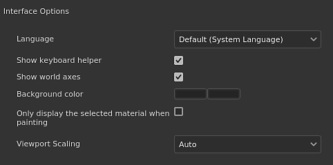

# Allgemeine Voreinstellungen

Auf dieser Seite werden die Haupteinstellungen der Anwendung erläutert.

## Benutzeroberflächen-Optionen

| Einstellung | Beschreibung |
| --- | --- |
| **Sprache** | Definieren Sie die Sprache, die von der Benutzeroberfläche in der Anwendung verwendet wird. Diese Einstellung erfordert einen Neustart der Anwendung, damit diese wirksam wird.Mögliche Werte:<ul data-preserve-html="true"><li data-preserve-html="true"><strong>Standard (Systemsprache)</strong>: Abrufen der kompatiblen Sprache vom Betriebssystem</li><li data-preserve-html="true"><strong>Englisch</strong></li><li data-preserve-html="true"><strong>Deutsch</strong></li><li data-preserve-html="true"><strong>Französisch</strong></li><li data-preserve-html="true"><strong>Japanisch</strong></li><li data-preserve-html="true"><strong>Chinesisch</strong> (vereinfacht)</li></ul> |
| **Helfer der Tastatur anzeigen** | Wenn diese Option aktiviert ist, werden die Tastaturbefehle links unten in den Viewporten angezeigt, wenn eine Taste gedrückt wird (z. B. STRG oder UMSCHALT). |
| **Weltweite Achsen anzeigen** | Wenn diese Option aktiviert ist, wird die Welt-Achse unten rechts in der 3D-Ansicht angezeigt. |
| **Hintergrundfarbe** | Wählt die Farben, die als Hintergrund für die Viewport verwendet werden. Es sind zwei Farben verfügbar, um einen Verlauf zu erstellen. |
| **Nur das ausgewählte Material beim Malen anzeigen** | Wenn diese Option aktiviert ist, wird beim Malen nur der aktuell ausgewählte Textursatz in der 3D-Ansicht angezeigt (die anderen Textursatz werden vorübergehend ausgeblendet).  **Hinweis:** Es wird empfohlen, diese Einstellung so auszuschalten, wie eine schnelle Änderung der Sichtbarkeit im Viewport die Leistung der [Dünn besetzte virtuelle Texturen](../../features/sparse-virtual-textures.md) beeinträchtigen kann. |
| **Skalierung des Viewports** | Ermöglicht die Reduzierung der Auflösung des Viewports für HDPI-/Retina-Bildschirme, um die Leistung zu verbessern.Mögliche Werte:<ul data-preserve-html="true"><li data-preserve-html="true"><strong>Keine</strong>: Ohne Skalierung wird der Viewport mit der nativen Bildschirmauflösung gerendert.</li><li data-preserve-html="true"><strong>Auto</strong>: teilen Sie die Bildschirmauflösung durch zwei (nur auf HDPI-Bildschirmen).</li></ul> |

## Ebenenstapel-Optionen

| Einstellung | Beschreibung |
| --- | --- |
| **Standard-UV-Skalierung für Material** | Definiert den standardmäßigen Kachelung-/Wiederholungswert für Füllebenen und den Fülleffekt im Ebenenstapel beim Anwenden von Materialien. |
| **Vereinfachte Miniaturansichten verwenden** | Wenn diese Option aktiviert ist, zeigt der Ebenenstapel nur Symbole an, anstatt Miniaturansichten zu berechnen. Die Verwendung von Symbolen verbessert die Leistung. Diese Einstellung gilt nicht für Projekte, die den Arbeitsablauf &quot;UV-Kachel&quot; verwenden, da sie immer Symbole anzeigen. |

## Kameraoptionen

| Einstellung | Beschreibung |
| --- | --- |
| **Drehgeschwindigkeit** | Multiplikator der Standarddrehzahl der Kamera in den Viewporten. |
| **Zoomgeschwindigkeit** | Multiplikator der standardmäßigen Zoomgeschwindigkeit der Kamera in den Viewporten.Mit der umgekehrten Richtung können Sie die Richtung des Zooms basierend auf der Mausbewegung umkehren. |
| **Radgeschwindigkeit** | Multiplikator für die Zoomgeschwindigkeit des Mausrads.Mit der umgekehrten Richtung können Sie die Richtung des Zooms basierend auf der Radbewegung umkehren. |

## Baking-Optionen

| Einstellung | Beschreibung |
| --- | --- |
| **Vorverarbeitete Szene speichern** | Wenn diese Option aktiviert ist, werden von den Bakern verwendete vorverarbeitete Mesh mit hohem Poly-Anteil zur späteren Wiederverwendung auf der Festplatte gespeichert. Diese Einstellung ermöglicht ein schnelleres erneutes Baking. |
| **Baking der Live-Vorschau aktivieren** | Wenn diese Option aktiviert ist, zeigt der 3D- und 2D-Viewport die Textur des aktuellen Bakers an, der auf dem Mesh berechnet wird. |
| **GPU-Raytracing aktivieren** | Wenn diese Option aktiviert ist, versuchen die Baker, die GPU zum Ausführen von Raytracing anstelle der CPU zu verwenden. Mit dieser Funktion können Baker im Allgemeinen schneller arbeiten.Diese Option kann nur auf kompatibler Hardware aktiviert werden. Weitere Informationen finden Sie in den [Systemanforderungen](../../getting-started/system-requirements.md). |

## Vorschauoptionen

| Einstellung | Beschreibung |
| --- | --- |
| **Verzeichnis für lokalen Cache** | Definieren Sie den sekundären Speicherort, an dem sich die Miniaturansichten der Ressourcen befinden, wenn sie generiert werden.Diese Einstellung ist nützlich, um Ressourcen-Miniaturansichten zu berechnen und zu speichern, wenn ein Ressourcenpfad schreibgeschützt ist (wie bei einem Netzwerkpfad mit nur Lesezugriff). Dadurch wird vermieden, dass Miniaturansichten bei jedem Start neu berechnet werden, da sie sonst nicht auf der Festplatte gespeichert würden. |
| **Budget für lokalen Cache (in MB)** | Legen Sie die maximale Größe des Caches für den lokalen Cache fest. |
| **Materialvorschau-Shader** | Definiere einen Shader, der Miniaturansichten von Materialien in Regalen erzeugt. Dies ist nützlich, wenn Ressourcen einen anderen Workflow als den Standard-Shader verwenden. Diese Einstellung erfordert, dass die Anwendung neu gestartet wird. |

## Temporäre Dateien

| Einstellung | Beschreibung |
| --- | --- |
| **Cacheverzeichnis** | Definiert den Speicherort, an dem temporäre Dateien geschrieben werden. Dies umfasst den [Cache für virtuelle Texturen mit geringer Dichte](../../features/sparse-virtual-textures.md). Diese Einstellung kann von [Umgebungsvariablen](../../pipeline-and-integration/configuration/environment-variables.md) überschrieben werden. |

## Wenig virtuelle Texturen

| Einstellung | Beschreibung |
| --- | --- |
| **Beschleunigung des Hardware-Supports** | Wenn diese Option aktiviert ist, versucht die Anwendung, die &quot;Sparse&quot;-Texturen mit der GPU zu verwenden. Weitere Informationen finden Sie auf der Seite [Dünn besetzte virtuelle Texturen](../../features/sparse-virtual-textures.md). Diese Einstellung kann von [Umgebungsvariablen](../../pipeline-and-integration/configuration/environment-variables.md) überschrieben werden. |

## IRay-Hardware

In diesem Abschnitt werden alle verfügbaren kompatiblen Hardware-Komponenten aufgeführt, die beim Rendern mit Iray verwendet werden können.

Die CPU-Einstellung ist auf allen Computern verfügbar. Wenn der Computer über eine **Nvidia-GPU** mit einer CUDA-kompatiblen Version verfügt, wird diese auch hier aufgeführt.

>[!NOTE]
>
> Es wird empfohlen, die CPU zu deaktivieren und nur die GPU-Hardware aktiviert zu lassen, um die beste Rendering-Leistung zu gewährleisten. Wenn sowohl CPU als auch GPU aktiviert sind, kann sich die Renderzeit erhöhen.

## Datenschutz

| Einstellung | Beschreibung |
| --- | --- |
| **Statistiken zu Benutzern automatisch senden** | Wenn diese Option aktiviert ist, werden anonyme Informationen über die Konfiguration der Computerhardware sowie andere Nutzungsdaten gesendet. Diese Daten helfen uns, die Software zu entwickeln und zu verbessern. |
