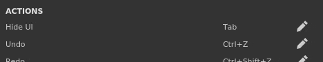

# Tastaturkürzel

{width="400px"}

Auf dieser Seite werden alle verfügbaren Tastatur- und Mauskürzel aufgeführt.

## Übersicht über Tastaturbefehle

Einen kurzen Überblick über alle verfügbaren Tastaturbefehle finden Sie in der Grafik [, die in unseren Tutorials &#x200B;](https://helpx.adobe.com/substance-3d/unlisted/tutorials/courses/substance-3d-painter-keyboard-shortcuts.html) verfügbar ist.

## So ändern Sie einen Tastaturbefehl

Klicken Sie auf das Symbol &quot;Öffnen&quot; neben einem Tastaturbefehl, um ihn zu bearbeiten, und geben Sie die neue Kombination ein.Durch Drücken der letzten Taste wird der Bearbeitungsmodus automatisch beendet und der Tastaturbefehl geändert.

### Liste der bearbeitbaren Tastaturbefehle

Um einen Tastaturbefehl auf seinen Standardwert zurückzusetzen, klicken Sie einfach mit der rechten Maustaste auf den Tastaturbefehl.

| *Aktion* | *Tastaturbefehl (Windows)* | *Tastaturbefehl (MacOS)* | *Beschreibung* |
| --- | --- | --- | --- |
| **Benutzeroberfläche ausblenden** | Tabulator | Tabulator | Blenden Sie alle Docks/Fenster der Benutzeroberfläche aus, um den/die Viewport(s) zu maximieren. |
| **Rückgängig** | Strg+Z | ⌘+Z | Macht die letzte Aktion rückgängig. |
| **Wiederholen** | Strg+Y | ⌘+Y | Wiederholen Sie eine Aktion, die gerade rückgängig gemacht wurde. |
| **Backen** | F8 | F8 | In den Backmodus wechseln |
| **Malen** | F9 | F9 | Wechseln Sie in den Malmodus. |
| **Rendern (Iran)** | F10 | F10 | Wechseln Sie in den Rendermodus. |
| **Projekt öffnen** | Ctrl+O | ⌘+O | Navigieren Sie zu einem Substance Painter-Projekt, das geöffnet werden soll, und wählen Sie es aus. |
| **Projekt schließen** | Strg+F4 | ⌘+W | Schließen Sie das aktuelle Projekt. |
| **Projekt speichern** | Ctrl+S | ⌘+S | Speichern Sie das aktuelle Projekt. |
| **Als Projekt speichern** |  |  | Speichern Sie das aktuell geöffnete Projekt unter einem neuen Namen. |
| **Neues Projekt** | Strg+N | ⌘+N | Öffnen Sie das Fenster zum Erstellen eines neuen Projekts. |
| **Anwendung beenden** | Alt+F4 | ⌘+Q | Schließen Sie den Substance Painter. |
|  |  |  |  |
| **Manipulator anzeigen/ausblenden** | Q | Q | Schaltet die Anzeige des Manipulators um, der zum Steuern der Transformationen der Füllebenen verwendet wird. |
| **Größe des Manipulators erhöhen** | + | + | Mache den Bediener in den Viewports größer. |
| **Größe des Manipulators verringern** | \- | \- | Verkleinere den Manipulator in den Viewports. |
| **Zwischen Manipulationsräumen wechseln** | T | T | Alternative zwischen Objekt- und Welt-Raumtransformation für den Manipulator. |
| **Warp-Edition-Modus umschalten** | Umschalt+V | Umschalt+V | Wechseln Sie beim Bearbeiten einer Verkrümmungsprojektion zwischen den Modi &quot;Verformen&quot; und &quot;Scheitelpunkte bearbeiten&quot;. |
| **Übersetzungstool** | B | B | Stellen Sie den Manipulator-Modus auf &quot;Übersetzung&quot; ein. |
| **Werkzeug drehen** | E | E | Stellen Sie den Modus des Manipulators auf Drehung ein. |
| **Skalierungswerkzeug** | R | R | Stellen Sie den Modus des Manipulators auf Skalierung ein. |
| **Oberflächenwerkzeug** | Umschalt+W | Umschalt+W | Stellen Sie den Modus des Manipulators so ein, dass er an der 3D-Modelloberfläche einrastet. |
| **Symmetrie** | L | L | Aktivieren Sie die Symmetrie entlang einer bestimmten Achse. |
| **Modulberechnung anhalten** | Umschalt+Escape | Umschalt+Escape | Umschalten der Motorberechnung. |
|  |  |  |  |
| **Malwerkzeug auswählen** | 1 | 1 |  |
| **Malwerkzeug + Partikel auswählen** | Strg+1 | ⌘+1 |  |
| **Radiergummi-Werkzeug auswählen** | 2 | 2 |  |
| **Radiergummi-Werkzeug + Partikel auswählen** | Strg+2 | ⌘+2 |  |
| **Projektionstool auswählen** | 3 | 3 |  |
| **Projektionswerkzeug + Partikel auswählen** | Strg+3 | ⌘+3 |  |
| **Polygonfüllung auswählen** | 4 | 4 |  |
| **Verwisch-Werkzeug auswählen** | 5 | 5 |  |
| **Kopierwerkzeug auswählen (relative Quelle)** | 6 | 6 |  |
| **Kopierwerkzeug auswählen (absolute Quelle)** | Strg+6 | ⌘+6 |  |
| **Gitterzuordnungen backen** | Strg+Umschalt+B | ⌘+Umschalt+B | Öffnen Sie das Fenster Backeinstellungen. |
| **Werkzeuggröße erhöhen** | **&rbrack;** | **&rbrack;** | Erhöhen Sie die Größe des Pinsels für das Malwerkzeug. |
| **Werkzeuggröße verringern** | **&lbrack;** | **&lbrack;** | Verkleinern Sie den Pinsel für das Malwerkzeug. |
| **Graustufen-Werkzeug umkehren** | X | X | Aktuellen Graustufenwert umkehren, wenn sich das Malwerkzeug auf einer Maske befindet. |
| **Strichmaterial auswählen** | P | P | Aktiviere den Materialwähler. |
| **Faule Maus** | D | D | Aktivieren Sie das Verhalten der träge Maus für das aktuelle Werkzeug. |
| **Ausgeschlossene Geometrie ausblenden/ignorieren** | Alt+H | Option+H | Ausblenden von 3D-Modellteilen, die über die Geometriemaske ausgeschlossen wurden. |
|  |  |  |  |
| **Kameraperspektive** | F5 | F5 | Ändern Sie die Kamera des Viewports in eine Perspektivansicht. |
| **Kamera orthografisch** | F6 | F6 | Ändern Sie die Kamera des Viewports in eine orthogonale Ansicht. |
| **Nächsten Kanal anzeigen** | C | C | Wechseln Sie im Ansichtsfenster zum Solo-Ansichtsmodus, und zeigen Sie den nächsten Kanal des aktuellen Textursatzes an. |
| **Vorherigen Kanal anzeigen** | Umschalt+C | Umschalt+C | Wechseln Sie im Ansichtsfenster zum Solo-Ansichtsmodus, und zeigen Sie den vorherigen Kanal des aktuellen Textursatzes an. |
| **Material anzeigen** | M | M | Wechseln Sie im Darstellungsmodus des Ansichtsfensters zu Material. |
| **Nächste Netzzuordnung anzeigen** | B | B | Wechseln Sie im Ansichtsfenster zum Ansichtsmodus Solo und zeigen Sie die nächste Gitterzuordnung des aktuellen Textursatzes an. |
| **Vorherige Gitterzuordnung anzeigen** | Umschalt+B | Umschalt+B | Wechseln Sie im Ansichtsfenster zum Ansichtsmodus Solo und zeigen Sie die vorherige Gitterzuordnung des aktuellen Textursatzes an. |
| **Animation umschalten** | Raum | Raum | Anhalten/Anhalten der Animation der Partikel, wenn eine Partikelprojektion ausgeführt wird. |
| **Texturen exportieren** | Strg+Umschalt+E | Umschalttaste+⌘+E | Öffnen Sie das Fenster Texturexport. |
| **Das gesamte Gitter zentrieren** | F | F | Zentriert das gesamte Gitter des aktuellen Projekts in der Mitte des Viewports. |
| **Schnellmaskenedition ein/aus** | U | U | Geben Sie die Schnellmaskenausgabe ein bzw. beenden Sie sie. |
| **Schnellmaske löschen** | Y | Y | Deaktivieren und bereinigen Sie die Schnellmaske. |
| **Kurzmaske umkehren** | I | I | Aktuelle Werte der Schnellmaske umkehren. |
| **Viewport-Layout 3D/2D** | F1 | F1 | Ändern Sie die Viewport-Anzeige, sodass sowohl die 3D- als auch die 2D-Ansicht gleichzeitig angezeigt werden. |
| **Nur 3D-Viewport-Layout** | F2 | F2 | Ändern Sie die Viewport-Anzeige so, dass nur die 3D-Ansicht angezeigt wird. |
| **Viewport-Layout nur 2D** | F3 | F3 | Ändern Sie die Viewport-Anzeige so, dass nur die 2D-Ansicht angezeigt wird. |
| **2D-/3D-Ansicht austauschen** | F4 | F4 | Tauschen Sie im Viewport zwischen der 2D- und 3D-Ansicht und der 2D-UV-Ansicht aus. |
| **Isolat für Textursatz** | Alt+Q | Wahl+Q | Isolieren Sie den aktuellen Textursatz im Viewport, indem Sie den anderen ausblenden. |
|  |  |  |  |
| **Werkzeug/Farbe verwenden** | Maus nach links | Maus nach links |  |
| **Geraden zeichnen** | Umschalt+Maus nach links | Umschalt+Maus nach links |  |
| **Geraden mit Ausrichten zeichnen** | Strg+Umschalt+Nach links bewegen | Strg+Umschalt+Nach links bewegen |  |
| **Kamera gedreht** | Alt+Maus nach links | Wahl+Nach links |  |
| **Kameraeinrastdrehung** | Alt+Umschalt+Nach links bewegen | Umschalt+⌘+Maus nach links | Richten Sie die Kameradrehung alle 90 Grad Winkel ein. |
| **Kameraübersetzung** | Alt+Mitte-Maus | Wahl+⌘+Linke Maustaste |  |
| **Kameraübersetzung (alternativ)** | Strg+Alt+Nach links bewegen |  |  |
| **Kamerazoom** | Alt+Nach rechts bewegen | Maus in der Mitte |  |
| **Schablone drehen** | S+Maus nach links | S+Maus nach links |  |
| **Schabloneneinrasten drehen** | Umschalt+S+Maus nach links | Umschalt+S+Maus nach links |  |
| **Schablonenübersetzung** | S+Mitte-Maus |  |  |
| **Schablonenzoom** | S+Rechte Maustaste | S+Rechte Maustaste |  |
| **Werkzeuggröße/Härte ändern** | Strg+Nach rechts bewegen | ⌘+Nach rechts bewegen | Ändern Sie die Größe, indem Sie sich horizontal bewegen, ändern Sie die Härte des Pinsels, indem Sie sich vertikal bewegen. |
| **Werkzeugfluss/Drehung ändern** | Strg+Maustaste links | ⌘+Linke Maustaste | Ändern Sie den Fluss des aktuellen Pinsels, indem Sie ihn horizontal und die Drehung des Pinsels, indem Sie ihn vertikal bewegen. |
| **Umgebung drehen** | Umschalt+Nach rechts ziehen | Umschalt+Nach rechts ziehen | Horizontal die Umgebungskarte drehen, die für die Beleuchtung im Viewport verwendet wird. |
| **Autofokus (Tiefe des Felds)** | Strg+Mitte-Maus |  |  |
| **Auswahl der Texturmenge** | Strg+Alt+Nach rechts bewegen | Option+⌘+Nach rechts bewegen |  |
| **Kontextmenü** | Maus nach rechts | Maus nach rechts | Schnellmenü, um auf das Eigenschaftsfenster im Ansichtsfenster zuzugreifen. |
| **Quellspeicherort für Kopierwerkzeug festlegen** | V + Maus nach links | V + Maus nach links |  |
|  |  |  |  |
| **Schablonenmaske ignorieren** | H | H | Deaktivieren Sie die Schablone vorübergehend (vermeiden Sie dies, um sie vollständig zu entfernen). |
| **Vorherigen Strich fortsetzen** | A | A | Lassen Sie zu, dass der zuvor erstellte Pinselstrich fortgesetzt wird, um Unterbrechungen zu vermeiden. |

## Liste der nicht bearbeitbaren Tastaturbefehle

Einige Tastaturbefehle funktionieren möglicherweise nur **&#x200B;**, wenn sich die **Maus über dem** bestimmten Fenster befindet.

Beispiel: **Kopieren** und **Einfügen** erfordert, dass sich die Maus **über dem Ebenenstapel** befindet.

| *Aktion* | *Tastaturbefehl (Windows)* | *Tastaturbefehl (MacOS)* | Beschreibung |
| --- | --- | --- | --- |
| **Ebene kopieren** | Strg+C | ⌘+C | Kopieren Sie die aktuell ausgewählte(n) Ebene(n). |
| **Ebene ausschneiden** | Strg+X | ⌘+X | Schneiden Sie die aktuell ausgewählten Ebenen aus. |
| **Ebene einfügen** | Strg+V | ⌘+V | Fügen Sie die Ebene in den Speicher ein. |
| **Ebene löschen** | Löschen | Löschen | Löschen Sie die aktuell ausgewählte(n) Ebene(n). |
| **Ebene duplizieren** | Strg+D | ⌘+D | Duplizieren Sie die aktuell ausgewählte(n) Ebene(n). |
| **Gruppenebene** | Strg+G | ⌘+G | Legen Sie die aktuell ausgewählten Ebenen in einem Ordner ab. |
| **Ebeneninhalt kopieren** | Strg+Umschalt+C | Option+⌘+C | Kopieren Sie den Ebeneninhalt (Malen) und seine Effekte. |
| **Ebeneninhalt einfügen** | Strg+Umschalt+V | Option+⌘+V | Inhalte (Malerei) und Effekte, die sich derzeit im Arbeitsspeicher befinden, einfügen. |
| **Maske im Ansichtsport anzeigen** | Alt+Maus nach links | Wahl + Maus nach links | Wechseln Sie im Darstellungsmodus des Ansichtsfensters zur Maske der angegebenen Ebene. |
| **Maske deaktivieren/aktivieren** | Umschalt+Maus nach links | Umschalt+Maus nach links | Schaltet den Zustand der Maske auf einer Ebene um. |
|  |  |  |  |
| **Ziehen und Ablegen von Material** | Strg+Drag&amp;Drop | ⌘+Drag&amp;Drop | Halten Sie diese Taste gedrückt, während Sie ein Material (oder intelligentes Material) per Drag &amp; Drop in den Viewport ziehen, um nur einen bestimmten Teil des 3D-Modells zu beeinflussen. |
|  |  |  |  |
| **Manipulator-Einschränkung/-Ausrichtung** | Shift | Shift | Ausrichtung der Transformation beim Anpassen des Manipulators (Verschiebung oder Drehung) in der 3D-Ansicht. Verhältnis beim Anpassen des Manipulators in der 2D-Ansicht einschränken. |
| **Spiegelung des Manipulators** | Strg | ⌘ | Der Spiegelmanipulator zeigt die Transformation um seinen Drehpunkt in der 2D-Ansicht an. |
