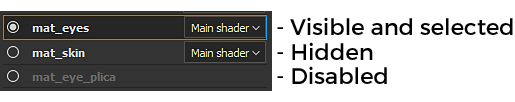

# Textursatz

Im Fenster &quot;**Textursatz List**&quot; werden alle Material-IDs des aktuellen 3D-Modells in einem Projekt angezeigt. Sie ermöglicht das Wechseln und Anzeigen des Ebenenstapels, der jedem Material auf dem Modell zugeordnet ist, sowie der zugehörigen Einstellungen.

Das Hauptziel des Fensters &quot;Textursatz-Liste&quot; besteht darin, den Wechsel zwischen Materialien zu ermöglichen, um auf den Ebenenstapel zuzugreifen, der jedem Material zugeordnet ist.\
Im Fall des Arbeitsablaufs [Materialschichtung](../../features/dynamic-material-layering.md) werden die **Unterstapel** **unter dem Namen des Textursatzes** angezeigt.

>[!WARNING]
>
> Es kann jeweils nur ein Textursatz bearbeitet/gemalt werden.

## Status des Textursatzes

Textursatz können mehrere Status haben:

* **Ausgewählt** : Der aktuell bearbeitete Textursatz. Wenn Sie einen Textursatz auswählen, werden der [Ebenenstapel](../layer-stack/layer-stack.md) und die [Shader-Einstellungen](../shader-settings/shader-settings.md) entsprechend aktualisiert.
* **Sichtbar/Ausgeblendet** : Weitere Informationen finden Sie im Abschnitt zur Sichtbarkeit weiter unten.
* **Deaktiviert** : Das bedeutet, dass die Textursatz und der zugehörige Ebenenstapel nicht an ein Material in auf dem Mesh angehängt werden können. Weitere Informationen finden Sie unter [Neuzuweisung von Textursätzen](texture-set-reassignment.md).

## Sichtbarkeit

Die Anzeige eines Textursatzes kann über die dedizierten Symbole verwaltet werden:

| *Symbol* | *Aktion* | *Beschreibung* |
| --- | --- | --- |
| 

 | Menü öffnen | Öffnen Sie ein neues Menü mit den folgenden Aktionen:<ul data-preserve-html="true"><li data-preserve-html="true"><strong>Alle anzeigen</strong>: Zeigt alle Textursatz im Viewport an.</li><li data-preserve-html="true"><strong>Alle ausblenden</strong>: Blendet alle Textursatz im Viewport aus.</li><li data-preserve-html="true"><strong>Einblenden/Ausblenden umkehren</strong>: Sichtbare Textursatz werden ausgeblendet, ausgeblendete Textursatz werden eingeblendet.</li></ul> |
| 

 | Fokussiermodus | Isoliert den aktuell aktiven Textursatz und blendet alle anderen aus, während dieser Modus aktiv ist. Klicken Sie erneut auf diese Schaltfläche, um den Modus zu beenden. |
| 

 | Sichtbarkeit | Klicken Sie auf diese Schaltfläche neben einem Textursatz, um einen Textursatz im Viewport auszublenden oder sichtbar zu machen. |

>[!NOTE]
>
> Beim **Malen** wird standardmäßig nur der Textursatz angezeigt, der ausgewählt wird. Sie können dieses Verhalten in den [Voreinstellungen](../settings/settings.md) ändern, indem Sie das Kontrollkästchen &quot;**Nur beim Malen ausgewähltes Material anzeigen**&quot; deaktivieren.\
> Hinweis : Das Ausblenden anderer Textursatz beim Malen von **verbessert die Leistung**.

## Kontextmenü

Wenn Sie mit der rechten Maustaste auf einen Textursatz klicken, wird ein Kontextmenü mit den folgenden Aktionen geöffnet:

* **Textursatz anzeigen/ausblenden** : die Sichtbarkeit des Textursatzes ein-/ausschalten (wie im vorherigen Abschnitt beschrieben)
* **Name bearbeiten** : ermöglicht das Umbenennen eines Textursatzes. Dieser Name wird auch während des Exportvorgangs der Texturen verwendet. Umbenennen ist auch möglich, indem Sie auf den Namen des Textursatzes doppelklicken.
* **Setzen Sie den Namen auf \*ursprünglichen Namen\*** zurück: Stellt den ursprünglichen Namen des Textursatzes im Material &quot;Mesh&quot; wieder her, wenn er geändert wurde.
* **Beschreibung bearbeiten** : ermöglicht das Hinzufügen/Ändern der einem Textursatz zugeordneten Beschreibung.

## Shader-Management

Die Schaltfläche rechts neben dem Namen jedes Textursatzes kann zur Verwaltung der Shader-Zuweisung verwendet werden.\
Standardmäßig hat jeder Textursatz dieselbe Shader-Instanz. Manchmal ist es jedoch zweckmäßig, einen anderen Shader nur für einen bestimmten Teil des Meshs zu verwenden. Klicken Sie dazu auf die Schaltfläche und wählen Sie &quot;**Neue Shader-Instanz**&quot; aus. Von dort aus können Sie im Fenster &quot;[Shader-Einstellungen](../shader-settings/shader-settings.md)&quot; den Shader und seine Parameter ändern, ohne andere Textursatz zu beeinflussen.

{width="500px"}

## Einstellungen

Über die Schaltfläche &quot;Einstellungen&quot; wird ein neues Menü geöffnet, in dem mehrere Aktionen gelegt sind:

* **Leere Beschreibungen ausblenden** (Standard) : Ausblenden der Beschreibungsfelder, wenn diese leer sind
* **Alle Beschreibungen ausblenden** : Die Beschreibungsfelder ausblenden, auch wenn sie nicht leer sind
* **Alle Beschreibungen anzeigen** : Beschreibungsfelder anzeigen, auch wenn sie leer sind
* **Shader-Parameter importieren** : Importieren einer JSON-Datei zum Konfigurieren der Shader-Parameter der Textursätze zulassen
* **Textursatz erneut zuweisen** : Weitere Informationen finden Sie unter [Neuzuweisung von Textursätzen](texture-set-reassignment.md).
