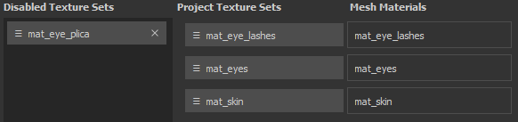

# Neuzuordnung von Textursätzen

Im Fenster &quot;Neuzuweisung von Textursätzen&quot; können Sie die Zuweisung von Ebenenstapeln zu einem anderen Teil des Meshs &quot;Szene&quot; ändern. Dies ist beispielsweise nützlich, wenn Sie einen neuen Mesh in ein bestehendes Projekt importieren, in dem einige Textursatz deaktiviert wurden. Dies geschieht, weil der Ebenenstapel einem Material zugewiesen wurde, das nicht mehr existiert. Mit dem Neuzuweisungsfenster ist es möglich, diesen Ebenenstapel wieder herzustellen (siehe &quot;Wiederherstellen von deaktivierten Textursätzen&quot; weiter unten).

Um auf das Fenster für die Neuzuweisung von Textursätzen zuzugreifen, öffnen Sie das Fenster &quot;[Textursatz list](texture-set-list.md)&quot; und wählen Sie &quot;**Settings&quot; > &quot;Reassign Textursatzes**&quot;.

Das Fenster ist in drei Bereiche unterteilt:

* **Textursatz deaktiviert** : Listet alle Textursatz auf, die derzeit nicht verwendet werden.
* **Projekt-Textursatz** : Listet alle Textursatz auf, die derzeit einem Mesh-Material zugewiesen sind.
* **Mesh Materials** : Listen Sie die Mesh-Material des Projekts auf.

Das Fenster verfügt außerdem über eine zusätzliche Schaltfläche, mit der die folgenden Aktionen ausgeführt werden:

* **Rückgängig** : Zum vorherigen Status des Fensters zurückkehren
* **Wiederholen** : Wenden Sie die rückgängig gemachte Änderung erneut an.
* **Anwenden** : Schließen Sie das Fenster und führen Sie die Neuzuweisung(en) durch.
* **Abbrechen** : Schließen Sie das Fenster und verwerfen Sie alle Änderungen, die gerade vorgenommen wurden.

## Neuzuweisen von Textursätzen

Das Neuzuweisen von Textursätzen kann durch einfaches Ziehen und Ablegen der Schaltflächen erfolgen.

## Wiederherstellen von deaktivierten Textursätzen

Ein Textursatz kann deaktiviert werden, wenn er nicht mehr mit einem Mesh-Material verknüpft ist.\
Dies kann beim Importieren eines neuen Meshs in ein Projekt geschehen, bei dem die Namen der Materialien zwischen dem Projekt und dem neuen Mesh unterschiedlich sind.

Um einen Textursatz wiederherzustellen, **vertauschen** einfach seine Position mit einem Textursatz in der Liste &quot;**Projekt-Manager**&quot;.

## Löschen deaktivierter Textursatz

Wenn Sie auf das **Kreuz** neben einem Textursatz in der Liste **Deaktivierte Textursatz** klicken, wird es **zum Löschen markiert**.\
Der Löschvorgang erfolgt, wenn Sie auf die Schaltfläche **Anwenden** am unteren Rand des Fensters klicken.

>[!WARNING]
>
> Diese Aktion kann nicht rückgängig gemacht werden, wenn das Fenster mit der Schaltfläche &quot;Anwenden&quot; geschlossen wurde.
