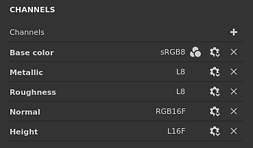
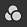
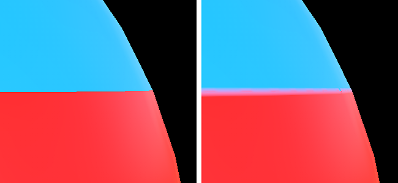

# Einstellungen für &quot;Textursatz&quot;

{width="300px"}

Die **Einstellungen für den Textursatz** steuern die Parameter des aktuell ausgewählten Textursatzes. Hier können die Auflösung, die Kanäle und die zugehörigen Mesh Maps verwaltet werden.

## Allgemeine Eigenschaften

| Einstellung | Beschreibung |
| --- | --- |
| **Name** | Name des Textursatzes. Geerbt für den Materialnamen, der dem 3D-Modell zugewiesen ist. |
| **Beschreibung** | Textfeld zum Hinzufügen von Informationen zu einem Textursatz. Dieser Text wird in den Fenstern [Textursatz-Liste](texture-set-list.md) und [Backen](../../baking/baking.md) angezeigt. |
| **Größe** | Steuert die Auflösung der Kanäle in Pixel innerhalb eines Textursatzes. Um **nicht quadratische** Auflösungen (z. B. 2048x1024) zu verwenden, deaktivieren Sie die **Sperrschaltfläche** zwischen den beiden Dropdown-Listen.Textursatzauflösungen sind **dynamisch** aufgrund des **nicht-destruktiven Workflows**. Dies bedeutet, dass es möglich ist, mit einer niedrigen Auflösung zu arbeiten, um gute Leistungen zu erhalten, und dann später mit einer höheren Auflösung eine bessere Qualität zu erzielen. Innerhalb der Anwendung beträgt die maximale Auflösung eines Kanals 4096x4096 Pixel, während beim Exportieren das Maximum stattdessen 8192x8192 beträgt (sofern von der GPU unterstützt). Eine Änderung der Auflösung kann eine lange Berechnung des Motors auslösen. |
| **Shader-Instanz** | Definieren Sie, welcher [Shader](../shader-settings/shader-settings.md) zum Rendern des angegebenen Textursatzes im [Viewport](../viewport/viewport.md) verwendet werden soll. |

## Kanäle

### Kanalliste

Die Liste kann jederzeit durch Hinzufügen oder Entfernen von Kanälen geändert werden (es sei denn, sie wird vom Arbeitsablauf [Materialschicht](../../features/dynamic-material-layering.md)überschrieben).

| Schaltfläche/Symbol | Beschreibung |
| --- | --- |
| <b>Kanal hinzufügen</b>  

 | Klicken Sie auf diese Schaltfläche, um einen neuen Kanal zur Liste hinzuzufügen.Das Popupmenü wird in drei Kategorien unterteilt:<ul data-preserve-html="true"><li data-preserve-html="true"><strong>Unterstützte Kanäle</strong>: Diese Kanäle können vom aktuellen Shader im Viewport verwendet werden.</li><li data-preserve-html="true"><strong>Nicht unterstützte Kanäle</strong>: Diese Kanäle werden vom aktuellen Shader im Viewport ignoriert.</li><li data-preserve-html="true"><strong>Benutzerkanäle</strong>: zusätzliche Kanäle zum Malen weiterer Informationen, in der Regel nicht von den Shadern unterstützt.</li></ul>  **Hinweis:** Die Anzahl der Kanäle ist nicht begrenzt. Allerdings können zu viele Kanäle die Leistung stark beeinträchtigen und erfordern mehr Speicher. |
| <b>Kanal entfernen</b>  

 | Entfernen Sie einen Kanal aus der Liste.  **Hinweis:** Die Malinformationen innerhalb des Projekts werden mit dem Kanal nicht gelöscht. Daher kann der Kanal später wieder hinzugefügt werden, falls er für die Wiederherstellung der Texturierung (nach einer Neuberechnung) erforderlich ist. |
| <b>Kanalname</b>  

 | Der Name eines bestimmten Kanals.Benutzerkanäle können umbenannt werden, indem Sie auf den aktuellen Namen doppelklicken: 

 |
| <b>Kanaleinstellungen</b>  

 | Mit dieser Schaltfläche wird das Einstellungsmenü des Kanals mit mehreren Aktionen geöffnet.Die erste Aktionsliste steuert den Speichertyp und die Genauigkeit des Kanals:<ul data-preserve-html="true"><li data-preserve-html="true"><strong>sRGB8</strong>: RGB-Farben, gamma-korrigierte Werte, gespeichert auf 8 Bit.</li><li data-preserve-html="true"><strong>L8</strong>: Graustufenwerte, gespeichert auf 8 Bit.</li><li data-preserve-html="true"><strong>RGB </strong>: RGB-Farben, gespeichert auf 8 Bit.</li><li data-preserve-html="true"><strong>L16</strong>: Graustufenwerte, gespeichert auf 16 Bit.</li><li data-preserve-html="true"><strong>RGB16</strong>: RGB-Farben, gespeichert auf 16bit.</li><li data-preserve-html="true"><strong>L16F</strong>: Graustufenwerte - positive und negative Werte, gespeichert auf gleitenden 16-Bit-Werten.</li><li data-preserve-html="true"><strong>RGB16F</strong>: RGB-Farben - positiv und negativ, gespeichert auf 16bit schwebend.</li><li data-preserve-html="true"><strong>L32F</strong>: Graustufenwerte - positive und negative Werte, gespeichert auf gleitenden 32-Bit-Werten.</li><li data-preserve-html="true"><strong>RGB32F</strong>: RGB-Farben - positiv und negativ, gespeichert auf 32bit Floating.</li></ul>  **Hinweis:** Der Speichertyp **ist kein Farbraum-/Gammasteuerelement**. Die Daten, die zur Speicherung der Informationen eines Kanals (z. B. sRGB8 oder L32F) verwendet werden, haben keine Auswirkungen auf die Art und Weise, wie die Anwendung sie liest. Beispielsweise wird der Rauigkeitskanal weiterhin als Daten-/Rohfarbe und die Grundfarbe weiterhin als gamma-korrigiert betrachtet.  Die letzte Aktion des Menüs kann verwendet werden, um [Farbmanagement](../../features/color-management/color-management.md) auf dem Kanal zu aktivieren oder zu deaktivieren:<ul data-preserve-html="true"><li data-preserve-html="true"><strong>Farbkanal</strong>: Wenn diese Option aktiviert ist, wird der Kanal farbverwaltet. Diese Option kann nur manuell für Benutzerkanäle geändert werden.</li></ul> |
| <b>Farbmanagement</b>  

 | Gibt an, dass der Kanal farbverwaltet ist, sofern vorhanden. Nur Benutzerkanäle können als farbverwaltet markiert werden oder nicht, das Verhalten anderer Kanäle ist festgelegt.Eine detaillierte Liste der Kanäle, die farbverwaltet werden oder nicht, finden Sie unter: [Farbmanagement](../../features/color-management/color-management.md). |

### Mischeinstellungen

Diese Einstellungen steuern verschiedene Verhalten bei der Kanalgenerierung, insbesondere bei der Kombination von Kanälen mit angebrannten Texturen (Gittermasken).

| Einstellung | Beschreibung |
| --- | --- |
| **Normale Mischung** | Steuert, wie die &quot;backed normal map&quot; mit dem Kanal &quot;Normal&quot; kombiniert werden soll. Mögliche Werte sind:<ul data-preserve-html="true"><li data-preserve-html="true"><strong> Ersetzen von </strong> : Ignorieren Sie die &quot;backed normal map&quot; und verwenden Sie nur den Kanal &quot;Normal&quot; für diesen Textursatz. Kann verwendet werden, um eine fertig gestellte Normalkarte zu übermalen. Weitere Informationen finden Sie in der Dokumentation [Advanced channel painting](../../painting/advanced-channel-painting/normal-map-painting.md). Wenn der Normal-Kanal nicht vorhanden ist oder wenn die Normal-Kanalausgabe leer ist, wird die gebackene Normal-Map weiterhin verwendet.</li><li data-preserve-html="true"><strong> Kombinieren von </strong> (Standard) : Verwenden Sie eine detailorientierte Funktion, um den &quot;Normal&quot;-Kanal und die &quot;Backed Normal Map&quot; zu kombinieren.</li></ul>  **Hinweis:** Diese Einstellung ist möglicherweise deaktiviert, wenn der Kanal in der Kanalliste fehlt. Wenn der Kanal fehlt, wird der standardmäßige Mischwert verwendet. |
| **Height zur normalen Methode** | Steuert, welche Methode zum Konvertieren des Height-Kanals in eine Normalmap verwendet wird. Mögliche Werte sind:<ul data-preserve-html="true"><li data-preserve-html="true"><strong>Sharp</strong>: eine präzisere Normalmap zu erstellen, bei der Rauschen und Aliasing vermieden werden. Geeignet für sich wiederholende Muster wie Stoffe.</li><li data-preserve-html="true"><strong>Glatt (Sobel)</strong> (Standard): erstellen Sie eine glattere Normalmap mit einem Sobel-Filter, bei dem Details verloren gehen können. Angepasst für die meisten Fälle.</li></ul> |
| **Mischen von Umgebungsgeräuschen**: Verdeckung | Steuert, wie die &quot;gebackene Umgebungs-Verdeckung&quot; mit dem Kanal &quot;Umgebungs-Verdeckung&quot; kombiniert werden soll. Mögliche Werte sind:<ul data-preserve-html="true"><li data-preserve-html="true"><strong> Ersetzen von </strong> : Ignorieren Sie die Option &quot;Hintergrundfarbe&quot; und verwenden Sie für diesen Textursatz nur die Verdeckung &quot;Umgebungsfarbe&quot; (Ambient Verdeckung). Kann verwendet werden, um eine gebackene Umgebungs-Verdeckung zu übermalen. Weitere Informationen finden Sie in der Dokumentation [Advanced channel painting](../../painting/advanced-channel-painting/ambient-occlusion-painting.md).  </li><li data-preserve-html="true"><strong> Multiplizieren </strong> (Standard) : Verwenden Sie einen Multiplikationsvorgang, um den Kanal &quot;Umgebungs-Verdeckung&quot; und die &quot;gebackene Umgebungs-Verdeckung&quot; zu kombinieren.  </li></ul>  **Hinweis:** Diese Einstellung ist möglicherweise deaktiviert, wenn der Kanal in der Kanalliste fehlt. Wenn der Kanal fehlt, wird der standardmäßige Mischwert verwendet. |
| **UV-Auffüllung** | Steuert, wie die Auffüllung außerhalb der UV-Insel generiert wird. Mögliche Werte sind:  <ul class="steps" data-preserve-html="true"> <li class="step" data-preserve-html="true">    <strong>Nachbarraum in 3D</strong> (Standard): Schau auf die andere Seite der UV-Naht, um die benachbarte Pixelfarbe zu finden und sie an der UV-Grenze zu verwenden. Diese Einstellung empfiehlt sich beim Malen über UV-Nähte mit durchgehenden Mustern. Beispiel mit normaler Auffüllung links und dem 3D-Nachbarn rechts:           </li> <li class="step" data-preserve-html="true">    <strong>Nachbar des 2D-Raums</strong>: Kopieren Sie den Pixel innerhalb einer UV-Insel in den Rahmen außerhalb der UV-Insel, bevor Sie die Auffüllung generieren. Diese Einstellung empfiehlt sich, wenn UV-Inseln sehr entgegengesetzte Informationen haben und sich nicht überlappen. Beispiel mit einer Kugel, in der die Bänder jeweils eine eindeutige Farbe pro UV-Insel haben, links mit der Einstellung &quot;2D-Nachbar&quot; und rechts mit der Einstellung &quot;3D-Nachbar&quot; (beachten Sie die Blutung):           </li> </ul>  **Hinweis:** Diese Auffüllungseinstellung wird pro Textursatz gespeichert und beim Texturexport und der Visualisierung im Viewport berücksichtigt.Da der 3D-Raum-Nachbar funktioniert, kann er nicht mit dem normalen Kanal verwendet werden und verwendet stattdessen die 2D-Version. |

## Mesh-Maps

Die Gitterzuordnungen sind gitterspezifische Strukturen und Texturensätze, die verwendet werden, um die Qualität der Texturierung mithilfe von Filtern, Smart-Materialien und Smart-Masken zu verbessern. Weitere Informationen finden Sie in der Dokumentation [Backen](../../baking/baking.md).
