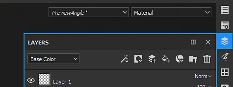

# Symbolleisten

Auf dieser Seite erhalten Sie einen kurzen Überblick über alle verfügbaren Symbolleisten. Jedes von ihnen enthält unterschiedliche Aktionen und Einstellungen.

Im Folgenden finden Sie eine Liste aller verfügbaren Symbolleisten.

## Werkzeuge

{width="450px"}

Die **Werkzeugleiste** ist standardmäßig oben links in der Hauptbenutzeroberfläche verfügbar. Es werden alle [Malwerkzeuge](../painting/painting.md) aufgelistet, die zum Texturieren des 3D-Gitters des aktuell geöffneten Projekts verwendet werden können. Diese Werkzeuge sind nur verfügbar, wenn eine Malebene ausgewählt ist.

Einige Werkzeuge verfügen über einen zweiten Modus namens &quot;Physikalisch&quot;, der das Partikelmalen ermöglicht. Sie können auch auf das Partikelmalen zugreifen, indem Sie im Fenster [Elemente](assets/assets.md) auf &quot;Partikelpinselvorgaben&quot; klicken.

Diese Symbolleiste kann nur vertikal an der linken oder rechten Seite der Hauptbenutzeroberfläche angedockt werden.

## Docks

{width="450px"}

Die <b>Docks-Symbolleiste</b> ist standardmäßig in der oberen rechten Ecke der Hauptbenutzeroberfläche verfügbar. Der Zweck ist es, einen schnellen Zugang zu den Dockfenstern zu bieten, um sie schnell zu öffnen und zu schließen.

Wenn Sie auf eine der Schaltflächen in der Symbolleiste klicken, wird das Dock neben der Schaltfläche angezeigt und schwebt über dem Rest der Benutzeroberfläche. Wenn Sie erneut auf die Schaltfläche klicken, wird sie geschlossen. Wenn sich das Dock von seiner Schaltfläche entfernt, wird es zu einem normalen schwebenden Fenster, das in der Benutzeroberfläche angedockt werden kann. Wenn sie geschlossen wird, ist die Schaltfläche wieder in der Dock-Symbolleiste verfügbar.

{width="450px"}

Diese Symbolleiste kann nur vertikal an der linken oder rechten Seite der Hauptbenutzeroberfläche angedockt werden.

## Plug-ins

{width="450px"}

In der Symbolleiste **Plug-ins** werden die installierten (und derzeit aktivierten) Skript-Plug-ins von Substance 3D Painter aufgeführt. Weitere Informationen zu Plug-ins und deren Verwendung finden Sie unter [Plug-ins](../features/plugins/plugins.md).

## Kontextbezogen

{width="450px"}

Die Kontextsymbolleiste ist eine Symbolleiste, deren Inhalt sich in Teilen ändert, je nachdem, welches Werkzeug gerade ausgewählt ist oder welche andere Eigenschaft geändert wird. Die linke Seite der Symbolleiste kann geändert werden, aber die rechte Seite ist fest und listet Verknüpfungen auf, um die Anzeige des [Viewport](viewport/viewport.md) zu ändern.

In dieser Symbolleiste können Eigenschaften für die folgenden Elemente aufgelistet werden:

* [Malen](../painting/painting.md)
* [Manipulatoren für Projektionen von Füllebenen](../painting/fill-projections/fill-projections.md)

Diese Symbolleiste kann nicht verschoben werden und befindet sich immer am oberen Rand der Viewports.
