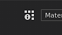

# 2D-Ansicht

{width="450px"}

Die 2D-Ansicht zeigt die Gitteransicht aus dem aktuell ausgewählten [Textursatz](../texture-set/texture-set.md) an. Die UV-Inseln werden in der 2D-Ansicht angezeigt. Du kannst die Strukturen des Ebenenstapels sehen, aber auch die Gitter-UV-Inseln aufmalen.

## Anzeigemodus

Oben rechts im Viewport befindet sich das Dropdown-Menü für den Anzeigemodus. Mit diesem Steuerelement können Sie ändern, welche Informationen im Viewport angezeigt werden sollen. Es ermöglicht die Anzeige einzelner Kanäle, Mesh-Maps oder des endgültigen Materialergebnisses mit Beleuchtung.

## Achseninformationen

Unten rechts im Viewport befindet sich die **Achseninformation**, die die Richtung der zweidimensionalen Achsen angibt. In der 2D-Ansicht sind die Achsen U und V.

## Informationen zur UV-Kachel

Neben dem **Anzeigemodus** befindet sich die Schaltfläche **UV-Kachelinformationen**, mit der Informationen zu UV-Kacheln ein- bzw. ausgeblendet werden können. Diese Schaltfläche ist bei regulären Projekten nicht sichtbar.

## Projekt-Workflow

Abhängig vom Workflow, der beim Erstellen eines Projekts definiert wurde, kann die 2D-Ansicht anders aussehen und sich anders verhalten:

| *Projektarbeitsablauf* | *Verhalten* |
| --- | --- |
| **Standardprojekt** | Bei regulärem Projekt kann nur die UV mit dem UV-Bereich [0-1] angestrichen werden. Alles, was außerhalb dieses Bereichs liegt, ist sichtbar, aber nicht interaktiv.In diesem Beispiel können nur die UV-Inseln auf der linken Seite (mit hellgrauem Hintergrund) gemalt werden. 

 |
| **UV-Kachelprojekt** | Mit dem UV Tile-Projekt ist jeder UV-Bereich ein neuer Satz von Texturen, die aufgemalt werden können. Die 2D-Ansicht wird ebenfalls als Raster angezeigt, um die Anordnung der einzelnen Kacheln zu verdeutlichen. Jeder Kachel wird eine UDIM-Nummer zugewiesen. 

 |
