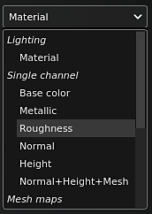

# 3D-Ansicht

{width="370px"}

Die 3D-Ansicht zeigt das 3D-Modell unter Beleuchtungsbedingungen an, wodurch Sie sehen können, wie das Oberflächenmaterial definiert ist. Hier ist es auch möglich, das 3D-Modell direkt zu übermalen.

## Profil

Links oben im Viewport wird möglicherweise ein Text angezeigt, der das derzeit geladene Profil angibt. Weitere Informationen finden Sie auf der Seite [Farbprofil](../../features/post-processing/color-profile.md).

## Kameraauswahl

Wenn in der 3D-Modelldatei, die zum Erstellen des Projekts oder zum Importieren des Gitters verwendet wird, Kameras definiert sind, können sie in das Projekt importiert und verwendet werden, um die Position und Ausrichtung der Kamera zu ändern. Mit dieser Dropdown-Liste können Sie zwischen der im Projekt verfügbaren Kamera wechseln. Wenn es keine andere Kamera als die Standardkamera gibt, wird die Dropdown-Liste nicht angezeigt.

Der Wechsel zwischen Kameras kann schnell über den dedizierten [Tastaturbefehl](../settings/shortcuts.md) erfolgen. Weitere Informationen finden Sie auf der Seite [Kameraverwaltung](camera-management.md).

## Anzeigemodus

Standardmäßig ist der Viewport-Anzeigemodus auf Material eingestellt, um die Umgebungsbeleuchtung anzuzeigen. Mit der Dropdown-Liste können Sie den Anzeigemodus auf Solo umschalten, wodurch Kanäle und Meshmaps einzeln isoliert werden.

Diese Beleuchtung kann über die [Anzeigeeinstellungen](../display-settings/display-settings.md) sowie andere Rendereinstellungen gesteuert werden. Die Beleuchtungsausrichtung kann auch mithilfe des [Tastaturbefehls](../settings/shortcuts.md) geändert werden.

## Achse

Unten rechts im Viewport befindet sich die 3D-Ansichtsachse, die angibt, wie die Szene im Vergleich zur Kamera ausgerichtet ist.

## Weitere Einstellungen

Die Viewport-Anzeige kann durch andere Einstellungen beeinflusst werden:

* [Shader-Einstellungen](../shader-settings/shader-settings.md)
* [Nachbearbeitung](../../features/post-processing/post-processing.md)
