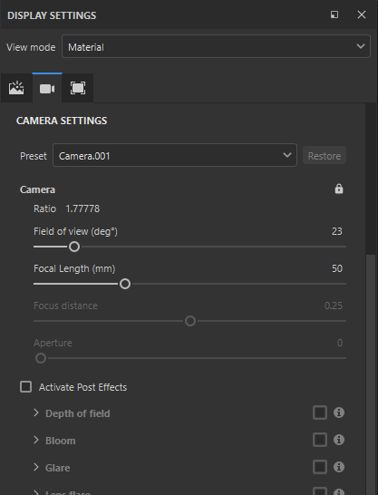
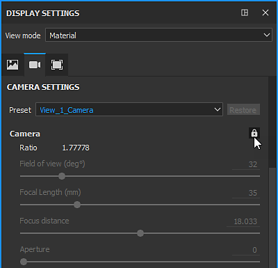

# Kameramanagement

In Maya, Max, Blender, Modo und DAE erstellte Kameras können in Substance 3D Painter importiert werden.

>[!NOTE]
>
> Orthografische Kameras und Anzeigeverhältnisse werden im ABC-Format (Alembic) nicht korrekt unterstützt.

## Kameras in Substance 3D Painter importieren

Die Kameras sollten in der Gitterdatei enthalten sein, entweder im FBX- oder im ABC-Format (Alembic).

Der Name, die Transformationsparameter, das FOV und das Seitenverhältnis (sofern vorhanden) werden importiert.

Wählen Sie im Fenster Neues Projekt die Gitterdatei aus, die die Kameras enthält, und überprüfen Sie, ob das Kontrollkästchen **Kameras importieren** aktiviert ist. Wenn Sie im **Bearbeiten > Projektkonfigurationsfenster** das **Wiederholen-Importgitter** aktivieren, können Sie auch **Kameras importieren** aktivieren, wenn Sie sie bei der ersten Projekterstellung verpasst haben.

Klicken Sie dann auf **OK**:

<table>
  <tr style="border: 0;">
    <td style="border: 0;" valign="top"></td>
    <td style="border: 0;" valign="top"></td>
  </tr>
</table>

## Kameras auswählen

Wenn Kameras in Ihr aktuelles Projekt importiert wurden, können Sie im **3D Viewport** aus der Dropdown-Liste **auswählen, welche Kamera aktiv ist.**

Standardmäßig ist die Painter-Kamera mit dem Namen &quot;Standardkamera&quot; ausgewählt und befindet sich im Perspektivmodus.

Im obigen Beispiel werden 3 Kameras importiert, sodass insgesamt 4 Kameras in der Dropdown-Liste angezeigt werden, wenn die Standardkamera enthalten ist.

## Kameras steuern.

Wenn eine importierte Kamera ausgewählt ist, wird beim Verschieben der Kamera durch Schwenken, Zoomen oder Drehen im Viewport die Standardkamera aktiviert. Dies verhindert, dass die importierten Kameras in der Szene verschoben werden.

>[!NOTE]
>
> Wenn Sie die importierte Kameraposition ändern müssen, können Sie diese in der ausgewählten Szenenbearbeitungsanwendung aktualisieren und die Szene mit **Bearbeiten > Projektkonfiguration** erneut importieren.

Sie können die Parameter der importierten Kameras im Fenster **Anzeigeeinstellungen** steuern.

Wählen Sie im Dropdown-Menü **Vorgabe** die zu ändernde Kamera aus.

Wenn eines der Attribute geändert wird, können Sie mit der Schaltfläche **Wiederherstellen** die ursprünglichen Werte wiederherstellen.

Wenn ein Parameter für eine importierte Kamera geändert wurde, wird der Kameraname kursiv formatiert und ein &quot;\*&quot; wird dem Kameranamen hinzugefügt.

### Kameraattribute

Das Blickfeld oder das FOV wird in Grad ausgedrückt.

Die Brennweite wird in mm angegeben.

Im Viewport-Modus (OpenGL) sind der Fokusabstand und die Blende deaktiviert. Um sie zu aktivieren, müssen Post Effects und DOF aktiviert sein.

### Anzeigeverhältnis

Wenn das Anzeigeverhältnis in der Gitterdatei vorhanden ist, wird es im Abschnitt Kamera angezeigt. Wenn eine Kamera kein definiertes Anzeigeverhältnis hat, wird sie als **Nicht angegeben** aufgeführt (wie die Standardkamera).

### Sperren

Eine Kamera kann durch Klicken auf das Schlosssymbol gesperrt werden. Das Sperren einer Kamera verhindert Änderungen an den Parametern der Kamera.

## Kamerarahmen

Der Kamerarahmen kann in **Anzeigeeinstellungen > Viewport-Einstellungen** umgeschaltet werden:

Sie können die Deckkraft des Bereichs außerhalb des Rahmens auch mit der **Gate-Maskendeckkraft** anpassen.

<table>
  <tr style="border: 0;">
    <td style="border: 0;" valign="top"></td>
    <td style="border: 0;" valign="top"></td>
  </tr>
</table>
