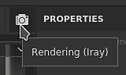

# Viewport

{width="600px"}

Im Viewport werden das 3D-Mesh und seine Texturen angezeigt. Hier ist es auch möglich, auf die 3D-Meshfläche zu malen.

## Überblick

Der Viewport besteht aus vier Teilen:

* **Kontextabhängige Symbolleiste**: Diese Symbolleiste befindet sich oben im Viewport und bietet Verknüpfungen zu verschiedenen Eigenschaften, die vom aktuellen Kontext abhängen (z. B. Pinselparameter beim Malen).
* **3D-Ansicht**: Diese Ansicht zeigt das 3D-Gitter aus einem bestimmten Winkel, der durch eine Kamera definiert wird.
* **2D-Ansicht**: Diese Ansicht zeigt das UV-Ausgliedern des 3D-Gitters für den aktuell ausgewählten [Textursatz](../texture-set/texture-set-list.md).
* **Fortschrittsleiste**: Diese graugrüne Leiste am unteren Rand des Viewports wird angezeigt, wenn eine Berechnung ausgeführt wird (z. B. wenn der Motor Texturen generiert).

Weitere Informationen finden Sie auf den entsprechenden Seiten:

* [2D-Ansicht](2d-view.md)
* [3D-Ansicht](3d-view.md)
* [Kameramanagement](camera-management.md)

Die 3D- und 2D-Ansichten können angepasst werden, um zusätzliche oder andere Informationen über die [Anzeigeeinstellungen](../../interface/display-settings/display-settings.md) anzuzeigen.

## Viewport-Navigationssteuerelemente

Die Steuerelemente für das Navigieren im Viewport sind in den 2D- und 3D-Ansichten ähnlich.

<table>
  <tr>
    <th>Bewegungstyp</th>
    <th>Tastaturbefehl</th>
    <th>Beschreibung</th>
  </tr>
  <tr>
    <td>Kreisen/Drehen </td>
    <td><strong>Alt + Linksklick</strong></td>
    <td><ul><li>3D-Ansicht: Drehen Sie die Kamera um die Cursorposition.</li><li>2D-Ansicht: Drehen Sie den UV-Raum um die Cursorposition.</li></ul></td>
  </tr>
  <tr>
    <td>Schwenken</td>
    <td><strong>Alt + Mitte-Klick</strong></td>
    <td>Bewegen Sie die Kamera nach oben, unten, links oder rechts.</td>
  </tr>
  <tr>
    <td>Zoom/Dolly</td>
    <td><strong>Alt + Rechtsklick</strong></td>
    <td>Näher an das Gitter/die UVs heranzoomen oder weiter davon entfernt.</td>
  </tr>
</table>

>[!NOTE]
> Sowohl in 2D- als auch in 3D-Ansichten können Sie an orthogonalen Winkeln ausrichten, wenn Sie mit **Alt + Umschalt + Linksklick** kreisen/drehen.

## Layout ändern

Beim Standardlayout wird die 3D-Ansicht links und die 2D-Ansicht rechts platziert. In der **Kontextsymbolleiste** sind einige Parameter verfügbar, mit denen das Layout geändert werden kann:

<table>
  <tr>
    <th><em>Einstellung</em></th>
    <th><em>Beschreibung</em></th>
  </tr>
  <tr>
    <td><strong>Viewport-Modus</strong> </td>
    <td>Diese Einstellungen steuern das Layout des Viewports: <ul><li><strong>3D/2D</strong> (Standard): sowohl die 3D- als auch die 2D-Ansicht im Viewport anzeigen</li><li><strong>Nur 3D</strong>: Maximieren Sie die 3D-Ansicht und blenden Sie die 2D-Ansicht aus.</li><li><strong>Nur 2D</strong>: Maximieren Sie die 2D-Ansicht und blenden Sie die 3D-Ansicht aus.</li><li><strong>3D/2D austauschen</strong>: die Reihenfolge austauschen, in der die Ansichten angezeigt werden. Wenn die 3D-Ansicht auf der linken Seite war, wird sie nach Auswahl dieser Aktion auf der rechten Seite angezeigt.</li></ul></td>
  </tr>
  <tr>
    <td><strong>Perspektivmodus</strong> </td>
    <td>Mit diesen Einstellungen wird gesteuert, wie das 3D-Mesh in der 3D-Ansicht angezeigt wird: <ul><li><strong>Perspektivische Ansicht</strong> (Standard): zeigt das 3D-Mesh so an, wie es vom menschlichen Auge oder von der Kamera gesehen würde.</li><li><strong>Orthografische Ansicht</strong>: zeigt das 3D-Mesh an, da jede Richtung dieselbe Länge misst.</li></ul></td>
  </tr>
  <tr>
    <td><strong>Kameradrehungsmodus</strong> </td>
    <td>Diese Einstellungen steuern, wie viele Achsen die Viewport-Kamera drehen kann. <ul><li><strong>Freie Drehung</strong>: die Kamera um die X-, Y- und Z-Achse drehen.</li><li><strong>Eingeschränkte Drehung</strong> (Standard): Die Kamera dreht sich nur um die X- und Y-Achse (keine Rolle).</li></ul></td>
  </tr>
  <tr>
    <td><strong>Rendermodus</strong> </td>
    <td>Wechseln Sie in den <a href="../../features/iray-renderer/iray-renderer.md">-Rendermodus </a>.</td>
  </tr>
</table>
