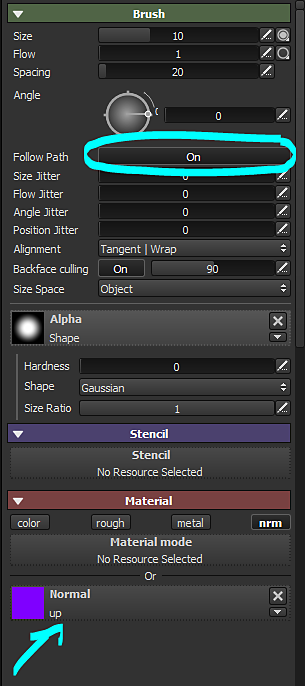
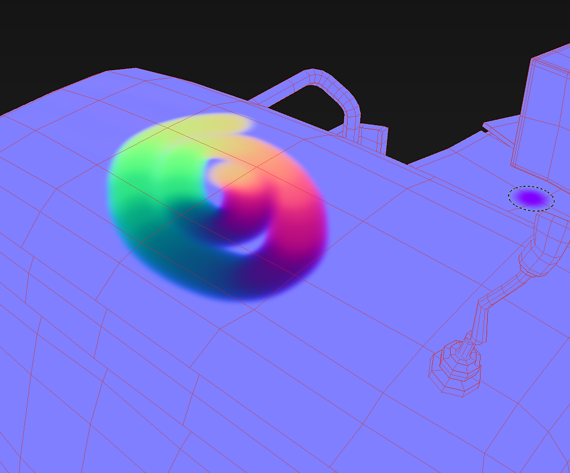

# Flow Map Painting

Ein eigener Kanal ist geplant, aber in der Zwischenzeit ist es möglich, mithilfe des Normal-Kanals und einiger Pinselparameter Flow Maps in Substance 3D Painter Malen.

## Schritt 1: Erstellen der Normalen-Map

Erstellen Sie eine Normalen-Map-Textur von 16 x 16 Pixel. Die Farbe muss 128, 255, 128 sein, was die folgende Farbe ergeben sollte: \
(Diese Farbe entspricht einer in DirectX nach oben schauenden Vektorgrafik)

## Schritt 2: Hinzufügen eines normalen Kanals

Fügen Sie in Ihrem Substance 3D Painter-Projekt einen **Normal**-Kanal über die **Kanaleinstellungen** hinzu, wenn dieser Textursatz noch nicht vorhanden ist.

## Schritt 3: Pinseleinstellungen

Aktivieren Sie die Funktion &quot;Pfad folgen&quot; in den Pinselparametern. Laden Sie die Normalen-Map-Textur (Schritt 1) in den normalen Kanalsteckplatz. Deaktivieren Sie die anderen Kanäle.

{width="300px"}

## Schritt 4: Malen!

Wenn Sie auf dem Mesh mit aktivierter Einstellung &quot;Pfad folgen&quot; malen, zeichnen die Pinselstriche Richtungen auf den Normalen-Map.

{width="700px"}
