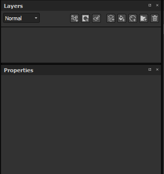

# Normales Kartenmalen

Um Details zu zeichnen, malen Sie direkt mit normalen Kartendaten direkt auf das Gitter. Auf dieser Seite wird eine neue Art und Weise für das normale Malen von Karten beschrieben.

## Normale Kartendetails malen

So malen Sie normale Kartendetails:

1. Hinzufügen eines normalen Kanals im aktuellen Textursatz (falls nicht bereits vorhanden)
1. Normalen Kanal im aktuellen Malwerkzeug aktivieren
1. Lädt eine Ressource vom Typ Normal in den Schlitz Normal des Bereichs Material des aktuellen Malwerkzeugs.

Von dort aus ist das Malen mit einer Normalmap sehr ähnlich wie das Malen mit [Height Map Painting](height-map-painting.md) , mit der zusätzlichen Präzision einer eingebrannten Normalmap.

## Normale Füllmethoden

Normale Maps haben ihre eigenen Füllmethoden im Ebenenstapel:

* **Normale Zuordnungsdetails** (Standard)
* **Inverse Details der normalen Karte**
* **Normale Kartenkombination**

Weitere Informationen finden Sie auf der Seite [Füllmethoden](../../interface/layer-stack/blending-modes.md).

## Normaler Farbraum

Beim Laden einer Normalmap in den Schlitz eines Materials (Werkzeugeigenschaften oder Füllschicht) kann der Standardfarbraum geändert werden.

Diese Einstellung kann verwendet werden, um die Normalen-Map-Format anzugeben, da standardmäßig eine DirectX (Y-) Normalmap erwartet wird (sie wird von der Projekteinstellung nicht beeinflusst). Wenn Sie also eine OpenGL-Normalmap (Y+) verwenden, müssen Sie auf den kleinen Pfeil klicken, um das Farbraummenü zu öffnen und dann den Farbraum der Bitmap zu ändern.

## Malen über eine fertig gestellte Normalkarte

In manchen Situationen kann es nützlich sein, über die gebackene Normalkarte zu malen, um Details zu verbergen (oder sogar Backprobleme zu beheben).\
Beim Standardsetup eines Projekts in Substance 3D Painter ist dies nicht möglich, da der Normalkanal und der gesicherte Normalkanal separat berechnet werden. Dieses Verhalten kann über die [Einstellungen für den Textursatz](../../interface/texture-set/texture-set-settings.md) geändert werden.

### 1 - Ändern des Mischmodus des Textursatzes

Standardmäßig wird ein Textursatz mit der Einstellung **Normale Mischung** erstellt, die auf **Kombinieren** festgelegt ist.

Um die normale Zuordnung zu überschreiben/zu malen, ist es wichtig, diese Einstellung stattdessen auf **Ersetzen** festzulegen. Die normale Karte wird aus dem Viewport verschwinden, aber das wird erwartet. Wenn Sie diesen Modus in **Ersetzen** ändern, wird Substance 3D Painter angewiesen, beim Generieren der endgültigen Normalmap nur den Normalkanal und den Height-Kanal zu berücksichtigen.

### 2 - Festlegen einer Füllebene mit der fertig gestellten Normalmap

Erstellen Sie eine neue Füllebene und setzen Sie die fertig gestellte Normale über das Eigenschaftenbedienfeld in den Steckplatz &quot;Normal&quot;. Vergessen Sie nicht, die Standardbearbeitung der Füllebene zu ändern, wenn sie nicht auf 1 gesetzt ist.

### 3 - Füllmethode der Ebene ändern

Standardmäßig ist der Mischmodus des normalen Kanals auf einer neuen Ebene auf &quot;Normale Kartendetails&quot; eingestellt. Da es besser ist, die Füllebene als Basis zu verwenden, haben wir den &quot;normalen&quot; Mischmodus gewählt, da die Bitmap keinen Alpha-Wert hat. Er ersetzt alles darunter (einschließlich der Standardfarbe des Shaders).

### 4 - Erstellen einer Ebene zum Übermalen der fertig gestellten Normalmap

Erstelle eine neue Ebene (normal oder gefüllt). Setze den Mischmodus für den normalen Kanal auf &quot;Normal&quot;. Sobald diese Einrichtung abgeschlossen ist, übernimmt alles, was auf dem normalen Kanal gemalt wird, die gebackene Normalmap auf der darunterliegenden Ebene.

