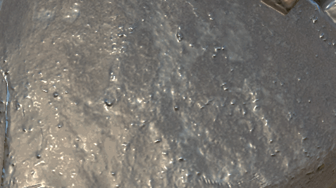
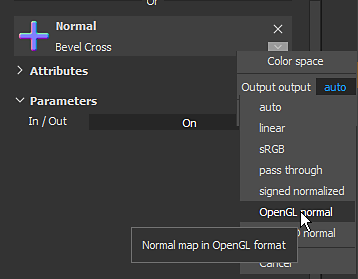
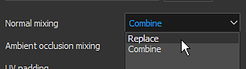
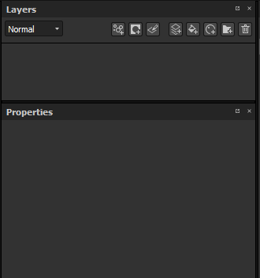
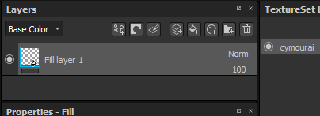
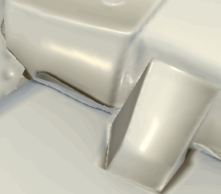

# Normalen-Map Painting

Details können gemalt werden, indem Daten direkt auf den Mesh Normalen-Map werden. Auf dieser Seite werden verschiedene Möglichkeiten zur Verwaltung von Normalen-Map-Malvorgängen neu gruppiert.

## Normalen-Map-Detail malen

Malen von Normalen-Map-Details:

1. Hinzufügen eines Normalkanals im aktuellen Textursatz (falls nicht bereits vorhanden)
1. Normalen Kanal im aktuellen Malwerkzeug aktivieren
1. Lädt eine Ressource vom Typ Normal in den Steckplatz Normal des Bereichs Material des aktuellen Malwerkzeugs.

Von dort aus ähnelt das Malen mit einer Normalen-Map sehr dem [Höhen-Map-Malen](height-map-painting.md) , mit der zusätzlichen Präzision einer Baking geführt Normalität.

## Normale Füllmethoden

Normalen-Map haben ihre eigenen Füllmethoden im Ebenenstapel:

* **Normalen-Map-Details** (Standard)
* **Normalen-Map Inverse Detail**
* **Normalen-Map-Kombination**

Weitere Informationen finden Sie auf der Seite [Füllmethoden](../../interface/layer-stack/blending-modes.md).

## Normaler Farbraum

Beim Laden einer Normalen-Map in den Steckplatz eines Materials (Werkzeugeigenschaften oder Füllebene) kann der Standardfarbraum geändert werden.

Diese Einstellung kann zur Angabe der Normalen-Map-Format verwendet werden, da standardmäßig eine DirectX-Normalen-Map (Y-) erwartet wird (sie wird von der Projekteinstellung nicht beeinflusst). Wenn Sie also eine OpenGL-Normalen-Map (Y+) verwenden, müssen Sie auf den kleinen Pfeil klicken, um das Farbraummenü zu öffnen und dann den Farbraum der Bitmap zu ändern.

## Malen über eine Baking geführt Normalen-Map

In manchen Situationen kann es hilfreich sein, über die Baking geführt Normalen-Map Malen, um Details auszublenden (oder sogar Baking führend Probleme zu beheben).\
Beim Standardsetup eines Projekts in Substance 3D Painter ist dies nicht möglich, da der Normalkanal und der Baking geführt Normalkanal separat berechnet werden. Dieses Verhalten kann über die [Textursatz-Einstellungen](../../interface/texture-set/texture-set-settings.md) geändert werden.

### 1 - Ändern des Textursatz-Mischmodus

Standardmäßig wird ein Textursatz mit der Einstellung **Normale Mischung** erstellt, die auf **Kombinieren** festgelegt ist.

Zum Überschreiben/Malen der Normalen-Map ist es wichtig, diese Einstellung stattdessen auf **replace** festzulegen. Die Normalen-Map wird vom Viewport verschwinden, aber das ist zu erwarten. Wenn Sie diesen Modus in &quot;**replace**&quot; ändern, wird Substance 3D Painter angewiesen, beim Generieren der endgültigen Normalen-Map nur den Normalkanal und den Height-Kanal zu berücksichtigen.

### 2 - Festlegen einer Füllebene mit dem Baking geführt Normalen-Map

Erstellen Sie eine neue Füllebene und setzen Sie die Baking geführt Normale über das Eigenschaftenbedienfeld in den Steckplatz &quot;Normal&quot;. Vergessen Sie nicht, die Standardbearbeitung der Füllebene zu ändern, wenn sie nicht auf 1 gesetzt ist.

### 3 - Ändern der Füllmethode der Füllebene

Standardmäßig ist die Füllmethode des Normalkanals auf jeder neuen Ebene auf &quot;Normalen-Map details&quot; festgelegt. Da es besser ist, die Füllebene als Grundlage zu verwenden, haben wir den &quot;normalen&quot; Mischmodus gewählt, da die Bitmap keinen Alpha-Wert hat. Alles darunter (einschließlich der Standardfarbe des Shader) wird ersetzt.

### 4 - Erstellen einer Ebene zum Malen über der Baking geführt Normalen-Map

Erstelle eine neue Ebene (normal oder gefüllt). Setze den Mischmodus für den normalen Kanal auf &quot;Normal&quot;. Sobald diese Einrichtung abgeschlossen ist, übernimmt alles, was auf dem normalen Kanal gemalt wird, die Baking geführt Normalen-Map, die sich auf der darunterliegenden Ebene befindet.

