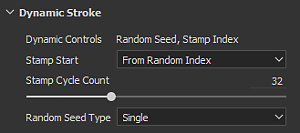

# Aktivieren der Funktion &quot;Dynamische Konturen&quot;

Um die Funktion &quot;Dynamische Pinselstriche&quot; zu aktivieren, ist zunächst eine bestimmte Ressource erforderlich.

## Finden von Ressourcen, die mit Dynamischen Pinselstrichen kompatibel sind

Beim Durchsuchen des Fensters &quot;[Assets](../../interface/assets/assets.md)&quot; zeigt ein dediziertes Symbol unten rechts in einer Miniaturansicht den Kompatibilitätstyp der Ressource an. Wenn kein Symbol angezeigt wird, bedeutet dies, dass die Ressource die Funktion nicht nutzen kann.

| *Symbol* | *Beschreibung* |
| --- | --- |
| 

 | Diese Ressource kann eines oder mehrere der folgenden Verhalten verwenden:<ul data-preserve-html="true"><li data-preserve-html="true">Stempelindex</li><li data-preserve-html="true">Uhrzeit</li><li data-preserve-html="true">Zufällige Verteilung</li></ul> |
| 

 | Diese Ressource legt nur den Parameter &quot;Zufallsverteilung&quot;. |

Es ist auch möglich, Ressourcen mithilfe des Suchfelds im Regal mit den folgenden Schlüsselwörtern zu suchen:

* dynamischer Strich
* randomseed

## Parameter für Dynamische Pinselstriche

Wenn eine Dynamic Stroke-Ressource geladen wurde, wird eine neue Parameterliste direkt vor der Substance-Parametergruppe hinzugefügt.

| *Parameter* | *Beschreibung* |
| --- | --- |
| **Dynamische Steuerelemente** | Listet die Parameter auf, die für die aktuell verwendete Substance-Datei verfügbar sind. |
| **Stempelanfang** | Nur verfügbar, wenn die Ressource über das dynamische Steuerelement &quot;Stempelindex&quot; verfügt. Gibt an, von welchem Wert der Index der Stempel innerhalb des Pinselstrichs beginnen soll:<ul data-preserve-html="true"><li data-preserve-html="true"><strong>Vom Anfang (0)</strong>: Standard. Der Index beginnt bei jeder neuen Kontur bei null.</li> <li data-preserve-html="true"><strong>Von zufälligem Index</strong>: Der Index beginnt mit einem zufälligen Wert (wobei sein Maximum durch die Anzahl der Stempelzyklen definiert wird). Beachten Sie, dass die folgenden Werte immer noch der Reihe nach und nicht völlig zufällig sind.</li> </ul> |
| **Anzahl der Stempelzyklen** | Nur verfügbar, wenn die Ressource über das dynamische Steuerelement &quot;Stempelindex&quot; verfügt. Mit diesen Parametern wird gesteuert, wann Substance 3D Painter die Generierung neuer Substance-Varianten beenden und mit der Wiederverwendung der vorhandenen beginnen soll. Dieser Parameter hat große Auswirkungen auf die Leistung, die Sie weiter über [Dynamische Strichleistungen](dynamic-stroke-performances.md) lesen können. |
| **Zufallsverteilungstyp** | Nur verfügbar, wenn die Ressource über das dynamische Steuerelement &quot;Random Seed&quot; verfügt. Steuert, wie sich die Zufallsverteilung ändern soll:<ul data-preserve-html="true"><li data-preserve-html="true"><strong>Single</strong>: Standard. Verwenden Sie einen einzelnen Zufallswert, der manuell über die Substance-Parameter eingestellt werden kann.</li> <li data-preserve-html="true"><strong>Zufällig pro Strich</strong>: Generiert einen neuen Wert für &quot;Zufallsverteilung&quot; für jeden neuen Pinselstrich.</li> <li data-preserve-html="true"><strong>Zufällig pro Stempel</strong>: Generiert einen neuen Wert für &quot;Zufallsverteilung&quot; für jeden Stempel innerhalb eines Pinselstrichs. <em><strong>Seien Sie vorsichtig mit dem Parameter, da er sehr teuer sein kann</strong>.</em></li> </ul> |
| **Zeit** | Das dynamische Zeitsteuerelement verfügt über keinen Parameter. Die Zeit wird durch die Dauer des Malens eines Pinselstrichs bestimmt. |

## Liste der kompatiblen Tools

Die Einstellungen für dynamische Konturen sind nur mit den folgenden Werkzeugen und Kontexten verfügbar:

| *Tooltyp* | *Kompatibler Ressourcensteckplatz* |
| --- | --- |
| **Farbe** | <ul data-preserve-html="true"><li data-preserve-html="true">Alpha</li><li data-preserve-html="true">Material</li></ul> |
| **Radiergummi** | <ul data-preserve-html="true"><li data-preserve-html="true">Alpha</li><li data-preserve-html="true">Material</li></ul> |
| **Projektion** | <ul data-preserve-html="true"><li data-preserve-html="true">Alpha</li></ul> |
| **Verwischen** | <ul data-preserve-html="true"><li data-preserve-html="true">Alpha</li></ul> |
| **Klon** | <ul data-preserve-html="true"><li data-preserve-html="true">Alpha</li></ul> |

>[!NOTE]
>
> Dynamische Pinselstriche sind nicht mit **Partikeln** kompatibel. Aus diesem Grund ist die Funktion deaktiviert, wenn ein Tool im Physikmodus verwendet wird.
