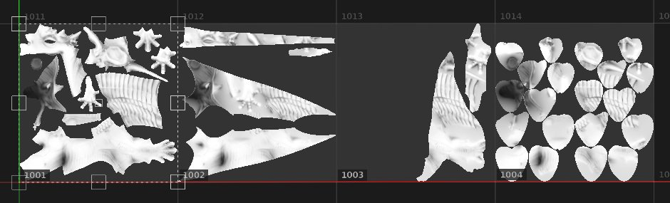

# Füllung (Übereinstimmung pro UV-Kachel)

Die **Füllung (Übereinstimmung pro UV-Kachel)** ist eine besondere 2D-Projektion, die für [UV-Kachel](../../features/uv-tiles/uv-tiles.md)-Projekte nützlich ist. Es ermöglicht, eine UDIM-Textur aus einer Sequenz für jede UV-Kachel zuzuweisen.

Für diese Projektion sind keine speziellen Einstellungen verfügbar, da ein einzelnes Bild oder mehrere Bilder zugewiesen sind, um jede UV-Kachel zu füllen. Da es keine Einstellungen gibt, ist dieser Modus auch besser für die Leistung.

| Modus | Beschreibung |
| --- | --- |
| **UV-Projektion** | Ein einzelnes Bild oder das erste Bild aus einer Sequenz wird auf alle UV-Kacheln angewendet. Dadurch ergeben sich auch Deformationssteuerungen. Weitere Informationen finden Sie unter [UV-Projektion](uv-projection.md). 

 |
| **Füllung (Übereinstimmung pro UV-Kachel)** | Jedes Bild einer Sequenz ist der zugehörigen UV-Kachel zugeordnet. Es gibt keine Deformationssteuerungen. 

 |
