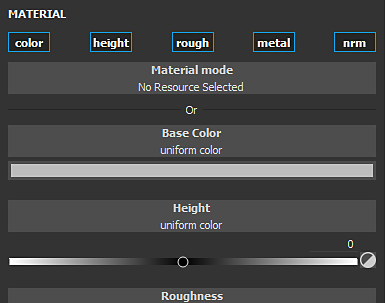

# Projektionen füllen

Füllebene- und Fülleffekte projizieren eine Textur basierend auf einem bestimmten Modus direkt auf den Mesh. Bei dieser Art von Ebene/Effekt müssen keine Texturen manuell auf das 3D-Modell Malen werden. Die Einstellungen der Projektion können über das Eigenschaftenfenster bearbeitet werden.

Die Eigenschaften sind in zwei Kategorien unterteilt: **Fülleigenschaften** und **Material**.

## Fülleigenschaften

Die Fülleigenschaften steuern, wie das Material angewendet und/oder auf den Mesh projiziert wird. Der Projektion-Modus kann über die Dropdown-Liste **Projektion** im Fenster [Eigenschaften](../../interface/properties.md) geändert werden.

Die derzeit verfügbaren Modi zur Projektion sind:

* [Füllung (Übereinstimmung pro UV-Kachel)](fill-match-per-uv-tile.md)
* [UV-Projektion](uv-projection.md)
* [Triplanare Projektion](tri-planar-projection.md)
* [Planarprojektion](planar-projection.md)
* [Sphärische Projektion](spherical-projection.md)
* [Zylindrische Projektion](cylindrical-projection.md)
* [Verkrümmungsprojektion](warp-projection.md)

## Material (und Graustufen)

Die Steuerelemente &quot;Material&quot; und &quot;Graustufen&quot; sind mit den anderen Werkzeugen identisch. Weitere Informationen finden Sie in der Dokumentation zum [Malen-Tool](../tool-list/paint-brush.md).
