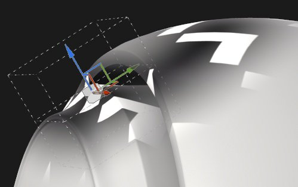
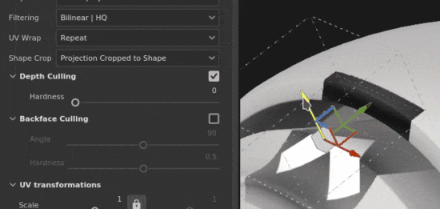
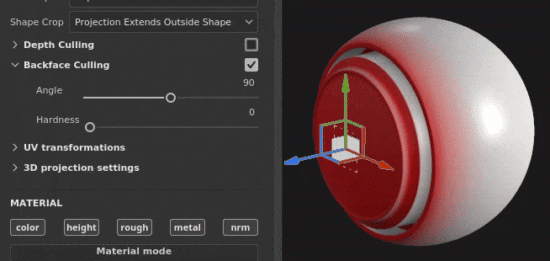

# Planarprojektion

Die Planare Projektion der Fläche ist eine 3D-Projektion, mit der ein Bild in eine Richtung als Ebene projiziert wird. Es kann verwendet werden, um Schilder, Aufkleber und andere Muster auf der Oberfläche oder durch das 3D-Modell zu projizieren.

## Eigenschaften

| *Einstellung* | *Beschreibung* |
| --- | --- |
| **Filterung** | Steuert, wie die Textur oder das Material gefiltert wird. Diese Einstellung kann sich darauf auswirken, wie die Textur aussieht, wenn sie mehrmals wiederholt wird. Wenn hohe Skalierungswerte mit einer anderen Filterung als der Standardeinstellung verwendet werden, kann das Ergebnis möglicherweise besser aussehen. Aktuelle Einstellungen verfügbar:<ul data-preserve-html="true"><li data-preserve-html="true"><strong>Bilinear `\|` HQ</strong> (Standard): Fortschrittliche bilineare Filterung, die versucht, die Qualität der Textur zu verbessern, wenn die Kachelung hoch ist.</li><li data-preserve-html="true"><strong>Bilinear `\|` Sharp</strong>: Eine bilineare Filterung, die die Textur glättet, aber die Details bewahrt.</li><li data-preserve-html="true"><strong>Nächste</strong>: Keine Filterung, nützlich, wenn die Bilineare Filterung zu einem verschwommenen Ergebnis führt und feine Details aufbricht. Kann Aliasing in die Textur einführen.</li></ul> |
| **Abwicklung** | Lege fest, wie sich die Textur innerhalb der Projektion wiederholt. Mögliche Werte sind:<ul data-preserve-html="true"><li data-preserve-html="true"><strong>Keine</strong>: Die Textur wiederholt sich nicht. Alles, was sich außerhalb der Textur befindet, ist schwarz/transparent.</li><li data-preserve-html="true"><strong>Horizontal wiederholen</strong>: Die Textur wird nur horizontal wiederholt.</li><li data-preserve-html="true"><strong>Vertikal wiederholen</strong>: Die Textur wird nur vertikal wiederholt.</li><li data-preserve-html="true"><strong>Wiederholen</strong> (Standard): Die Textur wiederholt sich auf beiden Achsen.</li></ul>  

 |
| **Formzuschnitt** | Legen Sie fest, ob die projizierte Textur außerhalb des Bereichs &quot;Projektion&quot; angezeigt werden soll. Mögliche Werte sind:<ul data-preserve-html="true"><li data-preserve-html="true"><strong>Projekt auf Form zugeschnitten</strong>: die Projektion ist innerhalb der Projektion begrenzt.</li><li data-preserve-html="true"><strong>Projektion erstreckt sich außerhalb von Form </strong> (Standard): die Projektion geht über die Projektion hinaus.</li></ul>  

 |
| **Tiefe ausblenden** | Wenn diese Option aktiviert ist, wird die Projektion entlang ihrer Projektion-Achse Verblassen/ausgeschnitten, anstatt unendlich zu sein.  <ul class="steps" data-preserve-html="true"> <li class="step" data-preserve-html="true">    <strong>Aktiviert</strong>:           </li> <li class="step" data-preserve-html="true">    <strong>Deaktiviert</strong>:         </li> </ul>  Es ist ein Parameter verfügbar:<ul data-preserve-html="true"><li data-preserve-html="true">Die Einstellung <strong>Härte</strong> steuert, wie stark oder weich die Tiefe ausblenden entlang der Achse der Projektion ist.</li></ul>  

 |
| **Rückseiten-Ausblendung** | Wenn diese Option aktiviert ist, wird die Projektion nicht auf den Flächen des 3D-Modells angezeigt, die von der Achse der Projektion wegschauen.Es stehen zwei Parameter zur Verfügung:<ul data-preserve-html="true"><li data-preserve-html="true"><strong>Winkel</strong>: den Mindestwinkel festlegen, der bestimmt, wann Flächen, die wegschauen, ignoriert werden sollen.</li><li data-preserve-html="true"><strong>Härte</strong>: Legen Sie fest, wie hart oder weich der Übergang sein soll.</li></ul>  

 |

>[!NOTE]
>
> Durch Anpassen der Transformationsskala kann auch die Tiefe der Projektion gesteuert werden:
> 
> 

### Transformation der UV

Die UV-Transformationseinstellungen steuern die Textur/das Material innerhalb der Projektion.

<table data-preserve-html="true" style="width: 100.0%;"><colgroup> <col style="width: 40.0%;"/> <col style="width: 20.0%;"/> <col style="width: 40.0%;"/> </colgroup><tbody><tr><th>Skalierungsmodus</th><th>Einstellung</th><th>Beschreibung</th></tr><tr><td>
<strong>Kachelung</strong> (Standard)<strong>  </strong>

Ermöglicht die manuelle Festlegung des wiederholenden Betrags für die aktuelle Textur.
</td><td><strong>Wiederholen</strong></td><td>Steuert, wie oft die Textur wiederholt wird.</td></tr><tr><td rowspan="2">  </td><td colspan="1"><strong>Drehung</strong></td><td colspan="1">Steuert den Winkel, in dem die Textur auf den Mesh projiziert wird.</td></tr><tr><td colspan="1"><strong>Versatz</strong></td><td colspan="1">Steuert, von wo aus die Textur projiziert wird. Der Standardwert bedeutet, dass die Textur im Mittelpunkt der UVs des Meshs steht.</td></tr><tr><th colspan="1"> </th><th colspan="1"> </th><th colspan="1"> </th></tr><tr><td rowspan="4">
<strong>Physische Größe</strong>

Automatische Einstellung einer Textur entsprechend der Größe des Meshs und der eingebetteten Physische Größe. Die richtige Physische Größe wird anhand der Längen- und Breitenwerte (X- und Y-Werte) berechnet. Die Z-Messung wird nicht berücksichtigt.

(Weitere Informationen finden Sie auf der speziellen [Dokumentationsseite](https://experienceleague.adobe.com/en/docs/substance-3d-painter/using/features/physical-size))
</td><td><strong>Benutzerdefinierte Größe</strong></td><td>
Wenn diese Option aktiviert ist, können Sie eine Physische Größe manuell eingeben und die von einem Asset bereitgestellte Version überschreiben.

Sie wird automatisch ausgewählt, wenn keine Physische Größe erkannt wird oder wenn mehrere Assets mit unterschiedlichen Physische Größen innerhalb derselben Ebene/desselben Effekts verwendet werden.
</td></tr><tr><td colspan="1"><strong>Größe (cm)</strong></td><td colspan="1">Eingebettete Physische Größen werden in Zentimetern angegeben. Es ist möglich, mit einer Gitterdatei zu arbeiten, die mit unterschiedlichen Maßeinheiten erstellt wurde. Die Proportionen bleiben dabei erhalten. Die Elementgröße wird derzeit jedoch nur in Zentimetern angezeigt.</td></tr><tr><td colspan="1"><strong>Drehung</strong></td><td colspan="1">Steuert den Winkel, in dem die Textur auf das Gitter projiziert wird.</td></tr><tr><td colspan="1"><strong>Versatz</strong></td><td colspan="1">
Steuert, von wo aus die Textur projiziert wird. Der Standardwert bedeutet, dass sich der Mittelpunkt der Textur in der Mitte der UVs des Gitters befindet.
</td></tr></tbody></table>

### 3D-Projektionseinstellungen

Die Einstellungen für die 3D-Projektion steuern die Transformation der Projektion im 3D-Raum.

| Einstellung | Beschreibung |
| --- | --- |
| **Offset** | Die Position des Ursprungs der Projektion im 3D-Raum. Die Einheiten basieren auf dem Begrenzungsrahmen der gesamten Szene. 0 ist die Mitte dieser Box. |
| **Drehung** | Winkel in Grad, um die gesamte Projektion auf jeder Achse zu drehen. |
| **Skalierung** | Größe der gesamten Projektion auf jeder Achse. |

## Kontextabhängige Symbolleiste

Mehrere Einstellungen und Tools sind über die [Kontextsymbolleiste](../../interface/toolbars.md) am oberen Rand des Viewports verfügbar, die Steuerelemente für den Manipulator und die Projektion bereitstellen:

| Symbol | Name | Beschreibung |
| --- | --- | --- |
| 

 | Manipulator anzeigen/ausblenden | Wenn diese Option aktiviert ist, ist der Manipulator im Viewport sichtbar und steuerbar. |
| 

 | Manipulator-Einstellungen | Dieses Menü enthält drei Einstellungen:<ul data-preserve-html="true"><li data-preserve-html="true"><strong>Manipulatorgröße</strong>: steuert, wie groß der Manipulator im Viewport ist.</li><li data-preserve-html="true"><strong>Raster-Schritte</strong>: die Größe des Schritts bei der Übersetzung mit einer Einschränkung zu definieren.</li><li data-preserve-html="true"><strong>Winkelschritte</strong>: den Winkel des Schritts beim Drehen mit einer Bedingung definieren.</li></ul> |
| 

 | Übersetzungs-Manipulator | Lassen Sie zu, dass die Projektion in der Szene entlang der wichtigsten Achsen (X, Y, Z) verschoben wird. |
| 

 | Manipulator Drehung | Lassen Sie zu, dass die Projektion in der Szene entlang der Hauptachsen (X, Y, Z) gedreht wird. |
| 

 | Manipulator skalieren | Skalieren Sie die Projektion in der Szene entlang der Haupt-Achsen (X, Y, Z). |
| 

 | Oberflächenmanipulator | Lassen Sie zu, dass die Projektion verschoben wird, indem Sie sie auf die 3D-Modelloberfläche einrasten.  **Hinweis:** Dieser Manipulator ist nur mit den Projektionen &quot;Planar&quot; und &quot;Verkrümmen&quot; verfügbar. |
| 

 | Manipulatorraum | Definieren Sie, in welchem Raum die Transformation durchgeführt wird. Mögliche Werte sind:<ul data-preserve-html="true"><li data-preserve-html="true"><strong>Lokaler Speicherplatz</strong>: Achsen werden an der aktuellen Transformation ausgerichtet.</li><li data-preserve-html="true"><strong>Weltraum</strong>: Achsen werden an der Szene ausgerichtet.</li></ul> |
| 

 | Spiegeln auf X | Spiegeln Sie die Transformation auf der X-Achse. |
| 

 | Spiegeln auf Y | Spiegeln Sie die Transformation an der Y-Achse. |
| 

 | Spiegeln auf Z | Spiegeln Sie die Transformation auf der Z-Achse. |
| 

 | Umwandlung zurücksetzen | Stellen Sie die Transformation der Projektion wieder auf ihren Standardzustand zurück. |

## Manipulator

Dieser Projektion-Manipulator ist nur im [3D-Viewport ](../../interface/viewport/3d-view.md) verfügbar.

| Aktion | Tastaturbefehl | Beschreibung |
| --- | --- | --- |
| **Übersetzung** | Mausklick | Wenn Sie mit dem Translation Manipulator auf die Achsen klicken, wird die Projektion verschoben:<ul data-preserve-html="true"><li data-preserve-html="true"><strong>Eine Achse</strong>: sich nur in eine Richtung der Projektion bewegen.</li><li data-preserve-html="true"><strong>Zwei Achsen</strong>: Verschieben Sie die Projektion auf den Plänen, die an den Achsen ausgerichtet sind.</li><li data-preserve-html="true"><strong>Drei Achsen</strong>: verschieben Sie die Projektion im Bereich der Kamera (der Plan ist ihr zugewandt).</li></ul>   <table> <tr style="border: 0;"> <td style="border: 0;" valign="top">  

  </td> <td style="border: 0;" valign="top">  

  </td> <td style="border: 0;" valign="top">  

  </td> </tr> </table> |
| **Einschränkung der Übersetzung** | UMSCHALT+Mausklick | Verschieben Sie die Projektion mit dem Translation Manipulator entlang der ausgewählten Achsen, jedoch nur in bestimmten Intervallen (schrittweise Schritte). Die Größe des Intervalls wird über die Manipulator-Einstellungen festgelegt.  

 |
| **Drehung** | Mausklick | Klicken Sie mit dem Manipulator &quot;Drehung&quot; auf eine Achse, um die Projektion zu drehen. Klicken Sie zwischen die Achsen, um alle Achsen gleichzeitig zu drehen.   <table> <tr style="border: 0;"> <td style="border: 0;" valign="top">  

  </td> <td style="border: 0;" valign="top">  

  </td> </tr> </table> |
| **Drehungseinschränkung** | UMSCHALT+Mausklick | Wenn du mit dem Drehungs-Manipulator auf eine Achse klickst, um die Projektion zu drehen, kannst du dies nur in bestimmten Intervallen tun. Die Stufe wird durch einen Winkel über die Manipulatoreinstellungen definiert.  

 |
| **Skalierung** | Mausklick | Wenn du mit dem Manipulator &quot;Skalieren&quot; auf eine Achse klickst, wird die Größe der Projektion entlang der Achse angepasst.   <table> <tr style="border: 0;"> <td style="border: 0;" valign="top">  

  </td> <td style="border: 0;" valign="top">  

  </td> <td style="border: 0;" valign="top">  

  </td> </tr> </table> |
| **Einschränkung der Skalierung** | UMSCHALT+Mausklick | Wenn du mit dem Skalierungsmanipulator auf einen Achsengriff klickst und dabei den Tastaturbefehl aufrechterhältst, wird die Größe der Projektion in Schritten angepasst. Die Schrittgröße ist die gleiche wie für den Translation Manipulator.  

 |
| **Oberfläche** | Mausklick | Wenn du mit dem Manipulator &quot;Fläche&quot; (Surface) klickst und ihn über das 3D-Modell ziehst, wird es auf der Fläche einrasten.  

  **Hinweis:** Dieser Manipulator ist nur mit den Projektionen **Planar** und **Warp** verfügbar. |
