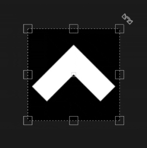
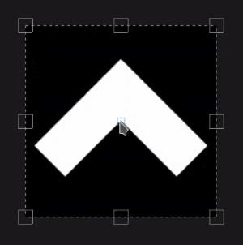

# UV-Projektion

Die UV-Projektion der Füllung ist eine 2D-Projektion, die nur im Raum der 2D-Textur funktioniert. Es bietet Steuerelemente zum Verschieben, Drehen und Skalieren eines Bildes.

## Eigenschaften

| *Einstellung* | *Beschreibung* |
| --- | --- |
| **Filtern** | Steuert, wie die Textur oder das Material gefiltert wird. Diese Einstellungen können sich darauf auswirken, wie die Textur aussieht, wenn sie mehrmals wiederholt wird. Bei hohen Skalierungswerten kann die Verwendung einer anderen Filterung als der Standardmethode zu einem besser aussehenden Ergebnis führen. Derzeit verfügbare Einstellungen:<ul data-preserve-html="true"><li data-preserve-html="true"><strong>Bilinear `\|` HQ </strong>: (Standard) Erweiterte bilineare Filterungen, die versuchen, die Qualität der Textur zu verbessern, wenn die Werte der Kachelung hoch sind.</li><li data-preserve-html="true"><strong>Bilinear `\|` Sharp </strong>: Einfache bilineare Filterung, die die Textur etwas glättet, aber versucht, Details zu erhalten.</li><li data-preserve-html="true"><strong>Nächste </strong>: Keine Filterung, nützlich, wenn die Bilineare Filterung zu einem verschwommenen Ergebnis führt und feine Details aufbricht. Kann Aliasing in die Textur einführen.</li></ul> |
| **Abwicklung** | Steuert, wie das projizierte Material/Bild in der Form der Projektion wiederholt werden soll. Mögliche Werte sind:<ul data-preserve-html="true"><li data-preserve-html="true"><strong>Keine</strong> : Es gibt keine Wiederholung der Projektion.</li><li data-preserve-html="true"><strong>Horizontal wiederholen</strong> : Wiederholen Sie diesen Vorgang nur horizontal.</li><li data-preserve-html="true"><strong>Vertikal wiederholen</strong> : Wiederholen Sie diesen Vorgang nur vertikal.</li><li data-preserve-html="true"><strong>Wiederholen</strong> (Standard) : Wiederholen Sie diesen Vorgang sowohl horizontal als auch vertikal.</li></ul> 

 |

### UV-Transformation

Die UV-Transformationseinstellungen steuern die Textur/das Material innerhalb der Projektion.

<table data-preserve-html="true" style="width: 100.0%;"><colgroup> <col style="width: 40.0%;"/> <col style="width: 20.0%;"/> <col style="width: 40.0%;"/> </colgroup><tbody><tr><th>Skalierungsmodus</th><th>Einstellung</th><th>Beschreibung</th></tr><tr><td>
<strong>Kachelung</strong> (Standard)<strong>  </strong>

Ermöglicht die manuelle Festlegung des wiederholenden Betrags für die aktuelle Textur.
</td><td><strong>Wiederholen</strong></td><td>Steuert, wie oft die Textur wiederholt wird.</td></tr><tr><td rowspan="2">  </td><td colspan="1"><strong>Drehung</strong></td><td colspan="1">Steuert den Winkel, in dem die Textur auf das Gitter projiziert wird.</td></tr><tr><td colspan="1"><strong>Versatz</strong></td><td colspan="1">Steuert, von wo aus die Textur projiziert wird. Der Standardwert bedeutet, dass sich der Mittelpunkt der Textur in der Mitte der UVs des Gitters befindet.</td></tr><tr><th colspan="1"> </th><th colspan="1"> </th><th colspan="1"> </th></tr><tr><td rowspan="4">
<strong>Physische Größe</strong>

Automatische Einstellung einer Textur entsprechend der Größe des Meshs und der eingebetteten Physische Größe. Die richtige Physische Größe wird anhand der Längen- und Breitenwerte (X- und Y-Werte) berechnet. Die Z-Messung wird nicht berücksichtigt.

(Weitere Informationen finden Sie auf der speziellen [Dokumentationsseite](https://experienceleague.adobe.com/en/docs/substance-3d-painter/using/features/physical-size))
</td><td><strong>Benutzerdefinierte Größe</strong></td><td>
Wenn diese Option aktiviert ist, können Sie eine Physische Größe manuell eingeben und die von einem Asset bereitgestellte Version überschreiben.

Sie wird automatisch ausgewählt, wenn keine Physische Größe erkannt wird oder wenn mehrere Assets mit unterschiedlichen Physische Größen innerhalb derselben Ebene/desselben Effekts verwendet werden.
</td></tr><tr><td colspan="1"><strong>Größe (cm)</strong></td><td colspan="1">Eingebettete Physische Größen werden in Zentimetern angegeben. Es ist möglich, mit einer Gitterdatei zu arbeiten, die mit unterschiedlichen Maßeinheiten erstellt wurde. Die Proportionen bleiben dabei erhalten. Die Elementgröße wird derzeit jedoch nur in Zentimetern angezeigt.</td></tr><tr><td colspan="1"><strong>Drehung</strong></td><td colspan="1">Steuert den Winkel, in dem die Textur auf das Gitter projiziert wird.</td></tr><tr><td colspan="1"><strong>Versatz</strong></td><td colspan="1">
Steuert, von wo aus die Textur projiziert wird. Der Standardwert bedeutet, dass sich der Mittelpunkt der Textur in der Mitte der UVs des Gitters befindet.
</td></tr></tbody></table>

## Kontextabhängige Symbolleiste

Mehrere Einstellungen und Werkzeuge sind in der [Kontextsymbolleiste](../../interface/toolbars.md) am oberen Rand des Viewports verfügbar, die die Steuerung des Manipulators und der Projektion ermöglichen:

| Symbol | Name | Beschreibung |
| --- | --- | --- |
| 

 | Manipulator anzeigen/ausblenden | Wenn diese Option aktiviert ist, ist der Manipulator im Viewport sichtbar und steuerbar. |
| 

 | Größe der Manipulator-Handles | Dieses Menü enthält drei Einstellungen, die festlegen, wie groß die Griffe des transformieren Objekts im Viewport sind:<ul data-preserve-html="true"><li data-preserve-html="true"><strong>Klein</strong></li><li data-preserve-html="true"><strong>Medium</strong></li><li data-preserve-html="true"><strong>Groß</strong></li></ul> |
| 

 | Spiegeln auf X | Spiegeln Sie die Transformation auf der X-Achse. |
| 

 | Spiegeln auf Y | Spiegeln Sie die Transformation an der Y-Achse. |
| 

 | Drehpunkt zurücksetzen | Setzt den Drehpunkt wieder auf den Mittelpunkt der Transformation. |
| 

 | Umwandlung zurücksetzen | Stellen Sie die Transformation der Projektion wieder auf ihren Standardzustand zurück. |

## Manipulator

Die UV-Projektion verwendet einen Manipulator, der nur in der [2D-Ansicht](../../interface/viewport/2d-view.md) verfügbar ist.

| Aktion | Tastaturbefehl | Beschreibung |
| --- | --- | --- |
| **Kamera beweg** | Mausklick | Klicke auf einen Bereich innerhalb der Transformation, und ziehe, um ihn zu verschieben. 

 |
| **Eingeschränkt Kamera bewogen** | UMSCHALT+Mausklick | Klicken und ziehen Sie einen beliebigen Bereich innerhalb der Transformation, während Sie den Tastaturbefehl drücken und halten, um ihn nur entlang einer Achse zu verschieben. Die Achse kann horizontal oder vertikal ausgerichtet werden und richtet sich nach der Kamera. 

 |
| **Drehung** | Mausklick | Durch Klicken und Ziehen von außerhalb der Transformation können Sie sie drehen. Durch Verschieben des Drehpunkts kann auch der Drehpunkt geändert werden.   <table> <tr style="border: 0;"> <td style="border: 0;" valign="top">  

  </td> <td style="border: 0;" valign="top">  

  </td> </tr> </table> |
| **Drehungseinschränkung** | UMSCHALT+Mausklick | Durch Klicken und Ziehen von außerhalb der Transformation, während Sie den Tastaturbefehl drücken und beibehalten, können Sie ihn nur um alle 45 Grad drehen. 

 |
| **Skalierung** | Mausklick | Durch Klicken und Ziehen der Griffe des Manipulators können Sie die Transformation verformen.   <table> <tr style="border: 0;"> <td style="border: 0;" valign="top">  

  </td> <td style="border: 0;" valign="top">  

  </td> </tr> </table> |
| **Einschränkung der Skalierung** | UMSCHALT+Mausklick | Durch Drücken und Beibehalten des Kurzbefehls beim Ziehen eines Handles wird die Transformation gezwungen, ihr Verhältnis beizubehalten.   <table> <tr style="border: 0;"> <td style="border: 0;" valign="top">  

  </td> <td style="border: 0;" valign="top">  

  </td> </tr> </table> |
| **Gespiegelte Skalierung** | STRG + Mausklick | Wenn Sie einen Handle verschieben, während Sie den Kurzbefehl drücken, führen die anderen Handles eine ähnliche Bewegung aus. Sie erlaubt es, die Transformation in der Symmetrie um den Drehpunkt zu verformen.   <table> <tr style="border: 0;"> <td style="border: 0;" valign="top">  

  </td> <td style="border: 0;" valign="top">  

  </td> </tr> </table> |
| **Gespiegelte und eingeschränkte Skalierung** | UMSCHALT + STRG + Mausklick | Durch das Kombinieren beider Tastaturbefehle können Sie die Transformation in Symmetrie verformen und gleichzeitig das Seitenverhältnis beibehalten. 

 |
