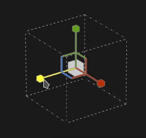
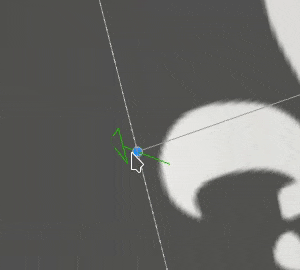

# Verkrümmungsprojektion

Die Projektion &quot;Verformen&quot; der Füllung ist eine 3D-Projektion, mit der sich eine Textur durch Bearbeiten der Punkte eines Rasters verformen lässt. Es kann verwendet werden, um Muster und das Logo auf einer nicht planaren Fläche einzupassen.

## Schnelles Setup

Es ist möglich, schnell eine Ebene mit der Verkrümmungsressource einzurichten, indem Sie eine Projektion per Drag &amp; Drop aus dem Fenster [Elemente](../../interface/assets/assets.md) auf den Mesh ziehen. Wenn Sie die Maustaste loslassen, öffnet sich ein Menü, in dem Sie wählen können, in welchem Kanal die Ressource zugewiesen werden soll.

Kompatible Ressourcentypen sind:

* **Alpha**
* **Prozedural**
* **Textur**
* **Material** (ALT-Taste erforderlich)

## Eigenschaften

| Einstellung | Beschreibung |
| --- | --- |
| **Filterung** | Steuert, wie die Textur oder das Material gefiltert wird. Diese Einstellung kann sich darauf auswirken, wie die Textur aussieht, wenn sie mehrmals wiederholt wird. Wenn hohe Skalierungswerte mit einer anderen Filterung als der Standardeinstellung verwendet werden, kann das Ergebnis möglicherweise besser aussehen. Aktuelle Einstellungen verfügbar:<ul data-preserve-html="true"><li data-preserve-html="true"><strong>Bilinear `\|` HQ</strong> (Standard): Fortschrittliche bilineare Filterung, die versucht, die Qualität der Textur zu verbessern, wenn die Kachelung hoch ist.</li><li data-preserve-html="true"><strong>Bilinear `\|` Sharp</strong>: Eine bilineare Filterung, die die Textur glättet, aber die Details bewahrt.</li><li data-preserve-html="true"><strong>Nächste</strong>: Keine Filterung, nützlich, wenn die Bilineare Filterung zu einem verschwommenen Ergebnis führt und feine Details aufbricht. Kann Aliasing in die Textur einführen.</li></ul> |
| **Abwicklung** | Lege fest, wie sich die Textur innerhalb der Projektion wiederholt. Mögliche Werte sind:<ul data-preserve-html="true"><li data-preserve-html="true"><strong>Keine</strong>: Die Textur wiederholt sich nicht. Alles, was sich außerhalb der Textur befindet, ist schwarz/transparent.</li><li data-preserve-html="true"><strong>Horizontal wiederholen</strong>: Die Textur wird nur horizontal wiederholt.</li><li data-preserve-html="true"><strong>Vertikal wiederholen</strong>: Die Textur wird nur vertikal wiederholt.</li><li data-preserve-html="true"><strong>Wiederholen</strong> (Standard): Die Textur wiederholt sich auf beiden Achsen.</li></ul> |
| **Formzuschnitt** | Legen Sie fest, ob die projizierte Textur außerhalb des Bereichs &quot;Projektion&quot; angezeigt werden soll. Mögliche Werte sind:<ul data-preserve-html="true"><li data-preserve-html="true"><strong>Projekt auf Form zugeschnitten</strong>: die Projektion ist innerhalb der Projektion begrenzt.</li><li data-preserve-html="true"><strong>Projektion erstreckt sich außerhalb von Form </strong> (Standard): die Projektion geht über die Projektion hinaus.</li></ul> 

 |
| **Projektion Tiefe** | Steuern Sie, wie weit die Projektion entlang ihrer Z-Achse geht. Diese Einstellung hilft beim Erreichen der Mesh-Oberfläche, wenn der Raster-Punkt oder die Projektion-Ebene zu weit entfernt ist.Die grünen Pfeile geben die Richtung und die Entfernung der Projektion für jeden Punkt des Rasters an. 

 **Warnung:** Ein hoher Wert kann die Leistung stark beeinträchtigen. Es wird empfohlen, diesen Parameter so niedrig wie möglich zu halten. |
| **Tiefe ausblenden** | Verblassen der Projektion anhand der Entfernung. Ein Parameter ist verfügbar:<ul data-preserve-html="true"><li data-preserve-html="true"><strong>Härte</strong>: steuert, wie hart oder weich der Überblendungseffekt ist.</li></ul> 

 |

### Transformation der UV

Die UV-Transformationseinstellungen steuern die Textur/das Material innerhalb der Projektion.

<table data-preserve-html="true" style="width: 100.0%;"><colgroup> <col style="width: 40.0%;"/> <col style="width: 20.0%;"/> <col style="width: 40.0%;"/> </colgroup><tbody><tr><th>Skalierungsmodus</th><th>Einstellung</th><th>Beschreibung</th></tr><tr><td>
<strong>Kachelung</strong> (Standard)<strong>  </strong>

Ermöglicht die manuelle Festlegung des wiederholenden Betrags für die aktuelle Textur.
</td><td><strong>Wiederholen</strong></td><td>Steuert, wie oft die Textur wiederholt wird.</td></tr><tr><td rowspan="2">  </td><td colspan="1"><strong>Drehung</strong></td><td colspan="1">Steuert den Winkel, in dem die Textur auf den Mesh projiziert wird.</td></tr><tr><td colspan="1"><strong>Versatz</strong></td><td colspan="1">Steuert, von wo aus die Textur projiziert wird. Der Standardwert bedeutet, dass die Textur im Mittelpunkt der UVs des Meshs steht.</td></tr><tr><th colspan="1"> </th><th colspan="1"> </th><th colspan="1"> </th></tr><tr><td rowspan="4">
<strong>Physische Größe</strong>

Automatische Einstellung einer Textur entsprechend der Größe des Meshs und der eingebetteten Physische Größe. Die richtige Physische Größe wird anhand der Längen- und Breitenwerte (X- und Y-Werte) berechnet. Die Z-Messung wird nicht berücksichtigt.

(Weitere Informationen finden Sie auf der speziellen [Dokumentationsseite](https://experienceleague.adobe.com/en/docs/substance-3d-painter/using/features/physical-size))
</td><td><strong>Benutzerdefinierte Größe</strong></td><td>
Wenn diese Option aktiviert ist, können Sie eine Physische Größe manuell eingeben und die von einem Asset bereitgestellte Version überschreiben.

Sie wird automatisch ausgewählt, wenn keine Physische Größe erkannt wird oder wenn mehrere Assets mit unterschiedlichen Physische Größen innerhalb derselben Ebene/desselben Effekts verwendet werden.
</td></tr><tr><td colspan="1"><strong>Größe (cm)</strong></td><td colspan="1">Eingebettete Physische Größen werden in Zentimetern angegeben. Es ist möglich, mit einer Meshdatei zu arbeiten, die mit unterschiedlichen Maßeinheiten erstellt wurde. Die Proportionen bleiben erhalten. Die Elementgröße wird derzeit jedoch nur in Zentimetern angezeigt.</td></tr><tr><td colspan="1"><strong>Drehung</strong></td><td colspan="1">Steuert den Winkel, in dem die Textur auf den Mesh projiziert wird.</td></tr><tr><td colspan="1"><strong>Versatz</strong></td><td colspan="1">
Steuert, von wo aus die Textur projiziert wird. Der Standardwert bedeutet, dass die Textur im Mittelpunkt der UVs des Meshs steht.
</td></tr></tbody></table>

### 3D-Projektionseinstellungen

Die Einstellungen für die 3D-Projektion steuern die Transformation der Projektion im 3D-Raum.

| Einstellung | Beschreibung |
| --- | --- |
| **Offset** | Die Position des Ursprungs der Projektion im 3D-Raum. Die Maßeinheit richtet sich nach dem Begrenzungsrahmen der gesamten Szene. 0 ist die Mitte dieser Box. |
| **Drehung** | Winkel in Grad, um die gesamte Projektion auf jeder Achse zu drehen. |
| **Skalierung** | Größe der gesamten Projektion auf jeder Achse. |

## Kontextabhängige Symbolleiste

Mehrere Einstellungen und Tools sind über die [Kontextsymbolleiste](../../interface/toolbars.md) am oberen Rand des Viewports verfügbar, die Steuerelemente für den Manipulator und die Projektion bereitstellen:

| Symbol | Name | Beschreibung |
| --- | --- | --- |
| 

 | Manipulator anzeigen/ausblenden | Wenn diese Option aktiviert ist, ist der Manipulator im Viewport sichtbar und steuerbar, um die Projektion-Transformation oder die Raster-Punkte zu bearbeiten. Wenn diese Option deaktiviert ist, sind sowohl der Manipulator als auch der Raster ausgeblendet. |
| 

 | Manipulator-Einstellungen | Dieses Menü enthält drei Einstellungen:<ul data-preserve-html="true"><li data-preserve-html="true"><strong>Manipulatorgröße</strong>: steuert, wie groß der Manipulator im Viewport ist.</li><li data-preserve-html="true"><strong>Raster-Schritte</strong>: die Größe des Schritts bei der Übersetzung mit einer Einschränkung zu definieren.</li><li data-preserve-html="true"><strong>Winkelschritte</strong>: den Winkel des Schritts beim Drehen mit einer Bedingung definieren.</li></ul> |
| 

 | Menü &quot;Warp Edition&quot; | Dieses Menü enthält fünf Aktionen:<ul data-preserve-html="true"><li data-preserve-html="true"><strong>Verkrümmung Transformieren</strong>: die Verkrümmungstransformation zu bearbeiten. Erlaubt die Bearbeitung der globalen Rasterposition, Drehung und Skalierung.</li><li data-preserve-html="true"><strong>Scheitelpunkt bearbeiten</strong>: die Raster-Verzerrungspunkte einzeln (oder in der Gruppe) bearbeiten.</li><li data-preserve-html="true"><strong>Verzerrung in Querrichtung aufteilen</strong>: starte das Krümmungswerkzeug, um eine neue Raster-Division sowohl horizontal als auch vertikal einzufügen.</li><li data-preserve-html="true"><strong>Verzerrung horizontal teilen</strong>: starte das Krümmungs-Werkzeug, um eine neue Raster-Division horizontal einzufügen.</li><li data-preserve-html="true"><strong>Vertikale Verformung teilen</strong>: starte das Krümmungswerkzeug, um einen neuen Raster vertikal einzufügen.</li></ul> |
| 

 | Einstellungen für Verkrümmungsprojektion | In diesem Menü werden Einstellungen neu gruppiert, die sich nur auf die aktuelle Verkrümmungsprojektion auswirken:<ul data-preserve-html="true"><li data-preserve-html="true"><strong>Zeile und Spalten</strong>: geben die Anzahl der Unterteilungen an, die der Verkrümmungs-Raster hat. Diese Einstellung kann nur bearbeitet werden, wenn keine Punkte des Rasters verändert wurden.</li><li data-preserve-html="true"><strong>Handle-Größe</strong>: die Größe der Rasterpunkte im Modus <strong>Eckpunkte bearbeiten</strong> definieren.</li><li data-preserve-html="true"><strong>Rasterfarbe</strong>: die Farbe der Verzerrungslinien des Rasters festlegen.</li></ul> |
| 

 | Automatische Tangenten | Wenn diese Option aktiviert ist, richten Sie die Tangenten eines Punkts automatisch an seinen Nachbarpunkten aus, wenn er verschoben wird. |
| 

 | Übersetzungs-Manipulator | Lassen Sie zu, dass die Projektion oder der Raster entlang der Achsen (X, Y, Z) verschoben werden. |
| 

 | Manipulator Drehung | Lassen Sie zu, dass die Projektion oder der Raster in der Achse entlang der Hauptlinien (X, Y, Z) gedreht wird. |
| 

 | Manipulator skalieren | Skalieren Sie die Projektion in der Szene entlang der Haupt-Achsen (X, Y, Z). |
| 

 | Oberflächenmanipulator | Erlauben Sie, die Projektion- oder Raster-Punkte zu verschieben, indem Sie sie auf die 3D-Modelloberfläche einrasten. |
| 

 | Manipulatorraum | Definieren Sie, in welchem Raum die Transformationen durchgeführt werden. Mögliche Werte:<ul data-preserve-html="true"><li data-preserve-html="true"><strong>Lokaler Speicherplatz</strong>: Achsen werden an der aktuellen Transformation ausgerichtet.</li><li data-preserve-html="true"><strong>Weltraum</strong>: Achsen werden an der Szene ausgerichtet.</li></ul> |
| 

 | Spiegeln auf X | Spiegeln Sie die Transformation auf der X-Achse. |
| 

 | Spiegeln auf Y | Spiegeln Sie die Transformation an der Y-Achse. |
| 

 | Spiegeln auf Z | Spiegeln Sie die Transformation auf der Z-Achse. |
| 

 | Umwandlung zurücksetzen | Dieses Menü enthält drei Aktionen:<ul data-preserve-html="true"><li data-preserve-html="true"><strong>Globale Transformation wiederherstellen</strong>: Position, Drehung und Skalierung der Projektion wieder auf die Ausgangswerte zurücksetzen. Diese Aktion hat keine Auswirkungen auf die Raster selbst.</li><li data-preserve-html="true"><strong>Alle Scheitelpunkt zurücksetzen</strong>: werden alle Positionen und Tangenten der Raster-Punkte des Rasters zurückgesetzt.</li><li data-preserve-html="true"><strong>Ausgewählte Scheitelpunkt zurücksetzen</strong>: die Position und Tangenten nur der markierten Punkte des Verkrümmungs-Rasters zurücksetzen.</li></ul> |

## Manipulator

Dieser Projektion-Manipulator ist nur im [3D-Viewport ](../../interface/viewport/3d-view.md) verfügbar.

| Aktion | Tastaturbefehl | Beschreibung |
| --- | --- | --- |
| **Übersetzung** | Mausklick | Wenn Sie mit dem Translation Manipulator auf die Achsen klicken, wird die Projektion verschoben:<ul data-preserve-html="true"><li data-preserve-html="true"><strong>Eine Achse</strong>: sich nur in eine Richtung der Projektion bewegen.</li><li data-preserve-html="true"><strong>Zwei Achsen</strong>: Verschieben Sie die Projektion auf den Plänen, die an den Achsen ausgerichtet sind.</li><li data-preserve-html="true"><strong>Drei Achsen</strong>: verschieben Sie die Projektion im Bereich der Kamera (der Plan ist ihr zugewandt).</li></ul>   <table> <tr style="border: 0;"> <td style="border: 0;" valign="top">  

  </td> <td style="border: 0;" valign="top">  

  </td> <td style="border: 0;" valign="top">  

  </td> </tr> </table> |
| **Einschränkung der Übersetzung** | UMSCHALT+Mausklick | Verschieben Sie die Projektion mit dem Translation Manipulator entlang der ausgewählten Achsen, jedoch nur in bestimmten Intervallen (schrittweise Schritte). Die Größe des Intervalls wird über die Manipulator-Einstellungen festgelegt. 

 |
| **Drehung** | Mausklick | Klicken Sie mit dem Manipulator &quot;Drehung&quot; auf eine Achse, um die Projektion zu drehen. Klicken Sie zwischen die Achsen, um alle Achsen gleichzeitig zu drehen.   <table> <tr style="border: 0;"> <td style="border: 0;" valign="top">  

  </td> <td style="border: 0;" valign="top">  

  </td> </tr> </table> |
| **Drehungseinschränkung** | UMSCHALT+Mausklick | Wenn du mit dem Drehungs-Manipulator auf eine Achse klickst, um die Projektion zu drehen, kannst du dies nur in bestimmten Intervallen tun. Die Stufe wird durch einen Winkel über die Manipulatoreinstellungen definiert. 

 |
| **Skalierung** | Mausklick | Wenn du mit dem Manipulator &quot;Skalieren&quot; auf eine Achse klickst, wird die Größe der Projektion entlang der Achse angepasst.   <table> <tr style="border: 0;"> <td style="border: 0;" valign="top">  

  </td> <td style="border: 0;" valign="top">  

  </td> <td style="border: 0;" valign="top">  

  </td> </tr> </table> |
| **Einschränkung der Skalierung** | UMSCHALT+Mausklick | Wenn du mit dem Skalierungsmanipulator auf einen Achsengriff klickst und dabei den Tastaturbefehl aufrechterhältst, wird die Größe der Projektion in Schritten angepasst. Die Schrittgröße ist die gleiche wie für den Translation Manipulator. 

 |
| **Oberfläche** | Mausklick | Wenn du mit dem Manipulator &quot;Fläche&quot; (Surface) klickst und ihn über das 3D-Modell ziehst, wird es auf der Fläche einrasten. 

 **Hinweis:** Dieser Manipulator ist nur mit den Projektionen **Planar** und **Warp** verfügbar. |

## Bearbeiten von Raster-Punkten

Die Projektion der Verformung wird durch eine Ebene und einen Raster von Punkten dargestellt. Jeder Punkt kann so verändert werden, dass die Projektion besser in das 3D-Modell passt, aber auch, um die Textur zu verzerren.

Um den Raster zu bearbeiten, wechseln Sie in der kontextabhängigen Symbolleiste in den Editionsmodus zu **Scheitelpunkt bearbeiten**:

>[!NOTE]
>
> Ein Tastatur-Tastaturbefehl ist verfügbar, um schnell zwischen **Transformieren warp** und **Edit Scheitelpunkts** zu wechseln. Siehe **Warp-Edition-Modus umschalten** auf der Seite [Tastaturbefehle](../../interface/settings/shortcuts.md).

### Auswählen von Punkten

| Aktion | Beschreibung |
| --- | --- |
| 

 | <ul data-preserve-html="true"><li data-preserve-html="true">Ein Klick auf einen Punkt genügt, um ihn auszuwählen.</li><li data-preserve-html="true">Wenn Sie außerhalb eines Punktes oder Manipulators klicken, wird die Auswahl der Punkte aufgehoben.</li><li data-preserve-html="true">Durch Klicken auf Punkte beim Drücken von <strong>UMSCHALT</strong> können mehrere Punkte ausgewählt werden.</li><li data-preserve-html="true">Wenn Sie beim Drücken von <strong>STRG</strong> auf einen Punkt klicken, können Sie die Auswahl nur für diesen Punkt aufheben, nicht für den anderen.</li></ul> |
| 

 | <ul data-preserve-html="true"><li data-preserve-html="true">Durch Klicken und Ziehen können Sie eine rechteckige Auswahl erstellen. Alle Punkte innerhalb des Rechtecks werden ausgewählt, wenn die Maustaste losgelassen wird.</li><li data-preserve-html="true">Durch Klicken und Ziehen beim Drücken von <strong>UMSCHALT</strong> können Sie der aktuellen Auswahl weitere Punkte hinzufügen.</li><li data-preserve-html="true">Durch Klicken und Ziehen beim Drücken von <strong>STRG</strong> können Sie Punkte aus der aktuellen Auswahl entfernen.</li></ul> |

### Bewegliche Punkte

| Aktion | Beschreibung |
| --- | --- |
| 

 | <ul data-preserve-html="true"><li data-preserve-html="true">Verwenden Sie den Manipulator &quot;Übersetzung&quot;, um einen Punkt zu verschieben.</li><li data-preserve-html="true">Verwenden Sie den Manipulator Fläche , um sich an einem Punkt auf der 3D-Modellfläche zu bewegen.</li></ul> |
| 

 | <ul data-preserve-html="true"><li data-preserve-html="true">Klicken und ziehen Sie einen Punkt, um ihn schnell zu verschieben, ohne ihn zuerst auswählen zu müssen.</li><li data-preserve-html="true">Durch Klicken und Ziehen eines Punkts wird er wie der Manipulator &quot;Oberfläche&quot; verschoben.</li><li data-preserve-html="true">Durch Klicken und Ziehen eines Manipulators, während Sie <strong>STRG</strong> drücken, wird dieser wie der Übersetzungspunkt verschoben (in Kameras auf drei Achsen).</li></ul> |

### Anpassen von Tangenten

Der Raster &quot;Projektion verformen&quot; ist ein [Bézier-Patch](https://en.wikipedia.org/wiki/B%C3%A9zier_surface). Das bedeutet, dass jeder Punkt über eigene Tangenten verfügt, um die Krümmung der Linien zu steuern, die Punkte miteinander verbinden. Durch Anpassen der Tangenten haben Sie mehr Kontrolle darüber, wie die Textur deformiert wird.

| Aktion | Beschreibung |
| --- | --- |
| 

 | <ul data-preserve-html="true"><li data-preserve-html="true">Um die Tangenten eines Punkts zu ändern (wird in Rot angezeigt), wählen Sie einfach den angegebenen Punkt aus und verwenden Sie dann den Manipulator Drehung oder Skalierung .</li></ul> |

>[!NOTE]
>
> Die Tangente wird zurückgesetzt und automatisch angepasst, wenn Punkte verschoben werden, wenn die Einstellung **Automatische Tangenten** aus der kontextbezogenen Symbolleiste aktiviert ist.
> 
> 

### Erhöhen oder Verringern der Punktzahl

Der Raster &quot;Verformen&quot; kann unterteilt werden, um die Anzahl der Punkte zu erhöhen und mehr Kontrolle darüber zu haben, wie die Textur verformt werden soll.

| Aktion | Beschreibung |
| --- | --- |
| 

 | <ul data-preserve-html="true"><li data-preserve-html="true">Über das Einstellungsmenü &quot;Verformen&quot; können Sie den Raster nach Zeilen und Spalten sortieren und die dividieren festlegen. (Dies ist nur möglich, wenn keine Punkte verschoben wurden)</li><li data-preserve-html="true">Unterteilen Sie das Raster, indem Sie eines der drei Teilungswerkzeuge verwenden.</li><li data-preserve-html="true">Alle Teilungswerkzeuge können durch Drücken von <strong>Esc</strong> abgebrochen werden.</li></ul> |
