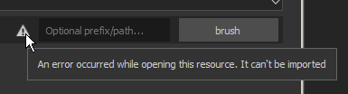

# Importieren von Photoshop-Pinselvorgaben

Auf dieser Seite wird Schritt für Schritt erläutert, wie Sie eine ABR-Datei in Substance 3D Painter importieren.

1. <b>Öffnen Sie das Importressourcenfenster.</b>

   Das Fenster Ressource importieren kann auf drei verschiedene Arten geöffnet werden:

   * Ziehe die ABR-Datei in das Bedienfeld &quot;Elemente&quot;.
   * Verwenden Sie <b>Datei > Ressourcen </b> im Hauptmenü.
   * Verwenden Sie die Schaltfläche <b>+ </b> im Bedienfeld &quot;Elemente&quot;.
1. <b>Fügen Sie die ABR-Datei dem Fenster &quot;Ressourcen importieren&quot; hinzu.</b>

   Wenn Sie die ABR-Datei nicht per Drag &amp; Drop in das Fenster &quot;Elemente&quot; gezogen haben, um das Importfenster zu öffnen, ist sie standardmäßig leer.

   Zum Hinzufügen der ABR-Datei haben Sie folgende Möglichkeiten:

   * **Ziehen Sie die ABR-Datei per Drag &amp; Drop** in das Fenster.
   * Klicken Sie auf die Schaltfläche **Ressourcen hinzufügen**, um die ABR-Datei auszuwählen und zu laden.

   >[!NOTE]
   >
   > 
   > 
   > Bei Problemen mit der ABR-Datei kann neben dieser ein Warnsymbol angezeigt werden. Zum Beispiel:
   > 
   > * Es wurde keine kompatible Vorgabe gefunden. Weitere Informationen finden Sie in der Liste [Kompatibilität der Photoshop-Pinselparameter](photoshop-brush-parameters-compatibility.md).
   > * Die Datei kann nicht gelesen werden (z. B.: sie ist beschädigt).
1. <b>Wählen Sie aus, wie die ABR-Datei importiert werden soll.</b>

   Legen Sie unten im Fenster &quot;Importressourcen&quot; fest, wo die ABR-Datei geladen werden soll:

   * <b>-Projekt </b>: Die ABR-Datei wird in das aktuell geöffnete Projekt geladen. Die Pinsel sind nur verfügbar, wenn das aktuelle Projekt geöffnet ist, und sind an die Projektdatei angehängt.
   * <b> Sitzung </b>: Die ABR-Datei wird in den Speicher geladen. Die Pinselvorgaben sind verfügbar, bis die Anwendung geschlossen ist.
   * <b> Bibliothek </b>: Die ABR-Datei wird in das Shelf auf der Festplatte kopiert. Pinselvorgaben sind bei jedem Öffnen von Painter für alle Projekte verfügbar.

   
1. <b>Zugriff auf die Pinselvorgaben aus dem Shelf.</b>

   

   Wenn beim Importieren der Pinselvorgaben keine Probleme aufgetreten sind, werden diese im Fenster [Elemente](../../../interface/assets/assets.md) angezeigt.

   >[!NOTE]
   >
   > Wenn eine Pinselvorgabe auf einer Bitmap basiert, ist das verwendete Bild auch im Bereich &quot;Alpha&quot; des Regals unter demselben Namen wie die Pinselvorgabe verfügbar.
