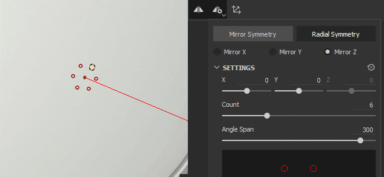
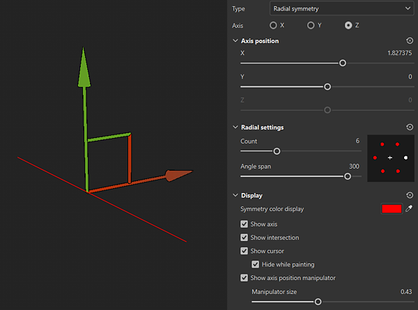
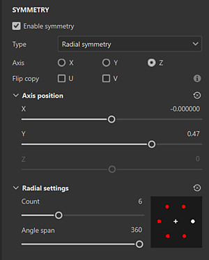

# Radialsymmetrie

Bei der radialen Symmetrie werden Striche oder Füllebenen radial um eine Achse herum dupliziert:

## Positionieren der Achse der Symmetrie mithilfe des Manipulators

Sie können über die Schaltfläche &quot;<b>Symmetrie-Einstellungen&quot; </b> in der kontextbezogenen Symbolleiste oben in der 3D-Symmetrie auf die Anzeigeeinstellungen für die 3D-Ansicht zugreifen. Unter den Anzeigeeinstellungen können Sie den Manipulator aktivieren und anpassen. Ziehen Sie in der 3D-Ansicht an den Griffen des Manipulators, um die Achse der Symmetrie zu ändern.

{width="600px"}

## Parameter für die radiale Symmetrie

{width="300px"}

| *Parameter* | *Beschreibung* |
| --- | --- |
| <b>Achse</b> | Definiert, welche Achse der Szene zum Ausführen der Symmetrie verwendet wird. |
| <b>Kopie spiegeln</b> | Wechselnde Kopien auf der U- oder V-Achse spiegeln. Dies ist hilfreich, wenn Sie Symmetrie auf Inhalt anwenden, der eine Richtung wie Text aufweist. |
| <b>Position der Achse: X, Y, Z</b> | Definiert den Offset der Achse im Projekt. Dieser Wert kann mit den Reglern oder mit dem Manipulator (siehe oben) bearbeitet werden. |
| <b>Achse anzeigen</b> | Wenn diese Option aktiviert ist, wird im Viewport eine durchsichtige Linie angezeigt, die die Achse der Symmetrie darstellt. |
| <b>Schnittmenge anzeigen</b> | Wenn diese Option aktiviert ist, wird ein Punkt auf dem Mesh im Viewport gezeichnet, um anzuzeigen, wo sich die Achse der Symmetrie mit dem Mesh überschneidet. |
| <b>Cursor (Pinselwerkzeug) anzeigen</b> | Wenn diese Option aktiviert ist, wird ein zweiter Cursor auf der anderen Seite der Symmetrie angezeigt, der angibt, wann das Malen ausgeführt wird. |
| <b>Beim Malen ausblenden (Pinselwerkzeug)</b> | Wenn diese Option aktiviert ist, wird der zweite Cursor ausgeblendet, während das Malen läuft (bis zum Loslassen des Mausklicks). |
| <b>Manipulator für die Achse anzeigen</b> | Umschalten der Sichtbarkeit des Manipulators im Viewport. |
| <b>Größe des Manipulators</b> | Steuert die Größe des Manipulators im Viewport. |
