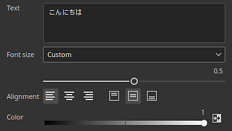

# Textressource

Die <b>Textressource</b> in kann zum Schreiben von Text in Texturen mit der Verwendung bestimmter <b>Schriftdateien</b> verwendet werden. Es stehen mehrere Parameter zur Verfügung, mit denen Sie das Aussehen des gezeichneten Endtextes anpassen können.

## Durchsuchen von Schriftarten

Um die verfügbaren Schriftartendateien zu durchsuchen, klicken Sie im Fenster [Elemente](../interface/assets/assets.md) einfach auf den Schriftartenfilter (die Schaltfläche <b>T</b>):

Die Schrift kann auch nach Pfaden gefiltert werden, je nachdem, wo sie sich auf dem System befindet:

Die verfügbaren Schriftspeicherorte hängen vom aktuellen Betriebssystem ab:

|  |  |
| --- | --- |
| Windows | <ul data-preserve-html="true"> <li data-preserve-html="true"><b>System</b>: C:/Windows/Schriftarten</li> <li data-preserve-html="true"><b>Benutzer</b>: C:/Benutzer/Benutzername/AppData/Local/Microsoft/Windows/Fonts</li> </ul> |
| MacOS | <ul data-preserve-html="true"> <li data-preserve-html="true"><b>System</b>: /System/Library/Fonts</li> <li data-preserve-html="true"><b>Lokal</b>: /Library/Fonts</li> <li data-preserve-html="true"><b>Benutzer</b>: /Benutzer/Benutzername/Library/Fonts</li> </ul> |
| Linux | <ul data-preserve-html="true"> <li data-preserve-html="true"><b>System</b>: /usr/share/fonts/</li> <li data-preserve-html="true"><b>Lokal</b>: /usr/local/share/fonts/</li> <li data-preserve-html="true"><b>Benutzer</b>: /home/username/.local/share/fonts/</li> </ul> |

### Importieren von Schriftarten

Schriften können manuell importiert oder wie jede normale Ressource in eine bestehende Painter-Bibliothek eingefügt werden. Lesen Sie dazu die [Importdokumentation](../content/importing-assets/import-drag-and-drop.md).

Painter unterstützt die Schriftformate <b>.ttf</b> und <b>.otf</b>.

>[!NOTE]
>
> Wenn eine Ressource nicht geladen/importiert werden kann und die Fehlermeldung &quot;Kann aufgrund der Lizenzeinschränkung der Schriftart nicht importiert werden&quot; angezeigt wird, bedeutet dies, dass sie von Painter nicht verwendet werden kann. Es können nur Schriftarten verwendet werden, die in den Metadaten als <b>einbettbar</b> markiert sind.

### Verwenden einer Schriftart als Textressource

Eine Textur-Ressource funktioniert wie andere Ressourcen (z. B. Bilder oder Substance-Materialien) und kann in Pinselparametern, Füll-Projektionen oder Substance-Bildeingaben verwendet werden.

Zum Erstellen einer Textressource fügen Sie einfach eine Schriftart in einen Ressourcenbereich ein. Es ist auch möglich, eine Schrift per Drag &amp; Drop in den Viewport einzufügen.

### Parameter für Textressourcen

Eine Textressource verfügt über die folgenden grundlegenden Parameter:

| <b>Parameter</b> | <b>Beschreibung</b> |
| --- | --- |
| <b>Text</b> | Text, der gerendert werden soll  **Hinweis:** Das Textfeld auf der Benutzeroberfläche verwendet eine generische Schriftart mit einer Vielzahl von Zeichen, was zu einer Diskrepanz zwischen dem, was in dem Feld eingegeben wurde, und dem, was die ausgewählte Schriftart in der Textur rendern kann, führen kann. |
| <b>Schriftgröße</b> | Geben Sie den Modus an, der zur Berechnung der Schriftgröße verwendet wird. Verfügbare Modi sind:<ul data-preserve-html="true"> <li data-preserve-html="true"><b>Auto</b>: Die Größe wird automatisch aus dem Textinhalt berechnet und an die Textur angepasst.</li> <li data-preserve-html="true"><b>Benutzerdefiniert</b>: Die Größe kann über die dedizierte Einstellung manuell gesteuert werden.</li> </ul> |
| <b>Ausrichtung</b> | Steuern Sie die vertikale und horizontale Ausrichtung. Verwenden Sie die Schaltflächen, um auszuwählen, welchen Modus Sie verwenden möchten. |
| <b>Farbe</b> | Die Farbe des gerenderten Texts. Diese Einstellung kann &quot;Graustufen&quot; sein, wenn die Textressource in einer Maske oder einem Graustufenkanal verwendet wird. |

Weitere erweiterte Parameter sind ebenfalls verfügbar:

| <b>Parameter</b> | <b>Beschreibung</b> |
| --- | --- |
| <b>Zeilen-Abstand</b> | Abstand zwischen Textzeilen (&quot;Zeilenabstand&quot;) im Verhältnis zur Schriftgröße |
| <b>Zeichen Abstand</b> | Der Abstand zwischen benachbarten Zeichen im Verhältnis zur Schriftgröße. Kann negativ sein, um Abstand abzuziehen. |
| <b>Offset</b> | Horizontaler und vertikaler Versatz des Textes. Auf die Schriftgröße normalisiert. |
| <b>Hintergrundfüllung</b> | Die Farbe des Hintergrunds hinter dem Text. |
| <b>Hintergrunddeckkraft</b> | Wie viel von der Hintergrundfarbe ist sichtbar. |
| <b>Auflösung</b> | Geben Sie den Modus an, mit dem die Größe der Textur berechnet wird, die zum Rendern des Textes verwendet wird. Verfügbare Modi sind:<ul data-preserve-html="true"> <li data-preserve-html="true"><b>Auto</b>: Die Auflösung wird automatisch berechnet.</li> <li data-preserve-html="true"><b>Benutzerdefiniert</b>: Die Auflösung kann manuell über die dedizierte Einstellung definiert werden.</li> </ul> |
