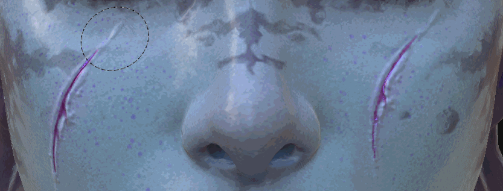

# Klonwerkzeug

Das in Substance 3D Painter 2 eingeführte Klon-Tool verwendet denselben Parametertyp wie das [Malen-Tool](https://support.allegorithmic.com/documentation/display/SPDOC/Paint+brush) . Wie der Name schon andeutet, kannst du mit dem Kopierwerkzeug den Inhalt einer bestimmten Ebene oder den gesamten Ebenenstapel von einem Punkt zum anderen duplizieren.

## Nutzung

Die einfachste Möglichkeit, das Klon-Werkzeug zu verwenden, besteht darin, es auf den Inhalt einer Malebene anzuwenden.

Dies kann in zwei Schritten erfolgen:

* Wählen Sie den Quellspeicherort aus, indem Sie die Maus auf das Modell platzieren und die Taste &quot;**V** &quot; drücken.
* Platziere dann die Maus an der Stelle, an der der duplizierte Bereich angezeigt wird, und beginne mit dem Malen.

Es ist jederzeit möglich, die Quelle zu aktualisieren, indem Sie &quot;**V** &quot; erneut drücken.

Beim Malen mit dem Klonwerkzeug folgt standardmäßig der Quellspeicherort und aktualisiert seinen Speicherort, sobald der Pinsel freigegeben wurde. Durch Deaktivieren der Schaltfläche, die für das Quellverhalten &quot;**Klon** &quot; verwendet wird, kehrt die Quelle an die Stelle zurück, an der sie beim Drücken von &quot;**V** &quot; definiert wurde. Dies kann nützlich sein, wenn Sie mehrmals mit demselben Quellbereich malen.

Mit dem Klon-Werkzeug kannst du jetzt eine Malebene erstellen und den Mischmodus für alle Kanäle auf &quot;Hindurchwirken&quot; setzen. Damit lassen sich alle Informationen zerstörungsfrei von allen Ebenen duplizieren, die sich unter der &quot;Klon-Ebene&quot; befinden. Die folgenden Ebenen bleiben intakt, und alle später vorgenommenen Änderungen werden von der Ebene &quot;Klon&quot; berücksichtigt:

