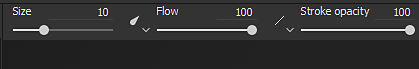
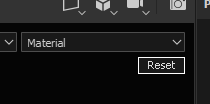
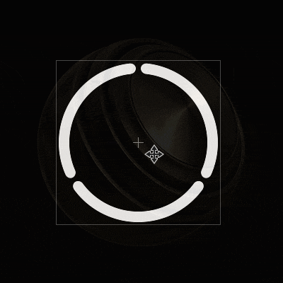
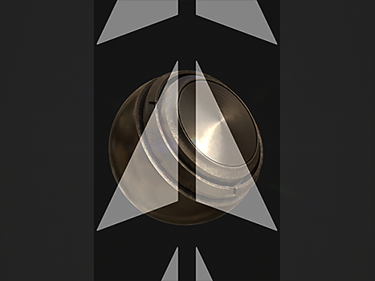

# Pinsel

Das Malwerkzeug ist das Standardwerkzeug von Substance 3D Painter zum Anwenden von Farben und Materialeigenschaften auf ein 3D-Gitter. Es verfügt über bestimmte Parameter, die über die [Eigenschaften](../../interface/properties.md) bearbeitet werden können.

Das Malwerkzeug simuliert Pinselstriche über verschiedene Verhalten und Einstellungen, um das Gefühl zu vermitteln, auf das 3D-Gitter gemalt zu werden.

## Symbolleiste

Die [Symbolleisten](../../interface/toolbars.md) zeigen die folgenden Tastaturbefehle an (siehe Erläuterung in den nächsten Abschnitten):

* Größe
* Fluss
* Konturdeckkraft
* Teilung

Es sind zusätzliche Tastaturbefehle verfügbar, die in einigen anderen Werkzeugen gleich sind:

* [Lazy Mouse](../lazy-mouse.md)
* [Symmetrie](../symmetry/symmetry.md)

## Vorschau

Am oberen Rand der [Eigenschaften](../../interface/properties.md) befinden sich die Pinsel- und Materialvorschau. Sie können verwendet werden, um schnell einen Blick darauf zu werfen, wie das aktuelle Werkzeug eingerichtet ist.

| *Name* | *Beschreibung* |
| --- | --- |
| **Pinselvorschau** | In der Pinselvorschau wird basierend auf den Pinselparametern angezeigt, wie sich der Pinsel verhält. Sie können in die Vorschau klicken, um einen benutzerdefinierten Strich zu zeichnen.   <table> <tr style="border: 0;"> <td style="border: 0;" valign="top">  

  </td> <td style="border: 0;" valign="top">  

  </td> </tr> </table>   **Hinweis:** Die Pinselvorschau unterstützt den Stiftdruck nicht. |
| **Materialvorschau** | Die Materialvorschau zeigt die Eigenschaften des aktuell zum Malen verwendeten Materials an. Wenn du in die Vorschau klickst, kannst du die Beleuchtung drehen und das Verhalten des Materials vor dem Malen überprüfen.   <table> <tr style="border: 0;"> <td style="border: 0;" valign="top">  

  </td> <td style="border: 0;" valign="top">  

  </td> </tr> </table> |

## Pinsel

Die Pinselparameter definieren das Aussehen des Pinselstrichs, wenn er am 3D-Gitter ausgeführt wird.

>[!NOTE]
>
> Einige Parameter können bei Verwendung eines Grafiktabletts durch den Stiftdruck gesteuert werden. Diese Informationen können auch in [Vorgaben](../presets/presets.md) gespeichert werden.\
> Klicken Sie auf die dedizierte Schaltfläche, um den Druck zu aktivieren oder zu deaktivieren :
> 
> 

| Name | Beschreibung |
| --- | --- |
| **Größe** | Bestimmt, wie groß die Stempel innerhalb eines Pinselstrichs sind. Die Pinselgröße ist relativ und kann je nach dem in definierten relativen Abstand geändert werden (siehe den Parameter &quot;Abstand der Ausrichtungsgröße&quot; unten). *Dieser Parameter kann durch den Stiftdruck gesteuert werden.* |
| **Flow** | Intensität oder Deckkraft der einzelnen Stempel innerhalb des Pinselstrichs. *Dieser Parameter kann durch den Stiftdruck gesteuert werden.* |
| **Konturdeckkraft** | Maximale globale Deckkraft eines Pinselstrichs. Im Gegensatz zum Parameter &quot;Fluss&quot; kann die Konturdeckkraft nicht über den Stiftdruck gesteuert werden, da sie am Ende des Konturzeichnungsvorgangs angewendet wird.Differenz zwischen Fluss- und Konturdeckkraft :<ul data-preserve-html="true"><li data-preserve-html="true"><strong> Links </strong> : Fluss bei 50 %, Konturdeckkraft bei 100 %</li><li data-preserve-html="true"><strong> Rechts </strong> : Fluss bei 100 %, Konturdeckkraft 50 %</li></ul> 

 **Hinweis:** Sie können einen vorherigen Strich wie in der Animation oben fortsetzen, indem Sie den Tastaturbefehl &quot;A&quot; drücken. |
| **Abstand** | Abstand zwischen den einzelnen Stempeln eines Pinselstrichs. Kleine Werte ermöglichen durchgehende Linien, sind aber umfangreicher zu berechnen, da sie insgesamt viel mehr Stempel zeichnen. Hohe Werte ermöglichen es, Lücken zwischen den Stempeln zu schaffen, die für bestimmte Muster (wie Nägel auf Holz) besser geeignet sein können. |
| **Winkel** | Ausrichtung der Stempel innerhalb des Pinselstrichs Dies ist hilfreich, um das Alpha zu drehen, wenn es nicht richtig ausgerichtet ist. Kann mit dem Pfad folgen kombiniert werden. |
| **Pfad folgen** | Richtet die Stempel innerhalb des Pinselstrichs so aus, dass sie der Malrichtung folgen. 

 **Hinweis:** Um die Strichrichtung zu berechnen, vergleicht Substance 3D Painter den vorherigen Stempel mit dem aktuellen. Aus diesem Grund führt ein einzelner Klick zum Malen nicht zu Ergebnissen, wenn &quot;Pfad folgen&quot; aktiviert ist. Wenn diese Funktion aktiviert ist, sind mindestens zwei Stempel erforderlich, um einen Pinselstrich zu malen. |
| **Größe Jitter** | Wenden Sie innerhalb des Pinselstrichs einen zufälligen Größenwert pro Stempel an. Ein Wert von 0 bedeutet keine Zufälligkeit, ein Wert von 1 bedeutet volle Zufälligkeit. 

 |
| **Flussjitter** | Wenden Sie einen zufälligen Flusswert pro Stempel innerhalb des Pinselstrichs an. Ein Wert von 0 bedeutet keine Zufälligkeit, ein Wert von 1 bedeutet volle Zufälligkeit. 

 |
| **Angle Jitter** | Wenden Sie einen zufälligen zusätzlichen Drehwinkel pro Stempel innerhalb des Pinselstrichs an. Ein Wert von 0 bedeutet keine Zufälligkeit, ein Wert von 1 bedeutet volle Zufälligkeit. 

 |
| **Positionsjitter** | Wenden Sie einen zufälligen Positionsversatz pro Stempel innerhalb des Pinselstrichs an. Ein Wert von 0 bedeutet keine Zufälligkeit, ein Wert von 1 bedeutet volle Zufälligkeit. 

 |
| **Ausrichtung** | Legt fest, wie die Stempel innerhalb des Pinselstrichs auf die Oberfläche des 3D-Gitters projiziert/ausgerichtet werden. Die folgenden Werte sind verfügbar:<ul data-preserve-html="true"><li data-preserve-html="true"><strong> Kamera </strong> : Richten Sie den Stempel zur Viewport-Ansicht aus.</li><li data-preserve-html="true"><strong> Tangente `\|` Umbruch (Standard) </strong> : Richten Sie den Stempel so aus, dass er mit der 3D-Netzfläche ausgerichtet ist. Der Stempel wird ebenfalls so verformt, dass er der Oberfläche entspricht.</li><li data-preserve-html="true"><strong> Tangente `\|` planar </strong> :  Richten Sie den Stempel so aus, dass er mit der 3D-Netzfläche ausgerichtet ist. Der Stempel verblasst seine Grenze sind zu weit von der 3D-Meshfläche entfernt. </li><li data-preserve-html="true"><strong> UV </strong> : Richten Sie den Stempel basierend auf den 3D-Mesh-UVs aus.</li></ul> |
| **Rückseitenkultur** | Ermöglicht das Ignorieren von Flächen im 3D-Gitter, die nicht mit dem Stempel ausgerichtet sind. Um zu berechnen, welche Teile des 3D-Gitters ignoriert werden sollen, schaut die Mal-Engine auf die Normale an der Oberfläche des 3D-Gitters und vergleicht ihren Winkel mit dem definierten Wert. |
| **Speicherkapazität** | Steuert, in welchem relativen Abstand die Pinselgröße berechnet wird. Mögliche Werte sind:<ul data-preserve-html="true"><li data-preserve-html="true"><strong> Objekt (Standard) </strong> : Die Pinselgröße wird mit der 3D-Gittergröße synchronisiert. Wenn du die Kamera im Viewport bewegst, wirkt sich das auf die Größe aus, damit sie im Verhältnis zum 3D-Mesh bleibt.</li><li data-preserve-html="true"><strong> Viewport </strong> : Die Pinselgröße ist mit dem Viewport verknüpft. Die Änderung der Größe der Benutzeroberfläche wirkt sich auf die Pinselgröße aus. Das Bewegen der Kamera hat keine Auswirkungen.</li><li data-preserve-html="true"><strong> Textur </strong> : Die Pinselgröße ist mit der 2D-Viewport-Ebene des Zooms verknüpft.</li></ul> |

## Alpha

Das Alpha ist die Graustufenmaske, die auf jeden Stempel innerhalb des Pinselstrichs angewendet wird. Es kann sich um eine Substance-Datei oder eine Bitmap handeln.

>[!NOTE]
>
> Wenn in einem Substance-Diagramm ein Parameter &quot;Härte&quot; (Bezeichner) angezeigt wird, kann er mit der Härte [Kurzbefehle](../../interface/settings/shortcuts.md) gesteuert werden.

## Physik

Mit den Eigenschaften unter &quot;Physik&quot; können Sie die Partikel steuern, die beim Malen projiziert werden.

Standardmäßig sind die Eigenschaften &quot;Physik&quot; nicht verfügbar, können jedoch auf zwei Arten aktiviert werden:

* Durch Umschalten des Tools auf &quot;Physisch&quot; in den [Symbolleisten](../../interface/toolbars.md) (oder über den Tastaturbefehl).
* Durch Klicken auf eine Partikelpinselvorgabe im Fenster [Elemente](../../interface/assets/assets.md).

## Schablone

Die Schablone ist eine zusätzliche Graustufenmaske für den Pinselstrich. Im Gegensatz zu dem Alpha, das für jeden einzelnen Stempel angewendet wird, ist die Schablone eine globale Maske, die vom Standpunkt [Viewport](../../interface/viewport/viewport.md) aus angewendet wird.

>[!NOTE]
>
> Sie können die Schablonentransformation zurücksetzen, indem Sie die Taste **S** drücken und dann auf die Schaltfläche **Zurücksetzen** oben rechts im Viewport klicken:
> 
> 

| *Modus* | *Viewport* |
| --- | --- |
| **Keine Ressource geladen** | Wenn keine Ressource geladen wird, hat die Schablone keine Auswirkungen. 

 **Hinweis:** Es ist möglich, die Schablonenmaske vorübergehend zu deaktivieren, ohne die Ressource zu entfernen, indem die [Tastaturbefehle](../../interface/settings/shortcuts.md) &quot;N&quot; gedrückt und beibehalten werden. |
| **Schablone verschieben** | Das Verschieben der Schablone kann durch Drücken der Taste **S** und Klicken und Ziehen mit der Schaltfläche **Mittlere Maustaste** erfolgen. 

 |
| **Schablone drehen** | Das Drehen der Schablone kann durch Drücken der Taste **S** und Klicken und Ziehen mit der **linken Maustaste** erfolgen. Außerdem können Sie durch Drücken der **Umschalttaste** die Drehung alle **90 Grad** einrasten lassen. 

 |
| **Schablone skalieren** | Die Größe der Schablone kann durch Drücken der Taste **S** und Klicken und Ziehen mit der Schaltfläche **Rechte Maustaste** geändert werden. 

 |

Die Einstellung für den Kachelmodus steuert, wie die Schablonenmaske über dem Viewport wiederholt wird (diese Einstellung wirkt sich auch auf die Texturierung aus):

| *Kachelmodus* | *Beschreibung* |
| --- | --- |
| **Keine Kachelung (Standard)** | Die Schablonenmaske wird nicht wiederholt. 

 |
| **Horizontale Unterteilung** | Wiederholen Sie die Schablonenmaske nur auf der horizontalen Achse. 

 |
| **Vertikale Kachelung** | Wiederholen Sie die Schablonenmaske nur auf der vertikalen Achse. 

 |
| **H- und V-Kachelung** | Wiederholen Sie die Schablonenmaske auf der horizontalen und der vertikalen Achse. 

 |

## Material

Ein Material besteht aus mehreren Kanälen, wobei jeder Kanal bestimmte Eigenschaften beibehält. Die Liste der Kanäle ist von den Kanälen abhängig, die in [Einstellungen für Textursatz](../../interface/texture-set/texture-set-settings.md) definiert sind.

Mit der Schaltfläche **Materialmodus** können Sie ganz einfach eine Substance-Datei oder eine Vorgabe laden, um schnell mehrere Kanäle gleichzeitig zuzuweisen und zu bearbeiten.

Wenn Sie auf einen Kanal klicken, wird er ausgewählt oder die Auswahl wird aufgehoben. Wenn diese Option deaktiviert ist, kann die Kanaleigenschaft nicht geändert werden und wird während des Malvorgangs nicht verwendet.

