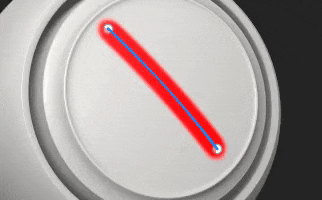
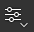
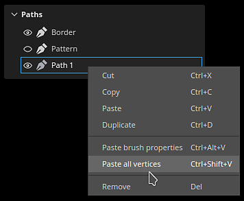

# Pfad-Werkzeug - Übersicht

<table>
<tr style="border: 0;">
<td style="border: 0;" valign="top">

<b>Audio</b>

Passe Audio an oder füge Audio zu deinem Projekt hinzu.

* Passen Sie die Quellvideolautstärke an, wenn sie Audio enthält.
* Externe Audiodateien hinzufügen, entfernen oder ersetzen
* Passen Sie die externe Lautstärke der Audiodatei an.

</td>
<td style="border: 0;" valign="top">

</td>
</tr>
</table>

Mit den <b>Pfadwerkzeugen</b> können Sie eine Kurve mit Punkten auf der Oberfläche des Gitters definieren. Nachdem die Kurve erstellt wurde, können Sie mit den verschiedenen Pfadwerkzeugen verschiedene Effekte entlang der Kurve erstellen.

## Erstellen eines Pfads

Pfade können auf Malebenen und Maleffekten erstellt werden. Es gibt zwei Möglichkeiten, auf das Pfad-Werkzeug zuzugreifen:

* <b>Über die Schnittstelle</b>: auf der linken Seite zur Werkzeugleiste navigieren und auf das dritte Symbol oben klicken.
* <b>Über einen Tastaturbefehl</b>: Standardmäßig ist dem Werkzeug keine zugewiesen. Dies kann im Menü &quot;Einstellungen&quot; geändert werden, indem Sie den Tastaturbefehl &quot;entlang des Pfades malen auswählen&quot; bearbeiten.

Sobald das Werkzeug ausgewählt ist, können Punkte platziert werden, indem Sie auf die Oberfläche des 3D-Modells im 3D-Viewport klicken. Mindestens zwei Punkte (oder Scheitelpunkte) sind erforderlich, um einen Pfad zu erstellen.

Das Pfadwerkzeug verfügt über verschiedene Modi, die den anderen in der Anwendung verfügbaren Malwerkzeugen ähneln können:

* Malen entlang Pfad: Zeichnen Sie einen normalen Pinselstrich entlang eines definierten Pfads.
* [Bandpfad](ribbon-tool.md): Zeichnet ein wiederholtes oder gestrecktes Bild entlang eines Pfades.
* [Ausgefüllter Pfad](filled-path.md): Füllen Sie das Innere eines Pfades mit einer einheitlichen Farbe.
* entlang Pfad radieren: Zeichnen Sie einen Strich, der Informationen entlang eines definierten Pfads löscht/entfernt.
* Verwischen entlang des Pfades: Zeichnen Sie einen Strich, der Informationen entlang eines definierten Pfads verwischt/verwischt.

Hier ist z. B. das Pfadwerkzeug im Modus &quot;<b>Verwischen</b>&quot;, das andere Malinformationen beeinflusst:

>[!NOTE]
>
> Die <b>Pfadwerkzeuge</b> funktionieren nur im 3D-Raum auf der Oberfläche der Geometrie. Das Erstellen eines Pfads im UV-Raum oder als Bildschirmraumprojektion wird derzeit nicht unterstützt.

### Bearbeiten eines Pfads

Pfadpunkte (oder Scheitelpunkte) haften automatisch an der Oberfläche des Gitters. Sie können jederzeit verschoben und angepasst werden. Sie können einem vorhandenen Pfad neue Scheitelpunkte hinzufügen, indem Sie an einer beliebigen Stelle entlang der Linie klicken. 

* Durch Drücken von <b>Escape </b> oder <b>Enter </b> wird die Pfadausgabe beendet.
* Wenn Sie auf eine leere Oberfläche des Gitters klicken, wird ein neuer Pfad erstellt.
* Wenn Sie mit der Maus auf einen vorhandenen Pfad klicken, wird er ausgewählt, sodass Sie den Pfad fortsetzen oder bearbeiten können. Pfade können auch über das Bedienfeld &quot;<b>Pfade</b>&quot; neu ausgewählt werden (siehe unten).

Einige Eigenschaften sind für einen Pfad als Ganzes spezifisch. Dies ist der Fall bei Optionen, die im Fenster <b>Eigenschaften </b> gefunden werden. Wie bei einer normalen Kontur (siehe [Paint-Tool-Dokumentation](paint-brush.md)) können die folgenden Eigenschaften für einen Pfad definiert werden:

* <b>Pinsel</b>
* <b>Alpha</b>
* <b>Material</b>

Der Abschnitt <b>Pinsel </b> enthält zusätzliche Optionen, die nur mit dem Pfadwerkzeug verfügbar sind:

| <b>Einstellung</b> | <b>Beschreibung</b> |
| --- | --- |
| <b>Tiefe der Projektion</b> | Legt fest, wie nah der Pfad an der Gitteroberfläche sein muss, damit die Pinselstempel angezeigt werden. Um dieses visuelle Feedback direkt im Viewport anzuzeigen, können Sie <b>Normale</b> in den <b>Pfad-Anzeigeeinstellungen </b> aktivieren (siehe unten). |
| <b>Achse nach oben</b> | Die Achse, an der die Pinselstempel ausgerichtet werden, wenn <b>Pfad folgen</b> deaktiviert ist.   In einem bestimmten Kontext ist es sinnvoller, alle Stempel entlang einer globalen Achse/Richtung und nicht entlang des Pfades auszurichten. Zum Beispiel mit Nieten auf einer metallischen Oberfläche. |

Andere Eigenschaften werden für Punkte (Scheitelpunkte) auf dem Pfad definiert, z. B. der Druck. Um einen bestimmten Punkt zu bearbeiten, klicken Sie einfach darauf (oder verwenden Sie die rechteckige Auswahl). Verwenden Sie dann die kontextbezogene Symbolleiste, um die ausgewählten Punktwerte zu bearbeiten.

### Steuern von Tangenten

Manchmal ist ein glatter Pfad nicht ideal, weil er nicht der Oberfläche des 3D-Modells am besten entspricht oder weil er nicht zu einem bestimmten Look passt. Um diese Probleme zu lösen, ist es möglich, die Tangenten eines bestimmten Scheitelpunktes zu ändern. Die Tangenten sind die Richtungen eines Punktes, die steuern, wie der Pfad gebeugt wird.

Um zwischen glatten oder linearen/unterbrochenen Tangenten zu wechseln, doppelklicken Sie einfach auf einen Scheitelpunkt (oder verwenden Sie die entsprechende Schaltfläche in der kontextbezogenen Symbolleiste):

Um die Ausrichtung der Tangenten genauer zu steuern, verwenden Sie die Schaltfläche Benutzerdefinierte Tangenten in der kontextbezogenen Symbolleiste, um sie manuell zu überschreiben:

Verwenden Sie die Tastenkombination <b>ALT</b>, um die Tangenten beim Bewegen zu unterbrechen, wenn der Punkt noch nicht bewegt wurde.

Verwenden Sie den Tastaturbefehl <b>STRG</b>, um beide Tangenten gleichzeitig zu skalieren.

>[!NOTE]
>
> Die Tangentensteuerungen werden entlang der Ebene definiert, die mit der Normalen des angegebenen Punkts im Pfad ausgerichtet ist. Das bedeutet, dass sich Tangenten nicht in bestimmte Richtungen biegen können.

### Kontextsymbolleiste

Die <b>kontextbezogene Symbolleiste</b>, wenn das <b>Pfad</b>-Tool ausgewählt ist, stellt mehrere Einstellungen bereit, mit denen der aktuell ausgewählte Pfad gesteuert werden kann:

| <b>Parameter</b> | <b>Beschreibung</b> |
| --- | --- |
| <b>Viewport-Schnittstelle ein-/ausblenden</b>  

 | Wenn diese Option aktiviert ist, werden die Überlagerungen von Pfaden und Scheitelpunkten im Viewport angezeigt. |
| <b>Anzeigeeinstellungen</b>  

 | Steuern Sie das Aussehen des visuellen Pfadfeedback im Viewport:<ul data-preserve-html="true"> <li data-preserve-html="true"><b>Handle-Größe</b>: steuert, wie groß die Punkte des Pfades aussehen.</li> <li data-preserve-html="true"><b>Pfadbreite</b>: die Thickness der Pfadlinie steuern.  </li> <li data-preserve-html="true"><b>Pfadfarbe</b>: die Farbe der Pfadlinie steuern.  </li> <li data-preserve-html="true"><b>Nicht ausgewählte Pfadfarbe</b>: die Farbe der nicht aktiven Pfade steuern.  </li> <li data-preserve-html="true"><b>Normale</b>: Wenn aktiviert, zeigen Sie die Projektionsrichtung an jedem Punkt eines Pfades an.  </li> <li data-preserve-html="true"><b>Tangenten</b>: Wenn aktiviert, zeigen Sie die Kurvenrichtung der Kontrollpunkte des Pfads an.  </li> <li data-preserve-html="true"><b>Pfadrichtung</b>: Wenn diese Option aktiviert ist, zeigen Sie einen kleinen Pfeil am Ende des Pfades an, um die Malrichtung anzugeben. Das ist nützlich, um zu erfahren, wie Stempel innerhalb des Strichs ausgerichtet werden.</li> </ul>  

 |
| <b>Pfadrichtung umkehren</b>  

 | Spiegeln Sie die Richtung des aktuellen Pfads. Die Richtung definiert die allgemeine Ausrichtung, die zum Malen der Stempel innerhalb des Strichs verwendet wird. Durch Umkehren des Pfads kannst du das gezeichnete Muster neu ausrichten. |
| <b>Ecke/Glättung ein/aus</b>  

 | Unterbrechen oder richten Sie die Tangente der aktuell ausgewählten Scheitelpunkte aus, sodass Sie zwischen einer glatten oder linearen Kurve wechseln können.  

  **Hinweis:** Der Wechsel zwischen Eck- und Übergangsparameter kann auch durch Doppelklicken auf einen Punkt direkt auf dem Pfad erfolgen. |
| <b>Benutzerdefinierte Tangenten</b>  

 | Wenn diese Option aktiviert ist, können Sie die Tangenten eines bestimmten Punkts auf dem Pfad manuell steuern.  

 |
| <b>Pfad öffnen/schließen</b>  

 | Öffnen oder schließen Sie den aktuellen Pfad. Um einen Pfad zu schließen, muss zuerst einer der beiden Endpunkte des aktuellen Pfads ausgewählt werden.  

 |
| <b>Scheitelpunkt löschen</b>  

 | Entfernen Sie die aktuell ausgewählten Scheitelpunkte auf einem Pfad. |
| <b>Symmetrie</b>  

 | Aktivieren oder deaktivieren Sie die Symmetrie für den aktuellen Pfad. Weitere Informationen finden Sie in der [Symmetrie-Dokumentation](../symmetry/symmetry.md).  

 |
| <b>Ausgeschlossene Geometrie ausblenden/ignorieren</b>  

 | Wenn diese Option aktiviert ist, lassen Sie den aktuellen Pfad durch die verborgene Geometrie malen. Weitere Informationen finden Sie in der [Dokumentation zu Geometriemasken](../../interface/layer-stack/geometry-mask.md). |

### Pfadebedienfeld

>[!NOTE]
>
> Das Bedienfeld ist ausgeblendet, wenn das aktuelle Werkzeug nicht das Pfadwerkzeug ist oder wenn eine Füllebene/ein Ordner ausgewählt ist.

Im Viewport befindet sich das Bedienfeld &quot;<b>Pfade</b>&quot;, in dem alle Pfade der aktuell ausgewählten Malebene/des Effekts aufgeführt sind. Pfade lassen sich einfach auswählen und verwalten.

Mit diesem Bedienfeld können Sie:

* Doppelklicken Sie auf einen Pfad, um &quot;<b>umzubenennen</b>&quot;.
* <b>Löschen</b> Sie einen Pfad, indem Sie ihn auswählen und dann die Löschtaste drücken.
* <b>Kopieren</b>/<b>Einfügen</b>/<b>Duplizieren</b> Sie einen Pfad mit den dedizierten Tastaturbefehlen.
* <b>Einblenden</b> oder <b>Ausblenden</b> eines Pfads mit dem Augensymbol (das steuert, ob der Pfad auf die Texturierung angewendet wird).

Der Einfachheit halber können Sie auch mit der rechten Maustaste auf einen Pfad klicken, um das Kontextmenü mit den gleichen Aktionen zu öffnen:

Im Kontextmenü können Sie auch Aktionen öffnen, um die Eigenschaften oder die Position eines Pfads auf einen anderen Pfad zu kopieren. Auf diese Weise können Features problemlos über verschiedene Pfade hinweg freigegeben oder synchronisiert werden:

>[!NOTE]
>
> Kopieren und Einfügen von Eigenschaften funktioniert nur, wenn Pfade auf demselben Malwerkzeug basieren. Beispielsweise ist es nicht möglich, Eigenschaften zwischen einem Pfad mit Verwisch-Einstellungen und einem anderen Pfad mit Pinseleinstellungen zu teilen.

## Werkzeugvorgaben

{width="400px"}

Wenn ein Pfadwerkzeug ausgewählt ist, steht oben im Bedienfeld &quot;Eigenschaften&quot; der Bereich &quot;Vorgaben&quot; zur Verfügung. Hier können Sie schnell auf Vorgaben für die verschiedenen Pfadwerkzeuge zugreifen.

### Bevorzugte Pfadvorgaben

Die Option &quot;Favoriten&quot; im Bereich &quot;Vorgaben&quot; enthält nur Vorgaben, die Sie für einen noch schnelleren Zugriff als Favoriten festgelegt haben. Um Favoriten hinzuzufügen, wählen Sie Favoriten und dann &quot;Kompatible Vorgaben in Elementen anzeigen&quot;, um eine vollständige Liste der verfügbaren Pfadvorgaben anzuzeigen.

Um eine Vorgabe als Favorit festzulegen, klicken Sie im Bedienfeld Elemente oder im Bereich Vorgaben des Bedienfelds Eigenschaften mit der rechten Maustaste auf die Vorgabe und wählen Sie dann &quot;Zu Favoriten hinzufügen&quot; aus. 

Sie können Vorgaben auch aus der Favoritenliste entfernen. Mache einen Rechtsklick bzw. Ctrl-Klick auf eine Vorgabe, und wähle &quot;Aus Favoriten entfernen&quot;.

{width="400px"}

### Erstellen von Pfadvorgaben

Wie andere Werkzeuge können auch Voreinstellungen erstellt werden, um die Pinseleinstellungen/-konfigurationen schnell wiederherzustellen. Klicken Sie dazu einfach mit der rechten Maustaste in das Fenster <b>Eigenschaften</b> und wählen Sie <b>Werkzeugvorgabe erstellen.</b> Diese neu erstellte Vorgabe wechselt automatisch zum Pfadwerkzeug, wenn sie im Fenster <b>Elemente</b> ausgewählt wird.
