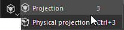

# Projektion

{width="50px"}

Die Projektion ist ein Werkzeug, mit dem ein Material durch Projektion in den Bildschirm/Viewport Malen werden kann. Es verfügt über ähnliche Kontrollen wie die Schablone.

Sie können die Transformation der Projektion bearbeiten, indem Sie **Tastaturbefehl S** drücken:

* Verwenden Sie **S + Linker Mausklick**, um die Schablone zu drehen.
* Verwenden Sie **S + Linksklick mit der Maus und UMSCHALT**, um die Schablone auszurichten bzw. auf die Drehung der Schablone zu beschränken.
* Verwenden Sie **S + Rechtsklick**, um die Schablone zu vergrößern/zu verkleinern.
* Verwenden Sie **S + Mittlere Maustaste**, um die Schablone Kamera bewegen.

<table>
<tr style="border: 0;">
<td style="border: 0;" valign="top">

</td>
<td style="border: 0;" valign="top">

</td>
<td style="border: 0;" valign="top">

</td>
</tr>
</table>

* **Projektion** : Malen-Tool basierend auf der Screenspace-Projektion. Dieses Werkzeug zeigt ein Muster über dem Viewport an und wiederholt es.
* **Physikalische Projektion** : Projektion-Malen-Tool mit physikalischen Eigenschaften auf der Grundlage von Partikeln-Vorgaben.
