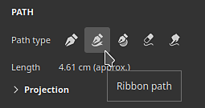
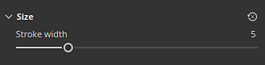
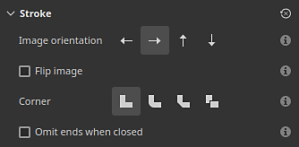

# Bandpfad

Mit dem Pfadwerkzeug <b>Menüband </b>können Sie Muster erstellen, die sich entlang einer Kurve verformen, die durch Punkte auf der Oberfläche des 3D-Modells definiert ist. Das Menüband kann auch verwendet werden, um Text entlang einer Kurve zu schreiben.

Das Menüband-Werkzeug kann über das Menü des Werkzeugs &quot;Pfad&quot; in der Werkzeugleiste ausgewählt werden:

Oder über die Schaltfläche <b>Pfadtyp</b>:

## Überblick

Das Bandpfad-Werkzeug unterscheidet sich vom Pfade-Werkzeug dadurch, dass es Bilder und Materialien zeichnet.

Während mit dem Malen-/Pinsel-basierten Werkzeug ein Bild auf einem Pfad mehrmals wiederholt wird, wird das Bild mit dem Menüband entlang des Pfads wiederholt und deformiert, um seinen Kurven zu folgen. Einzelne Komponenten eines Pinsels werden als <b>Stempel</b> bezeichnet, während die im Menüband als <b>Patches</b> bezeichnet werden.

## Einstellungen

### Größe

| Parameter | Beschreibung |
| --- | --- |
| <b>Konturbreite</b> | Steuert die globale Breite der aktuellen Kontur. |

### Deckkraft

| Parameter | Beschreibung |
| --- | --- |
| <b>Konturdeckkraft</b> | Legt die endgültige Deckkraft des aktuellen Strichs fest. |

### Kontur

| Parameter | Beschreibung |
| --- | --- |
| <b>Bildausrichtung</b> | Definieren Sie die Richtung des Eingabebilds. Diese Richtung steuert, wie das Bild auf dem Pfad platziert wird. |
| <b>Bild spiegeln</b> | Spiegeln Sie das Bild entlang der Achse/Breite des Pfades. |
| <b>Ecke</b> | Legen Sie fest, wie scharfe Ecken (geteilte Tangenten) auf dem Pfad angezeigt werden sollen. Mögliche Verhaltensweisen sind:<ul data-preserve-html="true"> <li data-preserve-html="true"><b>Gehrungsstoß</b>: spitze Ecke</li> <li data-preserve-html="true"><b>Runde Verbindung</b>: abgerundete Ecke</li> <li data-preserve-html="true"><b>Abgeflachte Kante </b>: quadratische/ebene Ecke</li> <li data-preserve-html="true"><b>Verknüpfung ausschneiden</b>: Starten Sie den Pfad erneut. Dieser Modus erstellt einen neuen Pfad mit dedizierten Start-/Endabschnitten.</li> </ul>Unten siehst du, wie die Ecken aussehen, in der richtigen Reihenfolge:  

 |
| <b>Die Auslassung endet beim Schließen</b>. | Wenn diese Option aktiviert ist, werden die Start-/Endabschnitte entfernt, wenn ein Pfad geschlossen wird, um eine kontinuierliche Schleife zu erstellen. Dies gilt sowohl für Streckungsabstände als auch für Dynamische Pinselstriche. |

### Dehnen und Kacheln

Der Bandpfad kann zwei verschiedene Modi verwenden, um zu steuern, wie ein Bild entlang eines Pfads wiederholt und gestreckt wird:

* <b>entlang Pfad dehnen</b>: (Standard) Das Bild, das entlang des Pfades wiederholt wird, wird entsprechend der Pfadlänge gestreckt.
* <b>Seitenverhältnis beibehalten</b>: Das Seitenverhältnis des entlang des Pfades wiederholten Bildes wird beibehalten. Ist das Bild zu lang im Vergleich zum Pfad, wird es beschnitten.

#### An Pfad entlang dehnen

| Parameter | Beschreibung |
| --- | --- |
| <b>Nur zwischen Offsets dehnen</b> | Wenn diese Option aktiviert ist, bleiben der Anfangs- und der Endabschnitt eines Bildes intakt, während die Mitte gedehnt wird. Verwenden Sie die Parameter <b>Anfangsoffset</b> und <b>Endoffset</b>, um die Größe dieser Abschnitte zu definieren. Der mittlere Abschnitt wird automatisch basierend auf dem Start/Ende berechnet.  

 |
| <b>Mustermodus</b> | Legen Sie fest, wie ein Bild entlang des Pfades wiederholt wird. Mögliche Werte sind:<ul data-preserve-html="true"> <li data-preserve-html="true"><b>Keine</b>: Das Bild wird nicht wiederholt. Es wird über den gesamten Pfad gestreckt.</li> <li data-preserve-html="true"><b>Auto</b>: (Standard) Das Bild wird automatisch eine bestimmte Anzahl von Malen wiederholt, basierend auf seiner Größe und der Strichbreite.</li> <li data-preserve-html="true"><b>Benutzerdefiniert</b>: Das Bild wird um die Anzahl wiederholt, die durch den <b>Tiling amount</b>-Parameter definiert ist.</li> </ul> |
| <b>Anzahl der Kacheln</b> | Geben Sie an, wie oft ein Bild im <b>benutzerdefinierten</b>-Kachelmodus wiederholt wird. |
| <b>Jede zweite Kachel spiegeln</b> | Spiegeln Sie das verwendete Bild jede zweite Wiederholung entlang der Pfadlänge. |
| <b>Seitenverhältnisfaktor</b> | Dehnen oder komprimieren Sie das aktuelle Bildseitenverhältnis. |

#### Seitenverhältnis beibehalten

| Parameter | Beschreibung |
| --- | --- |
| <b>Verhältnis</b> | Legen Sie fest, wie das Bild skaliert wird, ohne das Bildverhältnis zu ändern:<ul data-preserve-html="true"> <li data-preserve-html="true"><b>An Pfadbreite anpassen</b>: (Standard) Skalieren Sie das Bild, um es an die Pfadbreite anzupassen. Dies kann dazu führen, dass das Bild abgeschnitten wird, wenn es zu lang ist.</li> <li data-preserve-html="true"><b>An Pfadlänge anpassen</b>: Passen Sie die Abmessungen des Bildes so an, dass eine exakte Anzahl entlang des Pfades passt, während das Seitenverhältnis annähernd beibehalten wird.</li> </ul> |
| <b>Beschnittene Kacheln entfernen</b> | Wenn diese Option aktiviert ist, werden Wiederholungen entlang des Pfades entfernt, die nicht vollständig sichtbar sind (wenn sie beschnitten werden). Diese Einstellung ist deaktiviert, wenn die Einstellung <b>Verhältnis</b> auf <b>An Pfadlänge anpassen</b> festgelegt ist. |
| <b>Mustermodus</b> | Legen Sie fest, wie ein Bild entlang des Pfades wiederholt wird. Mögliche Werte sind:<ul data-preserve-html="true"> <li data-preserve-html="true"><b>Keine</b>: Das Bild wird nicht wiederholt. Es wird über den gesamten Pfad gestreckt.</li> <li data-preserve-html="true"><b>Auto</b>: (Standard) Das Bild wird automatisch eine bestimmte Anzahl von Malen wiederholt, basierend auf seiner Größe und der Strichbreite.</li> <li data-preserve-html="true"><b>Benutzerdefiniert</b>: Das Bild wird um die Anzahl wiederholt, die durch den <b>Tiling amount</b>-Parameter definiert ist.</li> </ul> |
| <b>Jede zweite Kachel spiegeln</b> | Spiegeln Sie das verwendete Bild jede zweite Wiederholung entlang der Pfadlänge. |
| <b>Ausrichtung</b> | Legen Sie fest, wo das Bild entlang des Pfades beginnen soll. Mögliche Werte sind:<ul data-preserve-html="true"> <li data-preserve-html="true"><b>Am Anfang ausrichten</b>: Das Bild wird ausgehend vom ersten Punkt des Pfades gezeichnet.</li> <li data-preserve-html="true"><b>In der Mitte ausrichten</b>: Das Bild wird in der Mitte des Pfades gezeichnet.</li> <li data-preserve-html="true"><b>Am Ende ausrichten</b>: Das Bild wird ausgehend vom letzten Punkt des Pfades gezeichnet.</li> </ul> |
| <b>Seitenverhältnisfaktor</b> | Dehnen oder komprimieren Sie das aktuelle Bildseitenverhältnis. |

### Kanalfüllmethode

Dieser Abschnitt steuert das Fülleffekt, wenn sich der Pfad selbst überlappt.

| Parameter | Beschreibung |
| --- | --- |
| <b>Alpha</b> | Steuern Sie, wie der Abschnitt &quot;<b>Alpha</b>&quot; des Bandpfads in Bereichen überblendet wird, in denen er sich selbst überlappt. Dies wirkt sich auf die Intensität der Überblendung aller anderen Kanäle aus. Mögliche Werte sind:<ul data-preserve-html="true"> <li data-preserve-html="true"><b>Normal</b>: verwendet das Alpha des obersten Segments.</li> <li data-preserve-html="true"><b>Aufhellen (max.)</b>: (Standard) verwendet den maximalen Alpha-Wert, wobei das deckendste Segment beibehalten wird.</li> <li data-preserve-html="true"><b>Linearer Abwedler (Hinzufügen)</b>: addiert das Alpha der Segmente, um sie zusammen anzuhäufen, was zu einem gesättigteren Wert führt.</li> </ul> |
| <b>Normal</b> | Definieren Sie, wie der <b>Normal</b>-Kanal in Regionen überblendet wird, in denen sich der Pfad selbst überschneidet. Mögliche Werte sind:<ul data-preserve-html="true"> <li data-preserve-html="true"><b>Normal</b>: verwendet das Ergebnis des obersten Segments.</li> <li data-preserve-html="true"><b>Normale Kartenkombination</b>: (Standard) die Segmente mit gleicher Intensität kombinieren.</li> <li data-preserve-html="true"><b>Normale Kartendetails</b>: das oberste Segment als zusätzliche Details betrachten, während die unteren Bereiche ihre Intensität beibehalten.</li> </ul>Diese Einstellung unterscheidet sich von dem für die gesamte Ebene definierten Mischmodus &quot;<b>Normal</b>&quot;, der nach der selbstüberlappenden Füllmethode des Pfades angewendet wird. <b>Hinweis</b>: Diese Einstellung ist deaktiviert, wenn der Kanal eine einheitliche Farbe hat. Es ist nur mit Bitmaps und Substance-Ressourcen kompatibel. |
| <b>Height</b> | Definieren Sie, wie der <b>Height</b>-Kanal in Regionen überblendet wird, in denen sich der Pfad selbst überschneidet. Mögliche Werte sind:<ul data-preserve-html="true"> <li data-preserve-html="true"><b>Normal</b>: verwendet das Ergebnis des obersten Segments.</li> <li data-preserve-html="true"><b>Linearer Abwedler (Hinzufügen)</b>: fügt die Segmente zusammen und behält dabei ihre ursprüngliche Intensität bei.</li> <li data-preserve-html="true"><b>Abdunkeln (Min.)</b>: nur den dunkelsten/niedrigsten Wert der überlappenden Segmente beibehalten.</li> <li data-preserve-html="true"><b>Licht (max.)</b>: (Standard) behält den hellsten/höchsten Wert der überlappenden Segmente bei.</li> <li data-preserve-html="true"><b>Bildschirm</b>: ähnelt <b>Linear Doge</b>, führt jedoch zu einem weniger gesättigten Ergebnis.</li> </ul>Diese Einstellung unterscheidet sich von dem für die gesamte Ebene definierten Mischmodus &quot;<b>Height</b>&quot;, der nach der selbstüberlappenden Füllmethode des Pfades angewendet wird. <b>Hinweis</b>: Diese Einstellung ist deaktiviert, wenn der Kanal eine einheitliche Farbe hat. Es ist nur mit Bitmaps und Substance-Ressourcen kompatibel. |

Beispiel für den Mischmodus mit dem Height-Kanal:

## Text und nicht quadratische Bilder

Wenn Sie eine [Textressource](../text-resource.md) oder ein Bild mit einem nicht quadratischen Seitenverhältnis verwenden, wird es automatisch an den Bandpfad angepasst.

Dieses Verhalten ermöglicht es, Text zu schreiben oder Bilder zu wiederholen, z. B. um Muster entlang eines Pfades zuzuschneiden.

