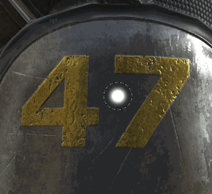

# Verwischen-Werkzeug

Das Wischfinger-Werkzeug wurde in Substance 3D Painter 2 eingeführt und verfügt über denselben Parametertyp wie das [Malen-Werkzeug](https://support.allegorithmic.com/documentation/display/SPDOC/Paint+brush) .

## Nutzung

Der einfachste Weg, das Wischfinger-Werkzeug zu verwenden, besteht darin, es direkt auf dem Inhalt einer Malebene als normales Malen-Werkzeug zu verwenden.

Mit dem Wischfinger-Werkzeug kannst du jetzt besser eine Malebene erstellen und alle Kanäle der Ebene auf den Mischmodus &quot;Hindurchwirken&quot; setzen. Auf diese Weise können Sie alle Ebenen, die sich unter der &quot;Verwischungsebene&quot; befinden, zerstörungsfrei verwischen. Die folgenden Ebenen bleiben intakt und alle später vorgenommenen Änderungen werden von der Verwisch-Ebene berücksichtigt.
