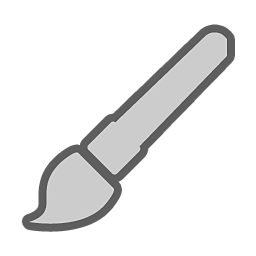

# Werkzeugliste

Auf dieser Seite finden Sie Informationen zu allen verfügbaren Malwerkzeugen und deren Verwendung.

| *Tool* | *Beschreibung* |
| --- | --- |
| 

 | Mit dem [Malwerkzeug](paint-brush.md) können Sie Pinselstriche mit einem bestimmten Material über das Gitter anwenden. |
| 

 | Mit dem [Radiergummi](eraser.md) können Sie alle vorhandenen Malinformationen entfernen. |
|  | [Mit dem Pfadwerkzeug ](path.md) können Sie eine Kurve entlang der Oberfläche Ihres Modells definieren, die einige verschiedene Effekte erzeugen kann. Zeichne einen Pinselstrich, radiere Zeichnungen aus, verwische Objekte oder füge Details wie Reißverschlüsse oder Risse hinzu. |
| 

 | Mit [Projektion](projection.md) können Sie ein Material oder eine Textur anwenden, das bzw. die an der aktuellen Perspektive ausgerichtet ist. |
| 

 | Mit [Polygonfüllung](polygon-fill.md) können Sie Polygone im 3D-Gitter auswählen, um Masken basierend auf der Geometrie zu erstellen. |
| 

 | Mit dem [Verwischen-Werkzeug](smudge-tool.md) können Sie Farben und andere Materialeigenschaften dehnen, mischen und weichzeichnen. |
| 

 | Mit dem [Kopierwerkzeug](clone-tool.md) können Sie einen Teil des vorhandenen Materials im 3D-Gitter duplizieren oder ausbessern. |
| 

 | Mit dem Materialwähler können Sie Materialeigenschaften in Ihrem Projekt von der Oberfläche des 3D-Gitters kopieren.  Hierbei handelt es sich um ein temporäres Werkzeug. Sobald eine Farbe ausgewählt wurde, wird das vorherige Werkzeug eingerichtet. |
|  | Mit [Schnellmaske](quick-mask.md) können Sie eine temporäre Maske erstellen, die mehr Kontrolle darüber bietet, wo Sie Farbe anwenden können. |
