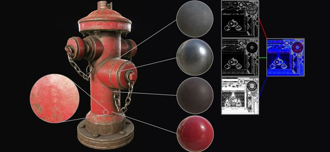
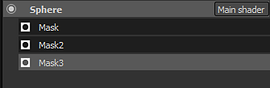
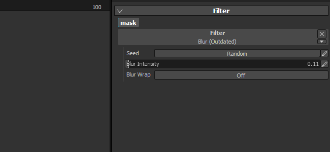

# Version 2.2

**Substance Painter 2.2** fügt einen neuen Workflow hinzu, der die Dynamische Materialüberlagerung ist.

Freigabedatum: *21. Juli 2016*

## Wichtigste Funktionen

### Neuer Arbeitsablauf für Dynamische Materialüberlagerung

Mit dieser neuen Version fügen wir einen neuen **Workflow** hinzu, der als **Material-Ebene** bezeichnet wird. Herkömmliche Workflows zur Texturierung basieren auf dem Erstellen von Texturen mit **hoher Auflösung** bis **Details erhalten**, dies ist jedoch **nicht praktisch** für den Anwendungsfall. Ein interessanterer Ansatz ist es, **ein kleines Material zu erstellen** und **es in einem Shader zu wiederholen**. Es ermöglicht, eine bestimmte Qualität beizubehalten und **mit diesem Shader** sehr nah **an das Objekt heranzoomen, ohne dass Einzelheiten verloren gehen**. Das einzige Problem ist, dass es für die Vorschau des Endergebnisses vorher zwingend erforderlich war, zum Engine/Renderer zu gehen, der den endgültigen Shader anzeigt. Das stimmt nicht mehr, denn in dieser neuen Version ist es jetzt möglich, einen ähnlichen Shader innerhalb von Substance Painter zu verwenden, mit dem Sie **das Endergebnis und das Malen gleichzeitig visualisieren können**.

Ein **neues Beispielprojekt** mit dem Namen &quot;**FireHydrant**&quot; wurde hinzugefügt, um den neuen Arbeitsablauf zu präsentieren.

Dieser neue Arbeitsablauf eröffnet zwei Arbeitsweisen:

* Materialien sind im Shader definiert, Sie können nur Malen Masken, um sie zu mischen
* Materialien und Masken können gemeinsam bemalt werden

In jedem Fall ist es möglich, jedes Mal einen neuen Ebenenstapel zu definieren, der mehr Spielraum beim Erstellen der Masken und Materialien bietet. Die Verwaltung von Ebenen ist auf diese Weise viel einfacher, und jeder Stapel kann seine eigenen spezifischen Kanäle haben, die im endgültigen Shader gemischt werden können.\
Wir haben auch einen besonderen Shader für Unity 5 und Unreal Engine 4 auf Share :

* [Einheit 5](https://share.allegorithmic.com/libraries/2126)
* [Unechtes Engine 4](https://share.allegorithmic.com/libraries/2125)

Weitere Informationen finden Sie auf der entsprechenden Seite der Dokumentation : [Dynamische Materialüberlagerung](../../features/dynamic-material-layering.md)

### Neues Mini-Regal-Suchfeld

Wir haben das **Mini-Regal**, das an verschiedenen Stellen der Anwendung angezeigt wird, mit einem dedizierten Suchfeld verbessert. Diese Verbesserung macht die Suche nach Ressourcen viel bequemer und angenehmer zu bedienen. Die benutzerdefinierte Suche bleibt während der aktuellen Sitzung der Anwendung erhalten. Wenn Sie z. B. viele Schmutz-Rauschen verwenden, macht die Verwendung dieses Schlüsselworts

## Tutorial

In unserem neuesten Video-Tutorial lernen Sie die neuen Funktionen kennen:

## Versionshinweise

### 2.2.0

(Release 21. Juli 2016)

**Hinzugefügt:**

* [Regal] Verbesserung des Suchsystems und der Suchanfragen
* [Regal] Hinzufügen eines Suchfelds für Mini-Regals
* [Shader] Festlegen der Schrittgenauigkeit für Schieberegler
* [Shader] Hinzufügen einer Schaltfläche &quot;Rückgängig/Wiederholen&quot; für Shader-Parameter
* [Shader] Das erneute Laden eines Shader sollte seine Parameter nicht zurücksetzen.
* [MathLayering] Unterstützung für Dynamische Materialüberlagerung und Sub-Stapel hinzufügen
* [MatLayering] Importieren der JSON-Datei zum Einrichten der Shader-Einstellungen zulassen
* [MathLayering] Limit für Textur-Sampler entsperren (Wechsel zu Bindless-Texturen)
* [Scripting] Einstellung der Baker erlauben und Berechnung starten
* [Substance] &quot;Verwendung&quot; für Ein-/Ausgangsverbindungen zusätzlich zu Identifizierungen verwenden
* [Tool] Ermöglicht die Auswahl des Vorschaukanals im Viewport für das Projektion-Tool

**Fest:**

* Absturz beim Start, wenn sich die Substanzen im falschen Ordner befinden
* Der Absturz-Bericht funktioniert aufgrund einer falschen Protokolldatei manchmal nicht
* [Iray] Post-Effekte werden nicht aktualisiert, wenn Iray angehalten wird
* [Iray] Autofokus-Tastaturbefehl funktioniert nicht mehr
* [Iray] Das Verhalten des Blende-Schiebereglers ändert sich je nach Elementgröße.
* [Ebenen] Der Kanal des ersten Materials ist standardmäßig nicht aktiviert, wenn alle deaktiviert sind
* [Shader] Es werden keine Fehler ausgegeben, wenn ein &quot;param auto&quot; nicht korrekt ist.

**Bekanntes Problem :**

* [Mac] Grenzwert für Textur-Samples auf 16 gesperrt (GPU-Treiberproblem)
