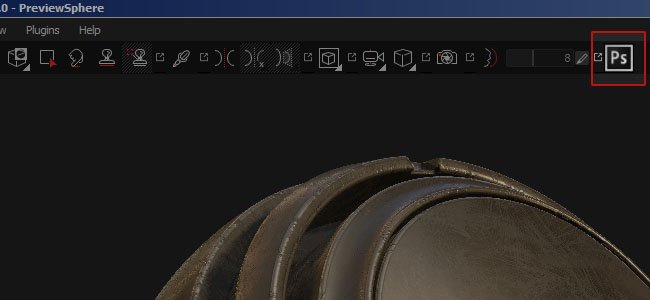
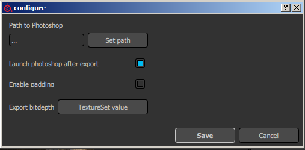

# Version 2.3

**Substance Painter 2.3** verbessert die Skript-API, um ihr erstes offizielles Plug-in zu veröffentlichen: einem Photoshop-Export mit dem vollen verfügbaren Ebenenstapel.

Freigabedatum : *15. September 2016*

## Wichtigste Funktionen

### Neues Photoshop-Export-Plug-in

Mit dieser Version haben wir uns darauf konzentriert, neue Möglichkeiten in der Skript-API hinzuzufügen, um **einen erweiterten Exporter für Photoshop** zu implementieren. Um auf diesen neuen Export zuzugreifen, klicken Sie einfach auf das Photoshop-Symbol in der Hauptsymbolleiste (wenn das Plug-in aktiviert ist, was standardmäßig der Fall ist). Mit dem Plug-in kannst du den gesamten Ebenenstapel eines Textursatzes exportieren und eine ähnliche Struktur innerhalb einer PSD-Datei erstellen. Für diese Funktion **muss Photoshop auf dem Computer installiert sein**, damit die PSD-Datei generiert werden kann.

Einige Optionen sind über die Schaltfläche &quot;Konfigurieren&quot; im Plug-in-Menü verfügbar:

## Tutorial

Unser neuestes Tutorial erklärt den Exportvorgang mit dem neuen Plug-in :

## Versionshinweise

### 2.3.1

(Release 7. Oktober 2016)

**Hinzugefügt:**

* [Plugin][Photoshop] Geben Sie an, welches Material/welcher Stapel/welche Kanäle exportiert werden sollen.
* [Scripting] Funktionsnamen weisen einige Inkonsistenzen auf.

**Fest:**

* [Exportieren] Alpha kann in benutzerdefinierten Exportvorgaben verworfen werden
* [Exportieren] Alpha erhält falsche Gamma-Konvertierung auf sRGB-Kanälen
* [Exportieren] Nicht quadratische Dokumente werden als quadratisch exportiert
* [Exportieren] Zusätzliche Karten können nicht exportiert werden, wenn eine fehlt
* [Iray] Einige Parameter (wie &quot;emissive-Intensität&quot;) haben keine Auswirkungen
* [NVIDIA] Absturz beim Start mit NVIDIA Quadro K2200/GTX 750/760
* [AMD] Falscher Farbsatz für Miniaturen und Vorschauen
* [AMD] Einfrieren und Treiberfehler beim Öffnen neuer Dateien und Dateien
* [Log] &quot;software-version&quot; fehlt in der Protokolldatei

### 2.3.0

(Release 15. September 2016)

**Hinzugefügt:**

* [Plug-In] Neues Plug-In &quot;Nach Photoshop exportieren&quot; (vollständiger Ebenenstapel exportieren)
* [Exportieren] Geben Sie die Breite der Auffüllung an (in Pixel oder unendlich).
* [Exportieren] Festlegen des Hintergrundtyps außerhalb der UVs zulassen
* [Regal] Neues Material mit Shader-Ebenen zum Überblenden von 10 Materialien
* [Regal] Neuer Tonkanal zur Anzeige von Shadern mit dem Height-/Normalkanal
* [Regal] Neuer Baking geführt Lichtfilter mit Umgebungseingabe
* [Regal] Einige Maskengenerator wurden aktualisiert, um nicht quadratische Transformationen hinzuzufügen.
* [Viewport] Hinzufügen von Composite-Normalen-Map (Normal+Height+Baking) zum Solomodus
* [Skripterstellung] Exportieren zusätzlicher Maps zulassen
* [Skripterstellung] Abfrage verfügbarer zusätzlicher Maps pro Textursatz zulassen
* [Scripting] Kanalformat kann abgerufen werden.
* [Skripterstellung] Hinzufügen von Beispielen in der Dokumentation zum Baking
* [Scripting] Ermöglicht das Abfragen der Sichtbarkeit einer Ebene.
* [Skripterstellung] Ermöglicht das Abfragen der Füllmethode und Deckkraft der Ebene
* [Skripterstellung] Exportieren konvertierter Maps (endgültige Normalen-Map, gemischte AO usw.)
* [Substance] Benutzerdefinierte Verwendungen lesen und verbinden
* [Shortcuts] Zusatztaste (SHIFT) hinzufügen, um Solo-Modus rückwärts zu durchlaufen
* [Exportieren] Standardvorgabe für den Export wurde aktualisiert, um Alpha zu deaktivieren
* [UI] Miniaturen werden jetzt nur berechnet, wenn das Engine verfügbar ist
* [UI] Anzeigen einer Erwähnung bei der Berechnung von Miniaturansichten

**Fest:**

* Absturz zu einigen alten Projekten beim Öffnen
* Absturz mit beschädigtem Textur-Kanal-Cache
* Absturz beim Mischen von mehr als 4 Materialien mit dem Material-Ebenen-Arbeitsablauf
* [UI] Tastenkombinationen funktionieren nicht, wenn die Symbolleiste ausgeblendet ist
* [UI] Iray-Symbolleiste ist im Menü &quot;Ansicht&quot; mit &quot;Unbenannt&quot; beschriftet
* [UI] Plug-in-Symbolleisten werden im Menü &quot;Ansicht&quot; als &quot;Nicht geneigt&quot; bezeichnet
* [Baker] Drücken der Eingabetaste beim Bearbeiten einer Baking-Einstellung startet den Baking-Prozess
* [Baker] Falsche Bereiche für einige Parameter
* [Importieren] OBJ Mesh können aufgrund sehr großer Zahlen nicht importiert werden.
* [Importieren] Einige OBJ werden mit zu vielen Unterobjekten importiert
* [Export] Kanalhintergrund wird beim Export mit Schwarz anstelle der Standardfarbe gefüllt
* [Tool] Partikeln funktionieren nicht richtig, wenn der FOV-Wert zu niedrig ist
* [Tool] Die Pinselvorschaufarbe ist bei Masken in untergeordneten Stapeln falsch
* [Viewport] Wenn der Pinsel in leere Bereiche in der 2D-Ansicht geht, wird er gigantisch
* [Viewport] Leere Pinselvorschau beim Malen mit normalen Texturen
* [Skripterstellung] Falsche Dokumentation : &quot;ao&quot; anstelle von &quot;ambientocclusion&quot; aufgeführt
* [Skripterstellung] Der mit subprocess() begonnene Prozess wird beim Schließen von Painter beendet
* [Regal] Baking geführt Beleuchtungsfilter verwenden falsche AO-Eingabe
* [MacOS] Entferntes Fire Hydrant-Projekt (inkompatibel)
* Standardprojekt wird beim Laden einer \*.spt-Datei geöffnet (anstelle von \*.spp).
