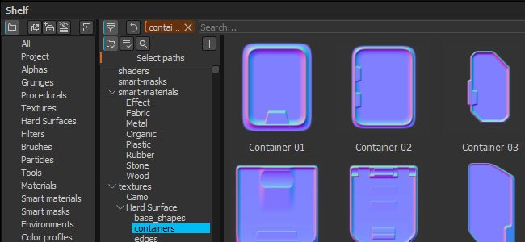

# Version 2.4

**Substance Painter 2.4** konzentriert sich auf die Verbesserung des Fachfensters sowie der Verwaltung von Ressourcen.

Freigabedatum : *27. Oktober 2016*

## Wichtigste Funktionen

### Neues Fachfenster mit erweiterter Filterung

Das neue Shelf-Fenster bietet eine **bessere Organisation** von Ressourcen neben **neuen Möglichkeiten zum Filtern von Inhalt**. Wir haben die Möglichkeit hinzugefügt, **benutzerdefinierte Vorgaben** zu erstellen, wobei jede Vorgabe über eine eigene Filterung verfügt (sodass schnell zwischen verschiedenen Abfragen gewechselt werden kann). Diese Vorgaben können auch in ein neues Fenster isoliert werden **, sodass** mehrere Ansichten **der Ablage vorhanden sind und nicht nur eine wie zuvor.** Die Filterung bietet außerdem die Möglichkeit, **die Ordnerhierarchie auf der Festplatte zu durchsuchen**, was beim Verfeinern einer allgemeineren Abfrage nützlich ist. Wir haben auch das **Kontextmenü** (beim Rechtsklick auf eine Ressource) verbessert, um **weitere nützliche Informationen** bereitzustellen.

Informationen zum Erstellen erweiterter Abfragen finden Sie im entsprechenden Teil der Dokumentation : [Erweiterte Suchabfragen](../../interface/assets/advanced-search-queries.md)

### Neues Importressourcenfenster

Mit der Überarbeitung des Regals **haben wir auch das Fenster für den Ressourcenimport** verbessert. Das Fenster ist jetzt konsistenter und kann **auf drei verschiedene Arten aufgerufen werden** : über das Dateimenü, über die Schaltfläche im Shelf-Fenster oder wie zuvor durch Ziehen und Ablegen einer Ressource in das Shelf-Fenster. Mit dem neuen Fenster können **schnell die Verwendung** für **mehrere Ressourcen** gleichzeitig festlegen. Das bedeutet, dass Sie die Ressourcen nicht mehr zuerst an den richtigen Ort ziehen und ablegen müssen. Wir haben außerdem die Möglichkeit hinzugefügt, **einen benutzerdefinierten Pfad anzugeben**, um Unterordner zu erstellen, um die Vorteile der neuen Strukturansicht zu nutzen.

Weitere Informationen finden Sie im entsprechenden Teil der Dokumentation : [Ressourcen werden über das Importfenster hinzugefügt](https://helpx.adobe.com/substance-3d/unlisted/documentation/spdoc/adding-content-via-the-import-window-151584824.html)

### Neue Partikelvorgaben

Die vorherige **Partikelvorgabe** wurde **überarbeitet**, um einsatzbereiter zu sein (insbesondere die **Regen**-Vorgabe). Wir haben diese Gelegenheit auch genutzt, um **neue Vorgaben** mit neuen Verhalten hinzuzufügen: Sehen Sie sich **Elektrische Schaltung, elektrische Leitungen, Rokoko und Adern klein** an!

## Tutorial

Die neuen Regalfunktionen und die Verwendung sind in unserem neuesten Tutorial beschrieben:

## Versionshinweise

### 2.4.1

(Release 28. Oktober 2016)

**Fest:**

* Absturz beim Erstellen eines Projekts mit einer Vorlage
* Absturz beim Schließen des Exportdialogs während eines Exports
* [Mac] Fehler beim Speichern des Projekts (Speichern der Exportvorgabe nicht möglich)
* [Shelf] Beim Erstellen einer neuen Vorgabe wird sie zweimal angezeigt
* [Shelf] Voreinstellungen können ohne Administratorrechte nicht im schreibgeschützten Modus geladen werden.

### 2.4.0

(Release 27. Oktober 2016)

**Hinzugefügt:**

* [Shelf] Neue Schnittstelle zum Durchsuchen von Ressourcen (Strukturansicht, Filter usw.)
* [Shelf] Speichern einer Suche als Vorgabe zulassen
* [Shelf] Erstellen eines neuen Fensters aus einer Vorgabe zulassen
* [Shelf] Neue Schnittstelle zum Importieren von Ressourcen
* [Shelf] Kopieren Sie die standardmäßige allegorische Ablage im Ordner Dokumente nicht
* [Shelf] Neue Partikel-Vorgaben : Stromkreis, elektrische Leitungen, Rokoko, Kleinvenen
* [Shelf] Verbesserte Vorgaben für ältere Partikel, die einfacher zu verwenden sind (z. B. &quot;Rain&quot;)
* [Shelf] Neue Informationen zum Kontextmenü der Ressource hinzufügen
* [Viewport] Verbessern der Leistung beim Laden von Umgebungskarten
* [Viewport] Unterstützung von Umgebungskarten hinzufügen, die nicht die Potenz von zwei sind

**Fest:**

* Absturz beim Entfernen einer Maske
* Absturz beim Malen nach dem Speichern einer Vorgabe
* Absturz mit Umgebungsunschärfe auf einigen GPUs
* Absturz beim Zuweisen einer falschen Ressource mit dem Mini-Regal
* [Shelf] Bereinigen + Speichern: Entfernen Sie Tags und Metadaten für Ressourcen im Projekt.
* [Shelf] Beim Importieren einer Voreinstellung werden die Ressourcen in der Voreinstellung angezeigt.
* [Exportieren] Die Normalmap, die aus dem Height-Kanal generiert wird, hat eine geringe Intensität.
* [Export] Normal aus Mesh ist in der endgültigen Normalmap nicht immer vorhanden.
* [Export] Dilation mit Transparenz kann manchmal ohne Transparenz erfolgen
* [Scripting] &quot;alg.plugin\_root\_directory&quot; kann einen abgeschnittenen Netzwerkpfad zurückgeben
* [TextureSet] Sperrschaltfläche ist aktiviert, wenn nicht quadratische Projekte erneut geöffnet werden
