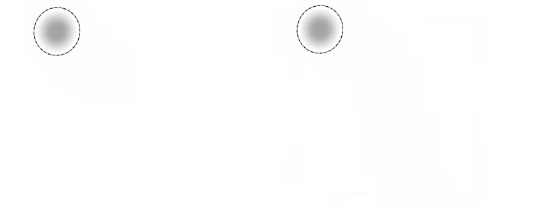
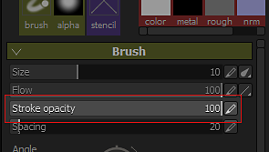
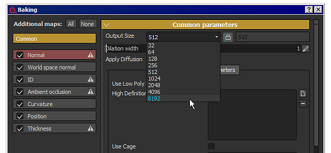
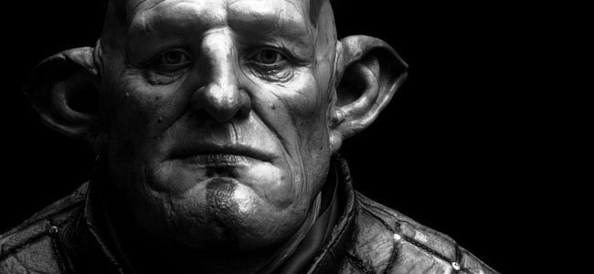
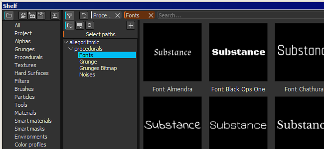
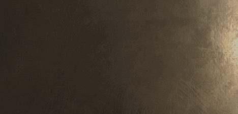
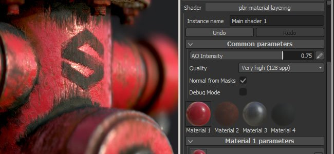

# Version 2.5

**Substance Painter 2.5** bietet viele neue Funktionen: von der Unterstützung der Deckkraft in den Pinseleinstellungen (zusätzlich zum Fluss) bis hin zur Möglichkeit, zusätzliche Maps in 8K und vieles mehr Baking führen.

Freigabedatum: *21. Februar 2017*

## Wichtigste Funktionen

### Neue Pinseldeckkraft

{width="650px"}

In den **Pinselparametern** beim Malen im Substance Painter gibt es jetzt eine neue Einstellung, die **Deckkraft** ist.\
Die **Deckkraft** steuern die **Gesamtintensität eines Pinselstrichs**, im Gegensatz zur **Fluss**-Einstellung, die die Intensität von **jedem einzelnen Stempel** innerhalb eines Pinselstrichs steuert. Dies bedeutet, dass es jetzt möglich ist, einen gleichen Bereich &quot;**&quot; Malen und erneut zu malen, ohne überlappende Werte zu erstellen.** Setze dazu den Durchfluss auf 100 und den Deckkraftwert auf die gewünschte Intensität. Aufgrund der Funktionsweise der Deckkraft ist es nicht möglich, sie mit dem Stift zu verknüpfen. Für diese Art von Kontrolle ist der Fluss immer noch die beste Wahl.

Wir haben außerdem einen **neuen Modifizierer** neben diesem neuen Parameter hinzugefügt, der standardmäßig auf dem Schlüssel **&quot;A&quot;** vorhanden ist. Durch Drücken dieser Taste kann **den vorherigen Pinselstrich** fortsetzen, anstatt einen neuen Pinselstrich zu erstellen. Das bedeutet, dass Sie eine einheitliche Farbe mit der gewünschten Deckkraft Malen können, während Sie die Kamera möglicherweise verschieben möchten. Ein weiteres Beispiel wäre, mit der Kopie fortzufahren, die Sie mit dem Kopierwerkzeug erstellt haben.

### Neues Baking mit 8K und nicht quadratischen Auflösungen

Der Baker wurde verbessert, um Auflösungen bis zu **8192x8192** (8K plus Anti-Aliasing) zu unterstützen, was bedeutet, dass Sie jetzt mit den zusätzlichen Maps bei 8K im Verhältnis 1:1 exportieren können.\
Wir haben auch Unterstützung für **nicht quadratische** Auflösungen hinzugefügt. Es ist jetzt möglich, beispielsweise eine Textur von **4096x2048** Baking führen. Klicken Sie dazu einfach auf das &quot;**Schloss**&quot;-Symbol neben der Dropdown-Liste, um die Auflösung auszuwählen.

### Neue Unterstützung für Farbprofil im Viewport

Wir haben die Unterstützung von **LUT** (Texturen) hinzugefügt, um das Rendern des **Viewports** in Substance Painter zu steuern. Um ein Profil anzuwenden, aktivieren Sie einfach die Einstellung &quot;**Farbprofil**&quot; im Fenster &quot;**Anzeigeeinstellungen**&quot; und laden Sie die LUT in den dedizierten Steckplatz. Es funktioniert sowohl mit dem **OpenGL**-Viewport (Zeichnen) als auch mit dem **Iray**-Renderer. Einige Beispiele sind standardmäßig von allgemeinen **Kamera-Vorgaben** bis zu mehr **Künstlerischen Effekten** verfügbar. Weitere Informationen finden Sie auf der entsprechenden Seite der Dokumentation : [Farbprofil](../../features/post-processing/color-profile.md)

### Neues Substance-Engine, kompatibel mit Substance Designer 6

Wir haben die Unterstützung für **Substance Designer 6** hinzugefügt. Das bedeutet, dass mit **SD6** erstellte Ressourcen geöffnet und in **Substance Painter 2.5** verwendet werden können!\
Ein gutes Beispiel ist die Möglichkeit, den **neuen Textknoten** von SD6 zu verwenden und in eine Substanz zu integrieren. Auf diese Weise ist es möglich, **dynamischen Text** zu erstellen und direkt Malen, ohne die Anwendung verlassen zu müssen. **Wir haben standardmäßig 10 Schriftarten** mit jeweils einem anderen Stil zur Abdeckung der häufigsten Verwendung eingeschlossen. Sie finden sie im Abschnitt &quot;**prozedural**&quot; des **Regals**.

{width="400px"}

### Neue Inhalte im Regal

Neben einigen Korrekturen und Verbesserungen für das neue Regal haben wir auch einige **neue Filter** hinzugefügt, um das Malen und Texturieren zu verbessern. Wir **haben außerdem das Verhalten bereits vorhandener Filter** verbessert (z. B. den **HSL**). Außerdem haben wir beim Erstellen von **neuen Projekten** neue **Vorlagen** hinzugefügt (z. B. **Unity 5** und **Unreal Engine 4**).

### Neue Skriptverbesserungen mit Unterstützung für benutzerdefinierte Shader-UI

Mit dieser Version haben wir einen Weg zu **script hinzugefügt und** die **Shader-Parameter** gesteuert. Wir haben auch die Unterstützung für die Verwendung einer **benutzerdefinierten Benutzeroberfläche** anstelle der Standardbenutzeroberfläche hinzugefügt, wodurch viele neue Möglichkeiten eröffnet werden, z. B. **animierter Shader**.\
Weitere Informationen finden Sie in der Skriptdokumentation, die im Hilfemenü der Anwendung verfügbar ist.

## Tutorial

Die neuen Hauptfunktionen sind in unserem neuesten Twitch-Stream beschrieben:

## Versionshinweise

### 2.5.3

(Release 15. März 2017)

**Fest:**

* [Baker] Absturz beim Baking führ mit bestimmten Meshs

**Bekanntes Problem :**

* [Mac] Partikeln können in einigen Fällen zu Beschädigungen der Textur führen

### 2.5.2

(Release 14. März 2017)

**Fest:**

* [Tool] Wacom-Tablet funktionieren unter Linux nicht
* [Werkzeug] Schwarze Artefakte bei Verwendung des Verwischen-Werkzeugs
* [Baker] Baking schlägt fehl, wenn &quot;Nach Name abgleichen&quot; mit einem Käfig verwendet wird
* [Baker] Ambient occlusion beim Baking nur mit Normalen-Map unterbrochen
* [Regal] Generische Filter behandeln Alpha nicht ordnungsgemäß (Kontrast/Luminanz, Hochpass usw.)
* [Viewport] Leistungsproblem beim Laden eines Projekts mit aktivierten Schatten
* [Viewport] Dithering-Problem in 3D-Ansichten über MacOS
* [Viewport] Partikel-Vorschauen werden falsch angezeigt, wenn Farbprofil aktiviert ist
* [Iray] Absturz beim Zurückwechseln des Projekts zu OpenGL, wenn Iray nicht initialisiert werden konnte
* [Iray] Glanz wird beim Rendern von SpecGloss Shader/mdl ignoriert
* [Shader] Spec/Gloss Shader stimmt nicht mit Iray und SD überein
* [Shader] sRGB-Konvertierung unterscheidet sich von der linearen in die sRGB-LUT-Konvertierung
* [Shader] Falsches Rendering beim Laden eines Projekts mit veralteten Shadern
* [Shader] &quot;pbr-coated&quot;-Shader funktioniert nicht mehr
* [Exportieren] Einige Kanäle werden weiterhin exportiert, auch wenn sie nicht im Textursatz vorhanden sind
* [Ebenen] Der Mischmodus &quot;Normalen-Map inverse detail&quot; funktioniert nicht auf Graustufenkanälen
* [UI] Problem beim &quot;Farbauswahl window&quot; mit HDPI-Monitor und Anzeigezoom bei 150 %

**Bekanntes Problem :**

* [Mac] Partikeln können in einigen Fällen zu Beschädigungen der Textur führen

### 2.5.1

(Release 27. Februar 2017)

**Fest:**

* [Mac] Wacom-Tablet-Eingang in 3D und 2D-Ansicht defekt
* [Baker] Die Zuordnung nach Namen funktioniert nicht mehr
* [Baker] Die Einstellung &quot;Normale Mittelwerte&quot; funktioniert nicht mehr.
* [Iray] Falsches Rendering mit fehlendem Baking geführt Normalen-Map
* [Iray] Farbprofil verhalten sich anders als beim OpenGL-Renderer
* [Iray] Exportieren von Rendering als Bitmap beinhaltet keine Farbprofil-Korrektur
* [Substance] Materialfilter funktionieren nicht mehr
* [Tool] Die Konturdeckkraft wird nicht in Pinselvorgaben gespeichert
* [Tool] Klon Brush UV Alignment funktioniert nicht mehr
* [Versatz] Beim Exportieren in Ganzzahl sollte der Exportkanal auf 0,5 zentriert sein.
* [Vorlage] Absoluter Pfad wird in Vorlagen gespeichert.
* [TextureSet] Die Textur des Kanals bleibt nach dem Entfernen des Kanals bestehen.

**Bekanntes Problem :**

* [Linux] Wacom-Tablet-Eingabe funktioniert nicht in 3D und 2D-Ansicht
* [Mac] Partikeln können in einigen Fällen zu Beschädigungen der Textur führen
* [Exportieren] In sehr seltenen Fällen können auf AMD-GPUs schwarze Rechtecke erscheinen

### 2.5.0

(Release 21. Februar 2017)

**Hinzugefügt:**

* Unterstützung für AMD Radeon Pro- und AMD FirePro-GPUs
* [Werkzeug] Unterstützung für Konturdeckkraft hinzufügen
* [Werkzeug] Fügen Sie einen Modifizierer hinzu, mit dem Sie den letzten Pinselstrich fortsetzen können
* [Iray] Update zur Unterstützung von Pascal-GPUs
* [Viewport] Unterstützung für Farbprofil hinzufügen (LUT)
* [Substance] Integration eines neuen Frameworks (SD6-Engine)
* [UI] Liste der &quot;zuletzt verwendeten Dateien&quot; im Menü &quot;Datei&quot; vergrößern
* [Importieren] Verwenden Sie die Kategorie aus Stoffen, um das Präfix im Dialogfeld &quot;Importieren&quot; auszufüllen.
* [Baker] Baking von 8K-Texturen zulassen
* [Baker] Baking nicht quadratischer Auflösungen zulassen
* [Baker] Verbessern Sie den Speicherverbrauch beim Baking führ von großen High-Poly-Meshs
* [Regal] Sperren von Regalen (und Projekten), um die gleichzeitige Bearbeitung zu verhindern und Beschädigungen zu vermeiden
* [Regal] Lesen Sie Kategorie und Schlüsselwörter von Stoffen, um sie für die Filterung zu verwenden
* [Regal] Ausschließen von Ressourcen vom Ergebnis einer Suchabfrage zulassen
* [Regal] Verbesserte Berechnung der Miniaturansichten
* [Regal] Einbetten von Vorgaben in Projekte zulassen
* [Regal] Schnelles Reduzieren/Erweitern der Strukturansicht mit UMSCHALT
* [Regal] Speichern von Miniaturansichten zulassen, wenn Assets schreibgeschützt sind (lokaler Cache)
* [Regal] Neuer Inhalt : neue Filter (transformieren, Mirror, Tri-planar usw.)
* [Regal] Neuer Inhalt : neue LUTs-Profile (klassisch und künstlerisch, z. B. Film Noir, Vintage usw.)
* [Regal] Neuer Inhalt : 10 neue Font-Substance zur schnellen Generierung benutzerdefinierter Texte
* [Regal] Neue Vorlagen : Unity 5 und Unreal Engine 4
* [Regal] Verbesserter HSL, um künstlerfreundlicher zu sein
* [Shader] Unterstützung für Specular level-Kanal in PBR-Shadern hinzufügen
* [Shader] Unterstützung für Dithering in Alpha Test Shader hinzufügen
* [Shader] Unterstützung für Parallax Verdeckung Mapping in PBR Shadern hinzufügen
* [Shader] Definieren einer benutzerdefinierten Benutzeroberfläche für Shader-Parameter zulassen
* [MatteLayering] Neuen Maskenkanal für den Workflow der Material-Ebene erstellen
* [Skripterstellung] Metadaten in einem SP-Projekt schreiben dürfen
* [Scripting] Export mit einer bestimmten Exportvorgabe zulassen
* [Scripting] Ermöglicht das Abrufen von Shader-Parametern als JSON.
* [Scripting] Unterstützung für WebSocket-Verbindungen hinzufügen
* [Scripting] Hinzufügen der Möglichkeit zum Laden von Shader-Instanzen
* [Scripting] Fügen Sie die Möglichkeit hinzu, ein neues Projekt zu erstellen
* [Scripting] Ermöglicht das Abrufen der URL des in ein Projekt importierten Meshs.
* [Skripterstellung] Nicht quadratisches Baking zulassen
* [Scripting] Berichtsfehler beim Festlegen von Daten über die Scripting-API
* [Substance] Benutzerdaten-Tag hinzufügen, um Normalen-Map-Format anzugeben

**Fest:**

* Absturz bei der Farbauswahl mit Stoffen
* Absturz beim Laden eines Nicht-RGBA32f-Bildes als Umgebungs-Map
* Absturz beim Malen auf AMD-GPUs
* [Mesh] OBJ Import erkennt keine Materialien ohne MTL-Datei.
* [Mesh] Die Generierung des UDIM-Textursatzes kann auf einigen Meshs falsch sein
* [UI] Schaltfläche &quot;Rückgängig/Wiederholen&quot; in Anzeigeeinstellung &quot;Fokus stehlen&quot; und Mausbildlauf anhalten
* [UI] Einige Beschriftungen werden in High-DPI falsch beschnitten
* [Ebene] Der Ersetzungsmodus für den Malen-Effekt hat ein falsches Verhalten auf der Maske.
* [Ebene] Der Subtrahieren-Mischmodus verhält sich mit Alpha nicht korrekt.
* [Tool] Die Pinselgröße wird in der 2D-Ansicht enorm, wenn auf UV-Rahmen gemalt wird
* [Tool] Einrasten gerade Linie hat ein ungleichmäßiges Verhalten mit High-DPI
* [Tool] Die Auflösung der Schablone ist manchmal falsch
* [Baker] Die Werte für &quot;Max. Verdeckungsabstand&quot; werden festgeklemmt, wenn &quot;relativ zum Begrenzungsrahmen&quot; &quot;Aus&quot; ist.
* [Shader] Stapel- und automatische Parameterkanaldefinitionen stimmen nicht überein
* [3D-Ansicht] Inkonsistente Anzeige des Normalkanals je nach Projekteinstellung
* [Viewport] Einige Normalen-Map haben Werte eingeklemmt, die als Artefakte erscheinen
* [Viewport] Nacheffekte sind standardmäßig immer deaktiviert
* [Export] Die normale Mischeinstellung ist falsch, wenn der normale Kanal fehlt
* [Exportieren] Falsche Generierung von Texturen in einigen Fällen auf AMD-GPUs
* [Exportieren] Shader-Parameter werden nicht ordnungsgemäß exportiert, wenn sie sich in einer Gruppe befinden
* [Exportieren] Beim Bearbeiten einer Exportvorgabe in einem benutzerdefinierten Regal wird ein Protokollfehler ausgegeben
* [Regal] Die Filterungen der Strukturansicht stimmen nicht genau mit dem Ordnernamen überein
* [Regal] Das Umbenennen einer Regal-Vorgabe ist schwer zu lesen
* [Regal] In das Regal importierte Shader-Ressource bleibt nach dem Neustart nicht erhalten
* [Regal] Inhalt : Werkzeugvorgabe fehlt
* [Regal] Inhalt : Tile Generator funktioniert nicht richtig
* [Regal] Inhalt : Falsche Maske auf Gummireifen-Schmutziges intelligente Material behoben
* [Regal] Inhalt : Falscher Gruppenname auf dem Material der Ledertasche wurde behoben
* [Iray] Die Hälfte der Meshs fehlt in Iray
* [Linux] Absturz beim Ziehen einer Ressource über die 3D-Ansicht
* [Mac] Voreinstellungen werden bei jedem Start in Sierra zurückgesetzt

**Bekanntes Problem :**

* [Exportieren] In sehr seltenen Fällen können auf AMD-GPUs schwarze Rechtecke erscheinen
* [Iray] Farbprofile können sich manchmal seltsam verhalten
