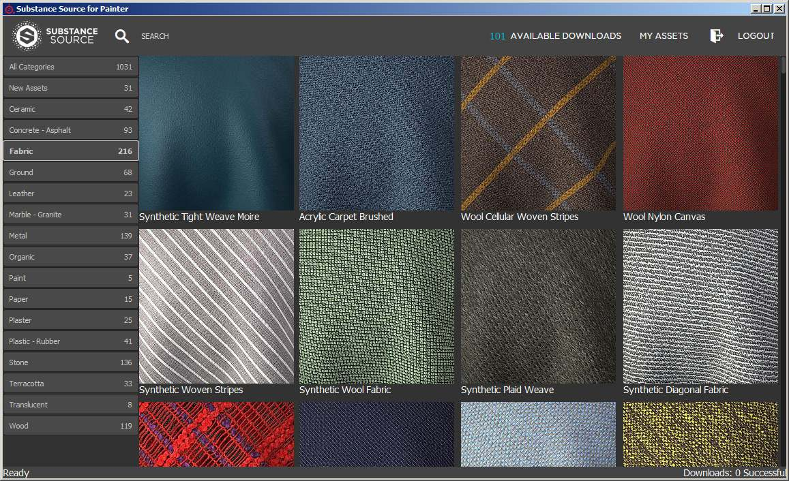

# Version 2017.1

Substance Painter ändert seine Versionsnummer im Anschluss an das neue Substance-Angebot. Weitere Informationen finden Sie unter: <https://www.allegorithmic.com/welcome-to-substance>\
In dieser neuen Version wollten wir uns auf den Inhalt konzentrieren, indem wir ein neues Plug-in bereitstellen, das es ermöglicht, Substance Source zu durchsuchen und Material direkt in das Regal zu importieren. Wir haben auch eine Menge neuer Elemente hinzugefügt, um deine kreativen Möglichkeiten zu erweitern.

Freigabedatum : *20. Juni 2017*

## Wichtigste Funktionen

### Neues Plug-in : Substance Source

Mit diesem neuen Plug-in ist es jetzt möglich, **direkt unsere Materialdatenbank** Substance Source **zu durchsuchen** und diese **direkt in das Regal** herunterzuladen, einsatzbereit und bereit für die Arbeit an Ihren Projekten.\
Um die Substance Source zu öffnen, klicken Sie einfach in der Hauptsymbolleiste **der Anwendung auf das Substance Source-Logo**. Dadurch sollte ein neues Fenster geöffnet werden, in dem Sie die Bibliothek durchsuchen können.

{width="650px"}

### Neue Inhalte : Alphas, Prozeduren, Filter und mehr

In dieser neuen Version fügen wir **mehr als 300 neue Assets** hinzu. Wir haben **sci-fi**, **geometrisch**, **mittelalterlich** oder sogar **keltisch** Themeninhalte in den Alphaten hinzugefügt. Sie enthält auch viele **neue Pinsel** und **gescannte Handabdrücke/Fingerabdrücke**. Wir stellen außerdem einige praktische neue Filter bereit, z. B. den **MatFX-Detailfilter**, mit dem **Kratzer** direkt **aus den normalen Informationen** generiert werden können, die auf Ihr Gitter gemalt wurden.

Hier ist die Liste der neuen Inhalte :

* **4 Neue Schriftarten** (Japanisch, vereinfachtes Chinesisch, Schreibmaschine, Segment)
* **230 Neue Alphas** (Mischung aus Mustern und gescannten Bildern)
* **50 New Procedurals** (Meist Stoffmuster für mittelalterliche und zeitgenössische Kleidung)
* **2 Neue Umgebungskarten** (Mondarrain und Villa Nova Street)
* **9 Neue Filter** (MatFX-Detailfilter, Edge Wear, HBAO usw.)

Wir haben auch einige der vorhandenen Assets aktualisiert, damit sie besser funktionieren, z. B. die **Standardumgebungszuordnung**, die jetzt **weniger gelb aussieht:**

## Tutorial

Die neuen Inhalte werden in unserem neuesten Video-Tutorial behandelt:

## Versionshinweise

### 2017.1

(Release 20. Juni 2017)

**Hinzugefügt:**

* [Plug-in] Neues Substance Source-Plug-in (ermöglicht das Herunterladen von Elementen im Shelf)
* [Shelf] 4 neue Schriftarten (Japanisch + vereinfachtes Chinesisch, Schreibmaschine, Segment)
* [Shelf] 230 Neue Alphas (Mischung aus Mustern, Pinseln und Fingerabdruckscans)
* [Regal] 50 Neue Prozedurale (Stoffmuster mittelalterlicher und zeitgenössischer Kleidung)
* [Shelf] 2 Neue Umweltkarten (Mondarrain und Villa Nova Street)
* [Shelf] 9 Neue Filter (MatFx Detail Edge Wear, Clamp, HBAO, etc.)
* [Shelf] Verbesserte standardmäßige Panorama-Umgebungszuordnung
* [Shelf] Neue Arnold 5-Exportvorgaben
* [Skripterstellung] Importieren der Ressource in den Shelf zulassen

**Bekanntes Problem :**

* [Exportieren] Die Bearbeitung einer Exportvorgabe ist sehr langsam
