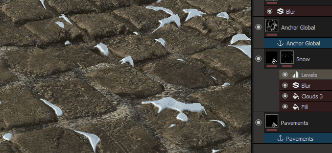

# Version 2017.2

Mit **Substance Painter 2017.2** wird eine neue leistungsstarke Funktion über das Ankerpunktsystem eingeführt. Es ermöglicht die Erstellung erweiterter Konfigurationen im Ebenenstapel, was viele neue Möglichkeiten eröffnet.

Freigabedatum: *27. Juli 2017*

## Wichtigste Funktionen

### Effekt &quot;Neuer Ankerpunkt&quot;

**Ein neuer Effekttyp** wurde dem Substance Painter hinzugefügt. Neben den bereits vorhandenen Effekttypen **Filter** und **Ebene** finden Sie jetzt den neuen **Ankerpunkt**. Mit diesem neuen Effekt können Sie einen **Speicherort** im **Ebenenstapel** definieren, auf den dann **verwiesen** für den Rest des Projekts in allen anderen Ebenen verwendet werden kann. So kannst du z. B. die Height-Informationen einer Ebene in die Maske einer Ebene direkt darüber einfügen, um eine natürlichere Überblendung zu ermöglichen (siehe GIF oben).

Da der Anker als Effekt fungiert, kann in **vielen Situationen** erstellt werden: den **Inhalt** einer Ebene, die **Maske** und sogar als **Pass-Through**-Filter. Der Effekt funktioniert auch, wenn die Ebene, in der er sich befindet, deaktiviert ist. Beachten Sie, dass der Anker nur einen Speicherort definiert, nicht den, den Sie daraus abrufen können. Diese Informationen werden an der Stelle definiert, an der der Verweis auf den Anker erstellt wird.

Weitere technische Einzelheiten und Beispiele finden Sie auf der entsprechenden Seite: [Ankerpunkt](../../features/effects/anchor-point.md)

### Verschiedene neue Verbesserungen

Neben dem neuen Ankerpunkt-Effekt arbeiteten wir auch an folgenden Themen:

* Die Möglichkeit, einige Effekte umzubenennen, wie z. B. die Füllung und die Farbe
* Neue Skriptfunktionen, die das Erstellen einer Live-Verknüpfung mit anderen Anwendungen wie Unity ermöglichen

## Tutorial

Die neuen Funktionen werden in den neuesten Videos ausführlich erläutert:

## Versionshinweise

### 2017.2

(Release 27. Juli 2017)

**Hinzugefügt:**

* [Effekt] Neuer Ankerpunkt, der Ebenen- und Maskenreferenzen zulässt
* [Ebenen] Möglichkeit, Füll- und Maleffekte umzubenennen
* [Plug-In] Aktualisiertes Substance Source-Plug-In
* [Scripting] Abfragen der Textursatz-Auflösung zulassen
* [Scripting] Ermöglicht das Abrufen des Status der Painting-Engine
* [Leistung] Verbessertes Laden des Projekts und Optimieren des Pinselstempels

**Fest:**

* [Tool] Leistungsprobleme beim Anpassen von Materialparametern
* [Engine] Verschwindende Pinselstriche bei Änderung der Auflösung (4K>2K)
* [3D-Ansicht] Tangentialraum wird nicht mit Bäckereien synchronisiert
* [Shelf] Der Shelf-Pfad in den Benutzerdokumenten wird nicht automatisch erstellt
* [Shelf] Kompatibilität von Vorgaben mit früheren Versionen nach einem Update
* [Shader] Nicht-PBR-Shader funktioniert nicht mehr
* [Bäcker] ID-Zuordnungssicherung schlägt fehl, wenn &quot;Mit Namen abgleichen&quot; aktiviert ist
* [Beispiel] Beispielprojekt &quot;Matte treffen&quot; Textursatz-Namen sind falsch
* Beim Speichern eines Projekts vor dem Erstellen einer Vorlage werden Schreibberechtigungsfehler zurückgegeben.
