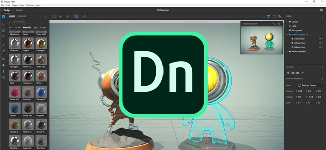
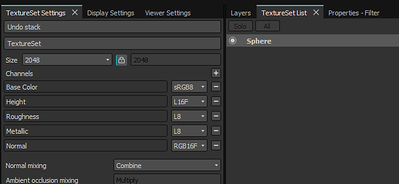

# Version 2017.3

**Substance Painter 2017.3** konzentriert sich auf neue erweiterte Exportvoreinstellungen mit Unterstützung von **Adobe Project Felix** und dem offenen Format **glTF**. Diese neue Version konzentriert sich auch auf das Benutzererlebnis, indem die Benutzeroberfläche verbessert und ein automatisch gespeichertes Plug-in hinzugefügt wird.

Freigabedatum: *28. September 2017*

## Wichtigste Funktionen

### Adobe Standard Material-Exportvorgabe

Einer der neuen Exporteure, die in dieser Version enthalten sind, ist die Unterstützung für Adobe-Standardmaterialien, die mit Adobe Dimension (früher Adobe Project Felix) verwendet werden sollen. Sie können das Szenengitter und seine Texturen exportieren, um sie mit einem Klick in Project Felix zu importieren. Um darauf zuzugreifen, wählen Sie einfach &quot;**Adobe Standard Material**&quot; im Fenster &quot;Texturen exportieren&quot; aus. Weitere Informationen finden Sie unter: [http://www.adobe.com/products/dimension.html](https://www.adobe.com/products/dimension.html)

Sie können auch unseren Blogpost darüber lesen: <https://www.allegorithmic.com/blog/new-dimension-substance-ecosystem>

### glTF 2.0-Exportvorgabe

Wir haben außerdem Unterstützung für das Dateiformat **glTF** mit dem Export des **Szenengitters** und der **PBR-Texturen** (Metallisch/Raueit) hinzugefügt. Um darauf zuzugreifen, wählen Sie einfach &quot;**glTF PBR Metal Roughness**&quot; im Fenster &quot;Exporttexturen&quot; aus. **glTF** ist ein Open-Source-Dateiformat, das von der Gruppe Khronos geleitet wird. Sie können Ihre glTF-Datei in **Windows 10** anzeigen oder einfach einen WebGL-Viewer wie [**Babylon**](http://sandbox.babylonjs.com/) verwenden.

Weitere Informationen finden Sie unter: <https://github.com/KhronosGroup/glTF>

### Plug-in für automatische Speicherung

In dieser Version wurde auch ein neues Plug-In hinzugefügt, mit dem **Sicherungen** des derzeit geöffneten Projekts erstellt werden können. Es wird eine Sicherungsdatei auf der Seite des derzeit geöffneten Projekts erstellt.\
Aus diesem Grund haben wir auch den Eintrag &quot;**Als Kopie speichern**&quot; im Menü &quot;Datei&quot; hinzugefügt. Das **automatische Speichern** kann gestoppt werden, indem das Plug-In selbst deaktiviert wird. Auf die **Einstellungen** kann über den Konfigurationsbereich **&#x200B;**&#x200B;zugegriffen werden. Wenn die Warnungszeitverzögerung erreicht ist, wird eine **Fortschrittsleiste** unter der Schaltfläche in der Hauptsymbolleiste angezeigt, die es ermöglicht, bei Bedarf einige Minuten lang zu schnüffeln (praktisch, wenn Sie vor der Sicherung etwas fertigstellen möchten).

Wenn eine Sicherung erstellt wird, das Projekt aber nicht gespeichert wurde (auch Untilted genannt), wird die Sicherung im Ordner **Documents/Allegorithmic/Substance Painter/autosave** gespeichert. Andernfalls befindet sich die Sicherung neben dem Projekt selbst (es sei denn, der Pfad wird vom Konfigurationsbereich überschrieben).

### Verbesserter Verlaufsfilter

Der **Verlaufsfilter** wurde vollständig überarbeitet. Die Funktion ähnelt der des **Verlaufsumsetzung**-Knotens, der in **Substance Designer** verfügbar ist. Es unterstützt jetzt bis zu **10 verschiedene Farben**, mit der Möglichkeit, **anzugeben, wo sich die Farbe innerhalb** des Farbverlaufs **&#x200B;**&#x200B;befindet, und damit viele neue Türen zu öffnen. Dadurch können weitere **erweiterte Farbmuster**, aber auch **Relaishöhenzuordnungen**&#x200B;erstellt und **neue Formen**&#x200B;erstellt werden.

Der Hauptregler (Farbmenge) legt die Anzahl der Gesamtfarben fest, die zum Erstellen des Verlaufs verwendet werden. Die Schaltfläche direkt unten definiert den Farbüberblendmodus (sRGB oder Linear). Dies ist wichtig, wenn Sie eine ordnungsgemäße Überblendung zwischen Farben haben möchten. Wenn Sie beispielsweise ein reines Rot und ein reines Grün mischen, erhalten Sie dazwischen ein schönes Gelb. Dies ist nicht der Fall, wenn die Schaltfläche deaktiviert ist (stattdessen wird dunkelbraun angezeigt). Wenn Sie das Height oder andere Graustufenkanäle neu zuordnen, sollte diese Schaltfläche deaktiviert sein, um eine Gamma-Konvertierung zu vermeiden.

Über die Schaltfläche oben kann das Ergebnis des Filters durch den Verlauf selbst ersetzt werden, um den Verlauf in der 2D-Ansicht darzustellen.

### Verbesserungen der Benutzeroberfläche und des Verhaltens

In dieser Version befinden sich die **Registerkarten** der verschiedenen Docks der Anwendung jetzt **oben anstatt unten** in ihren jeweiligen Fenstern. Diese Auswahl wurde getroffen, um die Lesbarkeit der Benutzeroberfläche zu verbessern, aber auch, um mit anderen Anwendungen konsistenter zu sein. Nach dieser Änderung folgt die Einführung des **kleinen Kreuzes** neben dem Registerkartentitel, um es **einfach zu schließen**. Es ist auch möglich, **mit der rechten Maustaste** auf die Registerkarte zu klicken, um ein **Kontextmenü** aufzurufen (mit dem Sie das Fenster schließen oder abdocken können). Um das Fenster abzudocken, ziehen Sie die Registerkarte einfach aus dem Fensterbereich heraus.

Es ist jetzt auch möglich, **Projekte** zu öffnen, indem Sie sie einfach **per Drag &amp; Drop aus dem Datei-Explorer in den Viewport** ziehen. Dies funktioniert auch mit **mesh**-Dateien: Durch Ziehen und Ablegen einer Gitterdatei in einem **leeren Viewport** wird das **neue Projektfenster** geöffnet. Wenn Sie dies jedoch in einem **bereits geöffneten Projekt** tun, wird das **Projektkonfigurationsdialogfeld** geöffnet, sodass ein Gitter schnell **aktualisiert werden kann**.

**Hinweis** : Wenn Sie Probleme mit dem Ziehen und Ablegen haben, stellen Sie sicher, dass Sie [unsere FAQ zum Thema](../../technical-support/technical-issues/miscellaneous-issues/impossible-to-drag-and-drop-files-into-the-shelf.md) überprüfen.

### Geschwindigkeitssteigerungen

Diese Version von Substance Painter bietet außerdem eine neue, deutliche Leistungsverbesserung für die Verwaltung des GPU-Speichers (VRam). Einheitliche Farben (wie z. B. Füllebenen) werden jetzt in kleinere Texturen komprimiert, wodurch ihre Übertragung zwischen dem Hauptspeicher und dem GPU-Speicher beschleunigt wird, aber auch ihr Speicherbedarf und ihre Berechnungszeit reduziert werden. Dies sollte besonders beim Öffnen großer Projekte und beim Erreichen der Grenzen des GPU-Speichers sichtbar sein.

## Versionshinweise

### 2017.3.3

(Release 01. Dezember 2017)

**Fest:**

* [Steam] Popup zur Versionsprüfung sollte beim Start nicht sichtbar sein
* [Exportieren] Beim Öffnen von PSD-Dateien in Photoshop CS6 sind die Gruppen gesperrt

### 2017.3.2

(Release 20. November 2017)

**Hinzugefügt:**

* [UI] Dialogfeld &quot;Neue Version verbessern&quot; und Änderungsprotokoll hinzufügen
* [UI] Geben Sie an, ob die Wartung im Dialogfeld &quot;Neue Version&quot; abgelaufen ist
* [Lizenz] Aktualisieren Sie das Lizenzsystem, um Wartungsdaten zu verarbeiten.
* [Exportieren] Adobe-Standardmaterial in Adobe Dimension umbenennen

**Fest:**

* [Mac] Malerei führt zu schwarzen Quadraten und Beschädigungen der Textur
* [Engine] Cache kann im Viewport manchmal verschwinden
* [Engine] Blockige Artefakte werden angezeigt, wenn der Speicherkomprimierungsauslöser aktiviert wird
* [Backen] Seltsame Fehlermeldungen beim Backen bestimmter Gitter
* [Exportieren] PSD werden falsch geschrieben und von Photoshop nicht richtig erkannt
* [Ebenen] Ebenen sollten nicht projektübergreifend kopiert/eingefügt werden können.
* [Substance] UserData-Farbraum für normale Eingabe wird in einigen Fällen gespiegelt
* [Shelf] Mikronormale in Generatoren erzeugen invertierte Krümmung
* [Shelf] HSL-Filter wirken sich auch auf den Alphakanal aus.
* [Linux] Installation auf Centos schlägt aufgrund fehlender Abhängigkeiten fehl.
* Das Installationsprogramm entfernt in bestimmten Fällen nicht alle Ressourcen aus der vorherigen Installation

### 2017.3.1

(Release 26. Oktober 2017)

**Hinzugefügt:**

* [Exportieren] Exportieren des Gitters aus einem Projekt zulassen
* [Shelf] Entfernen Sie &quot;Sub-Shelf&quot; aus den Registerkartentiteln.
* Einstellungen für die Nachbearbeitung in Vorlagen speichern
* Die TDR-Meldung verständlicher machen
* Fenster &quot;Einstellungen&quot; verbessern, um Fehler zu melden

**Fest:**

* Absturz beim Löschen mehrerer Unterböden
* Absturz beim Umschalten von einem Level auf einen anderen während einer Motorberechnung
* [Mac] Absturz auf der Intel-GPU während der Engine-Berechnungen
* [Mac]&#x200B;[Viewport] Fehlerhafte Bewegungen, wenn Dithering aktiviert ist
* [Mac] MacOS 10.13 wird in der Protokolldatei als &quot;Unbekannte Version&quot; erkannt
* [Bäcker] Backen mit einem Käfig funktioniert nicht mehr
* [Ebenen] Strg + C (Aktion kopieren) funktioniert nicht mehr
* [Ebenen] Beim Einfügen von Ebenen wird die Benutzeroberfläche mit Ankerreferenzen nicht aktualisiert
* [Anker] Duplizieren oder Kopieren/Einfügen der Ebene mit Referenzen unterbricht Verknüpfungen
* [Export] 8K-Export kann in einigen Fällen einen Absturz oder eine Deadlock-Anwendung verursachen
* [Export] Mehrere Probleme im generierten glTF-Dateiformat
* [Importieren] Das erneute Importieren eines Gitters mit demselben Dateinamen funktioniert nicht mehr
* [Plugin] Fenster zum automatischen Speichern wird immer über allem angezeigt
* [UI] Endlose Schleife, wenn Sie im TDR-Dialog &quot;Escape&quot; drücken
* [UI] UI zurücksetzen zeigt eine zweite Titelleiste im Shelf-Fenster an

### 2017.3

(Release 28. September 2017)

**Hinzugefügt:**

* [Exportieren] Exportieren von Gittern und Texturen für Adobe Project Felix
* [Exportieren] Export in das glTF-Dateiformat zulassen
* [Engine] Optimieren der Texturgröße im VRAM mithilfe der Blockkomprimierung
* [Viewport] Sie können ein Gitter oder Projekt im Viewport ziehen und ablegen.
* [UI] Verbessern der Warnmeldung bei TDR
* [UI] Protokoll sollte nur auf Anfrage angezeigt werden
* [UI] Inhalt des Protokollfensters löschen
* [UI] Anzeigen von Warnungen und Fehlern in der Statuszeile
* [UI] Registerkarten oben anzeigen wie in Webbrowsern
* [UI] Verbessern des Kontexts und der Nachrichten, die nicht bearbeitet werden können
* [UI] Aktion &quot;Als Kopie speichern&quot; im Dateimenü hinzufügen
* [Ebene] Legen Sie die Standardeinstellung für die Kachelung standardmäßig auf 1 fest.
* [Shelf] Verbesserter Verlaufsfilter zur Unterstützung von 10 dynamischen Farben
* [Shelf] Fügen Sie in der Standardabfrage des Mini-Shelf ein Leerzeichen hinzu
* [Shelf] Hinzufügen einer Aktion &quot;In Explorer öffnen&quot; für lokale Ressourcen im Shelf
* [Shelf] Vorlage und Shader für Adobe Material Standard hinzufügen (Project Felix)
* [Shelf] Erhöhen der maximalen Kachelung auf 128 in den Materialschichtschattierungen
* [Shelf] Zusätzliche Sobelkrümmung für Mikrodetails von Maskengeneratoren
* [Plug-in] Plug-in zum automatischen Speichern mit anpassbarem Zeitintervall hinzufügen
* [Skripterstellung] Hinzufügen einer Funktion zum Speichern als Kopie

**Fest:**

* [UI] Layout wird beim ersten Start beschädigt
* [Exportieren] Beim Exportieren generierte PSD weisen Formatfehler auf
* [Exportieren] EXR exportiert immer 8-Bit-Height-Map
* [Export] Absturz beim Exportieren beschädigter zusätzlicher Maps
* [Importieren] Harte Kanten werden in einigen Fällen bei Maschen mit niedrigem Poly-Wert nicht beibehalten.
* [Import] Verbesserte Fehlermeldungen beim Importieren von Netzen mit Problemen
* [Bäcker] ID-Zuordnungssicherung schlägt fehl, wenn &quot;Mit Namen abgleichen&quot; aktiviert ist
* [Viewport] Der Tangent-Bereich wird nicht mit Bäcker synchronisiert
* [Effekt] Das Zurückverschieben einer Ebene stellt die Referenz eines Ankers nicht wieder her.
* [Effekt] Aktualisierungsproblem beim Erstellen einer Verknüpfung zwischen zwei Masken mit Ankern
* [Effekt] Maskenanker über der Maske sollten nicht aufgeführt werden
* [Effekt] Die Einstellung &quot;Alpha aus Ankern extrahieren&quot; funktioniert nicht
* [Engine] Maske kehrt sich nach dem ersten Pinselstrich um
* [Engine] Absturz beim Wechseln des Textursatzes für ein bestimmtes Projekt
* [Shelf] Absturz beim Löschen einer Vorgabe, die sich in einem Projekt befindet
* [Shelf] Typo im erweiterten Tri-Planar Filter
* [Shelf] MG Mask Builder AO Noise Scale funktioniert nicht richtig
* [Shelf] MG Mask Builder hat umgekehrte Krümmungsparameter
* [Shelf] Importierte Alphas erzeugen eine Materialkugel-Vorschau anstelle einer flachen Vorschau
