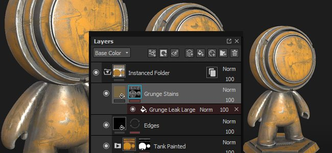

# Version 2017.4

**Substance Painter 2017.4** fügt ein neues Workflowfeature mit **Ebeneninstanzierung** hinzu, das das einfache Synchronisieren von Ebenen über verschiedene Textursätze innerhalb eines Projekts ermöglicht.

Freigabedatum: *23. November 2017*

## Wichtigste Funktionen

### Ebeneninstanzierung

Die **Ebeneninstanzierung** ist ein neues System, mit dem **synchronisierte** Ebene **Parameter** in **anderen Ebenen und Textursätzen** beibehalten werden kann. Beim Erstellen einer Ebeneninstanz wird die Originalebene zur **Quelle** und die Instanzen bleiben **aktualisiert**, es sei denn, die Verknüpfung zwischen ihnen ist unterbrochen. Instanzierte Ebenen sind eine **großartige Möglichkeit**, ein Element mit wenigen Klicks **zu strukturieren** und nicht hin- und herzuwechseln, um Ebenen zu aktualisieren. Um ein Element einfach zu texturieren, **instanziieren Sie einfach einen Ordner** über andere Textursätze und legen Sie ein Smart-Material oder eine andere Ebene hinein, er wird überall **repliziert**, und zwar sofort.

Es gibt zwei Möglichkeiten, eine Instanz zu erstellen:

* Wählen Sie nach dem Kopieren einer Ebene &quot;**Als Instanz einfügen**&quot; aus (oder drücken Sie STRG+UMSCHALT+V).
* Wählen Sie nach Auswahl einer Ebene &quot;**instanziieren über Textursätze**&quot; (oder verwenden Sie die Tastenkombination STRG+UMSCHALT+D)

>[!NOTE]
>
> Es gibt einige Einschränkungen in Bezug auf die Ebeneninstanzierung:
> 
> * Alle Malaktionen werden nur auf der Quellebene ausgeführt, instanzierte Ebenen replizieren keine Pinselstriche.
> * Ankerreferenzen müssen den Ankerpunkt auf derselben Ebene der Instanz haben. Ein Ankerpunkt darf sich nicht außerhalb eines instanzierten Ordners befinden, da er sonst beschädigt wird.
> * Wenn ein Smart-Material mit instanzierten Ebenen gespeichert wird, muss sich die Quellebene im Ordner &quot;Smart-Material&quot; befinden, andernfalls wird die Instanzverknüpfung unterbrochen.
> * Je nach Einstellung des Ebenenstapels können instanzierte Ebenen einen Zyklus erstellen, der nicht unterstützt wird und das Ergebnis der Instanz beschädigt. Lösche oder verschiebe die Instanz, um das Problem zu beheben.

Weitere Einzelheiten und Beispiele finden Sie auf der entsprechenden Seite: [Ebeneninstanzierung](../../interface/layer-stack/layer-instancing.md)

### DCC Live-link mit Unreal Engine 4 Unterstützung

Die Betaversion unseres **Live-Link-Plug-ins** wurde jetzt **in den Substance Painter integriert**. Wir haben die Gelegenheit genutzt, um die Unreal Engine 4 zu unterstützen, die es nun ermöglicht, das Ergebnis eines Projekts automatisch in der Engine zu sehen.

Um die Anwendung mit der **Unreal Engine 4** (Version **4.18** erforderlich) zu verbinden, laden Sie die Substance-Plug-ins hier herunter: 4<https://www.unrealengine.com/marketplace/substance-plugin>

### Neuer Inhalt der Ablage

Wir haben **20 neue prozedurale Materialien** hinzugefügt und **40 neue Schmutz Maps** hinzugefügt (wobei einige davon prozedurale Elemente sind). Die neuen Materialien sind im Abschnitt &quot;**Materialien**&quot; des **Regals** zu finden, z. B. die 6 neuen Metalle, die 8 neuen Kunststoffe, einige Stoffe und 2 neue Holzoberflächen. Die neuen Schmutz Maps befinden sich direkt im Abschnitt &quot;**Schmutz**&quot; des **Shelf**.

Vielen Dank an Clément Feuillet und Nicolas Longchamps, die uns die Lizenzierung ihrer Inhalte für diese neue Version ermöglicht haben.

### Verbesserter Sketchfab-Export

Wir haben unseren Sketchfab-Export aktualisiert und die Möglichkeit hinzugefügt, Ihr Projekt als Entwurf zu veröffentlichen und sogar bereits hochgeladene Projekte zu aktualisieren. Dadurch sollten Iterationen von Projekten wesentlich einfacher zu erledigen sein.

### Geschwindigkeitssteigerungen

Wir setzten unsere Arbeit in Bezug auf Leistungsverbesserungen fort. In dieser neuen Version haben wir einen großen Teil unseres OpenGL-Renderings in den Viewports überarbeitet, was einen schönen Geschwindigkeitsschub geben sollte. Außerdem haben wir die Art und Weise verbessert, wie Pinselstriche berechnet werden, und sie sollten viel weniger größere Texturberechnungen im Speicher erfordern. Insgesamt wird es viel schnellere Ergebnisse und bessere Malempfindungen geben.

## Tutorial

Die neuen Funktionen werden in den neuesten Videos ausführlich erläutert:

## Versionshinweise

### 2017.4.2

(Release 24. Januar 2018)

**Hinzugefügt:**

* [Export] Erhalten Sie den Status eines Exports mit Schrittfortschritt
* [Exportieren] Abbrechen eines Exports zulassen
* [Exportieren] Exportieren von Texturen nach Sketchfab, ohne die normale Kartenqualität zu verlieren
* [Export] Export im glTF-Binärformat (glb)
* [Export] Zulassen der Spaltengrößenänderung auf der Registerkarte &quot;Konfiguration&quot; des Exportfensters
* [Shader] Fügen Sie ein Änderungsprotokoll für den Shader-API hinzu
* [Scripting] Hinzufügen von Vorher- und Nachher-Rückruffunktionen beim Exportieren von Texturen
* [Iray] Upgrade auf SDK 2017.1 (Unterstützung für Volta-GPUs)

**&#x200B;**&#x200B;Fest:**&#x200B;**

* Absturz beim Beenden der Anwendung, bevor das Hauptfenster angezeigt wird
* [MAC] Absturz beim Laden von Graustufenzuordnungen mit IRAY
* [MAC] VRAM-Erkennung ist mit dem neuen High Sierra OS nicht korrekt
* [Plug-In] Das Herunterladen von Assets aus Substance Source funktioniert nicht mehr
* [Scripting] Falsche Erkennung der Mindestversion des Plug-ins
* [Export] Exportvorgabe kann nach dem Exportieren von Texturen nicht gespeichert werden
* [Instanz] Problem mit Generatoren, die in einem TextureSet ohne zusätzliche Karten instanziiert werden
* [Viewport] Dithering funktioniert nicht mit einer Auflösung über 4k
* [Viewport] Die Materialanzeige in 2D-Ansicht ist geräuschvoll.
* [Shelf] Verbessern der Ladezeit für Shelf-Vorgaben
* [Engine] Falsche Füllmethode beim Malen unter Farbauswahl

### 2017.4.1

(Release 15. Dezember 2017)

**Hinzugefügt:**

* [Scripting] Exportieren des Mesh über die Scripting-API
* [Importieren] Import von nicht unterstütztem Gitterdateiformat deaktivieren (nur obj, fbx, date, layer zulassen)
* [Log] Präzisere Angabe des TDR-Problems in der Protokolldatei

**Fest:**

* Absturz, wenn die Anwendung geschlossen wird, bevor das Crawlen der Ressourcen abgeschlossen ist
* Absturz beim Öffnen von Projekten mit dem Verwischen-/Klonen-Werkzeug
* Absturz bei Verwendung von &quot;Wiederholen&quot; nach einem Rückgängigmachen einer Shader-Änderung in den Anzeigeeinstellungen
* [Engine] Texturierung unterscheidet sich zwischen Painter 2017.2 und 2017.4
* [Viewport] Wenn Sie eine ID-Karte aus einer Instanz auswählen, wird die falsche Farbe angezeigt.
* [Export] Absturz beim Exportieren einer ungültigen Normalstruktur oder Verdeckung-Textur
* [Exportieren] Beim Öffnen von PSD-Dateien in Photoshop CS6 sind die Gruppen gesperrt
* [Plugin] Photoshop Plugin ignoriert die Kanalauswahl und exportiert immer alles
* [Ebenen] Anker brechen beim Kopieren/Einfügen über Textursätze hinweg ab
* [Ebenen] Einige Ankerreferenzen können nicht wiederhergestellt werden, wenn sie beschädigt sind
* [Shader] pbr-beschichteter Parameter für sekundäre Raueit ist defekt
* [Steam] Popup zur Versionsprüfung sollte beim Start nicht sichtbar sein

**Bekannte Probleme:**

* [AMD] Absturz/Einfrieren beim Malen auf einem Gitter. Kann mit einem GPU-Treiber-Update behoben werden.

### 2017.4

(Release 23. November 2017)

**Hinzugefügt:**

* [Instanz] Parameter über Ebenen hinweg instanziieren
* [Instanz] Erlaubt das Wechseln zwischen einer Quellebene und einer Instanz.
* [Instanz] Hinzufügen einer Aktion &quot;Instanziieren über Textursätze hinweg&quot;
* [Instanz] Zeigen Sie im Ebenenstapel erneut eintretende Instanzen (Zyklen) an.
* [Instanz] Instanzen löschen, wenn eine Quelle entfernt wird
* [Instanz] Verweise auf Anker von außerhalb eines instanzierten Ordners nicht zulassen
* [UI] Verschieben Sie den Rückgängig-Stapel in ein eigenes Fenster namens &quot;Verlauf&quot;.
* [Plug-In] DCC-Live-Link-Plug-In integrieren
* [Engine] Verbessern der Malleistung mit Sparse-Malerei
* [Exportieren] Optionen für Entwürfe und Re-Exporte zum Sketchfab-Exporteur hinzufügen
* [Shelf] Hinzufügen einer &quot;Flip&quot;-Steuerung für Schriftsubstanzen
* [Regal] 20 neue Verfahrensmaterialien hinzufügen
* [Shelf] 40 neue Grunges Maps hinzufügen (Bitmap-basiert und prozedural)
* [Viewport] Aktivieren von Kollisionen in der Pinselvorschau bei anderen sichtbaren Texturgruppen
* Mindestanforderungen für AMD GPU-Treiber aktualisieren

**Fest:**

* Absturz beim Berechnen von Substance mit zu großen Auflösungen
* Absturz beim starken Malen mit Partikeln
* [Viewport] Falsche Specular-Spiegelung in der 2D-Ansicht mit bestimmten Gittern
* [UI] Einige unerwünschte Aktionen werden im Protokollfenster angezeigt

**Bekannte Probleme:**

* [Ebenen] Einige Ankerreferenzen können nicht wiederhergestellt werden, wenn sie beschädigt sind
* Absturz bei Verwendung von &quot;Wiederholen&quot; nach einem Rückgängigmachen einer Shader-Änderung in den Anzeigeeinstellungen
