# Version 2018.1

Mit **Substance Painter 2018.1** wird eine brandneue Benutzeroberfläche mit vielen verbesserten Verhaltensweisen eingeführt. Auch die Leistungen wurden in vielen Bereichen verbessert.

Freigabedatum: *15. März 2018*

## Wichtigste Funktionen

### Neue Benutzeroberfläche und Verhaltensweisen

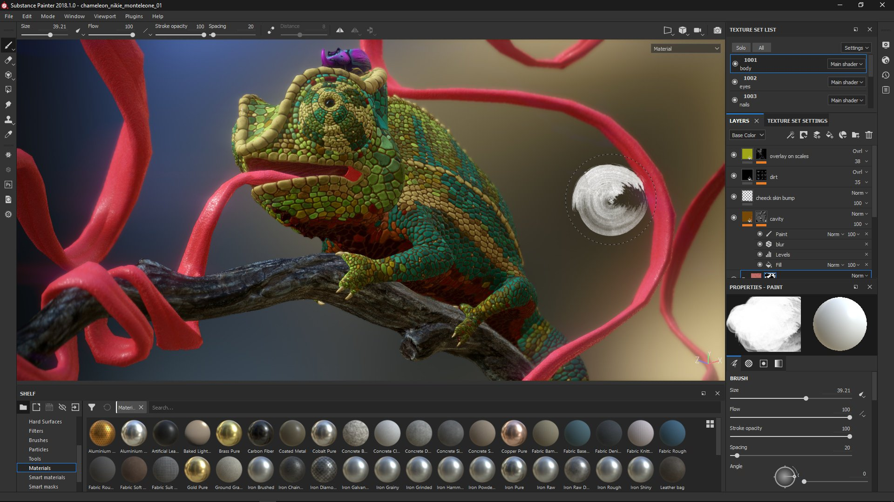{width="650px"}

Mit Substance Painter 2018.1 wird eine **vollständige Überarbeitung der Benutzeroberfläche** eingeführt, die von Farb- und Symbolen bis hin zu Widgetverhalten reicht.

* Die **neue Schnittstelle** konzentriert sich auf ein brandneues Design, das das Lesen erleichtert und die Navigation erleichtert.\
  Wir überarbeiteten alle unsere Icons, um sie deutlicher zu machen. Wir haben auch unser Farbschema überarbeitet, das jetzt einheitlicher sein sollte.\
  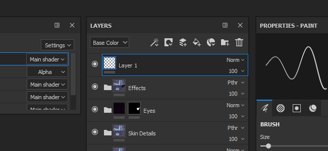
* Wir haben viele Widgets, insbesondere unsere **Regler**, verbessert, um **benutzerfreundlicher** zu sein, mit einem **Tablet-Stift**.\
  Sie können auf die Leiste klicken, um den Schieberegler zu verschieben, oder das Wertfeld verwenden, um die Zahlen präziser zu bearbeiten.\
  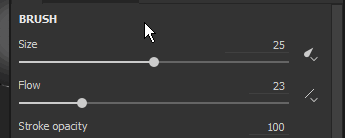 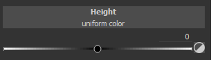
* Wir verfügen über eine **neue Symbolleiste**, mit der **Docks** im Handumdrehen geöffnet werden können.\
  Wenn Sie auf eine der Schaltflächen in der Symbolleiste klicken, wird das Dock neben der Schaltfläche angezeigt und schwebt über dem Rest der Benutzeroberfläche. Wenn Sie erneut auf die Schaltfläche klicken, wird sie geschlossen.\
  Wenn sich das Dock von seiner Schaltfläche entfernt, wird es zu einem normalen schwebenden Fenster, das in der Benutzeroberfläche angedockt werden kann. Wenn sie geschlossen wird, ist die Schaltfläche wieder in der Dock-Symbolleiste verfügbar.\
  Dieses neue Docksystem funktioniert einfacher mit dem Vollbildmodus. Es ist nicht mehr erforderlich, dass jedes Dock immer in der Benutzeroberfläche vorhanden ist.\
  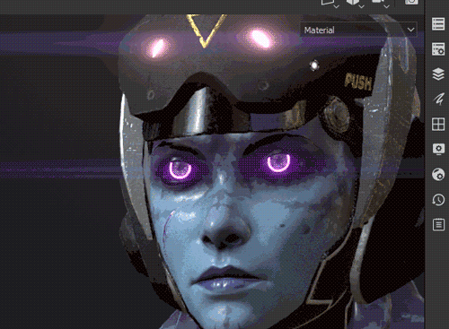
* Docks verwenden jetzt unser neues **Registerkarten-Layout**, das Elemente in Abschnitten organisiert, während gleichzeitig ein schneller Bildlauf in ihm möglich ist.\
  Dieses Registerkartenlayout erlaubt **große Fenster** und kann **alle Informationen** gleichzeitig anzeigen, im Gegensatz zu normalen Registerkartensystemen, die Informationen ausblenden.\
  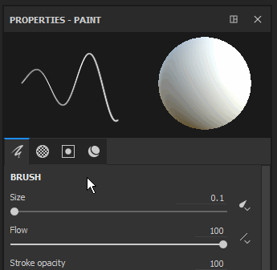 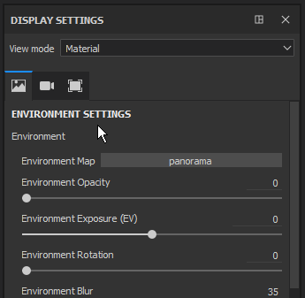 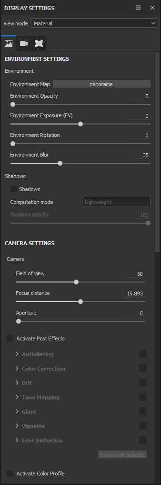
* Es ist jetzt ein **Schnellmenü** vorhanden, das **Werkzeugeigenschaften** direkt im Viewport **verfügbar macht.**\
  Klicken Sie zum Öffnen des Schnellmenüs einfach mit der rechten Maustaste auf den Viewport **.** Um das Schnellmenü **zu schließen**, klicken Sie **erneut in den Viewport**.\
  Das Menü wird nur geschlossen, wenn Sie in den Viewport klicken, sodass Ressourcen per Drag &amp; Drop aus dem Regal direkt in das Schnellmenü gezogen werden können.\
  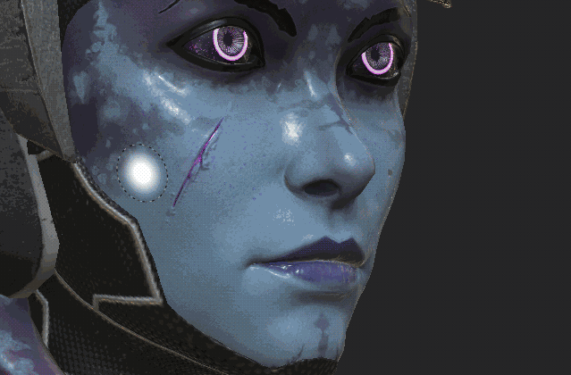
* Oben befindet sich jetzt eine neue **Kontextsymbolleiste** für den Viewport.\
  Diese Symbolleiste ändert ihre Parameter in Abhängigkeit vom aktuell verwendeten Werkzeug. Auf diese Weise können Sie schnell auf grundlegende Werkzeugfunktionen zugreifen (z. B. die Pinselgröße).\
  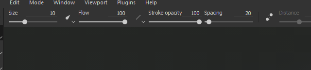
* Es ist jetzt möglich, **Effekte** mithilfe von **Ziehen und Ablegen** im **Ebenenstapel** neu anzuordnen.\
  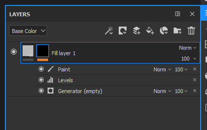
* Während Sie mit den Tastaturbefehlen &quot;**C**&quot; und &quot;**B**&quot; die **Kanal** und **Baking geführt Texturen** schnell in den **Viewport** anzeigen können, ist es jetzt möglich, die **vereinheitlichte Dropdown-Liste** zu verwenden, um die Anzeige des Viewports zu ändern.\
  Am **oberen rechten Rand** des **Viewports** befindet sich jetzt ein Dropdown-Menü mit **allen Kanälen und Mesh-Map** (zuvor Zusätzliche Karten). Diese vereinheitlichte Dropdown-Liste ist auch im Dock **Anzeigeeinstellungen** verfügbar.\
  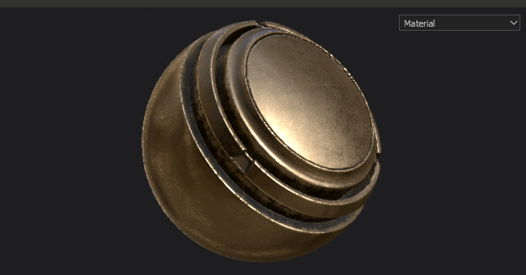
* Die **Anzeigeeinstellungen** und **Anzeigeeinstellungen** wurden **zusammengeführt** zu einem einzigen Dock.\
  **Die Einstellungen für Umgebung**, **Kamera** und **Viewport** sind jetzt **gruppiert**, während die **Shader**-Parameter **verschoben** in ein **dediziertes Dock** wurden.\
  Die Anzeigeeinstellungen nutzen jetzt das neue **Registerkarten-Layout**, um schnell durch das Fenster zu navigieren.\
  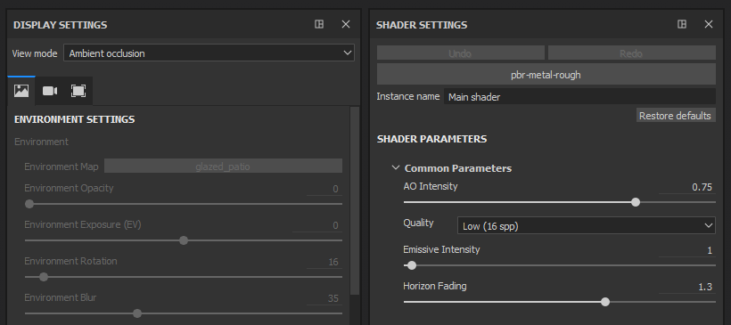

### Materialien und Smart-Materialien per Drag-and-Drop in den Viewport ziehen

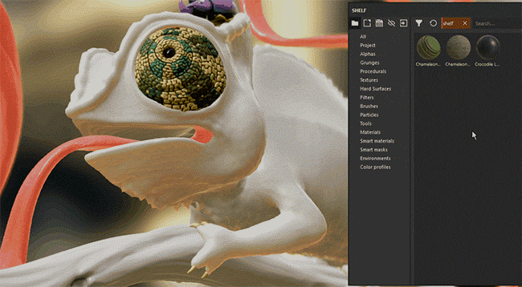{width="650px"}

Sie können jetzt **Materials und Intelligenten Materials von** direkt in den Viewport ziehen und ablegen ****.\
Durch diese neue Aktion wird **die Geometrie** des **Ziel-Textursatzes** gleichzeitig hervorgehoben. Dadurch werden die neuen Ebenen am oberen Rand des Ebenenstapels des Textursatzes erstellt.

### Verbessertes Verhalten von Tablet-Stiften

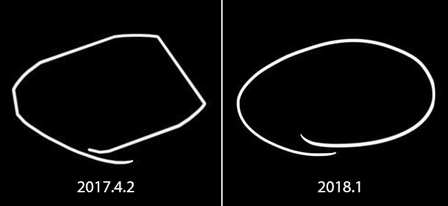

In dieser Version haben wir die Art und Weise verbessert, wie wir Grafiktablett-Stift-Bewegungen und Eingaben verarbeiten, insbesondere wenn Substance Painter unter einer großen Belastung ist.\
Wir verlieren die Eingaben nicht mehr, während wir aufeinander folgende Berechnungen durchführen. Dies sollte in allen Situationen präzise Pinselstriche ermöglichen.

### Verbesserte Innenabstände der Naht

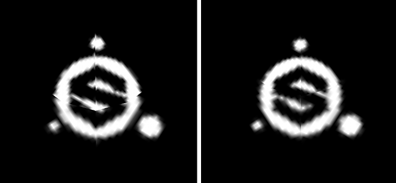

Wir haben die Art und Weise überarbeitet, wie wir Auffüllungen außerhalb der UV-Inseln generieren. Anstatt den aktuellen Pixel auf eine bestimmte Distanz zu erweitern, suchen wir nun nach dem benachbarten Pixel auf der anderen Seite der UV-Naht und interpolieren die beiden Werte.\
Dies führt zu einem viel besseren Endergebnis und reduziert die Sichtbarkeit der Teilung zwischen UV-Inseln, auch wenn die Textelverhältnisse nicht übereinstimmen.

<table>
<tr style="border: 0;">
<td style="border: 0;" valign="top">

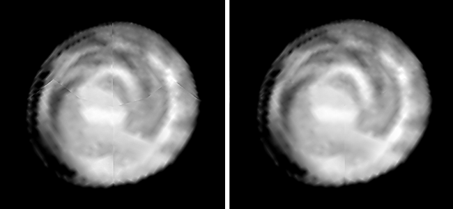{width="200px"}

</td>
<td style="border: 0;" valign="top">

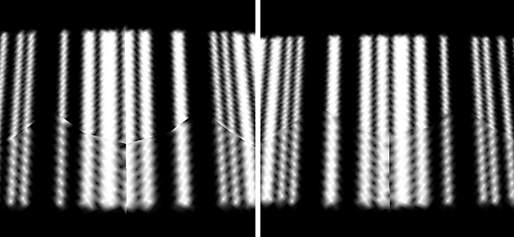{width="200px"}

</td>
</tr>
</table>

Dieser neue Abstand wird automatisch nach jedem Pinselstrich, jeder Änderung der Auflösung oder jeder Änderung der Ebene generiert.

### Verbesserte Leistung

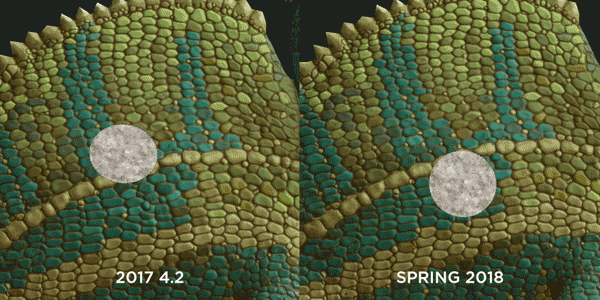{width="650px"}

Wir haben auch die Leistung in dieser Version auf mehreren Ebenen verbessert:

* Das Öffnen und Speichern von Projekten sollte etwas schneller als zuvor erfolgen.\
  Wir haben die Codierung/Decodierung unserer **Maldaten** überarbeitet. Dies betrifft insbesondere Projekte mit vielen Malen-Informationen (Pinselstriche).
* Wir unterstützen jetzt viele **Unterobjekte** mit Meshs.\
  Es ist nicht mehr zwingend erforderlich, einen Mesh zu einem Stück zusammenzufügen, bevor er in Substance Painter geladen wird. Die Leistung sollte auch bei **8000 Unterobjekten** in einem Projekt gut bleiben.
* Wir haben die Art und Weise geändert, in der **Viewport** **aktualisiert** wurde, um die Belastung der GPU beim Malen zu reduzieren.\
  Das bedeutet, dass wir nicht mehr das gesamte Bild aktualisieren, sondern eine kleine Region, in der Sie gerade arbeiten.\
  Sie können den Unterschied bei weniger leistungsstarken GPUs oder bei Verwendung einer hohen Sample-Anzahl in Ihrem Shader feststellen.
* Das System **Regal** ist jetzt **schneller, um** Ressourcen beim Starten der Anwendung zu erkennen.\
  Substance-Materialien mit eingebetteten Bitmaps sind **doppelt so schnell** zu erkennen (wenn sie als nicht-solid gekocht werden). **Vorgaben** sollten ebenfalls Verbesserungen sehen.

### Baker für die globale Szene

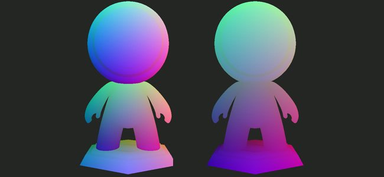

Wir haben jetzt eine neue Einstellung, die es ermöglicht, eine Positionskarte pro Textursatz Baking führen, die die Größe der gesamten Szene berücksichtigt.\
Mit diesem neuen Verhalten können Sie triplanare Projektionen in Maskengeneratoren verwenden, die über die gesamte Szene übereinstimmen, anstatt wie zuvor Nähte zu erstellen. Dies ist bei Projekten mit vielen Textursätzen (wie UDIM-basierten Projekten) wirklich nützlich.

Ändern Sie in den Positionsparametereinstellungen den Baker &quot;**Normalisierungsskala**&quot; von &quot;**Pro Material**&quot; in &quot;**Volle Szene**&quot;, um dieses neue Verhalten zu aktivieren.

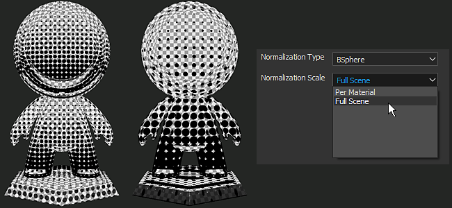

### Neuer Inhalt

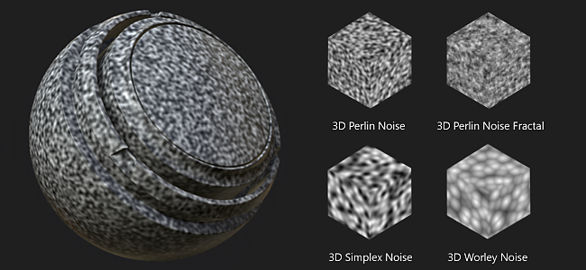

Wir haben in dieser Version auch einige neue Inhalte hinzugefügt:

* Neue **3D-Rauschen.**\
  Direkt aus Substance Designer importiert, wurden dem Standard-Regal 4 neue 3D- und völlig nahtlose Rauschen hinzugefügt.\
  Diese neuen Rauschen nutzen die Positionskarte des Projekts, um ein Ergebnis ohne Nähte zu generieren.
* **Nicht quadratische** Rauschen\
  Die Basisversionen wurden auf die neueste Rauschen von Substance Designer aktualisiert.\
  Dies bedeutet, dass die Funktion für nicht quadratische Erweiterungen jetzt in den Rauschen-Parametern verfügbar ist.
* Neuer Maskengenerator **3D Linear gradient.** Mit diesem neuen Maskengenerator können Sie einen linearen Verlauf in jede beliebige Richtung im 3D-Raum erstellen.\
  Die Richtung kann mit zwei 3D-Positionen definiert werden, die direkt auf der Positionskarte ausgewählt werden können.\
  Beispiel :

1. 
   1. Erstellen Sie den Maskengenerator **3D Linear gradient** in einer Ihrer Ebenen.
   1. Wechseln Sie die Anzeige des Viewports zu &quot;**Position**&quot; (über die Dropdownliste des Viewports oder mithilfe der Taste &quot;**B**&quot;).
   1. Klicken Sie auf den Parameter &quot;**3D-Positionsstart**&quot;, um das Popup **Farbwähler** zu öffnen.
   1. **Farbe** auf dem Mesh **im Viewport auswählen**
   1. Wiederholen Sie den Vorgang für den zweiten Parameter &quot;**3D Position End**&quot;.

      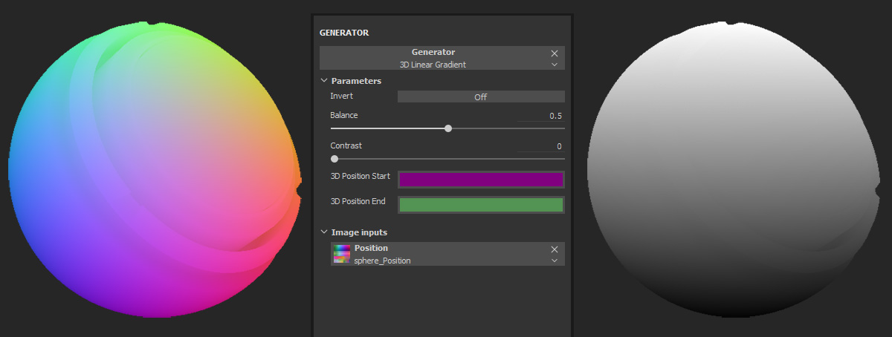

* Neue Vorlage **Lens-studio** (Einrasten Chat 3D-App).\
  Wir haben eine neue Vorlage, mit der Sie ganz einfach Projekte erstellen können, die auf die von Einrasten erstellte Lens-Studio-Anwendung abzielen.\
  Eine spezielle Shader- und Exportvorgabe ist ebenfalls verfügbar. Weitere Informationen zu Lens Studio finden Sie unter : <https://lensstudio.snapchat.com/>
* **Intelligenten Materials** und **Intelligente Masken** wurden mit der neuesten Version unserer Maskengenerator aktualisiert.\
  Unsere Smart-Vorgaben unterstützen jetzt alle die Funktion **micro details** , die mit **Ankerpunkten** verwendet werden kann.

### Neues Beispielprojekt

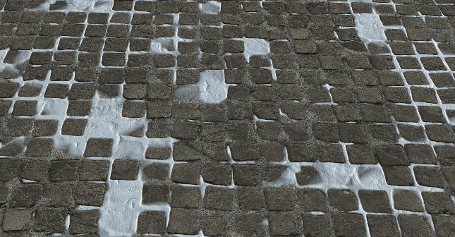{width="650px"}

Es gibt jetzt ein neues Beispielprojekt mit dem Namen &quot;**TilingMaterial**&quot;, das Sie über die Menüaktion &quot;**Datei > Beispiel öffnen**&quot; öffnen können.\
Dieses Projekt verwendet einen einfachen ebenen Mesh mit überlappenden UVs, der das nahtlose **Malen von** Materialien und Pinselstrichen zum **Erstellen von Kachelung-Materialien** ermöglicht.

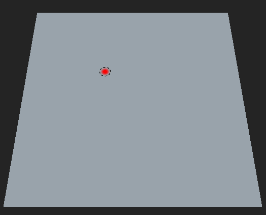{width="400px"}

## Tutorial

Der Substance Academy wurde ein neuer Tutorial-Kurs hinzugefügt, der unsere neue Benutzeroberfläche behandelt: [Erste Schritte mit Substance Painter 2018](https://academy.allegorithmic.com/courses/a97b433a5997fd800b5ed300d783cc41/youtube-e-zpEL0Wcqg)

## Versionshinweise

### 2018.1.3

(Release 28. Juni 2018)

**Hinzugefügt:**

* Zusammenfassung: Hotfix
* [Voreinstellungen] Vorschlag zum Speichern des Projekts beim Neustart von Painter

**Fest:**

* [Plug-In] Substance Source &quot;Suchen&quot; funktioniert nicht
* [Intelligenten Materials] Das Importieren von Intelligenten Materials führt in einigen Fällen zu einem Absturz
* [Intelligenten Materials] Das Löschen von Intelligenten Materials führt in einigen Fällen zu einem Absturz
* [Speichern] Das Speichern führt in einigen seltenen Fällen zu einem Absturz
* [Regal] Umkehren funktioniert nicht auf den Zellen 2 und 3 der Zellen
* [Regal] Typo in einigen Alphas
* [Regal] Einige Substance-Material werden nicht richtig gerendert

**Bekannte Probleme:**

* Einfrieren der Berechnung auf AMD VEGA-GPUs

### 2018.1.2

(veröffentlicht am 6. Juni 2018)

**Hinzugefügt:**

* Zusammenfassung: Verbesserte Geschwindigkeit beim Baking, verbessertes Speichersystem, aktualisierte Schieberegler, aktualisierte Plug-in-API, Übersetzung ins Chinesische, verbesserter Abstand jetzt optional
* [Baker] Leistungsverbesserung mit neuer Baker-Version
* Erzwungene Anzeige von Dialogfeldern mit inkompatibler GPU
* [Speichern] Leg neuer Kompaktprojekt-Funktionen (vollständiger/kompakter Speichermodus)
* [Speichern] Benutzer informieren, wenn Fehler beim Speichern auftritt
* [Clean] Nächste Speicherung im Voll-/Kompaktmodus
* [Schieberegler] Verbesserung der Präzision der Farb-/Graustufenbalken und Schieberegler
* [Schieberegler] Hinzufügen der Pfeilsteuerungen nach oben/unten
* [Schieberegler] Dieselbe Erkennungszone für Farb- und Graustufenbalkenschieberegler
* [Plugin] Automatische Speicherung immer im inkrementellen Modus
* [Plug-In] Option zum Wechseln von Plug-Ins zu einem neuen Schnittstellenstil
* [Sprache] Chinesische Übersetzung hinzufügen
* [Auffüllung] Option zum Wechseln zwischen UV- und 3D-Raum, Nachbar-Auffüllung pro Textursatz in den Textursatz-Einstellungen
* [Skript] Gelegt Speichermodus: Voll/Kompakt oder inkrementell
* [Script] Update Scripting/QML documentation
* [Log] Anzeige des Speichermodus im Protokoll (vollständig/kompakt oder inkrementell)

**Fest:**

* [Tool] Kanalsteckplatz transformieren bei Einkanalfüllungen in einen Material-Steckplatz
* Absturz beim Laden eines Meshs (FBX) mit einigen Flächen, die nicht von einem Material zugewiesen wurden
* Absturz in Iray mit NVIDIA RASTER 5.2 auf einem virtuellen Computer
* Absturz beim Rückgängigmachen eines Löschens einer Materialvorgabe
* Absturz beim Laden einiger Projekte
* [Befehlszeile] Neue Befehlszeile für UDIM-Mesh, aufgeteilt nach Audio
* [Symbolleiste] Verkleinern der Symbolleiste
* [Instanz] Bitmaps können nicht über mehrere Textursatz instanziieren werden
* [Viewport] Aktualisierung ist nicht abgeschlossen, wenn auf Mesh mit gekachelten UVs gemalt wird
* [Iray] Normalen-Map wird zweimal für Dielektrika angewendet
* [Regal] Tippfehler in einigen Substance-Parametern (Alphas, Prozeduren und Matfx)
* [Regal] Typo für die Bitmap &quot;Authorized Personnel Only&quot;
* [Script] Funktion alg.shaders.Materials() funktioniert nicht mehr

**Bekannte Probleme:**

* Einfrieren der Berechnung auf AMD VEGA-GPUs

### 2018.1.1

(veröffentlicht am 3. April 2018)

**Fest:**

* [Tablet] Problem beim Ändern der Standardinteraktionsoptionen
* [Baker] Absturz mit Assimp-Bibliothek
* [Baker] Leistungsrückgang mit A.O.-Map
* [Iray] Die Verzerrung des Objektivs wird nicht auf den Alphakanal angewendet
* [Treiber] Aktualisierung der Mindestanforderungen für Treiber
* [3Dview] Normale werden auf UDIM-Meshs ohne Normale-Informationen nicht korrekt generiert
* [Intel] Absturz mit Substance Painter 2018.1.0
* [Intel][Viewport] Problem mit der Auffüllung (schwarze Artefakte)

**Bekannte Probleme:**

* Einfrieren der Berechnung auf AMD VEGA-GPUs

### 2018.1

(veröffentlicht am 15. März 2018)

**Hinzugefügt:**

* Neuer allgemeiner Stil (Symbole, Farbe, Verhalten)
* Neues Standardlayout
* [Tablet] Benutzererfahrung beim Malen verbessert
* [Hauptmenü] Sortieren Sie native Elemente zuerst in Ansichten und Symbolleisten
* [Hauptmenü] Aktionen &quot;schnelle Maske verschieben&quot; im Abschnitt &quot;Viewport&quot;
* [Hauptmenü] Verschieben von Rechtsklickaktionen in den Abschnitt &quot;Viewport&quot;
* [Hauptmenü] Menü &quot;Ansicht&quot; in &quot;Fenster&quot; umbenennen
* [Schnellmenü] Neue Werkzeugeigenschaften durch Rechtsklick im Viewport
* [Dock-Widget] Neue Dock-Symbolleiste zum schnellen Reduzieren/Zurückrufen
* [Anzeigeeinstellungen] Fenster &quot;Kamera- und Anzeigeeinstellungen&quot; wurde zusammengeführt
* [Ebenenstapel] Kontextmenü (rechte Maustaste)
* [Ebenenstapel] Ziehen und Ablegen, um einen Effekt innerhalb derselben Ebene zu verschieben
* [Symbolleiste] Neuorganisation der Symbolleiste und neue kontextbezogene Symbolleiste
* [Werkzeugleiste] Klonwerkzeug in zwei separate Werkzeuge teilen
* [Werkzeugeigenschaften] Hellerer Graustufenwert im Hintergrund in der Vorschau
* [Eigenschaften von Tools] Organisation in Registerkarten (Füllung und Werkzeuge)
* [Tool] Das Malergebnis entspricht der Schablone
* [Viewport] Neuer Cursor für Füllebene
* [Viewport] Einfacheres Navigieren und Malen (höhere Rahmen-Rate)
* [Viewport] Auswahlkombination &quot;Material/Kanal/Karte&quot; im Viewport
* [Viewport] Flackern beim Drehen reduzieren (Schatten aktiviert)
* [Regal] Beim Öffnen von Painter werden Materials standardmäßig angezeigt
* [Regal] Ladezeitverbesserung von Substance-Texturen und -Materialien (2- bis 6-mal schneller)
* [Regal] Neuordnen von Materialien-Ordnern zum Anpassen an die Substance Source
* [Regal] Ziehen Sie Materialien per Drag &amp; Drop direkt auf den Mesh im Viewport
* [Regal] Neue 3D-Rauschen (Perlin, Perlin Fractal, Simplex und Worley)
* [Regal] Neuer 3D Linear gradient-Maskengenerator mit Mesh-Position
* [Regal] Die Basis-Rauschen wurden aktualisiert, um die quadratische Ausbreitung zu unterstützen.
* [Regal] Neue Vorlage und Exportvorgabe für Lens Studio hinzugefügt (Anwendung Einrasten)
* [Regal] Intelligenten Materials und Intelligente Masken wurden aktualisiert, um die neueste Version des Maskeneditors zu verwenden (Mikrodetails)
* [Regal] Neues Beispielprojekt &quot;TilingMaterial&quot; zum Erstellen nahtloser Kachelung-Materialien
* [Regal] Neue Pinselvorgaben (Kalligrafie, Nass, Schraffur usw.)
* [Schieberegler] Neue Schieberegler und Stil und Verhalten von Graustufen-/Farbbalken
* [Baker] Erlauben Sie die Verwendung des Begrenzungsrahmens für die volle Szene, um die Positionskarte zu berechnen.
* [Shader] Entfernen des Height Force-Parameters aus den Standard-Shader-Parametern
* [Engine] Substance Engine aktualisiert
* [Engine] Keine oder weniger Diskontinuitäten zwischen UV-Blöcken (neue Naht, Auffüllung)
* [Plug-ins] Importieren Sie schneller aus Substance Source heruntergeladene Materials
* [Plug-ins] Alle Plug-ins aktualisieren, um dem neuen Gesamtstil zu entsprechen
* [Voreinstellungen] Automatische Vorschau der Hintergrundfarbänderungen
* [Clean] Geringeres Risiko für Projektbeschädigung
* [Öffnen] Verbesserung der Projektzeit wird geöffnet
* [Neues Projekt] Neues Projekt - Verbesserung der Aktualisierungszeit des Meshs
* [Speichern] Speichern der Zeitverbesserung für das Projekt
* [Protokoll] Im Protokoll angegebener Lizenztyp
* [TextureSet] Schaltfläche &quot;Baking Texturen&quot; in &quot;Baking Mesh-Map&quot; umbenennen
* Benennen Sie &quot;Zusätzliche Maps&quot; in &quot;Mesh-Map&quot; um

**Fest:**

* [Viewport] Fehlerhafte Bewegungen mit Meshs, die viele Unterobjekte enthalten
* [Werkzeugeigenschaften] Kanal deaktiviert, wenn ein Material per Drag &amp; Drop in den Bildschlitz gezogen wird
* [Werkzeugeigenschaften] Pinselvorschau wird mit Verwisch- und Kopierwerkzeugen beschädigt
* [Textursatz] Die Reihenfolge der Kanäle ist falsch, wenn Vorlagen verwendet werden
* [Regal] Fehlendes Symbol für Graustufenkonvertierung-Generator
* [Regal] Alpha-Zahl für Signaturkreise ist fehlerhaft (fehlende Schriftart)
* Falsche Erkennung integrierter GPUs beim Start
* [Absturz] Ziehen und Ablegen einer importierten Ressource mit dem Namen &quot;#&quot;
* [Engine] Vram-Erkennungsproblem auf integrierter GPU
* [Engine] Mehrere Absturz im Substance Engine Linker behoben
* [Engine] Quadratische Artefakte bei der Änderung der Auflösung
* [Post-Effekte] Die Größe der Benutzeroberfläche ist langsam, wenn Post-Effekte aktiviert sind
* [Baker] Szene wird für Strahlenentfernungswerte nicht korrekt eingehalten
* [Baker] AO vom Mesh-Verdeckungsabstand wird unabhängig vom Eingabewert auf 1 geklemmt
* [Baker] Bei der Namensübereinstimmung werden einige Mesh mit bestimmten Namen ignoriert.
* [Baker] Die Farbe aus den Einstellungen &quot;Mesh-Polygruppe&quot; und &quot;Teilgitter-ID&quot; gibt immer ein schwarzes Bild zurück.
* [Baker] ID-Baking schlägt mit binären FBX-Meshs von Blender fehl
* [Shader] Rauschen in der 2D-Ansicht mit dota-2 und non-pbr-spec-gloss
* [Linux] Beim Baking wird nur ein CPU-Thread verwendet.
* [MacOS] Absturz mit dem Pinselcursor, der sich über den Viewport bewegt

**Bekannte Probleme:**

* Einfrieren der Berechnung auf AMD VEGA-GPUs
* Verzerrungsnachbearbeitung wird beim Export in Iray nicht berücksichtigt (Alphakanal)
