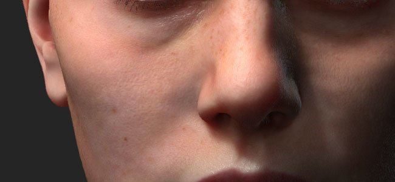
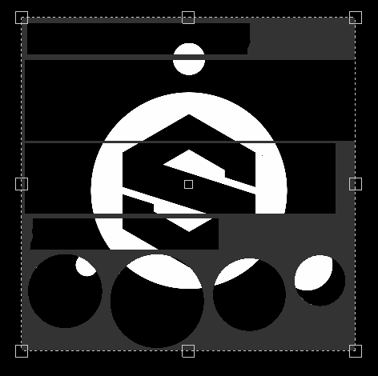
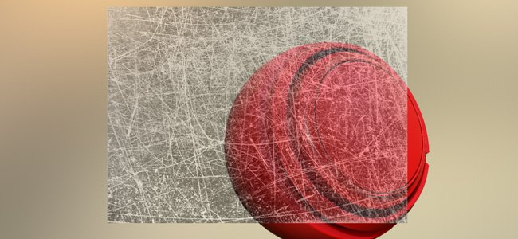

# Version 2018.2

**Substance Painter 2018.2** fügt lange erwartete Funktionen hinzu, wie z. B. das Malen mit Untergrundstreuung, die die Texturierung noch einfacher als zuvor machen.

Freigabedatum: *2. August 2018*

## Wichtigste Funktionen

### Streuung unter der Oberfläche

**Volumenstreuung** wird jetzt im **Echtzeit**-Viewport und mit dem **Iray-Renderer** unterstützt.\
Volumenstreuung ist ein Lichtmechanismus, der beim Eindringen in ein Objekt oder eine Fläche entsteht. Anstatt wie bei metallischen Oberflächen reflektiert zu werden, wird ein Teil des Lichts vom Material absorbiert und dann **in das Material gestreut**. Viele Materialien im echten Leben haben Volumenstreuung wie Haut oder Wachs.

Unsere Subsurface-Effekt-Implementierung entspricht sehr genau den Echtzeit-Implementierungen anderer Game-Engine sowie anderen Offline-Renderern. So lassen sich ganz einfach streuende Texturen für die Verwendung in anderen Anwendungen erstellen.

{width="650px"}

Oben sehen Sie ein Beispiel mit dem bekannten Element Digital Emily 2. Vielen Dank an das USC Institute for Creative Technologies und Mitglieder des Wikihuman-Projekts, die es uns ermöglicht haben, unsere Renderings mit den Digital Emily 2-Assets zu demonstrieren.\
(Bitte beachten Sie, dass dieser Vergleich unter ähnlichen, aber nicht exakten Lichtverhältnissen durchgeführt wurde, was visuelle Unterschiede erklären kann.)

Um einem Projekt eine Volumenstreuung hinzuzufügen, gehen Sie wie folgt vor:

1. Wechseln Sie zum Fenster **Anzeigeeinstellungen**, und **aktivieren** Sie die Einstellung **Volumenstreuung**.
1. Hinzufügen eines **Streuungskanals** im aktuellen Textursatz
1. Verwenden Sie eine Füllebene oder **Malen in Weiß** im neuen Kanal, um **den Unteroberflächeneffekt im Viewport freizulegen**.

Eine ausführlichere Vorgehensweise finden Sie in der [Dokumentation zur Untergrundstreuung](../../features/subsurface-scattering/subsurface-scattering.md).

>[!NOTE]
>
> Um die Volumenstreuung im Echtzeit-Viewport zu unterstützen, müssen die **Shader** in den Projekten **aktualisiert** sein.\
> Informationen zu benutzerdefinierten Shadern finden Sie in der Dokumentation im **Hilfemenü**. Dort erfahren Sie, welche Änderungen im **Shader-API** vorgenommen wurden.

### Manipulator für Füllebenen

Die Steuerelemente für Füllebenen wurden verbessert, um Manipulatoren mehr Möglichkeiten zu bieten. Es ist jetzt einfacher, die Projektionen der Füllung präzise zu platzieren und zu steuern.

Bei Verwendung der **UV-Projektion** wird ein Manipulator in der **2D-Ansicht** angezeigt:

* Durch Klicken auf **außerhalb von** wird der Manipulator **gedreht**.
* Durch Klicken auf das **Quadrat** an den **Rändern** wird es **skaliert/skaliert**.
* Durch Klicken auf **in** wird der Manipulator **Kamera bewogen**.
* Verwenden Sie **STRG**, um mehrere Eckpunkte in **Symmetrie** zu beeinflussen.
* Verwenden Sie **UMSCHALT** bis **Einschränkung** für eine Transformation (Kamera beweg, Drehung oder Skalierung).\
  

Bei Verwendung der **Tri-Planaren Projektion** wird ein Manipulator in der **3D-Ansicht** angezeigt:

* Der gepunktete Würfel repräsentiert die globale Projektion
* Verwenden Sie den **W**, **E** oder **R**-Tastatur-Tastaturbefehl, um zwischen den Modi **Kamera beweg**, **Drehen** und **Skalieren** zu wechseln.
* Verwenden Sie den **T**-Tastatur-Tastaturbefehl, um für den Manipulator zwischen &quot;Lokal&quot; und &quot;Welt&quot; zu wechseln.
* Verwenden Sie **SHIFT**, um **die Transformation zu beschränken**.
* Die Tri-Planare Cube-Projektion kann auch in den erweiterten Füllebene-Eigenschaften geändert werden:\
  \
  

Die kontextbezogene Symbolleiste am oberen Rand des Ansichtsfensters wird sich ebenfalls abhängig vom aktuellen Projektionsmodus anpassen und zusätzliche Werkzeuge und Steuerelemente bereitstellen:

Weitere Informationen finden Sie in der Dokumentation zur [Füllebene](../../painting/fill-projections/fill-projections.md).

### Nicht quadratische und nicht bearbeitungsfertige Unterstützung für Schablone und Projektion

Der Schablonenparameter und das Projektionswerkzeug wurden verbessert, um nicht quadratische Auflösungen und nicht bearbeitungsfreies Verhalten zu unterstützen.\
Der Standardparameter ist jetzt standardmäßig auf &quot;Nicht bestellen&quot; festgelegt. Dieser Parameter kann in den Werkzeugeigenschaften geändert werden:

Der Bearbeitungsmodus kann wie folgt eingestellt werden:

* **Keine Kachelung** (Standard)
* **Horizontale Kachelung**
* **Vertikale Kachelung**
* **H- und V-Kachelung** (altes Verhalten)

Dieser neue Parameter kann in einer Werkzeug- oder Pinselvorgabe gespeichert werden, was die Freigabe mit benutzerdefinierten Inhalten erleichtert.

>[!NOTE]
>
> * Das Projektion-Verhältnis wird sich auch bei Substance-Dateien anpassen, die nicht quadratische Auflösungen ausgeben. Das Verhältnis wird direkt vom Ausgabeknoten aus berechnet.
> * Wenn mehrere Kanäle unterschiedliche Verhältnisse aufweisen, wird das erste gefundene Verhältnis mit dem Projektion-Werkzeug auf alle anderen Kanäle angewendet.

### Import und Verwaltung von Kameras

Es ist jetzt möglich, **benutzerdefinierte Kameras** in Substance Painter neben dem Mesh-Import zu importieren.\
Kameras können **ausgewählt werden, um sie im** 3D-Viewport **zu durchsuchen** und **zum Rendern in Iray** zu verwenden.

Weitere Informationen finden Sie in der [Dokumentation zur Kamera-Verwaltung](../../interface/viewport/camera-management.md).

So **importieren Sie Kameras** in ein Projekt:

1. Mesh für das Projekt mit Kameras in derselben Datei exportieren (mit einem unterstützten Format wie FBX, Alembic oder glTF)
1. Wählen Sie die Einstellungen für &quot;Kameras importieren&quot; im [neuen Projektfenster](../../getting-started/project-creation.md) (oder [Projektkonfiguration](../../interface/project-configuration.md)).\
   
1. Wechseln Sie mit der Dropdown-Liste im Viewport oder mithilfe der Kameras in [Anzeigeeinstellungen](../../interface/display-settings/camera-settings.md) zur gewünschten Version.\
   

Die Kamera-Einstellungen im Fenster Anzeigeeinstellungen wurden erweitert, um die Eigenschaften der Kamera zu steuern.\
Es ist möglich, **zwischen Kameras zu wechseln**. Weitere Informationen finden Sie unter **Verhältnis** und **Sperre** der Eigenschaften, um eine Änderung zu vermeiden. Mit einer Wiederherstellungsschaltfläche kann die Kamera auf ihre ursprünglichen Werte zurückgesetzt werden.

Der Rahmen der Kamera (und sein Tor) wird ebenfalls berücksichtigt, sodass es möglich ist, über einen ganz bestimmten Blickwinkel zu betrachten und zu Malen. Der Rahmen und das Gate werden über dem 3D-Viewport angezeigt, und seine Deckkraft kann in den **Viewport-Einstellungen** im Fenster [Anzeigeeinstellungen](../../interface/display-settings/camera-settings.md) gesteuert werden:

### Verbesserungen am Verhalten von Ebenenstapeln

* **Ziehen Sie Materialien und Intelligente Materialien per Drag &amp; Drop auf den ID-Map :**\
  Das Ziehen und Ablegen von Inhalten aus dem Regal in den Viewport wurde verbessert. Durch Drücken von **STRG** beim Ziehen und Ablegen eines Materials können Sie jetzt die ID-Farbe auswählen, die als Maske verwendet wird.\
  Eine schwarze Maske mit dem Effekt &quot;Farbauswahl&quot; wird zur neuen Ebene hinzugefügt, die im Ebenenstapel erstellt wurde. Wenn dasselbe Material per Drag-and-Drop auf eine andere ID-Farbe platziert wird, wird die bereits vorhandene Ebene aktualisiert und die ID-Farben werden kombiniert.\
  
* **Scroll per Drag &amp; Drop von Ebenenstapeln:**\
  Beim Ziehen von Ebenen um den Ebenenstapel wird nun ein kleines Fenster angezeigt.\
  Wenn eine Ressource oder eine Ebene in die Nähe der Ränder des Ebenenstapel-Fensters gezogen wird, wird automatisch ein Bildlauf für den Inhalt durchgeführt.\
  

### glTF- und Alembic-Netzimport

Neue Dateiformate werden jetzt für das Importieren von Meshs und das Erstellen neuer Projekte unterstützt:

* **glTF** : Dieses Format war bereits beim Exportieren von Texturen verfügbar und kann jetzt während des Imports verwendet werden. Wenn eine glTF-Datei Texturen enthält, werden diese importiert und in den Ebenenstapel eingefügt (für den Metall-/Raueit-Workflow).
* **Alembic** : Dieses Format ist in der VFX-/Animationsbranche weit verbreitet, um Mesh zu übertragen.

>[!NOTE]
>
> Substance Painter bietet keine Möglichkeit, zu steuern, welcher Rahmen der Animation gerade importiert werden soll.\
> Dies bedeutet, dass beim Exportieren einer Alembic-Datei der Rahmen der Referenz für das Malen auf dem Asset bereits festgelegt sein muss.

### Verbesserungen an der Substance-Integration

Die Substance-Integration in Substance Painter wurde mit lange erwarteten Anfragen verbessert:

* <b>Sichtbar, wenn:</b>\
  Das &quot;Visible if&quot; ist eine großartige Funktion des Substance-Dateiformats, das es ermöglicht, Parameter auf Basis von Bedingungen auszublenden.\
  Diese Funktion bietet eine klarere Liste von Parametern und Kontexteinstellungen, sodass Material und Filter insgesamt einfacher zu verwenden sind.\
  Weitere Informationen finden Sie in der Dokumentation zu [Substance Designern](https://experienceleague.adobe.com/en/docs/substance-3d-designer/home).\
  
* **Substance-Vorgaben** Substance-Vorgaben sind eine einfache Möglichkeit, erweiterte Anpassungen und Variationen von Materialien bereitzustellen. Viele Material auf [Substance Source](https://source.allegorithmic.com) verfügen über Vorgaben. Probieren Sie es aus!\
  Wenn eine Substance-Datei eine oder mehrere Vorgaben enthält, ist ein neues Dropdown-Menü in der Parameterliste verfügbar. Wählen Sie die Vorgabe aus, die zum Aktualisieren der Parameter angewendet werden soll.\
  
* **Substance-Attribute**\
  Substance-Attribute werden jetzt in der Benutzeroberfläche angezeigt, sodass Informationen zu einer bestimmten Datei leichter abgerufen werden können.\
  Attribute können an zwei verschiedenen Orten angezeigt werden: über den Parametern im Eigenschaftenfenster oder durch Klicken mit der rechten Maustaste auf ein Element im Regal.\
   

### Neues Beispielprojekt &quot;Jade Toad&quot;

Ein neues Beispielprojekt mit dem Namen &quot;**JadeToad**&quot; ist jetzt im Substance Painter enthalten. Für dieses Beispielprojekt ist der Effekt **Volumenstreuung** standardmäßig aktiviert.\
Verwenden Sie zum Suchen des Projekts die Datei **Datei** > **Beispiel öffnen...**-Menüeintrag.

## Versionshinweise

### 2018.2.3

(Release 25. September 2018)

****Fest:****

* [2D-Ansicht] Die 2D-Ansicht wird bei der Erstellung eines neuen Projekts mit einigen Gittern unterbrochen.
* [Absturz] Das Umschalten von der UV-Projektion- auf die dreiplanare Projektion führt zu einem Absturz
* [RayCollider] Mehrere Abstürze durch &quot;RayCollider&quot;
* [Werkzeug] Beim Wechseln von Ebenen gehen die geänderten Pinseleigenschaften verloren
* Pinseleinstellungen werden beim Wechsel zum Radierer zurückgesetzt

**Bekannte Probleme:**

* Einfrieren der Berechnung auf AMD VEGA-GPUs
* Problem mit Huion-Tablets mit Tastaturbefehlen unter Windows

### 2018.2.2

(Release 11. September 2018)

**Hinzugefügt:**

* Zusammenfassung: Hotfix mit Inhaltsaktualisierung, neuen Skriptfunktionen und der Möglichkeit, die automatische Aktualisierung zu deaktivieren
* [Inhalt][Regal] Hinzufügen einer Skin-Regalvorgabe
* [Inhalt][Regal] Konvertierung von 19 Hautnormalen in Materialien zur Untergrundstreuung
* [Scripting] Erstellen einer Projektvorlage aus einem geöffneten Projekt
* [Scripting] Abrufen/Festlegen von Exporteinstellungen eines geöffneten Projekts
* [Updates] Deaktivieren des Popups &quot;Automatische Aktualisierung&quot; in den Einstellungen und der Umgebungsvariablen
* [Updates] Anzeige erst in der nächsten Version des veralteten Wartungs-Popup

**Fest:**

* [Kamera] Falscher Zoom durch Wechsel von orthografischer zur Perspektive
* [Anzeige] Einige Maps werden linear anstelle von sRGB angezeigt
* [Viewports] Der Gitterfokus verhält sich nicht ordnungsgemäß.
* [2D-Ansicht] Projekt mit kaputter Kamera enthält verschwindende UVs-Schalen
* [SSS][QuickInfo] QuickInfos für die unterirdische Streuung werden im Protokoll angezeigt
* Einige Projekte können nicht in 2018.2 geöffnet werden und die Fehlermeldung kann kein Null-Substance-Paket speichern
* [Maske] Die Farbe des Malwerkzeugs kann in einigen Fällen beim Arbeiten in einer Maske hängen bleiben
* [Material] Karten werden in bestimmten Situationen nicht angezeigt
* [Proj][Tools] Manipulator aktiv mit einem Generator
* [Substance] Fehlende Substance-Parametergruppen
* [Skripterstellung] Falscher Software-Name in der Dokumentation
* [UDIMs] Keine Informationen im Protokoll über UVs-Schalen auf mehreren UVs-Kacheln

**Bekannte Probleme:**

* Einfrieren der Berechnung auf AMD VEGA-GPUs
* Problem mit Huion-Tablets mit Tastaturbefehlen unter Windows

### 2018.2.1

(veröffentlicht am 3. August 2018)

**Fest:**

* Fehlende Parameter für die Teilflächen-Streuungs-Shader beim Aktualisieren von Projekten

**Bekannte Probleme:**

* Einfrieren der Berechnung auf AMD VEGA-GPUs
* Problem mit Huion-Tablets mit Tastaturbefehlen unter Windows

### 2018.2

(Release 2. August 2018)

**Hinzugefügt:**

* Zusammenfassung: Sommerversion, Streuung auf Untergrund Unterstützung, Verbesserungen bei Projektion und Füllung, Kameraimport und -auswahl, Alembic-/glTF-Unterstützung, Drag-and-Drop-Funktionen für ID-Maps, verbesserte Unterstützung für Substance-Formate und neue Inhalte
* [SSS][Viewport][Iray] Generische Untergrundstreuung
* [SSS] Synchronisierungsparameter für MDL und Untergrundstreuung
* [SSS] Es wurde ein neuer Graustufenkanal mit dem Namen &quot;Streuung&quot; hinzugefügt.
* [SSS][Schattierungseinstellungen] Streuungstyp-Parameter für Volumenstreuung (Haut oder transluzent)
* [SSS][Schattierungseinstellungen] Streuungsmaßstabsparameter für Untergrundstreuung
* [SSS][Schattierungseinstellungen] Streuender Farbparameter für Untergrundstreuung
* [SSS][Anzeigeeinstellungen] Streuung Abtastanzahl für Untergrundstreuung
* [Shader][Iray] Integrieren Sie die unterirdische Streuungs-MDL für Iray
* [Shader] Shader-Update über den Ressourcen-Updater
* [Shader] API und Dokumentation für Änderungsprotokoll aktualisieren
* [Werkzeugeigenschaften][Proj] Neue Parameter für die triplanare Projektion
* [Viewport][Proj] Steuern Sie die Eigenschaften der Füllebene in der 3D-Ansicht direkt mit Manipulatoren (triplanare Projektion).
* [Shortcuts][Proj] Neue Shortcuts Q, W, E, R, T für triplanare Projektionsmanipulatoren
* [Viewport][Proj] Steuern Sie die Eigenschaften der Füllebene in der 2D-Ansicht direkt mit den Manipulatoren (UV-Projektion).
* [Shortcuts][Proj] Neuer Shortcut Q für UV-Projektion-Manipulatoren
* [Contextual Toolbar][Proj] Steuern von triplanaren Projektionsmanipulatoren
* [Kontextsymbolleiste][Proj] Manipulatoren für die UV-Projektion steuern
* [Werkzeugeigenschaften] Deaktivieren der Texturkachelung mit Projektions- und Schablonenwerkzeug
* [Schablone] Verwenden von nicht quadratischen Bildern mit dem Projektionswerkzeug/der Schablone
* [Schablone] Steuerung des Kachelmodus im Eigenschaftenfenster zulassen
* [Schablone] Der Zoom ist nicht auf einer nicht gekachelten Schablone zentriert
* [Kameras] Importieren von Kameras aus Maya, Max, Blender, Modo, DAE
* [Kameras][Viewport] Wählen und steuern Sie die importierten Kameras im Viewport
* [Kameras][Iray] Auswählen und Steuern von importierten Kameras in Iray
* [Kameras][UI][Neues Projekt][Projektkonfiguration] &quot;Kameras importieren&quot; ist standardmäßig aktiviert.
* [Kameras][Tastaturbefehle] Fügen Sie die Tastaturbefehle &quot;&lt;&quot; und &quot;>&quot; hinzu, um zwischen den Kameras zu wechseln.
* [Kameras][Viewport] Frame im Viewport hinzufügen
* [Kameras][Viewport-Einstellungen] Steuerung der Frame-Deckkraft
* [Kameras][Kameraeinstellungen] Maximale Brennweite bei 500 mm
* [Kameras][Kameraeinstellungen] Belichtungsverhältnis
* [Kameras][Kameraeinstellungen] Fügen Sie eine Sperroption hinzu
* [Kameras][Kameraeinstellungen] Hinzufügen einer Wiederherstellungsoption
* [Kameras][Kameraeinstellungen] Attribut für den Fokusabstand hinzufügen
* [glTF] Import einer glTF-Datei
* [glTF] Umgebungskarte für die Verdeckung importieren
* [Alembic] Importieren Sie Alembic 1-Rahmen mit statischer Geometrie
* [Shelf] Ziehen Sie Materialien per Drag &amp; Drop direkt auf das Gitter, indem Sie ID-Zuordnungen mit einem Modifizierer (STRG/Befehlstaste) verwenden.
* [Ebenenstapel] Automatische Erstellung von ID-Masken durch Ziehen und Ablegen von Materialien auf einem Gitter mit ID-Maps
* [Ebenenstapel] Automatischer Bildlauf von Ebenen per Drag &amp; Drop über den Ebenenstapel
* [UI][Werkzeugeigenschaften] Zeigt die Vorgabe des Substance an.
* [UI][Hilfemenü] Verbesserung des Hilfemenüs
* [UI][Neues Projekt][Projektkonfiguration] Reorganisation des Fensters
* [UI][Neues Projekt][Projektkonfiguration] Ersetzen Sie &quot;Mesh&quot; durch &quot;Datei&quot;.
* [UI][Substance] Anzeigen von Substance-Attributen in der Benutzeroberfläche
* [Tastaturbefehle] &quot;F4&quot; wechselt zwischen 2D- und 3D-Ansicht
* [Tastaturbefehle] Neue Tastaturbefehle für die Schablone &quot;N&quot; zum Umschalten und die schnelle Maske &quot;U&quot; zum Umschalten
* [Substance-Integration] Berücksichtigung von &quot;visible if&quot;-Anweisungen in den Substance-Parametern
* [Viewport] Schatten müssen nach dem Verschieben der Kamera nicht berechnet werden.
* [Inhalt] Aktualisieren von MeetMat mit importierten Kameras
* [Inhalt] Muster mit aktivierter Volumenstreuung hinzufügen - JadeToad
* [Inhalt] Neue PBR-Projektvorlage mit aktivierter Untergrundstreuung hinzufügen
* [Inhalt] Exportvorgaben wurden aktualisiert, um einen neuen Streuungskanal hinzuzufügen
* [Content][Shelf] Zusätzliche Untergrund-Streuunterstützung für: pbr-metal-rau, pbr-metal-rau-alpha-test, pbr-coated, pbr-spec-gloss
* [Content][Shelf] Hinzugefügter Streuungskanal zu 5 intelligenten Materialien (Marmor und Skins)
* [Inhalt][Regal] 1 neues Jadematerial
* [Inhalt][Regal] 1 neues Wachsmaterial

**Fest:**

* [CMD] Verschiedene Ergebnisse über dieselbe Befehlszeile mit unterschiedlichen Versionen
* [TDR] Wenn TdrLevel eingerichtet ist, sind keine Fehler im Protokoll vorhanden.
* [Baker] Umgebungskarte der Verdeckung wird gespiegelt
* [ID Map] Absturz beim Kommissionieren außerhalb des Bereichs 0-1
* [Iray] Absturz beim Wechseln der Textursätze und Zurückkehren zum Malmodus
* [Viewport] Synchronisieren von Ablagebereichen zwischen Viewports für Drag &amp; Drop
* [Engine] Moire-Artefakt beim Kacheln von Füllebenen oder Malen eines kleinen Pinsels
* [Lizenz] Prüfung auf fehlerhafte Softwareversion des Lizenzdiensts
* [Lizenz] Überarbeiten Sie die Art und Weise, wie wir die Authentifizierung verarbeiten
* [API] Rufen Sie das `onNewProjectCreated`-Skript-API-Ereignis auf, selbst wenn Sie mit einer Vorlage erstellen.
* [Shader] Kompilierter Shader wird nicht aus dem Cache geladen, wenn die Shader-Datei nicht kompiliert wird
* [Shelf] Beim Exportieren der HDR-Datei aus dem Shelf wird eine Datei mit eingespannten Werten ausgegeben
* [Exportieren] EXR-Exportklammern RGB Farbwerte zwischen 0-1
* [Inhalt] Prozedurale Rauschen &quot;3D Perlin Rauschen Fractal&quot; ist verpixelt

**Bekannte Probleme:**

* Einfrieren der Berechnung auf AMD VEGA-GPUs
* Problem mit Huion-Tablets mit Tastaturbefehlen unter Windows
