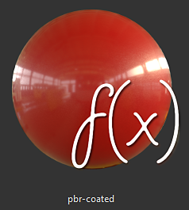
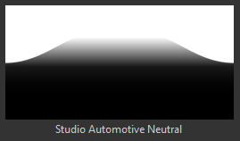

# Version 2018.3

**Substance Painter 2018.3** ist da und bietet viele neue Workflows und Rendering-Funktionen!

Freigabedatum: *20. November 2018*

## Wichtigste Funktionen

### 2D-Ansicht Export

Es ist jetzt möglich, die 2D-Ansicht **, die** darstellt, als Textur **zu exportieren.** Diese Funktion wurde von vielen Leuten angefordert und wir haben sie endlich verfügbar gemacht ! Der Exportprozess nimmt den aktuellen Status der **2D-Ansicht** an, um eine Textur mit den regulären Exporteinstellungen (Auffüllung, Dateiformat, Bittiefe) zu rendern. Das bedeutet, wenn der Ansichtsmodus auf **Solo** anstatt auf **Material** festgelegt ist, werden die 2D-Ansichten unverändert exportiert.

Wechseln Sie zum **Exportfenster** und wählen Sie die neue Konfiguration mit dem Namen &quot;**2D-Ansicht**&quot; aus:\

Eine neue **konvertierte Karte** mit dem Namen &quot;**2D-Ansicht**&quot; ist auch auf der Registerkarte **Konfiguration** des Exportfensters verfügbar, falls Sie Ihre eigene **Exportvorgabe** erstellen möchten.

### Verbesserter Baking geführt Beleuchtungsfilter

Der **Umgebung mit vorberechnete Beleuchtung**-Filter wurde erheblich verbessert und unterstützt jetzt **HDR. Umgebungs-Map**.\
Sie können nun die Beleuchtung des Viewports (wie in der 2D-Ansicht zu sehen) replizieren und in den Grundfarbe-Kanal Baking führen. Der neue Filter stellt weitere Steuerelemente bereit, z. B. **Drehen** der **Umgebung**-Map **vertikal** und Ändern der **Belichtung**.

### Anisotrope Echtzeit-Specular-Reflexionen

In dieser neuen Version führen wir einen neuen Shader mit dem Namen &quot;**pbr-metal-raw-Anisotropie-angle**&quot; ein. Dieser Shader unterstützt zwei Kanäle mit den Namen &quot;**Anisotropy angle**&quot; und &quot;**Anisotropy level**&quot;, die zum Erstellen anisotroper Specular-Reflexionen verwendet werden können. Dieser Shader Kamera bewegt auch ohne Umrüstung in Iray.

Auf diesen neuen Shader kann über das [Shader-Fenster](../../interface/shader-settings/shader-settings.md) zugegriffen werden, indem Sie auf die Shader-Schaltfläche klicken und das Mini-Regal öffnen:

Das standardmäßige Beispielprojekt &quot;**Preview Sphere**&quot; wurde aktualisiert, um diesen neuen Shader zu nutzen und zu zeigen, wie die verschiedenen Kanäle eingerichtet werden.

>[!NOTE]
>
> Wenn bei der Verwendung von Verläufen im **Anisotropy angle**-Kanal **Linienartefakte** seltsam aussehen, versuchen Sie, die Filtermethode in &quot;**Nächste**&quot; zu ändern, falls eine Füllebene vorliegt, da dies das Sampling für den Shader verbessern und das Problem beheben könnte.

### Aktualisierter Clear Coat Shader

Der **Clear Coat**-Shader (**pbr-coated**) wurde verbessert und bietet nun mehr Steuerelemente und Rendering-Möglichkeiten. Wir haben die Gelegenheit auch genutzt, um sie mit **Iray** mit einer dedizierten **MDL** kompatibel zu machen.

Hier ist eine Liste der Änderungen:

* **Steuern** der sekundären **Rauheit**-Ebene (über **Benutzerkanal0**).
* **Mask** out the secondary layer (via **User1** channel).
* Wählen Sie das Verhalten, das auf die Oberflächenebene angewendet werden soll: **Normaldetails beibehalten** (Original) oder **Fläche glätten** (neu, Mesh-Normal-Map ignorieren)

Der Einfachheit halber haben wir auch eine neue Projektvorlage für die Texturierung dieses neuen Shader mit dem Namen hinzugefügt: **PBR - Metallische Raueit beschichtet**.

### Neuer Viewport-Glättungsschutz

Der Nachbearbeitungsprozess des Substance Painters &quot;We Anti-Aliasing&quot; wurde überarbeitet und in eine neue Methode mit dem Namen &quot;**Temporale Anti-Aliasing**&quot; (**TAA**) geändert.\
Diese neue Technik bietet in jedem Fall viel bessere Ergebnisse bei sehr geringen Kosten. **TAA** funktioniert durch Akkumulation von Informationen über mehrere Rahmen hinweg, sodass sehr glatte Kanten erzeugt werden können, ohne Details zu verlieren.

Da es sich nicht mehr um einen Post-Effekt handelt, wurde die Einstellung ein wenig in das Fenster **Anzeigeeinstellungen** verschoben und befindet sich jetzt **unter** dem Abschnitt **Post-Effects**.

Dieses neue Anti-Aliasing bietet zudem neue Möglichkeiten in Kombination mit Transparenz. Wenn ein Projekt den **Alpha-Test**-Shader verwendet, aktivieren Sie die Einstellung &quot;**Alpha-Dithering**&quot;:

Das neue **TAA** filtert auch das Blue-Rauschen-Muster, das in den **Specular-Reflexionen** sowie in den **Volumenstreuung**-Beispielen sichtbar ist, gut.

### Virtuelle Texturierung mit geringer Dichte (SVT)

Eine große Veränderung in dieser neuen Version ist die Einführung der **Dünn besetzte virtuelle Texturen** oder **SVT**.

Dieses neue System ändert einige Grundlagen des Substance Painters und die Funktionsweise der Anwendung. Substance Painter verwendet die SVT jetzt als Möglichkeit, einen bestimmten Speicherbedarf für den Viewport zu verwalten, sodass **Texturen ein- und ausströmen können**. Der Hauptvorteil besteht in der Möglichkeit, größere Projekte einfacher zu laden und den Druck auf die GPU zu reduzieren, um **die Leistung zu verbessern**. Dies bedeutet, dass, wenn die Dinge beginnen, zu groß zu werden, einige Texturen auf der Festplatte entladen und sie später wieder abrufen wird, wenn nötig). Dies ist ein **flüchtiger Cache**, der beim Schließen der Anwendung gelöscht wird.

Ein weiterer Vorteil des Systems ist die Einführung von **Mipmaps** im **Viewport**, die die Texturqualität verbessern und den Moiré-Effekt reduzieren, der besonders bei Fabric-Mustern sichtbar ist.

Wir haben einige Steuerelemente zu diesem neuen System gelegt, die in den Haupteinstellungen bearbeitet werden können (**Bearbeiten > Einstellungen**):

* **Cacheverzeichnis** : Diese Einstellung steuert, wo der Substance Painter seine temporären Dateien einschließlich des SVT-Caches schreibt.
* **Beschleunigung des Hardware-Supports** : Wenn diese Option aktiviert ist, verwendet der Substance Painter die native Unterstützung von Sparse-Texturen durch die GPU (wenn sie deaktiviert ist, greift er auf eine Softwareimplementierung zurück).

Weitere Informationen zur SVT finden Sie auf unserer Dokumentationsseite : [Dünn besetzte virtuelle Texturen](../../features/sparse-virtual-textures.md)

>[!NOTE]
>
> Es wird empfohlen, das **Cacheverzeichnis** auf einem **Solid State Drive (SSD)** festzulegen, um die beste Leistung beim Arbeiten mit Substance Painter sicherzustellen.
> 
> Diese Einstellungen können über die Umgebungsvariable überschrieben werden: [Umgebungsvariablen](../../pipeline-and-integration/configuration/environment-variables.md).

### Neues und verbessertes Symmetrie-Tool

Das Symmetrie-Werkzeug wurde überarbeitet und ermöglicht jetzt den Versatz des Ursprungspunkts. Wenn ein Projekt teilweise symmetrisch oder außermittig ist, kann der Plan jetzt angepasst werden. Der Offset wird pro Achse im Projekt gespeichert.

Wir haben auch die Gelegenheit genutzt, um dieser Funktion etwas Liebe zu geben und haben jetzt ein neues visuelles Feedback :

* Eine **Schnittlinie** wird jetzt von **default** auf dem Mesh gezeichnet, um anzuzeigen, wo sich die Ebene der Symmetrie befindet.
* Ein **gespiegelter Punkt** wird jetzt angezeigt, wenn Sie den **Cursor** bewegen, um anzuzeigen, wo der Spiegelpinselstrich angewendet wird.

Alle neuen visuellen Elemente können über das neue Menü &quot;Symmetrie&quot; in der kontextbezogenen Symbolleiste angepasst werden:

* **Mirror X, Mirror Y, Mirror Z** : Definieren der Richtung, die für die Symmetrie verwendet wird
* **Offset** : Steuert den Versatzwert pro Achse. Mit dem Kreuzpfeil können Sie alle Abstände auf 0 zurücksetzen.
* **Symmetrie Ebene** : Mit &quot;Ebene einblenden&quot; können Sie eine Ebene zeichnen, die den Mesh schneidet. Schnittmenge anzeigen : Zeichnet eine Linie auf dem Mesh, an der die Ebene den Mesh schneidet.
* **Symmetrie-Cursor** :Show-Cursor zeichnet einen sekundären Pinselcursor an der Stelle, an der die Symmetrie angewendet wird. &quot;Beim Malen ausblenden&quot; zeigt diesen Cursor nur an, wenn nicht gemalt wird.
* **Manipulator** : &quot;Manipulator anzeigen&quot; zeigt einen Manipulator im Viewport an, um die Symmetrie zu versetzen. **Manipulator-Größe** steuert, wie groß der Controller im Viewport sein wird.

Die gleichen **Tastaturbefehle** wie für den Manipulator &quot;Planare Dreiecksverknüpfung&quot; und &quot;UV&quot; können zum Ausblenden/Anzeigen des Manipulators &quot;Symmetrie&quot; verwendet werden:

* **Q** : Manipulator ein-/ausblenden
* **Umschalttaste** : Einrasten Verschiebung (diskreter Versatz)
* **+ / -** : Größe des Manipulators ändern

### Verbesserter Tri-Planar-Manipulator

Zusätzlich zu den 3 ursprünglichen Achsen zur Steuerung der Drehung haben wir auch eine neue Drehungskugel hinzugefügt, wenn wir den planaren Manipulator steuern. Die Kugel erleichtert es, zum Beispiel bei der Projektion von Rauschen-Mustern schnell verschiedene Blickwinkel auszuprobieren.

### Exportieren von 8-Bit-Dithering-Texturen

Beim Exportieren von Normal- und Höhen-Map-Texturen in Dateiformate im 8-Bit-Modus wendet Substance Painter jetzt automatisch **Dithering** an, um **Banding** **Probleme** zu reduzieren.

>[!NOTE]
>
> Wenn eine Exportvorgabe eine Normalen-Map verwendet, aber etwas Anderes im Alpha-Wert (z. B. RGB = Normal, A = Rauheit), wird nur die Normale gedithert.

### Verbesserungen am Verhalten von Ebenenstapeln

Am Ebenenstapel und an der Ebenenverwaltung wurden einige Workflow-Verbesserungen vorgenommen:

* Weisen Sie **color** **layers** und **folders** im Ebenenstapel über das Kontextmenü **mit der rechten Maustaste** zu, um Ebenen zu organisieren.\
  Substance Painter-Ebenenfarben verhalten sich jedoch etwas anders als in anderen Softwarepaketen :
  * Ebenen in einem Ordner übernehmen die Ordnerfarbe (erscheinen jedoch abgeblendet).
  * Das Verschieben einer Ebene ohne zugewiesene Farbe innerhalb eines Ordners, der eine Farbe hat, übernimmt die Ordnerfarbe.
  * Wenn eine Ebene über eine eigene Farbe verfügt, wird diese vom Ordner nicht überschrieben.Dieses Originalverhalten erleichtert das Kolorieren und Organisieren des Ebenenstapels, ohne zu viele Farben manuell zuweisen zu müssen.

* **mehrere** Ebenen **schnell ein- und ausblenden**, indem Sie **die Maus anklicken und** verschieben.\
  Bei dieser Gelegenheit haben wir auch das Verhalten der Ebenen in ausgeblendeten Ordnern, die jetzt auch das Ausblenden des Ordners aufheben, ein wenig verfeinert.

* Mit der **Pfeiltasten**-Tastatur **Tastaturbefehle** können Sie schnell **zwischen den Mischmodi** wechseln.\
  Nach **Schließen** des Popupmenüs &quot;Füllmethode&quot; bleibt **Fokus** **auf der Ebene** und kann mit demselben vorherigen Tastaturbefehl geändert werden.

### Neue Substance-Eingänge für Filter und Generatoren

Neue Substance-Eingänge wurden für benutzerdefinierte Filter und Generatoren gelegt. Diese neuen Textur-Inputs ermöglichen die Erstellung von fortschrittlicheren Effekten dank neuer Mesh-Informationen.

Die neuen verfügbaren Eingaben sind:

* Mesh
* Mesh Welt-Raum-Normale
* Mesh Welt-Raum Tangente
* Mesh Welt-Raum Bitangent
* Mesh Texelgröße
* Mesh UV-Maske

Weitere Informationen finden Sie in der neuen Dokumentation : [Mesh-basierte Eingabe](../../content/creating-custom-effects/mesh-based-input.md)

Als Beispiel stellen wir jetzt einen neuen **Maskengenerator** mit dem Namen &quot;**UV Border Distance**&quot; bereit, der vom Rand der UV-Inseln des aktuellen Textursatzes aus ein Schwarz und eine weiße Maske erstellt.

>[!NOTE]
>
> Diese Eingaben werden direkt aus dem Engine des Substance Painters auf der Grundlage des Projekt-Meshs bereitgestellt und verwenden nicht die [Baker](../../baking/baking.md).

### Neue und aktualisierte Inhalte

In dieser neuen Version haben wir neue Inhalte hinzugefügt:

* Neue prozedurale **Verlaufsmuster**, die mit dem neuen **Anisotropic**-Shader verwendet werden sollen:

  * Anisotropes Radiales
  * Kreisförmiger Verlauf
  * Disc-Überlappung mit Farbverläufen
  * Verlaufsdiskette verschoben
  * Verlaufsflocken
  * Farbverlaufsvariante
  * Verlaufsüberprüfung
  * Verlaufsüberprüfung Doppelt
  * Gradientengewebe
  * Gradient Weave Rotated
  * Verlaufswinkel
  * Verlaufswinkel gedreht\
    
* Neue **Umgebungszuordnung** :

  * Studio Automotive Neutral\
    
* Neues **Projekt** **Vorlagen** :

  * PBR - Metallische Rauheit Anisotropy angle
  * PBR - mit Metallische Rauheit beschichtet
* Neues **Material** :

  * Human Female 30s Fläche 06 (über die Skin-Vorgabe im Regal schnell zu finden)\
    Dieses neue Skin-Material wurde von **Texturing.XYZ** bereitgestellt und verleiht realistischen Malen-Skins großartige Oberflächendetails.\
    

Wir haben auch einige der vorhandenen Inhalte aktualisiert, um sie zu verfeinern:

* Updaterfilter &quot;**Umgebung mit vorberechnete Beleuchtung**&quot; : Siehe oben.
* Filter &quot;**MatFx Shutline**&quot; wurde aktualisiert: Ermöglicht jetzt das Ausblenden des Material-Effekts und nur das Height/Normalergebnis beizubehalten.
* **Beispielprojekt** wurde aktualisiert: Die Vorschaukugel kann jetzt mit Symmetrie verwendet werden und hat einen neuen Kamera-Winkel für benutzerdefinierte Renderings. Der Standard-Shader ist jetzt &quot;Anisotropy angle&quot;.

## Versionshinweise

### 2018.3.3

(veröffentlicht am 7. März 2019)

**Hinzugefügt:**

* [Inhalt] Neue Projektvorlage integrieren: &quot;PBR - Metallische Rauheit Alpha-blend&quot;
* Die Suchreihenfolge der dynamischen Linux-Bibliothek wurde geändert, um Bibliotheken im Installationsverzeichnis Priorität einzuräumen, bevor sie auf dem System installiert werden.

**Fest:**

* Mesh verschwindet manchmal vom 3D-Viewport (drücken Sie F, um die Kamera zurückzusetzen)
* [glTF] Aktualisieren des Substance Painter Sketchfab-Uploaders mit den neuen Sketchfab-Lizenztypen
* [Import]&#x200B;[glTF] Falsche Handhabung der Modulation der Eingabe-Textur, wie in glTF-Dateien definiert
* [Import]&#x200B;[glTF] Boden-Ebene wird beim glTF-Import in einigen Fällen falsch angezeigt
* [Exportieren]&#x200B;[USD] Deckkraft funktioniert nicht in Arkit
* [Exportieren]&#x200B;[USD] USDz-Export-Absturz in einigen Fällen
* [Exportieren]&#x200B;[USD] Exportieren nach USD ohne Speichern führt zu Absturz
* [Exportieren]&#x200B;[USD] Falsche Kachelung für Texturen, Unterteilungsmodus für Mesh und Ausgabetypen für Shader
* [Exportieren]&#x200B;[USD] Wenig Exporte von nur einigen Textursätzen mit allen Geometrien
* [Instanz] Absturz beim Löschen einer beschädigten Instanzebene
* [Regression]&#x200B;[Exportieren] Einige Maps werden nicht in die ausgewählte Bittiefe exportiert
* [Linux] Problem mit der Bibliothek libtbb.so.2

**Bekannte Probleme:**

* Berechnungen frieren in einigen Fällen auf AMD VEGA-GPUs ein
* Problem mit Huion-Tablets mit Tastaturbefehlen unter Windows

### 2018.3.2

(Release 24. Januar 2019)

**Hinzugefügt:**

* Zusammenfassung: Hotfix mit neuen Funktionen
* [Export] Export nach USDZ zulassen
* [Viewport] Ermöglicht die Steuerung der Texturqualität in den Anzeigeeinstellungen.
* [Viewport] Zusätzliche Einstellung für die MIP-Voreinstellung in den Anzeigeeinstellungen
* [Viewport] Anisotrope Filterung in den Anzeigeeinstellungen hinzugefügt
* [Plug-ins] Offizielle Plug-ins aktualisieren, um den Stil von Substance Painter 2018 zu verwenden
* [Lizenz] Installation der Lizenz standardmäßig in einem Benutzerordner

**Fest:**

* Absturz mit Dekomprimierung verknüpft
* Hinzufügen von TAA zu Solomaterial
* Rauschen mit Schatten, TAA- und Alpha-Test-Shader mit Dithering
* Entfernen des Specular-Dithering für alle klassischen PBR-Shader
* Absturz in den Shader-Einstellungen in einigen Fällen
* Die Streuungsaktivierung wird nicht zwischen OpenGL- und Iray-Renderings synchronisiert
* Die Verwisch- und Kopierwerkzeuge funktionieren nicht mehr bei bestimmten Netzen
* Einige Texturensätze können nicht im Iran-Rendering angezeigt werden
* Umbenannte Textursätze werden nach dem Schließen des Projekts nicht gespeichert
* Drahtgitter-Artefakte beim Ziehen und Ablegen von Materialien auf ID-Maps
* [Scripting] Dateipfaderstellung beim Speichern eines Projekts nicht erzwungen
* [Scripting] Rückruf von &quot;onProjectAboutToSave()&quot; funktioniert nicht mehr
* Fehlerhafte Links im Fenster &quot;Fehler melden&quot;

**Bekannte Probleme:**

* Berechnungen frieren in einigen Fällen auf AMD VEGA-GPUs ein
* Problem mit Huion-Tablets mit Tastaturbefehlen unter Windows

### 2018.3.1

(Release 06. Dezember 2018)

**Hinzugefügt:**

* Zusammenfassung: Hotfix
* [Symmetrie]&#x200B;[Viewport] Symmetrie-Malerei in der 2D-Ansicht ist wieder da und zeigt jetzt eine fixierte Vorschau des Klonpinsels

**Fest:**

* [Exportieren] Beim Export in die 2D-Ansicht wird in einigen Fällen eine schwarze Textur ausgegeben
* [Iray] Normale Informationen werden in Iray falsch, nachdem eine Materialschicht instanziiert wurde
* Nicht quadratische Texturensätze können in einigen Fällen zum Absturz führen
* [Rückgängig] Mehrere Strg+Z können in einigen Fällen zufällig zum Absturz führen
* [QML] AlgScrollView kann in einigen Fällen eine Warnung im Protokoll erstellen (Bindungsschleifen)

**Bekannte Probleme:**

* Berechnungen frieren in einigen Fällen auf AMD VEGA-GPUs ein
* Problem mit Huion-Tablets mit Tastaturbefehlen unter Windows
* Glätten und Schatten können bei gemeinsamer Verwendung zu unerwarteten Ergebnissen führen

### 2018.3.0

(Release 20. November 2018)

<b><b>Hinzugefügt:</b></b>

* Zusammenfassung: Viewport-Upgrades, richtiger Export von 2D-Ansichten, neue UI-Helfer, ein verbessertes Symmetrie-Tool, neue Inhalte und eine enorme Leistungssteigerung
* [Glätten]&#x200B;[Viewport] Neue temporale Anti-Aliasing-Filterung für 3D-Viewport (über Anzeigeeinstellungen)
* [Exportieren] Exportieren Sie den Inhalt des 2D-Viewports als einzelne Textur
* [Exportieren]&#x200B;[Dithering] Dithering beim Exportieren Gelegt
* [Ebenenstapel] Farben auf Ebenen und Ordnern
* [Ebenenstapel] Schnelle Aktivierung und Deaktivierung mehrerer Ebenen und Effekte
* [Ebenenstapel] Einfachere Navigation für Füllmethoden mit Nach-oben-Tasten und Mausbildlauf
* [Proj]&#x200B;[UI] Zusätzlicher Dreh-Manipulator auf allen drei Achsen für triplanar
* [Proj]&#x200B;[Tastaturbefehle] - und +, um die Größe des Manipulators der UV-Projektion zu ändern
* [Shader] Kontrolle beschichteter Schichtparameter mit Kanälen im PBR-beschichteten Shader
* [Substance] Leg neuer Mesh-basierter Textur-Eingänge für Filter und Generatoren
* [Symmetrie]&#x200B;[Viewport]&#x200B;[UI] Steuern des Offsets der Symmetrie auf Manipulator
* [Symmetrie]&#x200B;[Kontextabhängige Symbolleiste]&#x200B;[Benutzeroberfläche] Neues Bedienfeld &quot;Symmetrie&quot; mit Optionen
* [Symmetrie] Neue Symmetrie Linienüberschneidungsmodus
* [Symmetrie] Neuer Symmetrie-Clone-Cursor
* [Symmetrie]&#x200B;[Tastaturbefehle] Q zum Ausblenden und -, + zum Ändern der Größe und Umschalttaste zum einrasten
* [Log] Verbessern von Fehlermeldungen, wenn Texturen nicht exportiert werden können
* [Scripting] Ressourcen in den Anzeigeeinstellungen ändern oder aktualisieren
* [Scripting] Erlaubt das Erstellen oder Entfernen von Kanälen in Textursätzen
* [Content]&#x200B;[Shaders] Unterstützung für Anisotropie mit einem dedizierten Shader hinzufügen (pbr-metal-rau-Anisotropie-angle)
* [Inhalt] Aktualisierung der Vorschaukugel mit Anisotropie und verändertem Winkel
* [Content] Aktualisierte matFx-Shutline
* [Content] Neuer Scanner zur Texturierung.XYZ-Fläche
* [Inhalt] Neue anisotrope Verfahren
* [Inhalt] Neuer Filter: Umgebung mit vorberechnete Beleuchtung
* [Inhalt] Neue Umgebungs-Map: Studio Automotive Neutral
* [Inhalt] Neue Projektvorlage: PBR - metallische Rauheit Anisotropy angle (mit Anisotropie-Kanälen)
* [Inhalt] Neue Projektvorlage: PBR - mit metallische Rauheit beschichtet
* [SVT]&#x200B;[Engine] Dünn besetzte virtuelle Texturen (SVT)
* [SVT]&#x200B;[Voreinstellungen]&#x200B;[UI] Beschleunigungsoption für SVT-Hardware-Unterstützung
* [SVT]&#x200B;[Protokoll] Zusätzliche Informationen für die Funktion &quot;Virtuelle Texturierung mit geringer Dichte&quot; (z. B. Festplatte in Größe)
* [SVT]&#x200B;[UI] Meldungsfenster beim Start, wenn die Größe auf der Festplatte für den Cache zu niedrig ist
* [SVT]&#x200B;[Voreinstellungen]&#x200B;[UI] Substance Painter globaler Cachespeicherort
* [SVT] Neue Umgebungsvariable zur Angabe des Pfads des Substance Painter-Cache
* [SVT] Neue Umgebungsvariable zum Aktivieren der SVT-Hardware-Support-Beschleunigung
* [SVT] Erkennen von geringer Unterstützung durch Hardware
* [SVT]&#x200B;[Hardware Sparse] Erhöhen der Mindesttreiberversion für Nvidia-GPU
* [SVT]&#x200B;[Shader]&#x200B;[Viewport]&#x200B;[UI] Warnen Sie den Benutzer, wenn beim Öffnen des Projekts Artefakte mit virtueller Texturierung mit geringer Dichte vorhanden sind

<b><b>Fest:</b>\
</b>

* [Farbwähler] Beim Auswählen einer Farbe wird ein Malcursor angezeigt
* Absturz durch Auswählen oder Aufheben der Auswahl von Ebenen in einer bestimmten Reihenfolge kann zum Absturz führen
* Absturz beim Einfügen einer Ebene mit einer Maske als Instanz
* [Benutzerkanal]&#x200B;[Regression] Absturz beim Umbenennen des Benutzerkanals
* [Benutzerkanal] Graue Pinselvorschau
* [Alembic] Nur ein Textursatz aus mehreren Materialien nach dem Import
* [Engine] Exportierte Textur unterscheidet sich vom Viewport für Pinselstempel
* [Engine] Die Umkehrung mit einem Ebeneneffekt wirkt sich nicht vollständig auf eine Textur aus
* Die Materialauswahl wendet beim Auswählen einen Pinselstrich an
* Das Umschalten der Auflösung auf 128 x 128 px führt zu einem Absturz
* Gitterzuordnungs-Verknüpfungen werden beim Umbrechen oder Instanziieren von Ebenen nicht ordnungsgemäß aktualisiert
* [Substance] UserData ColorSpace funktioniert nicht bei der als Eingabe angeforderten Option &quot;Standard für gepuffertes Gitter&quot;
* MDL-Zuordnungskonflikt bei Verwendung mehrerer Shader-Instanzen
* [Symmetrie]&#x200B;[Füllebene] Symmetrieebene und ihr Manipulator in der Füllebene aktiv
* [Viewport] Drehpunkt für Übersetzung wird nach dem Klicken nicht immer aktualisiert
* [UI] Symbole und Entfernen von Platzhaltern für HDPI-Monitore wurden korrigiert

<b><b>Bekannte Probleme:</b>\
</b>

* Einfrieren der Berechnung auf AMD VEGA-GPUs
* Problem mit Huion-Tablets mit Tastaturbefehlen unter Windows
* Glätten und Schatten können bei gemeinsamer Verwendung zu unerwarteten Ergebnissen führen

<b>  
</b>
