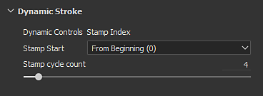
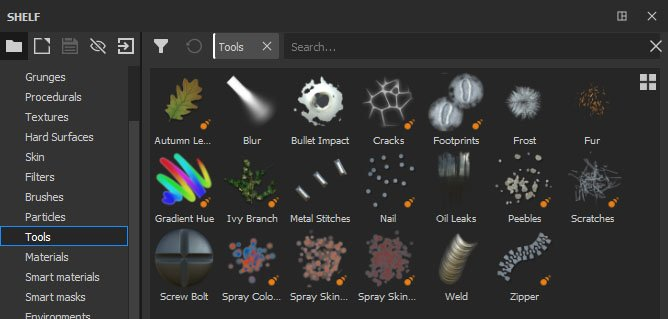
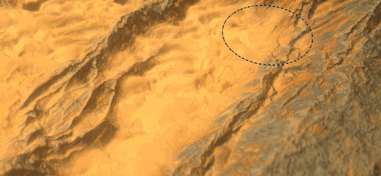
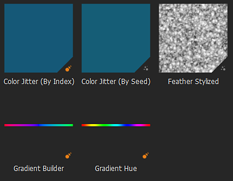

# Version 2019.1

**Substance Painter 2019.1** erweitert seine vorhandenen Funktionen und führt auch neue künstlerische Tools ein. Diese Version konzentriert sich auch auf die Bereitstellung vieler neuer Inhalte.

Freigabedatum: *23. April 2019*

## Wichtigste Funktionen

### Dynamische Pinselstriche

Mit dieser Version unterstützt unsere Pinsel-Engine jetzt das, was wir Dynamische Pinselstriche nennen. Diese Art von Konturen erzeugt Variationen und neue Effekte, da schnell neue Substance-Versionen generiert werden. Jetzt ist es möglich, für jeden neuen Pinselstrich, der auf Ihrem Element gemalt wird, ein neues Substance-Material oder Alpha zu verwenden.

Wenn eine Ressource geladen wird, die mit dynamischen Konturen kompatibel ist (Farbe, Radiergummi, Verwischen oder Kopierstempel), wird eine neue Parametergruppe angezeigt:

Dynamische Pinselstriche unterstützt die folgenden Eigenschaften (sofern diese im Substance-Diagramm angezeigt werden):

* **Stempelindex** : ID/Nummer eines Stempels innerhalb einer Kontur.
* **Zufallsverteilung** : Kann pro Stempel oder pro Strich geändert werden.
* **Zeit** : Verstrichene Malzeit eines Pinselstrichs beim schnellen oder langsameren Malen führt zu unterschiedlichen Ergebnissen.

Der Stempelindex umfasst noch zwei weitere Parameter:

* **Stempelanfang** : *Von Anfang* (den Index immer von 0 beginnen) oder *Von zufälligem Index* (wählen Sie eine zufällige Position zwischen 0 und dem durch **Stempelzyklusanzahl** definierten Maximum).
* **Anzahl der Stempelzyklen** : Dieser Parameter definiert die Gesamtzahl der generierten Substance-Varianten. Um die Leistung zu optimieren, fungiert dieser Parameter als Grenzwert. Substance Painter verwenden es, um bereits generierte Inhalte zu recyceln, anstatt etwas Neues zu schaffen.

Sie können Ressourcen finden, die mit dieser neuen Funktion kompatibel sind, indem Sie einfach im Regal nach den neuen Symbolen suchen, die jetzt neben ihnen sitzen:

Mit der Funktion kompatible Ressourcen erhalten außerdem automatisch ein neues Tag mit dem Namen &quot;**dynamicstroke**&quot;, damit sie leicht nach Schlüsselwörtern im Shelf gefiltert werden können.

Wir haben auch viele neue **Werkzeugvorgaben** hinzugefügt, um mit Folgendem zu spielen:

{width="450px"}

>[!NOTE]
>
> Weitere Informationen zu dieser Funktion (und ihren Auswirkungen auf die Leistung) finden Sie in der [dedizierten Dokumentation](../../painting/dynamic-strokes/dynamic-strokes.md).

### Versatz und Tesselierung

Substance Painter unterstützt jetzt **Versatz** und **Gittertesselierung** sowohl im Echtzeit-Viewport als auch in Irak. Beide können im Fenster **Shader Settings** unter den Shader-Parametern gesteuert werden.

* **Quellkanal** : Kanal, auf dem die Gitterverformung basiert. Der Standardwert ist &quot;Height&quot;, kann aber auch auf &quot;Versatz&quot; festgelegt werden.
* **Skalierung** : Steuert den Grad der Verformung, die auf das Gitter im Projekt angewendet wird.

* **Unterteilungsmodus** : Einheitliche Länge oder Kantenlänge. Bestimmt, wie der Betrag der Unterteilung berechnet wird.
* **Anzahl der Unterteilungen** : (Modus gleichmäßig) Von 1 bis 32. Bei einem hohen Wert werden mehr Polygone erzeugt, die mehr Details enthalten, aber Leistungsprobleme verursachen können.
* **Maximale Länge** : (Modus Kantenlänge) 1 / Wert. Jeder Polygonrand wird unterteilt, bis jedes Segment dieser Zahl entspricht oder kleiner ist; 1/1 ist dabei die Größe der Szene.

Laden Sie das Beispielprojekt &quot;**Kachelmaterial**&quot; (über **Datei > Beispiel laden**), um diese neue Funktion schnell zu testen:

{width="450px"}{width="450px"}

>[!NOTE]
>
> Ein neuer Filter mit dem Namen &quot;**Height zu Normal**&quot; wurde im Shelf hinzugefügt und kann verwendet werden, um die endgültige Normalzuordnung abzurufen (falls die native Konvertierung nach Substance Painter nicht stark genug ist).

### Maskeneffekt vergleichen

Das Erstellen und Mischen von Materialien kann manchmal etwas schwierig sein. Aus diesem Grund haben wir einen neuen Effekt mit dem Namen &quot;**Maske vergleichen**&quot; erstellt. Mit diesem Effekt können Sie schnell und einfach zwei Kanäle vergleichen und eine Maske erstellen.

Der Effekt &quot;Maske vergleichen&quot; verfügt über die folgenden Eigenschaften:

* **Kanal** : Der Kanal, der zwischen Quelle und Ziel verglichen werden soll, aus dem eine Maske erstellt werden soll.
* **Vergleichen** : Hier stehen drei Parameter zur Auswahl, wie die Maske berechnet werden soll. Die Dropdown-Liste in der Mitte definiert den Vergleichsvorgang (kleiner als, innerhalb der Toleranz, größer als).
* **Konstante** : Wert, mit dem verglichen werden soll, wenn die Vergleichseinstellung auf &quot;konstant&quot; festgelegt ist.
* **Härte** : Steuern Sie die Smoothness/Härte des resultierenden Maskenvergleichs.
* **Histogramm** : Bereitstellen einer Histogrammansicht der Quelle und des Ziels. Nützlich zu wissen, ob sie sich ein bisschen oder überhaupt nicht überlappen (wenn sie nicht überlappen, wird die Maske leer sein).

Um die Einrichtung noch zu vereinfachen, können Sie mit der rechten Maustaste auf eine Ebene klicken und den Tastaturbefehl &quot;**Height mit Maskenkombination hinzufügen**&quot; auswählen, um diese neue Maske schnell zur Ebene hinzuzufügen. Mit diesem Tastaturbefehl wird auch die Füllmethode für den Height-Kanal auf &quot;Normal&quot; gesetzt, anstatt auf die Standardeinstellung &quot;Linear abwedeln (Hinzufügen)&quot;.\

### Radialsymmetrie

Wir haben die Möglichkeiten unseres Symmetrie-Werkzeugs erweitert, um radiale Symmetrie zu handhaben. Es gibt jetzt einen neuen Modus im Menü &quot;Symmetrie-Einstellungen&quot;, um ihn zu aktivieren (verfügbar in der kontextbezogenen Symbolleiste).

Die folgenden Einstellungen sind verfügbar:

* **X / Y / Z** : Steuert die Richtung der Symmetrieachse, die von der Radialsymmetrie verwendet wird.
* **Anzahl** : Die Anzahl der duplizierten Punkte.
* **Winkelbereich** : Die Position der duplizierten Punkte vom ursprünglichen Punkt. Diese Einstellung kann verwendet werden, um einen ganzen Kreis, ein Viertel davon usw. zu erstellen.

Wir haben auch eine kleine Vorschau hinzugefügt, um es einfacher zu machen, die Einstellungen vor dem Malen zu optimieren:

### Neue Projektionsmodi für Füllebenen

Es wurden zwei neue Projektionsmodi mit Füllebenen und Fülleffekten hinzugefügt: **Planar** und **Kugelförmig**. Wir haben außerdem viele neue Parameter hinzugefügt, um das Verhalten der 3D-Projektionen genauer zu steuern.

* **Neuer planarer Projektionsmodus**\
  Mit diesem neuen Modus ist nun das Projizieren einer Ebene möglich. Es kann nützlich sein, um Streifen an Fahrzeugen zu erstellen oder Aufkleber an einer bestimmten Stelle zu platzieren.

  
* **Oberflächenwerkzeug für planare Projektion**\
  Um die Bearbeitung der Planarprojektion zu erleichtern, haben wir außerdem ein neues Steuerelement für den 3D-Manipulator hinzugefügt, den wir **Surface Tool** nennen und auf den mit der Tastenkombination &quot;**Shift+W**&quot; zugegriffen werden kann. Sie können auch über die Kontext-Symbolleiste darauf zugreifen. Beachten Sie, dass dieser neue Modus nur für die planare Projektion verfügbar ist.

  

  
* **Planare Projektionsabschwächung/-schwund**\
  Es stehen mehrere Einstellungen zur Verfügung, um die planare Projektion entweder kontinuierlich oder endlich zu gestalten. Wenn eine Einstellung für das Keulen aktiviert ist, zeigt der gepunktete Rahmen um den Manipulator den Begrenzungsrahmen für die Projektion an und die Mittellinie ist der Punkt, an dem die Projektion beginnt. Durch Skalieren der Projektion können Sie steuern, wie weit sie geht und wann sie zu verblassen beginnt.

  {width="500px"}

  
* **Modus für neue Sphärische Projektionen**\
  Sphärische Projektionen sind jetzt mit diesem neuen Modus ausführbar. Mit ihm können Sie fortgeschrittene Muster erreichen oder leichter gekrümmten Oberflächen folgen.

  {width="350px"}
* **Neue Einstellungen für das Zuschneiden von Formen**\
  3D-Projektionen verfügen jetzt über eine Einstellung, die die Wiederholung der Projektion steuert. Sehr nützlich zum Beispiel für einen Aufkleber, der nur in einem bestimmten Bereich wiederholt wird, ohne ihn manuell maskieren zu müssen.

  {width="500px"}
* **Vorhandene Einstellungen verschoben und umbenannt**\
  Aufgrund dieser neuen Projektionen haben wir die Funktionsweise einiger Einstellungen ein wenig überarbeitet. Beispiel: &quot;**Titel**&quot; wurde umbenannt und hat &quot;**Abwicklung**&quot;. Die Kachelung kann jetzt nur noch vertikal oder horizontal eingestellt werden. Skalierung, Drehung und Offset sind jetzt Teil der neuen Parametergruppe &quot;**UV-Transformationen**&quot;, damit sie in den Projektionsmodi einheitlicher sind.

  

  
* **Der All-Axis-Modus des Rotationsmanipulators wurde verbessert** Anstatt eine explizite Kugel zu zeichnen, wird diese jetzt ausgeblendet, um zu vermeiden, dass die unten stehende Texturierung ausgeblendet wird. Wenn Sie zwischen die Achsen klicken, wird die Kugel ausgewählt, mit der alle Achsen gleichzeitig gedreht werden können.\
  

### Verschiedene Verbesserungen

* **Mehrfachauswahl für Textursatz**\
  Die Auswahl mehrerer Textursätze zur gleichzeitigen Änderung der Auflösung über die Textursätze-Einstellungen ist jetzt möglich.\
  Im Mehrfachauswahlmodus wird immer noch von einem &quot;Haupt&quot;-Textursatz gesprochen, weshalb zusätzliche Elemente in Grau ausgewählt werden. Wenn Sie zu einem anderen Textursatz wechseln müssen, während Sie die aktuelle Auswahl beibehalten, können Sie dies mit der mittleren Maustaste tun.
* **Schnelles Ein-/Ausblenden in der Textursatzliste**\
  Sie können jetzt (wie im Ebenenstapel) klicken und ziehen, um Textursätze aus- oder einzublenden.
* **Verbesserte Benutzeroberfläche für Ebenenstapel**\
  Wir haben das Symbol für den Status &quot;Ein-/Ausblenden&quot; einer Ebene geändert, um einheitlicher und verständlicher zu sein. Wir haben auch die Anzeige der ausgewählten Ebenen geändert, um sie besser mit der Auswahl ihrer Effekte und anderer Ebenen zu vergleichen.\
  
* **Neue Effektposition basierend auf aktueller Auswahl** Jeder neue Effekt, der einer Ebene hinzugefügt wird, wird jetzt direkt über der aktuell ausgewählten Ebene platziert.\
  
* **Kurzes Umschalten der Schaltflächen für den Materialkanal**\
  Sie können jetzt ALT drücken und auf eine Kanalschaltfläche klicken, um sie zu isolieren. Wenn Sie erneut klicken, werden alle Kanäle wieder aktiviert.\
  
* **Dithering beim Export** Dithering kann jetzt über eine dedizierte Einstellung im Exportfenster neben dem Dateiformat und der Bittiefe deaktiviert werden. Weitere Informationen dazu, wie und wann Dithering angewendet wird [finden Sie in der Exportdokumentation &#x200B;](../../export/export-window/export-window.md).\
  
* **Bessere Histogramme**\
  Wir überarbeiteten unseren Histogrammgenerator. Histogramme sollten jetzt genauere Informationen anzeigen und nach einer Änderung im Ebenenstapel ordnungsgemäß aktualisieren.\
  
* **Bessere Instanziierung von Ebenen**\
  Für instanzierte Ebenen ist jetzt der Mischmodus auf &quot;Hindurchwirken&quot; festgelegt, anstelle des Standardmischmodus. Dieser Mischmodus verbessert die Kompatibilität einiger Effekte, wenn Ebenen über Textursätze hinweg instanziiert werden.

### Neue Inhalte

In dieser Version haben wir auch viele neue Inhalte hinzugefügt: von der Vorgabe über die Alpha-Ausgabe bis hin zu neuen, leistungsstarken Filtern.

* **Neue Pinsel- und Werkzeugvorgaben**\
  In dieser Version wird die neue Funktion &quot;Dynamische Pinselstriche&quot; eingeführt und mit ihr wurden einige gebrauchsfertige Pinsel- und Werkzeugvorgaben hinzugefügt.

  * 10 neue Pinselvorgaben :
    * Ink Dirty
    * Freihand-Zufallswert
    * Blattwölbung stark
    * Blattwölbung
    * Blätterteppich
    * Leaf Simple
    * Blätterwirbel
    * Zigzag Long
    * Zigzag Short
    * Zigzag Step
  * 11 neue Werkzeugvorgaben :
    * Herbstlaub
    * Risse
    * Fußabdrücke
    * Farbverlauf
    * Nagel
    * Kieselsteine
    * Kratzer
    * Sprühfarben
    * Sprühhautlicht
    * Rote Haut
    * Reißverschluss
* **93 neue Alpha**\
  Es gibt zu viele, um sie alle aufzuzählen, also schauen Sie sich den Abschnitt &quot;Alphas&quot; des Regals an und Sie werden viele neue Pfeile, Dreiecke, Schilder und andere Formen sehen.
* **13 neue Filter**\
  Wir haben in dieser neuen Version viele neue Filter, die für eine verlorene Situation sehr praktisch sein können:

  * **Steigung weichzeichnen** : Ein neuer Weichzeichnungsfilter wurde der Familie hinzugefügt. Dieser Filter funktioniert ähnlich wie der Verkrümmungsfilter : Verwenden Sie die vorhandene Eingabe oder eine benutzerdefinierte, um den Zielkanal zu verwischen.
  * **Abgeflachte Kante** : Erstellt einen Verlaufsrahmen um eine Form, der nützlich ist, wenn Sie beispielsweise die Maske erweitern möchten.
  * **Farbabgleich** : Dieser Filter versucht, eine Quellfarbe mit einer Zielfarbe abzugleichen. Praktisch zum Anpassen von Farben auf einem Material.
  * **Verlaufskurve** : Dieser Filter bietet eine Liste von Kurvenvorgaben, die auf jede Graustufeneingabe angewendet werden können, um ihren Look zu ändern.
  * **Dynamischer Verlauf** : Ordnet eine Graustufeneingabe einem neuen Eingabebild (Graustufen oder Farbe) neu zu.
  * **Height anpassen** : Dieser Filter bietet zwei Einstellungen, mit denen Sie den Height-Kanal ganz einfach bearbeiten können: Versatz und Multiplizieren.
  * **Height auf Normal** : Dieser Filter wandelt den Height-Kanal in einen Normal-Kanal um und übergibt ihn an den Normal-Kanal. Es hat verschiedene Intensitätskontrollen je nach Bedarf.
  * **Maskenkontur** : Dieser Filter erstellt einen weißen schwarzen Rahmen um eine Graustufeneingabe. Dies ist am nützlichsten in Masken, um Rahmen um Formen zu erstellen.
  * **PBR-Validierung** : Wir haben diesen Filter hinzugefügt, um zu überprüfen, ob Ihre PBR-Materialfarben im richtigen Bereich sind. Weitere Informationen finden Sie im [PBR-Handbuch](https://www.allegorithmic.com/pbr-guide) !
  * **MatFX Peeling Paint** : Simuliert, wie alte Farbe sich ablöst. Dieser Filter gibt Alpha aus, wodurch die Überblendung mit den darunter liegenden Materialien erleichtert wird.
  * **MatFx Wassertropfen** : Simuliert Wassertropfen auf der Oberfläche eines Objekts. Wie Wasser auf einem Auto nach dem Regen.
* **7 neue Generatoren**\
  In dieser Version haben wir einige neue Generatoren hinzugefügt:

  * **Umgebungs-Verdeckung** : Maskengenerator, der Steuerelemente über die Umgebungsmaske-Verdeckung bietet. Basierend auf dem Maskeneditor.
  * **Normale im Weltraum** : Maskengenerator mit Steuerelementen für die Mesh-Map &quot;World Space Normale&quot;. Basierend auf dem Maskeneditor.
  * **Position** : Maskengenerator mit Steuerelementen für die Positionierungsgitter-Map. Basierend auf dem Maskeneditor.
  * **Krümmung** : Maskengenerator mit Steuerelementen für die Krümmungsgitter-Map. Basierend auf dem Maskeneditor.
  * **Automatisches Zusammensetzen** : Maskengenerator, der Nähte in der Nähe der UV-Ränder, der Gitterkrümmung oder um eine benutzerdefinierte Maskeneingabe herum erstellt.
  * **UV-Texeldichte** : Helper, der einen farbigen Verlauf ausgibt, der auf der Texeldichte der Polygone des Gitters basiert.
  * **UV Random Color** : Generieren Sie eine zufällige Farbe pro UV-Insel (oder basierend auf einer benutzerdefinierten Verlaufseingabe).
* **2 neue Umgebungszuordnungen**

  * Herbstwald
  * Canopus Ground

    
* **5 neue Prozedurale**

  * Farbverlauf
  * Gradient Builder
  * Farbjitter nach Index
  * Farbenjitter nach Seed
  * Weiche Kante stilisiert

    

## Tutorials

Lerne unsere neuesten Funktionen in einem Tutorial kennen:

In diesem Tutorial der Substance Academy erfährst du, wie du einen dynamischen Strich erstellst: [Erstellen einer benutzerdefinierten dynamischen Kontur für Substance Painter](https://academy.allegorithmic.com/courses/Creating-a-custom-Dynamic-Stroke-for-Substance-Painter)

## Versionshinweise

### 2019.1.3

*(veröffentlicht am 01. Juli 2019)*\
Zusammenfassung: **Bugfix mit 2 neuen Funktionen**

**Fest:**

* &quot;Pfad folgen&quot; funktioniert nicht immer
* Kanalzuordnung funktioniert nicht mit SBSAR, das in Einkanal-Steckplätzen verwendet wird
* [Ebenenstapel] Niedrige Leistung beim Scrollen mit ausgeblendeten Ebenen
* [TextureSet] Absturz beim Klicken zwischen Masken
* [SVT] Versatz wird nicht richtig angezeigt und flackert in einigen Fällen
* [Alembic] Absturz mit Gitter mit Punktnormalen anstelle von Scheitelpunktnormalen
* [Alembic][Log] Melden Sie einen Fehler im Log, wenn die Alembic-Datei während des Imports nicht unterstützt wird

### 2019.1.2

*(veröffentlicht am 21. Mai 2019)*\
Zusammenfassung: **HotFix**

**Fest:**

* Absturz beim Auswählen von zwei Ressourcen mit einer Bildeingabe

### 2019.1.1

*(veröffentlicht am 20. Mai 2019)*\
Zusammenfassung: **HotFix**

**Hinzugefügt:**

* Aktualisieren Sie auf die neueste Version von Substance Engine mit der letzten Version von Substance Designer 2019.1

**Fest:**

* [Substance] Sichtbar, wenn bei Eingabebildern nicht berücksichtigt wird
* [SVT][Engine] Das Ändern der Auflösung des Textursatzes führt in einigen Fällen zu einem Absturz
* [Engine] In einigen Fällen werden zufällige schwarze Texturen angezeigt
* [Ebenenstapel][UI] Wenn Sie mit UMSCHALTTASTE eine Maske umschalten, können Sie mehrere Ebenen gleichzeitig auswählen
* [Ebenenstapel] Deckkraft hat keine Auswirkungen auf den Effekt &quot;Malen&quot; mit dem Mischmodus &quot;Hindurchwirken&quot;
* [Ebenenstapel] Die Filtereingabe &quot;Height zu Normal&quot; wird mit dem Pinselstrich des Radiergummis nicht ordnungsgemäß aktualisiert
* [LayersStack] Absturz beim Rückgängigmachen des Ablagevorgangs für eine Smart-Maske
* Flackerndes Drahtgitter mit aktiviertem temporalem Anti-Aliasing
* [Versatz] Verzögerung bei AMD mit einigen schweren Maschen
* [Windows] Absturz beim Öffnen einiger Projekte über den Datei-Explorer
* [Histogramm] Absturz beim Entfernen der Maske mit Ankerpunkt in einigen Fällen
* Absturz beim Generieren der Vorschau in einigen seltenen Fällen
* [Absturz] Ein Projekt kann nicht mit zu vielen Klon- und Verwischen-Werkzeugen erneut geöffnet werden
* Kein Gitter im Materialmodus nach dem Speichern in einigen Fällen angezeigt
* [Scripting] alg.mapexport.documentStructure() gibt falsche Werte für Ordner zurück

**Bekannte Probleme:**

* Durch Doppelklicken auf den Namen des Textursatzes wird dieser vor dem Umbenennungsmodus ausgewählt

### 2019.1

*(veröffentlicht am 23. April 2019)*\
Zusammenfassung: **Dynamischer Pinselstrich mit eigenem neuen Inhalt, Versatz und Tesselierung in Echtzeit und in Irak, Maskenvergleichseffekt, Radialsymmetrie, planar und Sphärische Projektion**

**Hinzugefügt:**

* [Werkzeug] Dynamischer Strich: Substance-Variation entlang eines Pinselstrichs
* [Dynamischer Strich] Stellen Sie einen neuen Stempelindexparameter mit Optionen bereit.
* [Dynamischer Strich] Parameter $time berücksichtigen
* [Dynamischer Strich] Generieren eines neuen $randomseed-Parameters pro Strich und pro Stempel
* [Dynamischer Strich] Starten eines dynamischen Strichindex aus einer zufälligen Zahl
* [Dynamischer Strich][Ablage] Helfen Sie, eine dynamische Strichressource mit einem neuen Symbol zu finden.
* Versatz und Tesselierung im Echtzeit-Viewport
* Versatz und Tesselierung in Iran
* [Shader settings][UI] Neue Registerkarte für die Steuerung von Versatz und Tesselierung
* [Ebenenstapel] Neuer Effekt &quot;Maske vergleichen&quot;: durch Vergleich zweier Kanäle eine Maske generieren
* [Ebenenstapel][UI] Neuer Eintrag im Rechtsklick-Menü &quot;Height mit Maskenkombination hinzufügen&quot;, um einen CompareMask-Effekt einzufügen
* [Symmetrie] Neuer Symmetriemodus: Radialmalerei
* [Symmetrie-Einstellungen] Erweitern Sie beide Abschnitte &quot;Einstellungen&quot; und &quot;Anzeige&quot;.
* [Symmetrie-Einstellungen][UI] Vorschau für radiales Malen
* Zeigen Sie zwei neue Projektionsmodi an: planar und sphärisch
* [Proj] Neuer Formzuschneidemodus für alle Projektionen
* [Proj] Planarer Modus mit neuem Manipulator: Oberflächenwerkzeug
* [Proj][Shortcut] Shortcut UMSCHALTTASTE+W für Oberflächenwerkzeug
* [Proj] Planare Projektionsmaskierung mit Tiefe ausblenden- und Rückseitenschälung
* [Manipulator] Verbesserung des Rotationsmanipulators auf allen drei Achsen für triplanar
* [Tool][UX] Alt-Klick auf einen Kanal fokussiert diesen Kanal (aktiviert ihn oder deaktiviert alle anderen)
* [Engine] Update auf die neueste Version von Substance Engine
* [Textursatz] Mehrfachauswahl und Änderung der Auflösung
* [Texturset] Schnelle Aktivierung und Deaktivierung der Textursets
* [Struktursatz] Kombination von Solo- und allen Optionen in einem neuen Menü
* [Textursatz][Ebenenstapel] Neues Symbol für Aktivierung und Deaktivierung
* [Ebenenstapel][UX] Einfügen von Effekten über den bereits ausgewählten
* [Ebenenstapel][UI] Auswahlstil für Ebenenstapelansicht überarbeiten
* [Ebenenstapel] Der Mischmodus für instanzierte Ebenen ist jetzt standardmäßig im Durchlaufmodus
* [Export] Option zum Aktivieren und Deaktivieren des Dithering
* [Plugin] Präzisionsmodifikator für Schieberegler unterstützen (SHIFT)
* [Plug-in][UI] Neues Symbol für automatisches Speichern
* [Scripting] Auflisten des Inhalts eines Ordners
* [Scripting] Löschen von Dateien zulassen
* [Skripterstellung] Lesen aller Stapelinformationen, einschließlich der verwendeten Ressourcen
* [Inhalt][Dynamischer Strich] Neue Werkzeuge und Pinselvorgaben
* [Inhalt][Dynamischer Strich] Zwei neue prozedurale Verläufe: Farbton und Verlaufsgenerator
* [Inhalt] 11 neue Filter: MatFx Peeling Paint, MatFx Wassertropfen und mehr
* [Inhalt] 7 neue Generatoren: Auto Stitcher, UV Random Color, UV Texel Density und mehr
* [Inhalt] 93 neue Alphas: neue Texte, Pfeile und verschiedene andere Formen
* [Inhalt] 2 neue Verfahren: Verlaufsfarbton, Verlaufsgenerator und mehr
* [Inhalt] 21 neue Werkzeug- und Pinselvorgaben für Dynamische Pinselstriche : Kiesel, Fußabdrücke, Spray und mehr
* [Inhalt] 2 Neue HDRs: Canopus Boden- und Herbstwald
* [Inhalt] Aktualisieren von Inhalten mit Kuration nach dem Zufallsprinzip in der Ablage
* [Inhalt] Neues Symbol mit exponierten Zufallsparametern im Regal

**Fest:**

* [Ebenenstapel] Der Ebenenstapel zieht ewig
* [Mac] &quot;Im Finder anzeigen&quot; kann zum Einfrieren führen
* [Scripting] Einstellungen, die über die benutzerdefinierte Benutzeroberfläche gespeichert wurden, gehen verloren, wenn die Shader-Datei verschoben wird
* [Scripting] API-Versionsnummer ist falsch und nicht aktuell
* [Effekt] Histogramminhalt wird nicht korrekt angezeigt
* [Effekt] Der Histogrammeffekt wird in einigen Fällen nicht aktualisiert
* [Shelf] Stiche sind auf Material &quot;Plastic Fabric Pyramid&quot; nicht richtig ausgerichtet.

**Bekannte Probleme:**

* Durch Doppelklicken auf den Namen des Textursatzes wird dieser vor dem Umbenennungsmodus ausgewählt
* [Ebenenstapel][UI] Wenn Sie mit UMSCHALTTASTE eine Maske umschalten, können Sie mehrere Ebenen gleichzeitig auswählen
