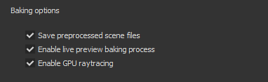
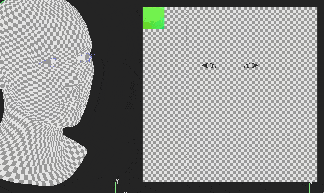
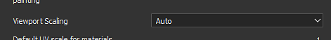

# Version 2019.2

**Substance Painter 2019.2** bietet seinen Bakers neue leistungsstarke Funktionen und stellt eine neue Gruppe von Smart-Materialien und Smart-Masken im Shelf bereit.

Freigabedatum: *25. Juli 2019*

## Wichtigste Funktionen

### Workflow-Verbesserungen für Bäcker

Der Backarbeitsablauf wurde in dieser Version mit einigen neuen Funktionen verbessert. Diese Verbesserungen beschleunigen und erleichtern die tägliche Arbeit mit Substance Painter.

* **Visualisierung des Backprozesses**\
  Standardmäßig wird mit dieser neuen Version jeder Backvorgang im Viewport angezeigt. Es ermöglicht, das Ergebnis der Bäcker in Echtzeit in der Vorschau und sogar abbrechen, wenn nötig, ohne bis zum Ende des Prozesses warten, um schnellere Iterationen bieten. Dieses Verhalten kann deaktiviert werden, indem Sie in den Haupteinstellungen die Einstellung &quot;**Live-Vorschau-Backvorgang aktivieren**&quot; im Abschnitt &quot;**Backoptionen**&quot; deaktivieren.

  

  {width="500px"}
* **Verbessertes Backdialogfeld**\
  Der Backdialog wurde überarbeitet und zeigt nun einen besseren Status des aktuellen Backprozesses an. Es gibt jetzt einen Zähler, der angibt, wie viele Texturen berechnet werden, sowie eine explizite Liste pro Bäcker und Textursatz, der angibt, was berechnet wird. Bei einem Fehler wird neben dem Bäckernamen ein rotes Kreuz angezeigt. Am Ende des Vorgangs können Sie über eine neue Schaltfläche das Protokollfenster schnell öffnen, um mehr über das Problem zu erfahren.\
  
* **Backen wird abgebrochen** Der Backvorgang sperrt die Anwendung nicht mehr. Substance Painter reagiert jetzt reaktionsfähiger, d. h. es ist möglich, ein Backen, das gerade in Bearbeitung ist, abzubrechen, ohne darauf zu warten, dass es beendet wird. Die Kündigung erfolgt jedoch nicht sofort und kann einige Sekunden dauern, bis sie wirksam wird. Dies liegt daran, dass der interne Backprozess an Texturen in Blöcken arbeitet und nicht anhalten kann, während ein Block berechnet wird. Wenn Sie den Backvorgang abbrechen, wird das Fenster &quot;Backen&quot; automatisch wieder geöffnet.\
  

### Leistungsverbesserungen für Bäcker

Mit der Workflow-Verbesserung haben wir auch die Gelegenheit genutzt, unsere Bäcker zu aktualisieren und ihre Leistung zu verbessern. Wir haben auch die Unterstützung von DXR und OptiX hinzugefügt, um GPU-Raytracing zu aktivieren, die es ermöglicht, viel schneller als zuvor zu backen. Beachten Sie jedoch, dass sich GPU-Raytracing nur auf die Verdeckung &quot;Umgebung&quot; und die Thickness auswirkt.

* **CPU-Raytracing wurde verbessert**\
  Die Raytracing-Berechnung auf der CPU ist jetzt 2- bis 3-mal schneller als zuvor. Selbst wenn Ihre GPU mit GPU-Raytracing nicht kompatibel ist, erhalten Sie daher im Allgemeinen trotzdem Leistungsverbesserungen.
* **GPU-Raytracing-Unterstützung mit DXR und Optix**\
  Mit kompatibler Hardware können die Bäcker jetzt direkt auf der GPU berechnen, was die Rechenzeit drastisch reduziert, insbesondere wenn Anti-Aliasing aktiviert ist und viele Strahlen definiert sind. DXR ist die Standardoption, sofern verfügbar, andernfalls wird Optix verwendet. Sie können GPU-Raytracing deaktivieren, indem Sie in den [Haupteinstellungen](../../interface/settings/settings.md) nach &quot;**Backing-Optionen**&quot; suchen:

  

>[!NOTE]
>
> Um die GPU-Raytracing-Funktion zu aktivieren, stellen Sie sicher, dass Sie auf die folgenden Treiber aktualisieren: **NVIDIA-Treiber 430.86**.\
> DXR ist auf RTX-GPUs und [GeForce GTX 10xx-GPUs](https://www.nvidia.com/en-us/geforce/news/geforce-gtx-dxr-ray-tracing-available-now/) verfügbar. Für DXR muss Windows 10 ebenfalls auf dem neuesten Stand sein, damit der Zugriff möglich ist (Version 1809). Weitere Informationen finden Sie auf dieser Seite.

>[!WARNING]
>
> Bei Verwendung von GPU-Raytracing kann der Bäcker fehlschlagen, wenn das High-Poly-Gitter nicht in VRam passen kann. Wenn dies der Fall ist, wird empfohlen, die [Haupteinstellungen](../../interface/settings/settings.md) aufzurufen und die Einstellung &quot;**GPU-Raytracing**&quot; im Abschnitt &quot;**Backing Options**&quot; zu deaktivieren. Danach können Sie den Backvorgang einfach neu starten.

### Verschiedene neue Funktionen und Verbesserungen

In dieser Version haben wir auch einige Dinge hinzugefügt und überarbeitet, um die Lebensqualität im Substance Painter zu verbessern.

* **Verbesserter Rotationsmanipulator**\
  Der Rotationsmanipulator war in der Vergangenheit etwas langsam, sodass Drehungen manchmal langwierig durchzuführen waren. Die Drehgeschwindigkeit ist jetzt mit der Kamera und der Szenengröße verknüpft.
* **Verbesserte Leistung auf Bildschirmen mit hoher DPI-Auflösung mit Verkleinerung des Ansichtsports**\
  In den [Haupteinstellungen](../../interface/settings/settings.md) gibt es jetzt einen neuen Parameter mit dem Namen &quot;Viewport-Skalierung&quot; mit dem Wert &quot;**Keine**&quot; und &quot;**Auto**&quot; (Standard). Wenn der Substance Painter erkennt, dass ein Bildschirm die HDPI-Skalierung verwendet (z. B. Retina-Bildschirme auf dem MacOS), wird die Viewport-Auflösung automatisch durch 2 dividiert. Durch dieses Verhalten wird vermieden, dass der Viewport zu groß gezeichnet wird, und die allgemeine Leistung wird ohne nennenswerten Qualitätsverlust verbessert.

  
* **Neues Konsolen-Plug-in für Skripterstellung**\
  Wir haben ein neues Plug-in erstellt, um Befehle über unsere Scripting-API einfach auszuführen. Es ist auf Github verfügbar: <https://github.com/AllegorithmicSAS/painter-plugin-console> Die Konsole unterstützt auch die automatische Vervollständigung.

  

### Neuer Inhalt

Ein neuer Satz von Smart-Materialien und Smart-Masken wurde zum Standard-Shelf hinzugefügt, um verschiedene Verwendungen abzudecken. Hier ist die vollständige Liste der hinzugefügten Assets:

* **40 neue Smart-Materialien**

  * Gewebe
    * Geknitterte Leinwand
    * Gewebe-Verbundwerkstoff verstärkt verwendet
    * Stoff Denim ausgewaschen
    * Fabric Flannel Tartan
    * Stoff Leinen gefaltet
    * Leinentuch
    * Synthetische Strukturelemente
    * Synthetischer Stoff Sport verwendet
  * Leder
    * Kalbsleder
    * Leder zerknittert
    * Leder natürlich gefärbt
    * Leder, rau, dunkel
  * Marmor – Granit
    * Marble Verde Alpi
  * Metall
    * Gold beschädigt
    * eisengeschmiedeter Alt
    * Stahl lackiert Splitter Schmutzig
    * Stahl lackiert roh beschädigt
    * Steel Painted Scraped Dirty
    * Steel Painted Scraped Green
    * Stahl lackiert verschlissen
    * Stahl ruiniert
  * Biologisch
    * Creature Skin Alien Blue
    * Creature Skin Green Smooth
    * Kreaturenzähne
    * Kreaturenzunge
  * Kunststoff – Gummi
    * Kunststoff staubig
    * Plastic Glossy Scuffed
    * Kunststoff glänzend gefärbt
    * Weich, körnig
    * Kunststoff, grob gekratzt
    * Kunststoff warmgeformt
    * Plastic dick Cracked
    * Abgetragenes Kunststoffwerkzeug
    * Plastic Used Soft
  * Stein
    * Sapphire Corundum
  * Durchscheinend
    * Glasfilm Schmutzspiegel
  * Holz
    * Anthrazit
    * Wood Acajou
    * Holz-Schiffsrumpf Nordic
    * Holzschiff Rumpf alt
* **20 neue Smart Masks**

  * Krümel
  * Dirt Cavities
  * Dirt
  * Dirt-Lecktrocknung
  * Dirt > Weiche Kanten
  * Dirt-Splashes
  * Dirt Spots
  * Dust Kunststoff
  * Dust > Weiche Kanten
  * Dust
  * Dust breiter Kanten
  * Schmutzige Risse in Edge
  * Edge Stone-Risse
  * Ränder stark verkratzt
  * Fabric-Thread
  * Farbe beschädigt
  * Leicht kratzen
  * Sandkasten
  * Sand-Dust
  * Wassertropfen

## Versionshinweise

### 2019.2.3

*(veröffentlicht am 23. Oktober 2019)*\
Zusammenfassung: **Bugfix**

**Hinzugefügt:**

* [Textursatzliste] Schaltfläche &quot;Hinzufügen&quot;, um den Fokusmodus schnell zu aktivieren/deaktivieren
* [Log] Windows 10-Versionsnummer in die Protokolldatei einfügen
* Aktualisieren Sie auf die neueste Version von Substance Engine
* [MacOS] Die Software wurde notariell beglaubigt, um die neuen MacOS Catalina-Verteilungsanforderungen zu befolgen

**Fest:**

* [Plugin] Plugin Source funktioniert nicht
* [MacOS][Shader] Mac OS 10.14.5 und AMD: Materialschichtung funktioniert nicht wie vorgesehen

**Bekannte Probleme:**

* Alembic-Dateien mit Unterteilungen können nicht importiert werden
* Seltene Abstürze beim Importieren einiger Alembic-Dateien
* Benutzeroberfläche reagiert vorübergehend nicht, wenn mit DXR auf Pascal-GPUs gebacken wird

### 2019.2.2

*(veröffentlicht am 20. September 2019)*\
Zusammenfassung: **Bugfix**

**Fest:**

* Das Importieren von Ressourcen durch Skripterstellung kann zu einem Absturz führen
* [Plugin] Das Herunterladen von Material von der Quelle kann zu einem Absturz führen

### 2019.2.1

*(veröffentlicht am 17. September 2019)*\
Zusammenfassung: **Bugfix**

**Fest:**

* [Mac][USD] Exportierte USDZ-Dateien aus MacOS können nicht geöffnet werden.
* [Textursatz] Es ist nicht möglich, einen Textursatz mit dem ALT-Modifizierer zu isolieren.
* [Shelf] Vorgaben, Smart-Materialien und Smart-Masken werden beim Beenden der Anwendung immer geändert
* [Ebenenstapel] Effekt kann nach Löschen eines anderen Effekts nicht ausgewählt werden
* Flackern bei Verwendung eines Schiebereglers im Bedienfeld &quot;Werkzeugeigenschaften&quot;
* Absturz beim Exportieren von Vorgaben in die Ablage
* Absturz beim Exportieren einer Vorgabe mit unzureichendem Speicherplatz
* Absturz beim Erstellen einer Vorgabe mit zu wenig Speicherplatz

**Bekannte Probleme:**

* Alembic-Dateien mit Unterteilungen können nicht importiert werden
* Seltene Abstürze beim Importieren einiger Alembic-Dateien
* Benutzeroberfläche reagiert vorübergehend nicht, wenn mit DXR auf Pascal-GPUs gebacken wird

### 2019.2

*(veröffentlicht am 25. Juli 2019)*\
Zusammenfassung: **Hauptversion mit Aktualisierungen der Bäcker in Bezug auf die Leistung und einen neuen Vorvisualisierungsmodus + neuen Inhalt**

**Hinzugefügt:**

* [Bäcker] Zusätzliche Unterstützung für GPU-Raytracing mit DXR und OptiX (Ambient Verdeckung, Thickness)
* [Bäcker] Optimierungen und Beschleunigungen für CPU Raytracing
* [Bäcker][Vis-Modus][UI] Neuer Visualisierungsmodus für Backen im Viewport
* [Bäcker][Voreinstellungen][UI] Neue Backing-Option zum Aktivieren/Deaktivieren von GPU-Raytracing
* [Bäcker][UI] Überarbeitung des Fortschrittsbalken-Dialogfelds
* [Bäcker] Verbesserung von Warn- und Fehlermeldungen
* [Bäcker] Ermöglicht reaktionsschnelleres Abbrechen des Backvorgangs
* [Bäcker] Backfenster nach Klicken auf &quot;Abbrechen&quot; erneut öffnen
* [Proj][UX] Verbesserung der Benutzerfreundlichkeit des Rotationsmanipulators
* [Einstellungen] Option zur Leistungsverbesserung durch Reduzierung der Viewport-Auflösung für HDPI-Bildschirme
* [Skripterstellung] Ändern der Auflösung des Textursatzes
* [Skripterstellung] Ausgewählten Textursatz abrufen
* [Scripting] Benutzer können einen Textursatz auswählen
* [Scripting] Funktion, um zu erfahren, wann die Auswahl der Texturmenge geändert wurde
* [Shelf] 40 neue Smart-Materialien hinzugefügt
* [Shelf] 20 neue Smart-Masken hinzugefügt

**Fest:**

* [Ebenenstapel] Einfrieren der Benutzeroberfläche bei Mehrfachauswahl von Ebenen
* [Ebenenstapel] Wenn viele Ebenen gruppiert werden, friert die Benutzeroberfläche länger als gewöhnlich ein
* [Ebenenstapel] In einigen Fällen können eine Ebene und ein Effekt gleichzeitig ausgewählt werden.
* In Malwerkzeugen verwendete Substance-Grafiken werden nicht mit der richtigen Auflösung erstellt
* [Baker] Schaltfläche &quot;Alle Textursätze backen&quot; ist nicht deaktiviert, wenn keine Bäcker ausgewählt sind
* [MacOS] Deaktivieren der Warnmeldung zur Tesselierung
* Das Projektionswerkzeug hat bei Verwendung mit einer Maske keine Vorschau
* Abstürze und beschädigte Projekte beim Versuch, mit unzureichendem Speicherplatz zu speichern
* [Shelf] Absturz beim Importieren einer Ressource auf dem Datenträger über das Shelf mit unzureichendem Speicherplatz
* [Shelf] Absturz beim Wiederherstellen der Sitzungsvorgabe
* [Shelf] Das Importieren einer Voreinstellung mit einem Namen, der mit einem Leerzeichen endet, führt zu einem Absturz
* [Shelf] Das Importieren einer Ressource mit einem Präfix, das mit einem leeren Bereich endet, führt zu einem Absturz

**Bekannte Probleme:**

* Alembic-Dateien mit Unterteilungen können nicht importiert werden
* Seltene Abstürze beim Importieren einiger Alembic-Dateien
* Benutzeroberfläche reagiert vorübergehend nicht, wenn mit DXR auf Pascal-GPUs gebacken wird
