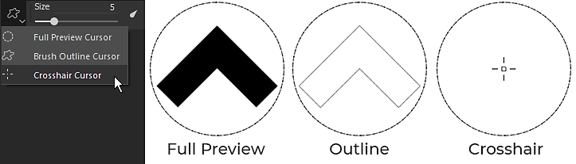
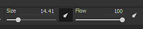
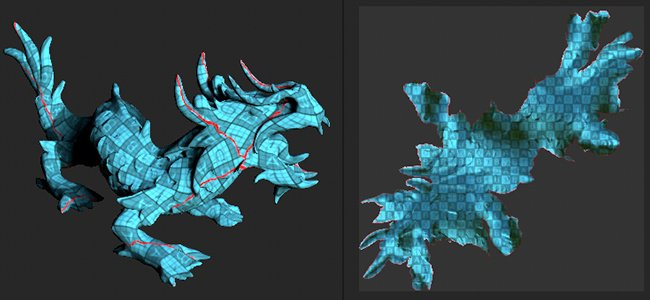
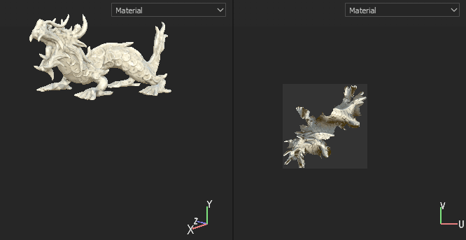
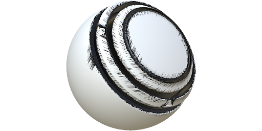
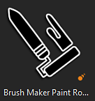

# Version 2019.3

**Substance Painter 2019.3** bietet Unterstützung für Photoshop-Pinselvorgaben und automatische UV-entpack für Ihre Mesh sowie verschiedene Verbesserungen der Lebensqualität, z. B. eine bessere Handhabung von Grafiktabletts.

Freigabedatum: *17. Dezember 2019*

## Wichtigste Funktionen

### Unterstützung für Photoshop-Pinselvorgaben (ABR)

Sie können Ihre Photoshop-Pinsel jetzt in der Substance Painter verwenden. Indem Sie Ihre Vorgaben einfach als ABR-Datei exportieren, können Sie sie jetzt als normale Pinselvorgaben importieren. In ABR-Dateien enthaltene Vorgaben werden im Regal als individuelle Pinselvorgaben angezeigt.

Wenn Sie keine ABR-Dateien zum Importieren haben, können Sie viele davon online finden:

* [Kyles Pinselvorgaben auf dem Adobe](https://www.adobe.com/products/photoshop/brushes.html)
* [Pinselvorgaben auf ArtStation](https://www.artstation.com/marketplace?q=photoshop%20brush&sort_by=trending)
* [Pinselvorgaben zu DeviantArt](https://www.deviantart.com/search?q=photoshop%20brush)
* [Pinselvorgaben für Cubebrush](https://cubebrush.co/marketplace?categories=354,57)

Um Photoshop-Pinsel zu unterstützen, wurden verschiedene neue Funktionen zu den Eigenschaften des Malwerkzeugs hinzugefügt:

* **Neue Mindestparameter für Größe und Fluss**\
  Sie können jetzt die Mindestgröße und den Mindestfluss des Werkzeugs angeben, wenn &quot;Stift-Druck&quot; aktiviert ist. Dieser Parameter arbeitet als Prozentsatz basierend auf der aktuellen maximalen Größe/dem aktuellen definierten Fluss. Diese Einstellungen werden automatisch kalibriert, wenn Sie eine Photoshop-Pinselvorgabe verwenden.\
  
* **Neue Positions-Jitter-Parameter**\
  Um das Pinselverhalten von Photoshop anzupassen, haben wir einige neue Einstellungen hinzugefügt. Es ist jetzt möglich zu definieren, auf welche Achse der Jitter angewendet wird und wie zufällige Positionen verteilt werden (wählen Sie **Uniform**, um mit Photoshop übereinzustimmen).\
  \
  
* **Modus für neue Alpha-Überblendungen**\
  Photoshop setzt seine Pinselstriche nicht so zusammen wie Substance Painter. Daher haben wir einen neuen Mischmodus (Aufhellen) hinzugefügt, um das Malergebnis besser aufeinander abzustimmen. Diese Füllmethode überkumuliert sich nicht, wenn sich Stempel überlappen, was das Druckgefühl beim Malen mit einem niedrigen Fluss-/Deckkraftwert verbessern kann.\
  \
  
* **Unterstützung für Rundheit und Spiegelung**\
  Ein neues Substance-Alpha mit dem Namen &quot;**Brush Maker Photoshop**&quot; wurde hinzugefügt, um Parameter wie &quot;Rundheit&quot; (Skalieren des Heights des Alphas) und &quot;Spiegeln&quot; (Spiegeln eines Bildes auf beiden Achsen) zu unterstützen. Dieses Substance-Alpha wird automatisch geladen, wenn Sie auf eine Pinselvorgabe klicken, die aus einer ABR-Datei stammt.\
  \
  
* **Neue Gammakorrektur für den Alphakanal von Ebenen**\
  Photoshop überblendet seine Pinselstriche nicht mit dem linearen Gamma-Raum, was bedeutet, dass beim Malen mit einer Photoshop-Pinselvorgabe Füllen und Deckkraft falsch aussehen können. Eine neue Einstellung kann für Ebenen aktiviert werden, um dieses Verhalten anzupassen und eine Gamma-Korrektur anzuwenden. Dies wirkt sich auf das Alpha aus, das zum Malen von Pinselstrichen verwendet wird, sowie darauf, wie die Ebenenmaske verwendet wird, um sich mit anderen Ebenen zu mischen. Die Füllmethoden der Ebene werden jedoch weiterhin im linearen Gamma-Raum angewendet.\
  Um **diese Einstellung zu aktivieren**, klicken Sie einfach mit der rechten Maustaste auf eine Ebene und wählen Sie **Gamma-korrigiertes Alpha/Maske** aus. Neben der Ebene wird ein neues Symbol angezeigt, das anzeigt, wenn diese Einstellung aktiviert ist.\
   \
  
* **Erhöhter Maximalwert für Abstand und Positions-Jitter**\
  Um die Parameter der Photoshop-Pinselvorgaben korrekt abzustimmen, wurde der Höchstwert der folgenden Parameter erhöht:

  * **Abstand**: maximum kann nun auf 1000 gesetzt werden.
  * **Positions-Jitter**: maximum kann nun auf 1000 gesetzt werden.

Weitere Informationen, z. B. zum Exportieren und Importieren von ABR-Dateien, finden Sie in der Dokumentation zu [Photoshop-Pinselvorgaben](../../painting/presets/photoshop-brush-presets/photoshop-brush-presets-abr.md).

>[!NOTE]
>
> Derzeit werden nicht alle Photoshop-Pinselparameter unterstützt. Weitere Informationen finden Sie in der [Kompatibilitätsliste](../../painting/presets/photoshop-brush-presets/photoshop-brush-parameters-compatibility.md).

### Verbesserungen bei der Unterstützung von Malen- und Grafiktabletts

Neben der Unterstützung von Photoshop-Pinselvorgaben wurden zahlreiche Verbesserungen und Korrekturen bei der Verwendung von Grafiktabletts vorgenommen.

* **Der erste Stempel der geraden Linie wird nicht mehr verdoppelt**\
  Beim Malen einer geraden Linie wird der erste Stempel nicht mehr dupliziert (Sie müssen Ihren Stempel nicht mehr rückgängig machen, nur um die gerade Linie in Position zu bringen).\
  
* **Interpolation des Drucks für gerade Linien**\
  Gerade Linien unterstützen jetzt Druck. Der Druckwert wird zwischen dem ersten und dem letzten Stempel interpoliert.\
  
* **Neue Pinselvorschaumodi**\
  Die Pinselvorschau im Viewport kann nun auf verschiedene Visualisierungsmodi umgestellt werden. Um den Modus zu ändern, klicken Sie einfach auf die neue Dropdown-Schaltfläche in der kontextabhängigen Symbolleiste.

  
* **Stift-Druckkurven**\
  In der kontextabhängigen Symbolleiste kann nun definiert werden, wie der Stift interpretiert werden soll. Diese neuen Einstellungen steuern, wie schnell der Druckaufbau erfolgt, der verschiedene Malstile ermöglicht.

  * **Linear**: Keine Transformation, der Druck, der vom Grafiktablett-Stift aufgebracht wurde. Verwenden Sie diese Einstellung, wenn in den Einstellungen für Tablet-Treiber bereits eine Druckkurve für den Stift definiert ist.
  * **Langsam einschwenken** (Standard): Verlangsamen Sie den Druckbeginn, sodass Sie leichter dünne oder schwache Pinselstriche Malen werden können.
  * **Langsam einschwenken**: Verlangsamen Sie den Anfang des Drucks, und beschleunigen Sie das Ende, sodass Sie leichter weiche oder starke Pinselstriche zeichnen können.

  
* **Die Druckschaltfläche ist kein Dropdown mehr**\
  Wir haben die Stift-Drucksteuerungen durch einfache Ein-/Aus-Tasten ersetzt. Dadurch wird die Aktivierung und Deaktivierung des Drucks wesentlich einfacher und schneller.

  
* **Verbesserte Unterstützung für Grafiktabletts und Wechsel zu Windows Ink**\
  Wir haben unseren Umgang mit Grafiktabletts überarbeitet. Dies sollte die Kompatibilität im Allgemeinen mit den neuesten Modellen von Grafiktabletts verbessern und die Anzahl der Probleme verringern, die wir in der Vergangenheit hatten. Unter Windows haben wir auch auf Windows Ink anstatt auf Wintab umgestellt, um die Kompatibilität zu verbessern.

  >[!NOTE]
  >
  > Stellen Sie sicher, dass Ihre Wacom-Treiber auf dem neuesten Stand sind und dass &quot;Windows Ink&quot; in den Tableteinstellungen aktiviert ist.

### Automatisches UV-Auspacken (Beta)

Substance Painter entpackt jetzt automatisch Mesh mit fehlenden UV-Koordinaten. Dies ermöglicht, jede Art von Geometrie zu importieren und sofort zu malen beginnen. Unser Entpackend UV-System generiert eine UV-Insel pro Sub-Mesh, während es gleichzeitig die Material-Zuweisung zum Erstellen von Textursätzen befolgt. Diese Funktion befindet sich derzeit in der Beta-Version und wird in zukünftigen Versionen weiterentwickelt. Der automatische Entpack wird nur auf Projekte angewendet, die **den UDIM-Workflow nicht verwenden**.

* **Automatisch Entpackend UV**\
  Standardmäßig generiert der Substance Painter jetzt automatisch UV-Koordinaten für Gitter, bei denen sie fehlen. Dies gilt sowohl für die Projekterstellung als auch für den erneuten Netzimport. Es ist jedoch möglich, dieses Verhalten zu deaktivieren, indem Sie die [Haupteinstellungen](https://helpx.adobe.com/substance-3d/unlisted/documentation/spdoc/general-71008262.html) aufrufen und **Automatische UV-entpack aktivieren** unter **Importoptionen** deaktivieren.

  
* **Fortschrittsleiste wird Entpackt**.\
  Beim Importieren eines Gitters wird jetzt ein Fortschrittsbalken angezeigt, der den aktuellen Status des Prozesses angibt. Dazu gehört auch der UV-Entpackungsprozess.

  
* **Derzeit bekannte Probleme**\
  Da sich diese neue Funktion derzeit in der Beta-Version befindet, sind einige Probleme zu erwarten. Eine Liste der derzeit bekannten Probleme finden Sie in den Versionshinweisen unten. Wenn die Anwendung einen Absturz verursacht und falsche Ergebnisse liefert, empfehlen wir, uns einen Absturz- oder Fehlerbericht über die Anwendung zu senden, damit wir das Problem untersuchen und den Prozess verbessern können.

>[!NOTE]
>
> Ein neuer **Generator** wurde dem Regal hinzugefügt, um den automatischen entpack zu veranschaulichen. Um sie zu verwenden, erstellen Sie einfach eine neue Ebene, fügen Sie einen Generatoreffekt hinzu und laden Sie die neue **UV Checker**-Ressource in diese ein.

### Verbesserungen an der Substance-Integration

Wir verbessern weiterhin die Integration des Substance-Formats, indem wir einige seit langem erwartete Funktionen unterstützen, aber auch indem wir bestehende Systeme wie die Dynamic Stroke-Funktion verbessern.

* **Nicht mit Reglern für weiche Bereiche eingeklemmt**\
  Bisher verhielten sich gelegt Schieberegler von Substance Graf immer wie eingespannt. Das bedeutet, dass die Werte, die eingegeben werden konnten, nicht über die durch den Parameter definierten standardmäßigen Mindest- und Höchstwerte hinausgehen konnten.

  
* **Unterstützung des in den Parametern definierten Schritts**\
  Substance-Graf mit Parametern mit einem definierten Schritt werden jetzt bei der Anpassung des Schiebereglers berücksichtigt.
* **Erhöhte Zifferngenauigkeit für Gleitkommaregler**\
  Gleitender Schieberegler kann jetzt Eingabewerte haben, die auf 6 Dezimalstellen nach unten gehen. Dies ist jedoch durch Gleitkomma-Präzision begrenzt, was bedeutet, dass die eingegebenen Werte in einigen Fällen gerundet werden können.
* **Neues Steuerelement für zufälliges Seed mit Dynamischen Pinselstrichen**\
  Es ist nun möglich, mehrere Zufallswerte mit einem definierten Bereich anzufordern. Dies ermöglicht es, einzigartige und zufällige Substance-Varianten zu erstellen und gleichzeitig eine gute Leistung zu erzielen, indem Sie von der Cache-Wiederverwendung profitieren.\
  Wechseln Sie unter der Gruppe &quot;Dynamische Kontur&quot; den Parameter &quot;**Zufallsverteilungstyp&quot;**&quot; in &quot;**Zufällig pro Kontur&quot;**&quot; oder &quot;**Zufällig pro Stempel&quot;**&quot;, um auf den neuen Parameter zuzugreifen. Der **zufällige Beispielbetrag** legt fest, wie viele Substance-Varianten insgesamt generiert werden. Innerhalb des Satzes werden bereits zufällige Variationen ausgewählt, sobald der ausgewählte Betrag generiert wurde.

  
* **Statische Dynamische Pinselstriche für neue Benutzerdaten**\
  Es wurde eine neue Optimierung hinzugefügt, mit der angegeben werden kann, wann eine Substance als dynamischer Strich betrachtet werden kann. Ähnlich wie &quot;Sichtbar wenn&quot; können jetzt Bedingungen im Benutzerdatenfeld hinzugefügt werden, um anzugeben, unter welchem Bedingungs-Substance Painter neue Substance-Varianten mit der Funktion &quot;Dynamische Kontur&quot; generiert werden sollen. Weitere Informationen finden Sie in der Dokumentation zu [Benutzerdaten](../../content/creating-custom-effects/user-data.md).
* **Neue Benutzerdaten, um einen Ausgabeknoten als Maske für alle Kanäle festzulegen**\
  Auf einem Ausgabeknoten können jetzt neue Benutzerdaten hinzugefügt werden, um sie als Alphamaske für alle anderen Kanäle zu verwenden. Dies ähnelt dem bestehenden System **Channels\_Alpha**, muss jedoch keine neue dedizierte Ausgabe im Substance-Graf erstellen. Weitere Informationen finden Sie in der Dokumentation zu [Benutzerdaten](../../content/creating-custom-effects/user-data.md).

### Verschiedene Verbesserungen

In der übrigen Anwendung wurden verschiedene Verbesserungen vorgenommen, die für die tägliche Arbeit in der Substance Painter hilfreich sein sollten.

* **Fokus auf unabhängige Viewport**\
  Der 2D- und 3D-Fokus (F-Tastaturbefehl) wurde wie folgt geändert:

  * **Bewegen Sie den Mauszeiger über die 2D-Ansicht**: Durch Drücken von F wird nur die 2D-Ansicht fokussiert.
  * **Mauszeiger über die 3D-Ansicht bewegen**: Durch Drücken von F wird nur die 3D-Ansicht fokussiert.
  * **Maus außerhalb der Viewport**: Durch Drücken von F können Sie die 2D- und 3D-Ansicht fokussieren.

  {width="400px"}
* **Tastatur- und Menübefehl für Backup-Fenster**\
  Es gibt zwei Möglichkeiten, das Fenster &quot;Baking&quot; zu öffnen:

  * Durch Drücken von **Strg+Umschalt+B**.
  * Indem Sie im Menü &quot;Bearbeiten&quot; auf **Baking-Mesh-Map** klicken.

  
* **Scroll-Docks und Windows mit Strg+Alt+Linksklick auf Tastaturbefehl**\
  Es wurde ein neuer Tastaturbefehl hinzugefügt, der das Scrollen von Fenstern und Docks ohne das Mausrad ermöglicht. Was dieser Tastaturbefehl ist es nun möglich, mit dem Stift des Grafiktabletts zu scrollen.

  
* **Leistungsverbesserungen**\
  Im Hintergrund wurden zahlreiche Optimierungen vorgenommen, die die Gesamtleistung des Substance Painters verbessern sollen (von Eröffnungsprojekten bis hin zum Malen).

### Neue Inhalte

In dieser Version wurden viele neue Inhalte hinzugefügt:

* **Das Beispielprojekt &quot;Meet Mat&quot; wurde aktualisiert**\
  Mat wurde mit einer neuen Topologie aktualisiert, sodass es freundlicher mit Versatz ist. Die ID-Map wurde überarbeitet, um mehr Maskierungsmöglichkeiten zu bieten, und eine neue Reihe von Kameras ist im Projekt verfügbar, um neue Blickwinkel zu bieten.

  {width="500px"}
* **Neue Filter**\
  Drei neue Filter wurden hinzugefügt, um stilisierte Inhalte zu vereinfachen:

  * **MatFx Comic-Buch**\
    Dieser Filter simuliert Schraffuren und Kantenlinien basierend auf dem bereitgestellten Input (von der Grundfarbe/Diffus bis zur Krümmung).

    
  * **MatFx Watercolor**\
    Dieser Filter simuliert Aquarellmalerei mit Farbausblutungen und Absorption auf Papier durch Lesen der Eingabefarbe.

    
  * **MatFx-Öl-Malen**\
    Inspiriert von der Arbeit [Emrecan Cubukcu](https://www.artstation.com/emrecancubukcu), liest dieser Filter die Farbinformationen aus der Eingabe und Kamera bewegt sie in Pinselstriche, die auf verschiedenen Parametern basieren. Mehrere Vorgaben sind verfügbar, um Varianten einfach auszuprobieren. Wir empfehlen, sie mit dem **Umgebung mit vorberechnete Beleuchtung**-Filter zu kombinieren oder Schatten in Ihren Texturen manuell zu backen/zu malen, um ihre Wirkung zu maximieren.

    

    

    >[!NOTE]
    >
    > Dies ist ein sehr teurer Filter, dessen Berechnung etwas Zeit in Anspruch nehmen kann. Beim Iterieren wird empfohlen, die Ebene, die den Effekt enthält, zu deaktivieren, bevor Sie Ebenen darunter anpassen.
* **Neue Pinselvorgaben**

  * **102 Photoshop-Pinselvorgaben**\
    Mit der Einführung der Fotoshop-Pinselunterstützung wurde ein neuer Satz von Vorgaben hinzugefügt, um ihn zu präsentieren. Diese Vorgaben wurden aus den Paketen von Kyle T. Webster ausgewählt, die auf der [Adobe-Website verfügbar sind](https://www.adobe.com/products/photoshop/brushes.html).

    {width="500px"}
  * **18 neue Pinselvorgaben**\
    Zusätzlich zu den Photoshop-Pinselvorgaben wurden neue, normalere Vorgaben hinzugefügt:

    * Grundhartdruck
    * Aktivkohle
    * Charcoal Full Rahmen
    * Anthrazit-Licht
    * Kohleträger
    * Anthrazit natur
    * Kohlerampe
    * Kontur dicht verwackeln
    * Verwackelte Punkte
    * Verwackelte Kontur mit Aufteilen
    * Verwackelte Konturen
    * Malen-Walzenpfeil
    * Malen Roller Hefter Weitwinkel
    * Malen-Walzenheftklammern
    * Malen-Walzenstiche
    * Malen Roller Stripe
    * Malen Roller Vein Long Narrow
    * Malen-Roller-Warntext

    {width="500px"}
* **Neue Werkzeugvorgaben**\
  Es wurden 2 neue Werkzeugvorgaben hinzugefügt, die das Gouache-Malen simulieren.

  * Gouache dicht.
  * Gouache verblasste.

  
* **Neue Alphas**\
  Zusätzlich zu den Alphaten, die zur Erstellung der neuen Pinselvorgaben (siehe oben) verwendet wurden, wurden zwei neue wichtige Alpha integriert:

  * **Pinselhersteller Photoshop**\
    Dieser neue Substance-Graf repliziert einige spezifische Pinselparameter, die in Photoshop über die Funktion &quot;Dynamischer Strich&quot; verfügbar sind. Mit ihm ist es möglich, die Rundheit und die Spiegelung oder ein Eingabebild zu steuern. Einige Jitter-Parameter sind auch verfügbar, um weitere Varianten zu erstellen. Dieser Substance-Graf wird automatisch in den Abschnitt &quot;Alpha&quot; eingefügt, wenn Sie auf eine Photoshop-Pinselvorgabe klicken, die aus einer ABR-Datei stammt.

    
  * **Malen-Rolle der Pinselerstellung**\
    Dieser neue Substance-Graf simuliert eine Malen-Rolle (oder ein einfaches Bandwerkzeug), um fortlaufende Muster mit Windungen ohne Bruch zu Malen. Zur Vereinfachung des Setups sollten Sie einen Blick auf die vorhandenen Vorgaben werfen oder in der Beschreibung des Grafen nachlesen. Es wird empfohlen, die [Verzögerte Mausbewegung](../../painting/lazy-mouse.md) zu aktivieren, damit der Rollpinsel ordnungsgemäß gezeichnet wird, ohne dass Unterbrechungen entstehen.

    

    {width="290px"}
* **Neuer Generator für &quot;UV-Prüfer&quot;**\
  Ein neuer Generator namens &quot;UV checker&quot; wurde integriert, um die Koordinaten des Meshs UV zu analysieren. Dadurch werden die UVs, die durch unsere automatische UV-Entpackung erzeugt werden, leichter verständlich.

  
* **Neue Vorlage und Exportvorgaben**

  * **Keyshot 9+**\
    Diese Exportvorgabe macht die exportierten Texturen mit der neuen Keyshot 9-Funktion kompatibel, die das Laden und Zuweisen von Texturen und Materialien vereinfacht. Weitere Informationen finden Sie in der [Dokumentation zu Keyshots](https://luxion.atlassian.net/wiki/spaces/K9M/pages/1124335675/Material+Importer).
  * **Spark AR Studio**\
    Diese neue Projektvorlage und Exportvorgabe erleichtern die Arbeit mit [Spark AR Studio](https://sparkar.facebook.com/ar-studio/).

>[!WARNING]
>
> * Diese Version unterstützt MacOS 10.11 (El Capitan) nicht mehr.
> * Diese Version unterstützt CentOS 6.x nicht mehr.
> * Unter CentOS 7.5 (oder niedriger) wird die Anwendung aufgrund einiger Abhängigkeitsprobleme möglicherweise nicht gestartet, um das Problem zu beheben. Aktualisieren Sie entweder das System, oder kopieren Sie die [folgende Bibliothek](https://centos.pkgs.org/7/centos-x86_64/freetype-2.8-12.el7.x86_64.rpm.html) in den Installationsordner.

## Versionshinweise

### 2019.3.3

*(veröffentlicht am 06. Februar 2020)*\
Zusammenfassung: **Bugfix mit Upgrade auf Irak 2019.3**

**Hinzugefügt:**

* Upgrade auf Irak 2019.3
* [Log] Veraltetes BIOS für Ryzen-CPU anzeigen, was während des Bakings zu Abstürzen führt
* [ABR] Extrahieren von ABR-Alphas in das Regal

**Fest:**

* [Baker] Baking schlägt fehl, wenn High-Poly-Mesh keine UVs enthält
* [Linux] Benutzerdefinierte Mauskürzel werden nicht gespeichert
* [Pinsel] Die Kontur verschwindet mit einigen Alpha-Formen
* [Tablet] Fehlerhafte Erkennung beim Verschieben von Schiebereglern
* [Tastaturbefehle] Mit Strg+Alt+Mausklick kann kein Tastaturbefehl eingerichtet werden
* [Regal] Die Ressourcen-QuickInfo wird bei Verwendung eines Stift-Tablets nicht angezeigt
* [2D-Ansicht][Exportieren] Die Voreinstellung &quot;2D-Ansicht&quot; berücksichtigt nicht die normalen Informationen
* Einfrieren beim Malen in UV-Ausrichtung mit bestimmten Pinseln
* Malen unter einem Filter erzeugt Artefakt auf dem laufenden Strich
* [Viewport] Falscher Textur-Cache im Viewport nach dem erneuten Importieren eines Gitters
* [Absturz] Fehler beim Speichern nach dem Export in Photoshop
* [Absturz] Schreiben spezieller Symbole im Präfix beim Importieren von Ressourcen
* [Absturz] Klicken Sie auf die Referenz in den Ankerpunkt-Eigenschaften
* [Ankerpunkte] Kanal wird nicht aktualisiert, wenn ein Filter zwischen Ankerpunkt und Referenz vorhanden ist
* Der Link &quot;Iray-URL&quot; im Hilfemenü funktioniert nicht

**Bekannte Probleme:**

* [Entpackend UV] Die Verarbeitung von Meshs mit hohem Poly-Anteil kann lange dauern
* [Entpackend UV] Scheitelpunkt mit genau denselben Koordinaten werden zusammengeführt
* [UV Entpackend] In seltenen Fällen kann die UV-Generierung auf einigen Mesh-Teilen fehlschlagen.
* [UV Entpackend] Ungleichmäßiges oder stark verzerrtes Textilverhältnis in einer einzigen UV-Insel in einigen Fällen
* [UV Entpackend] Ungleichmäßiges Textilverhältnis zwischen Textursätzen
* [UV Entpackend] UV-Insel kann sehr lang sein und passt in manchen Fällen nicht in den UV-Raum
* [UV Entpackend] Flächen mit degenerierten Flächen oder nicht dreieckigem Mesh mit kleinen oder überlappenden Kanten werden möglicherweise nicht in UV entpackt

### 2019.3.2

*(veröffentlicht am 21. Januar 2020)*\
Zusammenfassung: **Bugfix**

**Fest:**

* Beim Öffnen eines Projekts, das im Einzelkanalmodus gespeichert wurde, wird der Mesh nicht angezeigt
* Viewport wird beim Malen unter einer Ebene mit dem Kopierwerkzeug nicht immer aktualisiert

**Bekannte Probleme:**

* [Baker] Absturz im Zusammenhang mit Multithreading auf Ryzen-CPUs
* [Entpackend UV] Die Verarbeitung von Meshs mit hohem Poly-Anteil kann lange dauern
* [Entpackend UV] Scheitelpunkt mit genau denselben Koordinaten werden zusammengeführt
* [UV Entpackend] In seltenen Fällen kann die UV-Generierung auf einigen Mesh-Teilen fehlschlagen.
* [UV Entpackend] Ungleichmäßiges oder stark verzerrtes Textilverhältnis in einer einzigen UV-Insel in einigen Fällen
* [UV Entpackend] Ungleichmäßiges Textilverhältnis zwischen Textursätzen
* [UV Entpackend] UV-Insel kann sehr lang sein und passt in manchen Fällen nicht in den UV-Raum
* [UV Entpackend] Flächen mit degenerierten Flächen oder nicht dreieckigem Mesh mit kleinen oder überlappenden Kanten werden möglicherweise nicht in UV entpackt

### 2019.3.1

*(veröffentlicht am 20. Dezember 2019)*\
Zusammenfassung: **Hotfix**

**Fest:**

* Absturz beim Arbeiten an Netzen mit bestimmten UV-Projektionen
* [ABR] Absturz beim Wechseln zwischen Photoshop-Vorgaben
* [Linux] Substance Painter kann unter CentOS 7.4 aufgrund eines libGLX-Abhängigkeitsproblems nicht gestartet werden
* [Bäcker] Absturz beim Backen nach Verwendung von Datei > Bereinigen
* [Bäcker] Dialogfeld &quot;Backfortschritt&quot; friert nach Abbruch ein
* [Bäcker] Backen von Gittern nach dem Exportieren von Texturen funktioniert nicht
* [Bäcker] Verwenden von &quot;Match By Name&quot; mit schwarzen Mesh Maps
* [Bäcker] Käfig wird nicht berücksichtigt
* [Shelf] Das Importieren von PSD-Dateien führt zu beschädigten Bildern
* [Beispiel] Beispielprojekt &quot;Matte&quot; mit beschädigten Kameras und falscher Exportvorgabe

**Bekannte Probleme:**

* [Bäcker] Absturz im Zusammenhang mit Multithreading auf Ryzen-CPUs
* [UV-Entpacken] Die Verarbeitung von hochpolaren Netzen kann lange dauern
* [UV-Entpackung] Eckpunkte mit genau denselben Koordinaten werden zusammengeführt
* [UV-Entpackung] Die UV-Generierung kann in seltenen Fällen an einigen Netzteilen fehlschlagen
* [UV-Entpackung] Uneinheitliches oder stark verzerrtes Textilverhältnis in einer einzigen UV-Insel in einigen Fällen
* [UV-Entpackung] Nicht einheitliches Textilverhältnis zwischen Textursätzen
* [UV-Entpackung] erzeugte UV-Insel kann sehr lang sein und passt in einigen Fällen nicht in den UV-Raum.
* [UV-Entpackung] Degenerierte Flächen oder nicht dreieckige Netzflächen mit kleinen oder überlappenden Kanten werden möglicherweise nicht UV-entpackt

### 2019.3.0

*(veröffentlicht am 17. Dezember 2019)*\
Zusammenfassung: **Hauptversion mit Verbesserung der Benutzererfahrung beim Handmalen, Arbeiten mit Tablets, automatischem UV entpack in der Beta-Version (0.3.0) und verschiedenen neuen Inhalten zum Handmalen**

**Hinzugefügt:**

* Integrieren der automatischen UV-Entpackung 0.3.0 in Substance Painter
* [UV-Entpacken] Automatisches UV-Entpacken im Substance Painter, wenn keine UVs oder partielle UVs vorhanden sind
* [UV-Entpackung] Eine globale Einstellung zum Aktivieren und Deaktivieren
* [UV-Entpackung] In Protokolldatei gemeldete Version
* [UV-Entpacken][UI] Zeigt den Fortschritt des UV-Entpackens an
* [UI] Neue Einstellungen in der kontextabhängigen Symbolleiste zur Auswahl der Pinselvorschau: Vollständige Vorschau, Pinselkontur und Fadenkreuz
* [Tool] Neuer erweiterter Mischmodus im Alpha-Abschnitt: Aufhellen (maximal) zusätzlich zur normalen
* [Ebenenstapel] Gammakorrektur-Option pro Ebene für Alpha oder Maske (Kontextmenü)
* [Ebenenstapel][UI] Fügen Sie das Symbol &quot;i&quot; hinzu, wenn ein Alpha-Layer gamma-korrigiert wird
* [Tablet][Tool] Mindestdruck für Größe und Fluss freilegen
* [Tablet][UI] Neue Einstellung in der kontextabhängigen Symbolleiste zur Auswahl des Kurvendrucks: linear, easy-in, easy-in-out
* [Tablet][UX] Strg+Alt+Klick zum Scrollen hinzufügen
* Importieren von Photoshop-Pinselvorgaben (ABR-Format)
* [ABR] Support Shape-Parameter
* [ABR] Unterstützung von Parametern für die Formdynamik
* [ABR] Support Transfer-Parameter
* [ABR] Unterstützung von Streuungsparametern
* [ABR][Dynamische Pinselstriche] Unterstützung von Rundheit und Spiegelung
* [ABR][Shelf] Stellen Sie die Pinselordnerstruktur im Filter-Editor bereit.
* [ABR][Regal] Photoshop-Symbol zu Miniaturansichten hinzufügen
* [ABR][Regal] Fügen Sie eine Liste nicht unterstützter Parameter zur detaillierten Miniaturansicht von ABR hinzu.
* [Tool][Dynamische Pinselstriche] Neue dynamische Stricheinstellung zur Steuerung der Anzahl der zu generierenden Zufallszahlen
* [Tool][UI] Neue Verteilungs- und Achseneinstellungen für &quot;Jitter bei Streuung&quot; hinzufügen
* [Tastaturbefehl] Fügen Sie Strg+Umschalt+B hinzu, um das Backfenster zu öffnen
* [UI][Menu] Eintrag im Menü &quot;Bearbeiten&quot; hinzufügen, um das Backfenster zu öffnen
* [UI][Einstellungen] Verbesserte Ausrichtung der Liste der Tastaturbefehle
* [UI] Ersetzen von Drucksteuerelementen (Größe und Fluss) durch Schaltflächen zum Ein- und Ausschalten
* [Viewport] Ermöglicht die separate Fokussierung von 2D- und 3D-Viewport.
* Update auf QT 5.12.5
* [UI] Mesh-Ladefortschritt anzeigen
* [Substance] Zusätzliche Unterstützung für den nicht geklemmten und weichen Bereich mit Schiebereglern
* [Substance] Erhöhung der Präzision der Substance-Parameter auf bis zu 6 Dezimalstellen
* [Substance] Berücksichtigen Sie den durch einen Parameter definierten Schritt.
* [Substance] Optimieren der dynamischen Konturgenerierung mit Unterstützung von Bedingungen in Benutzerdaten
* [Substance] Legen Sie die Diagrammausgabe als Maske für alle Kanäle über Benutzerdaten fest.
* [Inhalt] Aktualisieren des Beispielprojekts &quot;Mat&quot; mit Kameratopologie, neuer ID-Versatz und neuen Kameras
* [Inhalt] Integration von drei neuen Filtern (MatFx): Comic, Aquarell, Ölfarbe (inspiriert von der Arbeit von Emrecan Cubukcu)
* [Inhalt] Integrieren Sie 102 Photoshop-Pinselvorgaben aus den Packs von Kyle T. Webster
* [Inhalt] Integrieren Sie 18 neue Pinselvorgaben: Malrollenpfeil, Malrollenwarntext, Aktivkohle - Fein und vieles mehr
* [Inhalt] Integrieren Sie 9 neue Alphas: Pinselmacher-Paintroller, Pinselmacher Photoshop, Pinselmuster und mehr
* [Inhalt] Integrieren Sie zwei neue Werkzeugvorgaben: Gouache Dense und Gouache Faded
* [Inhalt] 1 neuen Generator integrieren : UV-Prüfer (UV-Inseln und Nähte hervorheben)
* [Inhalt] Integrieren Sie 2 neue Exportvoreinstellungen: Keyshot 9+ und Spark AR Studio
* [Inhalt] 1 neue Projektvorlage integrieren : Spark AR Studio (Facebook)

**Fest:**

* [Tablet] Das Rückgängigmachen von Stiftstrichen (Strg+Z) verzögert sich mehr als das Rückgängigmachen von Mausstrichen
* [Tablet] Anfangs- und Enddruck werden beim Zeichnen einer Geraden nicht berücksichtigt
* [Tablet] Der erste Stempel wird bei einer geraden Linie zweimal gezeichnet
* [Tablet] Verbessern der Unterstützung für Huion-Tablet-Tastaturbefehle
* [Tablet] Verbesserte Unterstützung für Huion-Stiftschaltflächen
* [Tablet] Abstand zwischen der Pinselvorschau und dem gezeichneten Stempel
* [Tablet] Verknüpfungen zum Ändern von Pinseln mit dem Stift führen in seltenen Fällen zu geringer Leistung
* [Tablet] Verzögerung beim Malen auf einer bestimmten Ebene
* Unscharfe Texturen können in seltenen Fällen beim Wechseln des Viewport auftreten
* [UI][Substance] Bildeingaben werden nicht immer angezeigt
* Beim Bereinigen werden keine Vorgaben aus dem Regal entfernt, die in ein Projekt importiert wurden
* [Tool][Dynamischer Strich] Leistungsproblem beim Anpassen der Stempelzyklusanzahl
* Aktualisierungsprobleme beim Malen im 3D/2D-Viewport in seltenen Fällen
* Wenn Sie einen sehr langen Pinselstrich zeichnen, kann dies zum Einfrieren führen
* [Tool] Leistungsproblem beim Malen mit bestimmten Dynamischen Pinselstrichen
* [UI] Kontextbezogene Symbolleiste zeigt weiterhin Pinseleigenschaften an, wenn ein Ordner ausgewählt wird
* Werte für die Achse der Symmetrie werden nicht zurückgesetzt
* Import von EXR Texturen mit Fließkommawerten sind komplett schwarz
* Alt+Klicken auf einen Kanal zum Isolieren funktioniert nicht für Filter und Generator
* [Exportieren] Spezifische Projekt-Absturz beim Exportieren
* [Substance] Falscher Standardwert im Dropdown, wenn der Parameter von Visible If ausgeblendet wird
* [Shader] Kanäle, die über Material-Ebenen definiert wurden, werden in der Benutzeroberfläche nicht gleich sortiert
* [Regal] Vorgabenmetadaten werden nicht auf dem Datenträger gespeichert

**Bekannte Probleme:**

* [Entpackend UV] Die Verarbeitung von Meshs mit hohem Poly-Anteil kann lange dauern
* [Entpackend UV] Scheitelpunkt mit genau denselben Koordinaten werden zusammengeführt
* [UV Entpackend] In seltenen Fällen kann die UV-Generierung auf einigen Mesh-Teilen fehlschlagen.
* [UV Entpackend] Ungleichmäßiges oder stark verzerrtes Textilverhältnis in einer einzigen UV-Insel in einigen Fällen
* [UV Entpackend] Ungleichmäßiges Textilverhältnis zwischen Textursätzen
* [UV Entpackend] UV-Insel kann sehr lang sein und passt in manchen Fällen nicht in den UV-Raum
* [UV Entpackend] Flächen mit degenerierten Flächen oder nicht dreieckigem Mesh mit kleinen oder überlappenden Kanten werden möglicherweise nicht in UV entpackt
* Das Metamat-Beispiel hat einige Probleme mit importierten Kameras
