# Version 2020.1 (6.1.0)

**Substance Painter 2020.1 (6.1.0)** bietet einen brandneuen Exporter, Python-Skripterstellung, einen neuen Krümmung-Baker, neuen Inhalt und viele weitere Workflow-Verbesserungen.

Freigabedatum: *22. April 2020*

>[!NOTE]
>
> Ab dieser Version ändert die Versionsnummer der Anwendung ihr Format. **2020.1** wird jetzt zu **6.1.0**.

## Wichtigste Funktionen

### Neues Fenster &quot;Textur exportieren&quot;

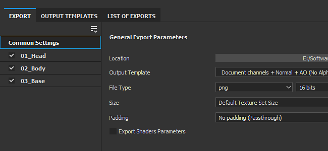

Das Exportfenster wurde vollständig überarbeitet, um eine einfachere und einfachere Möglichkeit zu bieten, Texturen aus einem Projekt zu konfigurieren und zu exportieren. Es bietet auch einige neue Funktionen, die das Exportieren viel bequemer machen. Das neue Exportfenster ist jetzt in drei Registerkarten unterteilt:

**Einstellungen**

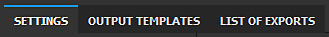

Diese Registerkarte steuert die allgemeinen und spezifischen Einstellungen für jeden Textursatz.

* **Neue globale Einstellungen**\
  Globale Einstellungen sind eine Reihe von Parametern, die für alle Textursatz freigegeben sind. Sie können verwendet werden, um schnell Parameter zuzuweisen oder zu aktualisieren, ohne jeden Textursatz einzeln manuell bearbeiten zu müssen. Globale Einstellungen verfügen über die folgenden Parameter:

  * **Ausgabeverzeichnis**: definiert den Zielspeicherort, an dem die Texturen generiert werden.
  * **Ausgabevorlage**: definiert die Vorgabe, die verwendet wird, um die Benennung und das Packing der exportierten Texturen zu konfigurieren.
  * **Dateityp**: definiert das Dateiformat und die Bittiefe der exportierten Texturen.
  * **Größe**: legt die größte Auflösung der Textur fest, mit der ein Textursatz exportiert wird.
  * **Auffüllen**: definiert, wie Informationen außerhalb der UV-Inseln generiert werden.
  * **Parameter für Exportschattierungen**: Wenn diese Option aktiviert ist, wird eine JSON-Datei exportiert, in der die Shader-Einstellungen und deren Textursatz-Zuweisungen gespeichert sind.

  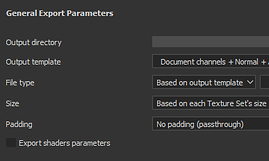
* **Die Einstellungen und Parameter pro Textursatz überschreiben**\
  Unterhalb der globalen Einstellungen befindet sich die Liste der Textursatz aus dem aktuell geöffneten Projekt. Im Abschnitt &quot;Allgemeine Exportparameter&quot; werden Einstellungen angezeigt, die von globalen Parametern übernommen wurden. Es ist auch möglich, eine andere **Exportvorgabe pro Textursatz** auszuwählen.

  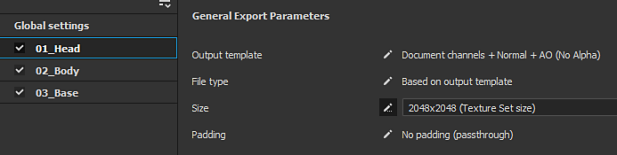

  Durch Klicken auf das Parametersymbol können Sie einen bestimmten Stift überschreiben, um seinen Wert zu ändern. Wenn Sie erneut darauf klicken, wird das irreguläre Format deaktiviert und der Wert auf den Standardwert (von den globalen Einstellungen übernommen) zurückgesetzt.

  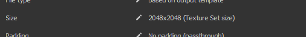
* **Auswählen der zu exportierenden Texturen**\
  Unter den Exportparametern für Textursätze befindet sich eine Liste der Texturen, die generiert werden. Mit dieser Liste können Sie genau auswählen, welche Datei durch Aktivieren oder Deaktivieren generiert werden soll. In der Liste werden auch das Dateiformat und die Bittiefe für jede Textur angezeigt, die von der Exportkonfiguration oder der Ausgabevorlage geerbt wird. Verwenden Sie das Symbol &quot;Stift&quot;, um das Dateiformat und die Bittiefe für eine bestimmte Textur zu überschreiben.
* **Einstellungen speichern, ohne** zu exportieren\
  Es ist jetzt möglich, die Exportkonfiguration des Projekts zu speichern, ohne Texturen exportieren zu müssen, indem Sie die neue Schaltfläche **Einstellungen speichern** verwenden. Dies ist nützlich, wenn Sie ein Projekt anpassen möchten, ohne Texturen neu zu generieren, was einige Zeit dauern kann.

  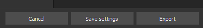
* **Klicken und ziehen Sie, um Exporte schnell zu aktivieren/deaktivieren**\
  Verwenden Sie das Mausklick-Plus und das Ziehen, um Textursätze und Texturen schnell zu aktivieren oder zu deaktivieren:

  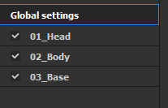

  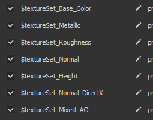

**Ausgabevorlagen**

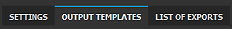

Auf dieser Registerkarte können Sie Konfigurationsvorgaben erstellen, um die exportierten Texturen zu benennen.

* <b>Exportvorgaben erstellen</b>\
  Die Registerkarte <b>Ausgabevorlage</b> ist identisch mit der Registerkarte <b>Konfiguration</b> des alten Exporters. Damit können Sie Exportvorgaben erstellen, um Texturen schnell zu benennen und zu verpacken. Wie Sie benutzerdefinierte Exportvorgaben erstellen, erfahren Sie auf unserer Dokumentationsseite.
* **Dateiformat und Bittiefe in den Exportvorgaben einrichten**\
  Eine neue Möglichkeit, Vorgaben zu exportieren, besteht darin, das Dateiformat und die Bittiefe pro Textur festzulegen, um die gemeinsame Nutzung einer Konfiguration in mehreren Projekten zu erleichtern.

  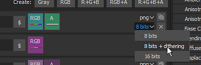
* **Das Steuerelement hat Texturen aus der Ausgabevorlage exportiert**\
  Verwenden Sie beim Einrichten des Exportprozesses die neue Option **Basierend auf Ausgabevorlage**, um die Eigenschaften der Textur aus der Exportvorgabe zu definieren.

  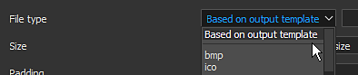

**Exportliste**

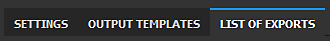

Auf dieser Registerkarte werden der laufende Exportprozess und eine globale Zusammenfassung aller exportierten Texturen angezeigt.

* **Liste der exportierten Texturen**\
  Auf der Registerkarte werden alle Texturen aufgelistet, die pro Textursatz exportiert werden sollen. Dabei werden überschriebene Parameter und ignorierte/ausgeschlossene Texturen berücksichtigt. Auf diese Weise können Sie sicherstellen, dass alles in Ordnung ist, bevor Sie den Exportvorgang starten. Die Benutzeroberfläche wechselt automatisch zu dieser Registerkarte, wenn der Exportvorgang gestartet wird.

  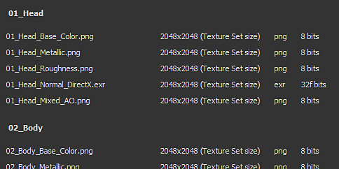
* **Prozess und Protokollierung exportieren**\
  Auf der rechten Seite der Registerkarte befindet sich eine Konsole, in der Details zum Exportvorgang ausgegeben werden, der gerade ausgeführt wird. Es gibt an, welche Texturen erfolgreich exportiert wurden, sowie alle Warnungen und Fehler. Unten auf der Benutzeroberfläche wird außerdem ein Fortschrittsbalken mit dem aktuellen Status des Prozesses angezeigt:

  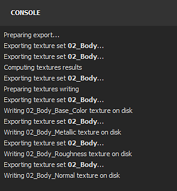

  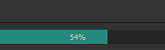

### Neuer Decal-Ebenenmodus

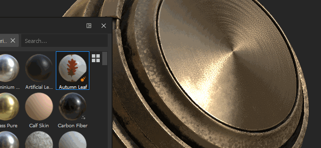

Es ist ein neuer **Aufkleber**-Modus verfügbar, wenn Sie ein Material per Drag &amp; Drop aus [Elementen](../../interface/assets/assets.md) ziehen. Es wird eine neue Füllebene im Modus **Planare Projektion** erstellt, mit der Muster und Bilder einfacher positioniert werden können. Um sie zu verwenden, ziehen Sie einfach **ein Material vom Regal und legen Sie es ab**, während Sie den **ALT-Tastaturbefehl** drücken, um eine Vorschau des Manipulators anzuzeigen, und lassen Sie die Maustaste los, sobald sich der Aufkleber an der gewünschten Stelle befindet. Sobald Sie die Maustaste loslassen, wird eine neue Füllebene erstellt.

Zu diesem Anlass hatten wir auch 5 Aufkleber in das Standard-Regal aus Substance Source aufgenommen. Weitere Informationen zu diesem neuen Aufkleberworkflow finden Sie in [diesem Artikel](https://magazine.substance3d.com/effortless-grunge-look-with-new-substance-source-parametric-decals/).

>[!NOTE]
>
> Um die Verwendung von Aufklebern zu erleichtern, haben wir ein neues [Benutzerdatenschlüsselwort](../../content/creating-custom-effects/user-data.md) implementiert, mit dem Sie beim Erstellen von Ebenen den Standardfüllmodus für jeden Kanal angeben können.

### Neues Python-Skript

**Python**-Skripte und -Module können jetzt mit Substance Painter geschrieben und ausgeführt werden. Wir haben Python 3.7 und PySide2 mit Substance Painter integriert und bieten außerdem eine benutzerdefinierte Python-API über das dedizierte **Substance\_painter**-Modul an. Außerdem haben wir die Gelegenheit genutzt, unsere API von der JavaScript-Version zu überdenken, um sie klarer und einfacher zu bedienen. Sie haben Gemeinsamkeiten, die die Erstellung von Python-Plug-ins für bestehende Benutzer einfach machen sollten.

Weitere Informationen über die Python-API finden Sie in der Dokumentation, die über das Hilfemenü in der Anwendung aufgerufen werden kann.

* **Installieren eines Python-Moduls**\
  Python-Module können im Ordner &quot;Dedizierte Dokumente&quot; unter dem Benutzerkonto installiert werden, aber wir bieten auch die Möglichkeit, zusätzliche Pfadspeicherorte über eine dedizierte Umgebungsvariable hinzuzufügen, um die Einrichtung in einem Studio zu erleichtern.
* **Substance Painter-Python-Untermodule**\
  Die folgenden Untermodule wurden gelegt (weitere werden zu einem späteren Zeitpunkt verfügbar sein):

  * substance\_painter.display
  * substance\_painter.event
  * substance\_painter.exception
  * substance\_painter.export
  * substance\_painter.logging
  * substance\_painter.project
  * substance\_painter.resource
  * substance\_painter.textureset
  * substance\_painter.ui
* **Python-Interpreter**\
  Ein neues Python-Konsolenfenster ist verfügbar, um Module auszuprobieren und/oder Python-Skripte auszuführen:

  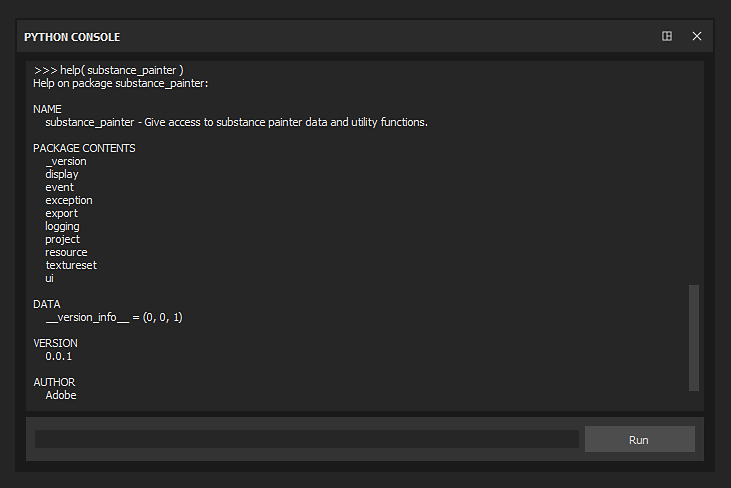{width="500px"}

### Verbesserte Baker

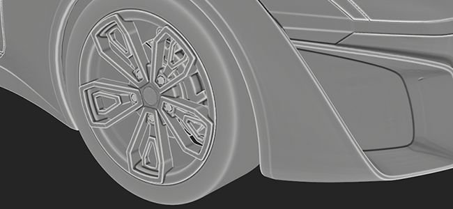

In dieser Version wurde der Krümmung-Baker verbessert und der Ambient occlusion-Baker hat einige neue Parameter erhalten.

* <b>Neue Krümmung vom Mesh Baker</b>\
  Der alte Krümmung-Baker ist jetzt veraltet und wurde durch die neue &quot;from Mesh&quot;-Version ersetzt, die kürzlich zu Substance Designer hinzugefügt wurde. Weitere Informationen zu den neuen Baker-Einstellungen finden Sie auf der Dokumentationsseite.\
  Der neue Baker verfügt über die folgenden Funktionen:

  * <b>Mehr Genauigkeit</b>: die berechnete Krümmung ist viel präziser und liefert realistische Werte.
  * <b>Mesh Kontakt</b>: Die Interpenetration zwischen Meshs erzeugt jetzt Krümmung-Informationen (was beim vorherigen Baker nicht der Fall war).
  * <b>High-Poly-Mesh</b>: -Details werden jetzt direkt aus dem Mesh mit hoher Poly-Dichte Baking geführt, anstatt sie von der Normalen-Map zu konvertieren.
  * <b>Vorstellungen</b>: Der neue Baker verwendet Raytracing, um Einzelheiten zu berechnen, was bedeutet, dass er von der GPU-Raytracing-Beschleunigung (RTX/Optix) profitiert.

  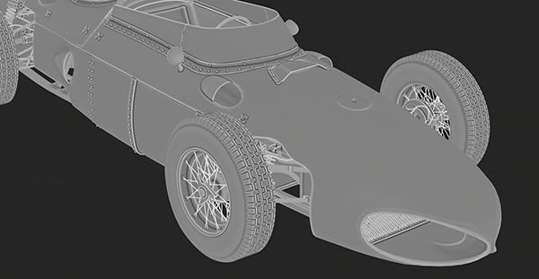{width="500px"}

  Aus Kompatibilitätsgründen ist es weiterhin möglich, über die Krümmung-Baker-Einstellungen auf den alten Krümmung-Baker zuzugreifen. Wählen Sie die Einstellung &quot;**Generieren von Normalen-Map**&quot;, um den alten Baker zu verwenden.

  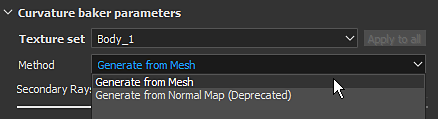
* <b>Verbessertes Ambient occlusion</b>\
  Der Ambient occlusion-Baker wurde verbessert und unterstützt jetzt neue Einstellungen:

  * <b>Boden-Ebene</b>: simuliert eine Ebene unter dem Mesh, um Schatten vom Boden zu erzeugen. Weitere Informationen finden Sie in der Ambient occlusion-Dokumentation.
  * <b>Hintergrundfläche ignorieren</b>: Es gibt ein neues Mesh-Namensuffix, mit dem bestimmte Objekte beim Baking der Ambient occlusion ignoriert werden. Dies ermöglicht es z. B., schwebende Geometriedetails zu ignorieren. Weitere Informationen finden Sie in der Dokumentation &quot;Matching By Name&quot;

  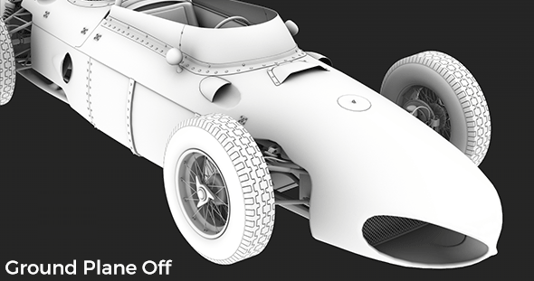{width="500px"}

### Verbesserter Mesh-Export (mit Tessellation)

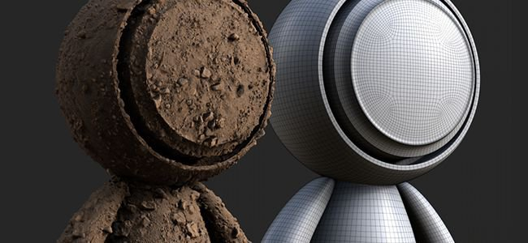

Der Export-Mesh wurde durch neue Funktionen und Einstellungen verbessert:

* **Die ursprüngliche Mesh-Topologie exportieren oder Mesh mit der Tessellation exportieren**\
  Beim Exportieren des Meshs können Sie jetzt die für Versatz-Effekte generierte Tessellation anwenden. Mögliche Einstellungen sind:

  * **Ohne Versatz/Tessellation**: den Basis-Mesh ohne Mesh-Unterteilungen exportieren. Wenn **Triangulation anwenden** deaktiviert ist, werden die Originaldreiecke, Quads oder n-Mesh exportiert.
  * **Mit Versatz/Tessellation**: den Mesh mit Unterteilungen exportieren. Wenn **Normale des Scheitelpunkts neu berechnen aktiviert ist**, werden die Normalen des Meshs angepasst, um den Versatz-Offsets zu entsprechen.

  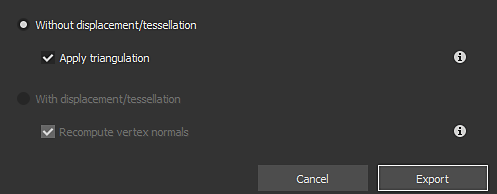
* **Szenen- und Mesh-Namen**\
  Die Hierarchie der ursprünglichen Szene und die Objektnamen des importierten Meshs bleiben nun erhalten und werden erneut auf den exportierten Mesh angewendet.
* **Export mit FBX Dateiformat**\
  Der Projekt-Mesh kann jetzt zusammen mit anderen Dateiformaten in FBX exportiert werden.\
  **Hinweis**: Inkompatible Daten mit Substance Painter werden während des Imports noch verworfen (z. B.: Schalen, Gelenke).

### Verbesserter automatischer Entpack von UV

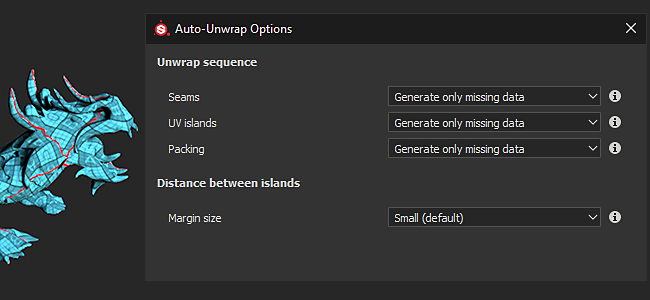

Der Entpack &quot;Automatisch&quot; kann nun mithilfe neuer Einstellungen leichter UV werden:

* **Automatische UV-Entpack während der Projekterstellung verwenden**\
  Beim Erstellen eines Projekts gibt es jetzt eine neue Einstellung, mit der der neue automatische entpack aktiviert oder deaktiviert werden kann. Diese Einstellung ist auch beim erneuten Importieren eines 3D-Mesh in ein bestehendes Projekt verfügbar.

  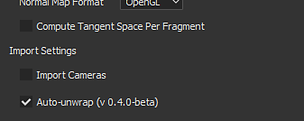
* <b>Erweiterte Entpackend Einstellungen</b>\
  Neben dem Kontrollkästchen zum Aktivieren der automatischen UV-Entpack befindet sich eine neue Schaltfläche <b>Optionen</b>. Es öffnet sich ein neues Fenster mit erweiterten Einstellungen zur Steuerung des entpackend Prozesses, sodass bestehende Mesh-Informationen an verschiedenen Stellen des Prozesses beibehalten werden können, anstatt alles wie zuvor neu zu berechnen. Weitere Informationen finden Sie in der entsprechenden Dokumentation. Aktuelle Einstellungen sind:

  * <b>Nähte</b>: legt fest, ob die bestehenden Nähte beibehalten oder neu generiert werden.
  * <b>UV-Inseln</b>: legt fest, ob die entpackt UV beibehalten oder neu generiert wird.
  * <b>Packing</b>: legt fest, ob das Packing der UV-Insel beibehalten oder neu generiert wird.
  * <b>Randgröße</b>: definiert den Abstand zwischen den einzelnen UV-Inseln (in Prozent).

  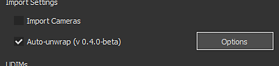

### Neue Inhalte

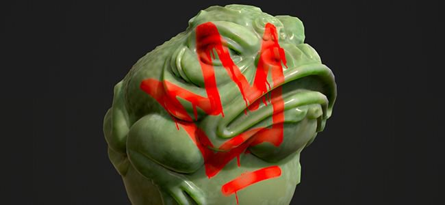

In dieser Version haben wir einige neue Material hinzugefügt und viele unserer Exportvorgaben aktualisiert, um sie an neue Softwareversionen anzupassen.

* **5 neue Decal-Material**\
  Wir haben 5 neue Materialien aus Substance Source hinzugefügt, um die neue Aufkleberfunktion auszuprobieren:

  * Große Rost-Lecks
  * Acarospora Lichen
  * Kaum Blutlecks
  * Kleine Geschosseinwirkung auf Betonwand
  * Sprühen Malen Tag

  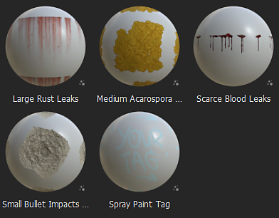
* <b>Neue Vray-Shader, Projektvorlagen und Exportvorgaben</b>\
  In Zusammenarbeit mit [Chaos Group](https://www.chaosgroup.com/) haben wir zwei neue Shader integriert, die das VrayMtl-Verhalten replizieren. Sie sollten einen genaueren Look ergeben, wenn Sie versuchen, Renderings mit Vray abzugleichen. Verwenden Sie die Projektvorlagen, um ganz einfach neue Projekte für Vray einzurichten. Weitere Informationen finden Sie in der Dokumentation.

  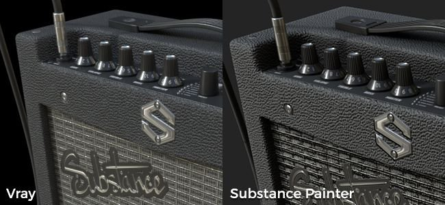
* <b>Neue Maxwell-Projektvorlagen und Exportvorgaben</b>\
  In Zusammenarbeit mit [Next Limit](http://www.nextlimit.com/) haben wir neue Projektvorlagen und Exportvorgaben für den Maxwell-Renderer integriert.
* **Die Exportvorgaben wurden aktualisiert**\
  Viele Exportvorgaben wurden aktualisiert, hauptsächlich, um das neue Dateiformat und die Bittiefe-Einstellungen zu verwenden, aber auch, um neue Softwareversionen abzugleichen.

## Tutorials

Sieh dir unsere neuen Video-Tutorials zu den neuen Funktionen an:

## Versionshinweise

### 2020.1.3

*(veröffentlicht am 16. Juni 2020)*\
Zusammenfassung: **Bugfix**

**Hinzugefügt:**

* [Exportieren] Hinzufügen von Versatz-Einstellungen in der JSON-Datei für Shader-Parameter

**Fest:**

* [Absturz]&#x200B;[Engine] Absturz beim Löschen und Ersetzen vorhandener Kanäle
* [Absturz] Ändern des Shader nach dem Malen einer Maske in der Material-Ebene
* [Absturz]&#x200B;[Engine] Absturz mit einigen umfangreichen Projekten
* [Baker] Zuordnung nach Name funktioniert nicht mit aus zBrush exportierten OBJ
* [Versatz]&#x200B;[SVT] Texturen werden beim Öffnen des Projekts nicht angezeigt, wenn der Versatz aktiviert ist
* [Exportieren] Einige Texturen werden in einheitlichem Grau exportiert.
* [Exportieren] Deaktivierte Textursatz sollten nicht für Dimension- und Sketchfab-Exportvorgaben exportiert werden
* [Scripting]&#x200B;[JavaScript]-Absturz bei der Verwendung der JavaScript-API für den Zugriff auf die Exportkonfiguration im onProjectOpened-Ereignis
* [Skripterstellung]&#x200B;[Javascript] onExportFinished() wird nach einem Export nicht aufgerufen

### 2020.1.2

*(veröffentlicht am 28. Mai 2020)*\
Zusammenfassung: **Bugfix mit Substance Engine- und Baker-Update**

**Hinzugefügt:**

* [Baker] Update auf die neueste Version
* [Baker] Neue Sampling-Methode in den Bakern Ambient occlusion, Krümmung, Thickness
* Aktualisieren Sie auf die neueste Version von Substance Engine
* [Scripting]&#x200B;[Python] Erstellen der ResourceID für Projektressourcen zulassen
* [Scripting]&#x200B;[Python] Abfragen von Kanalinformationen zulassen
* [Scripting]&#x200B;[Python] Fügen Sie Dryrun- und Rückruffunktionen hinzu, um den Export von Texturen zu simulieren

**Fest:**

* [Baker] Falsche Normale im Welt-Raum-Normale-Baker unter Verwendung einer Tangente-Normalen-Map in bestimmten Fällen
* [Baker] Fehler beim Baking von Ambient occlusion mit Optix, wenn kein hohes Poly
* [Dynamische Pinselstriche] Verzögerung beim Laden eines bestimmten Textursatzes
* [Exportieren] Die deaktivierten Textursatz für USD sollten nicht exportiert werden. glTF
* [Skripterstellung]&#x200B;[JavaScript] Die Einstellungen für den neuen Krümmung-Baker können nicht bearbeitet werden.
* [Scripting]&#x200B;[JavaScript] alg.texturesets.addChannel() gibt in einigen Fällen keinen Fehler zurück.
* [Scripting]&#x200B;[JavaScript] Tippfehler in der JavaScript-API-Dokumentation für setProjectExportOptions()
* [Skripterstellung]&#x200B;[JavaScript] Exportiert immer alle Textursatz
* [Scripting]&#x200B;[Python] sys.executable gibt einen Pfad zu python.exe anstelle von Substance Painter zurück
* Textur-Cache nicht kompatibel mit Mac OS und Windows/Linux
* [Livelink UE4] Nur das letzte Material wird für alle Textursatz in einem kombinierten Mesh verwendet.

**Bekannte Probleme:**

* [Exportieren]&#x200B;[Dimension]&#x200B;[Skecthfab] Die deaktivierten Textursatz sollten nicht exportiert werden.
* [Absturz] Ändern des Shader nach dem Malen einer Maske in der Material-Ebene

### 2020.1.1

*(veröffentlicht am 05. Mai 2020)*

**Hinzugefügt:**

* [Export] Überschriebenes visuelles Feedback zu TextureSet

**Fest:**

* [Exportieren] Exporter-Fenstergröße ist auf einem Spezialauflösungsmonitor zu groß und kann nicht geändert werden
* [Export] Optionen werden nach dem Export nicht gespeichert
* [Exportieren] Absturz oder kann nicht mit der Exportvorgabe &quot;Aus Cache&quot; exportiert werden
* [Export] Wenn Sie den Export abbrechen, wird eine unerwartete zusätzliche leere Map generiert.
* [Exportieren] Virtuelle Exportvoreinstellungen korrigieren
* [Python] PYTHONPATH env var wird nicht berücksichtigt
* [Python]&#x200B;[Export] Wenn Sie den Export über Python abbrechen, wird ein Ausnahmefehler zurückgegeben.
* [Python]&#x200B;[Exportieren] export\_project\_Texturen falsches Ergebnis mit psd-Dateiformat

**Bekannte Probleme:**

* [JavaScript] Die Baker-Einstellungen für neue Krümmungen können nicht bearbeitet werden.
* [JavaScript]&#x200B;[Export] Exportiert immer alle Textursatz
* [Baker] Absturz unter Linux mit GPU-Raytracing
* [Exportieren]&#x200B;[USD] Die deaktivierten Textursatz sollten nicht exportiert werden.

### 2020.1.0

*(veröffentlicht am 22. April 2020)*

**Hinzugefügt:**

* Exporter &quot;Neue Textur und neuer Mesh&quot;
* [Exportieren] Neue Exporter-Oberfläche
* [Exportieren]&#x200B;[Registerkarte &quot;Exportieren&quot;] Ermöglicht die Auswahl der Kartenkanäle, die pro Textursatz exportiert werden.
* [Exportieren]&#x200B;[Registerkarte &quot;Exportieren&quot;] Modifizierung der Größe des Textursatzes für alle Textursatz in einer Aktion zulassen
* [Exportieren]&#x200B;[Registerkarte &quot;Exportieren&quot;] Lassen Sie eine andere Vorlage pro Textursatz zu (außer USD, glTF, Sketchfab und Dimension)
* [Exportieren]&#x200B;[Registerkarte &quot;Exportieren&quot;] Schnelle Aktivierung und Deaktivierung von Karten und Textursätze
* [Exportieren]&#x200B;[Registerkarte &quot;Exportieren&quot;] Die Exportauflösung 8192x8192 ist nicht mehr experimentell
* [Exportieren]&#x200B;[Registerkarte &quot;Exportieren&quot;] Änderung des Dateiformats und der Bittiefe pro Map zulassen
* [Exportieren]&#x200B;[Registerkarte &quot;Exportieren&quot;] Zurücksetzen auf die Werte der Standardparameter zulassen
* [Exportieren]&#x200B;[Registerkarte &quot;Exportieren&quot;] Speichern von Einstellungen ohne Exportieren zulassen
* [Exportieren]&#x200B;[Registerkarte &quot;Ausgabevorlagen&quot;] Benennen Sie die Registerkarte &quot;Konfiguration&quot; in die Registerkarte &quot;Ausgabevorlagen&quot; um
* [Exportieren]&#x200B;[Registerkarte &quot;Ausgabevorlagen&quot;] Definition von Dateiformat und Bittiefe pro voreingestellter Map zulassen
* [Export]&#x200B;[Registerkarte &quot;Liste der Exporte&quot;] Neue Vorschauregisterkarte zum Zusammenfassen und Anzeigen des Exportvorgangs
* [Mesh importieren/exportieren] Optimierung der Performance der Import-/Exportzeit
* [Mesh exportieren] Mesh in FBX exportieren
* [Mesh exportieren] Exportieren von Mesh mit Versatz und Tessellation
* [Mesh exportieren]&#x200B;[UI] Neue Einstellungen für die Neuberechnung des normalen Scheitelpunkts, Anwendung der Triangulation
* [Mesh exportieren] Exportieren der ursprünglichen Mesh-Topologie mit neuen UVs, die durch automatischen entpack generiert werden
* Automatischer entpack mit weiteren Steuerelementen wurde aktualisiert
* [UV Entpackend]&#x200B;[UI] Fügen Sie die Einstellung hinzu, um die automatische UV-entpack in einem neuen Projektfenster zu aktivieren
* [Entpackend UV]&#x200B;[UI] Neue Optionen zum Steuern der entpackend Schritte (Nähte, entpackend Packing)
* [Entpackend UV]&#x200B;[UI] Beibehaltung bestehender entpackend Nähte/entpackend /Packing zulassen
* [UV Entpackend]&#x200B;[UI] Neue Optionen zur vollständigen Neuberechnung entpackend Schritte
* [Entpackend UV]&#x200B;[UI] Neue Option zur Steuerung der Randgröße (keine, kleine, mittlere und große)
* Neue Baker
* [Baker] Alte Krümmung durch neue Krümmung aus Mesh ersetzen
* [Baker] Fügen Sie die Option &quot;Match by Name&quot; hinzu, um die Rückseite im Baker &quot;Ambient occlusion&quot; zu ignorieren
* [Baker] Option &quot;Boden-Ebene hinzufügen&quot; im Baker &quot;Ambient occlusion&quot;
* Neue Python-API für die Skripterstellung (3.7.6)
* [Python]&#x200B;[UI] Neues Skriptmenü für Python
* [Python]&#x200B;[UI] Neue Python-Dokumentation im Hilfemenü
* [Python] Gelegt Substance Painter Python-Module: substance\_painter, alg, display, project.setting, project, texturesets, ui
* [Python] Neues Python-Modul &quot;substance\_painter&quot; Gelegt
* [Python] Neues Python-Untermodul Gelegt: alg, display, log, project, resource, texturesets, ui
* [Python] Listener für Projektänderungen
* [Python] Neue Beispiele in der Python-Dokumentation
* [JavaScript]&#x200B;[UI] Menü &quot;Plug-ins&quot; durch JavaScript ersetzt
* [Viewport] Ermöglichen der Erstellung einer Decal-Projektion durch &quot;Ziehen/Ablegen + ALT&quot; einer Ressource aus dem Regal
* Neue Inhalte
* [Inhalt] 5 neue Decal-Materialien von Substance Source
* [Inhalt] Hinzufügen neuer Projektvorlagen und Exportieren von Vorgaben für den Maxwell-Renderer
* [Inhalt] Hinzufügen einer Projektvorlage für den Keyshot 9-Export
* [Inhalt] Aktualisieren der Keyshot 9-Exportvoreinstellung, um Versatz und emissive zu unterstützen
* [Inhalt]&#x200B;[Exporter] Aktualisierung aller Exportvorgaben, um die neuesten Engine- und Renderversionen zu berücksichtigen
* [Inhalt]&#x200B;[Exporter] Aktualisieren Sie die Exportvoreinstellungsdateien, um neue Format- und Dithering-Einstellungen zu verwenden.
* [Inhalt] Neue Vorlagen und Shader zur Unterstützung von VRay Material (VRayMtl)
* [Ebenenstapel] Löschen von Ebeneneffekten mit Papierkorb-Symbol oder Tastaturbefehl-Entf-Taste zulassen
* Plug-in-Substance Source entfernen (Launcher mit &quot;Senden an&quot;-Funktion verwenden)
* [Windows] TDR-Warnung nicht auf High-End-GPUs anzeigen

**Fest:**

* Übersetzungsprobleme im Dialogfeld &quot;Neue Projektdatei&quot;
* [Baker] Die Einstellung &quot;Vorverarbeitete Szene speichern&quot; funktioniert nicht mehr.
* [Baker] Absturz beim Baking führ mit OptiX, wenn kein hohes Poly
* [Planare Projektion] Projektion funktioniert nicht bei Meshs mit sich wiederholenden UVs
* [Decal] Verhaltensunterschied im Normalkanal bei Verwendung verschiedener Modi zur Projektion der Füllebene
* [Verwischen]&#x200B;[Klon] Beim Malen in einer Maske kann ein Artefakt angezeigt werden
* [Engine] Absturz mit bestimmtem Ebeneninhalt
* [Engine] Zufälliger Absturz beim Malen in einigen Fällen
* [Ankerpunkt] Der Verweis auf eine leere Maske gibt immer Weiß zurück
* [Exportieren] Ebene wird in bestimmten Stapel-Konfigurationen nicht berücksichtigt
* [Mesh exportieren] Kann nicht mit einem Pfad exportiert werden, der Sonderzeichen enthält
* [Mesh exportieren] GLTF-Dateien können beim Exportieren aus Linux oder MacOS nicht gelesen werden
* [Mesh importieren] Der erneute Import von DAE, PLY oder glTF funktioniert nicht wie beabsichtigt
* [Absturz] Ändern des Shader nach dem Malen einer Maske in der Material-Ebene

**Bekannte Probleme:**

* [Skripterstellung]&#x200B;[JavaScript] Die Einstellungen für den neuen Krümmung-Baker können nicht bearbeitet werden.
* [Baker] Absturz unter Linux mit GPU-Raytracing
* [Exportieren]&#x200B;[USD] Die deaktivierten Textursatz sollten nicht exportiert werden.
