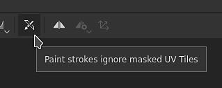
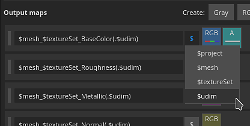
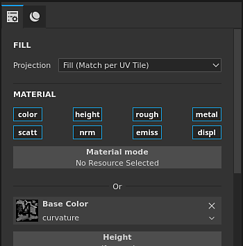
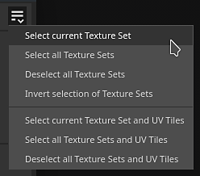

# Version 2020.2 (6.2.0)

Mit **Substance Painter 2020.2.0 (6.2.0)** wird der neue UV-Kachel-Workflow eingeführt, der das Malen zwischen UDIM ermöglicht. Es enthält auch einige Verbesserungen bei Leistung und Projektgröße für jede Art von Projekt.

Freigabedatum: *23. Juli 2020*

>> 

Künstlergutschriften: Dragon von [Damien Guimoneau](https://www.artstation.com/damz) und Robot von [Jason Huang](https://www.artstation.com/jasonhuang).

## Wichtigste Funktionen

### Neuer UV-Kachel-Workflow mit &quot;Malen über UDIM&quot;

In dieser Version wird der neue Arbeitsablauf für UV-Kacheln in Substance Painter eingeführt, der das Malen über UDIM-Kacheln hinweg ermöglicht.

Mit dem neuen Workflow werden die **UVs nicht mehr in einzelne Textursatz aufgeteilt**. Stattdessen sind die UV-Kacheln in einem einzigen Textursatz enthalten, der auf der Zuweisung des Materials zum Mesh basiert. UV-Kacheln, die sich innerhalb desselben Textursatzes befinden, können sowohl im 2D- als auch im 3D-Viewport **ohne Nähte** übermalt werden.

UV-Kachel ist der Begriff, der verwendet wird, um diesen neuen Arbeitsablauf auf eine generische Weise zu beschreiben, da UDIM hauptsächlich eine Benennungskonvention ist. Obwohl UDIM derzeit die einzige verfügbare Konvention ist, haben wir vor, sie in Zukunft zu erweitern (z. B. die Unterstützung für Mudbox- oder ZBrush-Benennung). Wir denken auch darüber nach, Kacheln mit negativen Koordinaten zu unterstützen, was mit dem UDIM-Schema nicht möglich ist. Aus diesem Grund haben wir einen umfassenderen Begriff für diesen Arbeitsablauf gewählt.

Im Folgenden finden Sie einen Überblick über die Änderungen, die mit diesem neuen Arbeitsablauf eingeführt wurden:

* **Erstellen eines UV-Kachel-Projekts**\
  Beim Erstellen eines neuen Projekts gibt es eine neue Einstellung, mit der angegeben wird, ob der neue Arbeitsablauf verwendet werden soll oder nicht.

  Beachten Sie, dass der Arbeitsablauf nach der Entscheidung und der Erstellung des Projekts später nicht mehr anders als bei anderen Einstellungen geändert werden kann.

  
* UV-Kacheln im 2D-Viewport

  Wenn Sie den neuen Arbeitsablauf für die UV-Kachel verwenden, wird in den 2D-Ansichten jetzt ein neuer Raster angezeigt, in dem jede UV-Kachel eine eigene UDIM-Nummer hat. Jede Kachel kann einzeln bemalt werden.

  
* Malen über UV-Kacheln

  UV-Kacheln

  die sich innerhalb desselben Textursatzes befinden, können nahtlos übermalt werden. Dies ermöglicht es, die allgemeine Auflösung und Qualität eines Assets zu erhöhen, indem einfach die Anzahl der UV-Kacheln multipliziert wird.
* UV-Kacheln im Fenster &quot;Textursatzliste&quot;

  Die

  Textursatz-Liste hat

  wurden aktualisiert, um die UV-Kacheln aufzulisten, die mit dem auf dem importierten Mesh gefundenen Material verknüpft sind. Jede UV-Kachel wird mit ihrem Namen entsprechend der UDIM-Konvention angezeigt.

  
* Ändern der Auflösung pro UV-Kachel

  Die Standardauflösung für jede UV-Kachel basiert zwar auf dem übergeordneten Textursatz, es ist jedoch möglich, diese Auflösung pro Kachel zu überschreiben. Wählen Sie einfach die Kacheln in der Liste der Textursatz aus und wechseln Sie dann zum Fenster &quot;Textursatz-Einstellungen&quot;, um die Auflösung zu ändern. Wenn die Auflösung einer Kachel überschrieben wurde, wird die neue Auflösung in der 2D-Ansicht neben der Nummer angezeigt.

  
* Neue Ebenenstapel-Symbole

  Der Ebenenstapel enthält neue Symbole für Mal- und Füllebenen. Da UV-Kacheln viele weitere Texturen aufweisen, war es nicht möglich, alle in diesem kleinen Bereich anzuzeigen. Dies hilft bei der Leistung, da keine bestimmten Miniaturansichten mehr berechnet werden müssen. Dieser neue Satz von Symbolen kann auch für reguläre Projekte verwendet werden, indem eine Einstellung in den Haupteinstellungen aktiviert wird (siehe unten).

  
* Neue UV-Kachelmaske auf Ebenen

  Die UV-Kachel-Maske ist eine neue Methode zum Maskieren von In- und Out-Ebenen, die effektiver ist als die normale Maskierung. Es bietet bessere Leistungen, da es erlaubt, die Berechnung bestimmter UV-Kacheln vollständig zu verwerfen. Dieses Tool wird empfohlen, um bei der Arbeit an einem Projekt mit vielen UV-Kacheln ein komfortables Erlebnis zu schaffen. Weitere Informationen finden Sie in der Dokumentation auf der [dedizierten Seite](../../interface/layer-stack/geometry-mask.md).

  {width="550px"}
* **Malen durch maskierte UV-Kacheln**\
  Da sich mehrere UV-Kacheln im selben Textursatz befinden, ist es möglicherweise schwierig, bestimmte Bereiche eines Gitters zu malen, da andere Teile der Geometrie im Weg sind. Um diese Situation zu umgehen, wurde eine neue Maleinstellung in der Kontextsymbolleiste mit dem Namen &quot;**&quot; hinzugefügt. Malen-Striche ignorieren maskierte UV-Kacheln**. Wenn diese Einstellung aktiviert ist, werden alle UV-Kacheln, die über die UV-Kachelmaske ausgeschlossen wurden, im Viewport ausgeblendet, sodass Malstriche sie durchgehen bzw. ignorieren können. Wenn Sie die Geometriemaske ändern, werden die Pinselstriche neu berechnet, da ein Mesh erneut importiert werden kann, dessen UV-Kachel sich möglicherweise geändert hat oder dessen neue UV-Kachel ebenfalls ausgeschlossen werden muss. Dadurch wird vermieden, dass die Pinselstriche wiederholt werden.

  

  
* Baking führend UV-Kacheln

  Die Baker unterstützen auch UV-Kacheln, und im Baking-Fenster befindet sich jetzt eine Auswahlliste.

  , um anzugeben, welche Kacheln und Textursatz Baking geführt werden sollen. Sie können die Auswahl schnell ändern, indem Sie auf das Kontrollkästchen klicken und es mit der Maus ziehen oder indem Sie die neuen Dropdown-Menüs verwenden.

  

  
* Exportieren von UV-Kacheln-Texturen mit dem neuen Tag $udim

  Den Ausgabevorlagen wurde ein neues Tag hinzugefügt, mit dem UV-Kacheln mit der Dateinummer in ihren Dateinamen exportiert werden können. Derzeit ist nur die UDIM-Konvention verfügbar. Es ist auch möglich, Klammern zu verwenden, um optionale Elemente in einem Dateinamen zu definieren, wenn kein Tag verfügbar ist. Auf diese Weise können Sie beispielsweise Dateinamen erstellen, an die nur die UDIM-Nummer angehängt wird, wenn sie für UV Tile-Projekte verfügbar ist. Dadurch werden Exportvorgaben mit allen Arten von Projekten kompatibel.

  
* **Importieren von Bildsequenzen** Eine Bildsequenz ist eine Serie von Texturen, bei denen jede mit einer bestimmten UV-Kachel übereinstimmt. Zum Importieren einer Bildsequenz ziehen Sie einfach die erste Datei der Sequenz in das Shelf oder verwenden Sie das Fenster &quot;Importressourcen&quot;. Die verbleibenden Dateien in der Sequenz werden ebenfalls automatisch importiert. Die Sequenzen werden im Shelf als einzelne Ressource mit einer Zahl angezeigt, die angibt, wie viele Dateien sie enthalten. Um die Sequenz zu verwenden, ziehen Sie sie einfach in eine Füllebene. Der Projektionsmodus wird automatisch auf **Füllung (Übereinstimmung pro UV-Kachel)** festgelegt.

  {width="600px"}

  
* Unterstützung von Facesets mit Alembic-Meshs

  Alembic-Facetten werden jetzt als Materialien importiert, die in Textursets aufgeteilt werden sollen. Diese Änderung macht Alembic-Meshs mit dem neuen Arbeitsablauf für UV-Kacheln kompatibel. Wenn ein Alembic-Mesh Flächen enthält, die nicht in Facesets enthalten sind, werden sie automatisch in einen Textursatz mit dem Namen DefaultMaterial eingefügt.

Weitere Informationen zum neuen Dokumentationsarbeitsablauf finden Sie in der [dedizierten UV-Kachel](../../features/uv-tiles/uv-tiles.md).

>[!NOTE]
>
> Der UV-Kachel-Workflow kann sehr anspruchsvoll sein. Wir empfehlen die Arbeit mit SSDs, um sowohl den Cache als auch eine Projektdatei zu speichern, um die Ladezeiten zu reduzieren und ein reibungsloses Erlebnis zu erhalten.

### Neue Pausen-Engine

Es ist jetzt möglich, das Substance Painter-Engine während der Arbeit anzuhalten. Wenn die Engine angehalten ist, werden alle Texturberechnungen, Viewport-Aktualisierungen oder Malstriche registriert, aber nicht berechnet.

Mit dieser neuen Aktion können Sie komplexe Ebenenstapel einrichten und optimieren und die Berechnung bis zum letzten Moment verzögern. Der Hauptvorteil des Pausierens des Engine besteht darin, dass zwischengeschaltete Berechnungen vermieden werden und stattdessen nur das Endergebnis berechnet wird. Dadurch reagiert die Anwendung schneller und das Update insgesamt schneller. Der Nachteil ist, dass es keine visuelle Rückmeldung gibt, bis das Engine nicht angehalten wurde.

Um das Modul anzuhalten, klicken Sie einfach auf die Schaltfläche **in der kontextabhängigen Symbolleiste** über dem Viewport oder verwenden Sie die **Tastenkombination Umschalt + Escape** (kann in den Einstellungen geändert werden). Um das Engine nicht anzuhalten, schalten Sie die Schaltfläche aus oder verwenden Sie den Tastaturbefehl wieder.

### Leistungsverbesserungen

* **Schnellerer Export von Texturen**\
  Der Export von Texturen sollte deutlich schneller erfolgen, insbesondere bei umfangreichen Projekten, die viele Texturen generieren. Die Art und Weise, wie Texturen erzeugt und geschrieben werden, wurde mehrfach verbessert. In unseren internen Tests an Projekten mit vielen Texturen Sets oder komplexen Ebenenstapeln haben wir festgestellt, dass der Exportvorgang im Allgemeinen bis zu **4 oder 5 Mal schneller war**.
* **Die verzögerte Cache-Berechnung beim Öffnen von Projekten** Substance Painter verwendet ein Cachesystem, um ein schnelles Anpassen und Überblenden von Ebenen zu ermöglichen. In früheren Versionen wurde dieser Cache jedes Mal berechnet, wenn ein Projekt geöffnet wurde (sichtbar durch die grüne Ladeleiste unten im Viewport). Jetzt wird die Cache-Berechnung nur noch ausgelöst, wenn versucht wird, eine Ebene zu bearbeiten (z. B. durch Malen oder Anpassen eines Parameters für die Füllebene). Diese Änderung ermöglicht das Öffnen von Projekten ohne zu warten und zu den gewünschten Textursätzen zu wechseln, bevor mit der Arbeit begonnen wird. Die Berechnung ist auch granularer, was erlaubt, nur zu berechnen, was benötigt wird. Bei einem Projekt mit UV-Kacheln werden beispielsweise nur die Kacheln berechnet, die geändert werden müssen.
* **Das asynchrone Laden von Mesh-Map** Mesh-Map wird jetzt asynchron geladen. Dies bedeutet, dass die Anwendung nicht mehr blockiert wird, während auf das Laden der Mesh-Map gewartet wird. Dies ist besonders sichtbar, wenn die Mesh-Map im Viewport angezeigt wird (wie in der Abbildung unten). Auch das Öffnen von Projekten wird dadurch beschleunigt, da die Mesh-Map nicht mehr warten.

  
* **Verbesserte Bearbeitung des Maskenansichtsmodus**\
  Wenn Sie bei gedrückter Alt-Taste auf eine Textur (oder den speziellen Ansichtsmodus) klicken, um sie im Viewport anzuzeigen, werden die Maskenaktualisierungen jetzt nur für die Maske ausgeführt. Das bedeutet, dass das Malen und Bearbeiten von Effekten mit diesem Ansichtsmodus viel reibungsloser verläuft, da alle anderen Berechnungen verzögert werden, bis der Viewport wieder auf den Materialmodi zurückgesetzt wird.

  
* **Miniaturansichten neuer Ebenenstapel**\
  Wie bereits erwähnt, kann der Ebenenstapel jetzt einen neuen Symbolsatz verwenden. Die Verwendung dieser Symbole kann die allgemeine Leistung verbessern, da keine Miniaturen berechnet werden müssen. Während dies für UV-Kachel-Projekte automatisch erfolgt, können reguläre Projekte diese Symbole ebenfalls verwenden, indem sie **Bearbeiten > Einstellungen** aufrufen und **Miniaturansichten von Ebenenstapeln durch Symbole ersetzen** aktivieren.

  
* **Schnelleres inkrementelles Speichern** Da das Projekt kleiner sein kann und der Speichervorgang in Bezug auf die geänderten Daten detaillierter ist, ist das inkrementelle Speichern (Drücken von STRG+S) jetzt viel schneller. Dies macht sich vor allem bei großen Projekten bemerkbar.
* **Verbesserte Leistung beim Starten von Iray**\
  Der Wechsel in den Render-Modus mit Iray sollte schneller erfolgen, da wir die Verwaltung des in der Anwendung freigegebenen Speichers verbessert haben.

### Verbesserungen der Projektgröße

Projektdateien haben bekanntermaßen einen [großen Dateispeicherplatz](../../technical-support/workflow-issues/project-issues/projects-are-really-big.md). Wir haben uns die Zeit genommen, um die Ursache dieses Problems zu untersuchen, und haben ein paar Lösungen entwickelt. Diese Version enthält eine erste Reihe von Änderungen:

* **Wechseln der Baker-Ausgaben zu Graustufenbilder**\
  In früheren Versionen gaben die Baker in jedem Fall RGB-Images aus. Jetzt geben Graustufen-Baker (Krümmung, ambient occlusion) nur noch Graustufenbilds aus. Mit dieser einfachen Änderung kann die Projektgröße von 20 % auf 60 % reduziert werden. Um diese Veränderung nutzen zu können, müssen Mesh-Map in bestehenden Projekten regeneriert werden.
* **Standardeinstellungen für Diffusion und Ausdehnung für Baker ändern**\
  Zuvor hatten die Baker eine Ausdehnung von 1 Pixel und dann ein Pixelmuster (unscharfe Diffusionen außerhalb der UV-Inseln) erzeugt. Diese Einstellung erzeugt ziemlich hohe Texturen, da Farbverläufe schwer zu komprimieren sind. Daher wurden die Standardeinstellungen geändert, um dieses Problem zu reduzieren. Die Diffusion ist jetzt standardmäßig deaktiviert und die Ausdehnung wurde auf 32 Pixel festgelegt (dies sollte der 4K-Auflösung entsprechen). Es wird empfohlen, das vorhandene Projekt auf diese neuen Einstellungen und auf die Umbrechung umzuschalten, damit diese Verbesserung genutzt werden kann.

### Verschiedene Verbesserungen

Diese neue Version enthält einige zusätzliche Änderungen:

* **Auswahl wird Baking geführt**\
  Um die Arbeit mit der neuen UV-Kachel zu erleichtern, wurde das Baking leicht verändert und enthält nun eine neue Auswahlliste, die die UV-Kachel pro Textursatz enthält. Die Schaltfläche &quot;Baking aktueller Textursatz&quot; wurde daher entfernt. Um die Auswahl der zu Baking führend Elemente bequem zu halten, wurden mehrere Optionen in Dropdown-Menüs hinzugefügt:

  

  
* **Shader-Instanz in den Textursatz-Einstellungen**\
  Durch die Überarbeitung der Liste der Textursatz, die UV-Kacheln enthält, wurden einige geringfügige Änderungen vorgenommen, um die Benutzeroberfläche übersichtlicher zu gestalten. Die Funktionen, die bisher das Erstellen und Wechseln zu verschiedenen Shader-Instanzen ermöglichten, wurden jetzt in die Textursatz-Einstellungen verschoben.

  

## Tutorials

Im Folgenden finden Sie unsere neuen Video-Tutorials zu den neuen Funktionen. Auf [Substance Academy](https://www.youtube.com/playlist?list=PLB0wXHrWAmCx1fWbUyBFcjtfL8xhxZFnv) sind weitere Videos zum neuen Arbeitsablauf für die UV-Kachel verfügbar.

## Versionshinweise

### 2020.2.0

*(veröffentlicht am 23. Juli 2020)*

**Hinzugefügt:**

* UV-Kacheln (UDIM)
* [UV-Kacheln] Malen über UV-Kacheln
* [UV-Kacheln] Auswahl zwischen neuem und veraltetem Arbeitsablauf für UV-Kacheln zulassen
* [UV-Kacheln] Importieren von UDIM/UV-Kachel-Bildsequenzen als Ressource
* [UV-Kacheln] Liste der UV-Kacheln pro Textursatz im Fenster &quot;Liste der Textursatz&quot; hinzufügen
* [UV-Kacheln] Erlauben Sie, die Auflösung mehrerer UV-Kacheln gleichzeitig in den Textursatz-Einstellungen zu bearbeiten.
* [UV-Kacheln][2D-Ansicht] UV-Kacheln als Raster anzeigen
* [UV-Kacheln][2D-Ansichten] Neue Viewport-Schaltfläche zum Anzeigen oder Ausblenden von UV-Kacheln-Informationen
* [UV-Kacheln] Wechseln des Malwerkzeugs für UV-Kachel-Projekte standardmäßig zum Ein Kanal
* [UV-Kacheln] Neue Schaltfläche in der kontextabhängigen Symbolleiste, um maskierte UV-Kacheln beim Malen zu ignorieren
* [UV-Kacheln][Ebenenstapel] Neue Ebenenstapel-Symbole zur Leistungssteigerung
* [UV-Kacheln][Ebenenstapel] Verbessern der Symbole &quot;Malen und Füllen&quot; in der Symbolleiste
* [UV-Kachel Maske][2D-Ansicht] Mehrere UV-Kacheln gleichzeitig ein- oder ausschließen (Linksklick, Strg+Linksklick)
* [UV-Kachelmaske] Neue UV-Kachelmaske zum Einschließen, Ausschließen von Kacheln pro Ebene mit neuem Symbol
* [UV-Kachelmaske][Ebenenstapel] Zeigt die Anzahl der UV-Kacheln im UV-Kachelmaskensymbol an, wenn nicht alle enthalten sind.
* [UV-Fliesenmaske][2D-/3D-Ansicht] Fügen Sie einen Hover-Effekt hinzu, um UV-Kacheln unter dem Cursor zu visualisieren.
* [UV-Kacheln][Bäcker] Auswählen und Backen bestimmter UV-Kacheln zulassen
* [UV-Kacheln][Bäcker] Hinzufügen von Auswahloptionen für Textursets/UV-Kacheln
* [UV-Kacheln][Bäcker] Kontextmenüoption zum Auswählen von UV-Kacheln in einem Textursatz
* [UV-Kacheln][Bäcker] Ermöglichen Sie eine schnelle Auswahl im Textursatz/UV-Kacheln durch Ziehen
* [UV-Kacheln][Bäcker] Ersetzen Sie die Schaltflächen &quot;Alle&quot; und &quot;Keine&quot; in Mesh Maps durch explizitere Auswahloptionen
* [UV-Kacheln][Bäcker] Anzahl der zu backenden Texturen anzeigen
* [UV-Kacheln][Exportieren] Auswahl und Export bestimmter UV-Kacheln zulassen
* [UV-Kacheln][Exportieren] Ermöglicht die schnelle Auswahl von UV-Kacheln durch Ziehen
* [UV-Kacheln][Exportieren] Dropdown-Menüoptionen für UV-Kacheln hinzufügen
* [UV-Kacheln][Exportieren] Stellen Sie einige Exportvorgaben nicht zur Verfügung, wenn sie nicht mit UV-Kacheln funktionieren (Adobe Dimension, Sketchfab, glTF, USD)
* [UV-Kacheln][Inhalt] Aktualisieren Sie die Exportvorgaben, um das neue Tag $udim zu verwenden
* [UV-Kacheln] Verbessern der Fehlerberichterstattung beim Importieren von Netzen mit überlappenden UV-Inseln
* [UV-Kacheln] UV-Kacheln kompatibel in Iray
* [UV-Kacheln][Skripterstellung] Hinzufügen einer Exportdokumentation für UV-Kacheln zu Python-Dokumenten
* Leistung
* [Leistung] Neue Schaltfläche in der kontextabhängigen Symbolleiste zum Anhalten der Modulberechnung bei der Arbeit (UMSCHALT+ESC)
* [Leistung] Schnellere Projektöffnung durch Verzögerung der Berechnung des Texture Set-Caches
* [Leistung] Warten Sie nicht darauf, dass Gitterzuordnungen beim Öffnen des Projekts geladen werden.
* [Leistung][2D-/3D-Ansicht] Berechnen Sie den Maskenkanal im Viewport nicht, wenn er nicht verwendet wird.
* [Leistung] Die Anwendung nicht blockieren, wenn in den Viewports angezeigte Gitterzuordnungen geladen werden.
* [Leistung] Verbessern der inkrementellen Speichergeschwindigkeit beim Speichern eines Projekts
* [Performance][Bäcker] Ändern Sie die Standardeinstellungen für die Erweiterung, um Zeit und Projektgröße zu sparen.
* [Leistung][Bäcker] Wechseln Sie auf bestimmte Bäcker in Graustufen, um Zeit und Projektgröße zu sparen.
* [Performance][Export] Verbessern Sie die Engine-Performance, um Texturen schneller zu exportieren.
* [Leistung][Export] Verbessern Sie die Reaktionsfähigkeit beim Öffnen des Exportdialogs mit vielen Textursätzen
* [Leistung][Export] Verbessern Sie die Leistung beim Wechsel zur Registerkarte &quot;Exportliste&quot;.
* [Performance][Iris] Reduzieren der Startzeit von Iris
* Sonstige
* [Bäcker] Hinzufügen von Auswahloptionen für Textursätze
* Shader-Instanzverwaltung in die Textursatzeinstellungen verschieben
* [2D-/3D-Ansicht] Fügen Sie am unteren Rand des Viewports eine Meldung hinzu, die angibt, welcher Maskentyp bearbeitet wurde.
* [Ebenenstapel] Neue Option in den Einstellungen, um zwischen alten und neuen Miniaturansichten zu wechseln
* [Ebenenstapel] Fügen Sie visuelles Feedback hinzu, um den Ladezustand der Miniaturansichten anzuzeigen
* [Proj] Neuer Projektionsmodus &quot;Füllen (Per UV-Kachel abgleichen)&quot; zum Laden von Bildsequenzen
* [Proj] Ändern Sie den Projektionsmodus für Füllebenen in &quot;Füllen (Per UV-Kachel abgleichen)&quot; in bestimmten Fällen.
* [Inhalt] Optimieren Sie die Pinselvorgaben für Kohle, um die Leistung zu verbessern
* Aktualisieren Sie Iray auf Version 2020.0.0
* [Exportieren] Deaktivieren Sie die Registerkarte &quot;Exportliste&quot;, wenn nichts ausgewählt ist
* Automatisches Ausgliedern
* [Automatisch auspacken] Verbessern der Qualität der Nahtplatzierung
* [Automatisch entpacken] Verbesserte Parametrisierung zur Erhöhung der Geschwindigkeit und Stabilität

**Fest:**

* [Alembic] Facesets werden beim Importieren von Dateien ignoriert
* [Alembic] Unendliche Ladezeit mit bestimmten Dateien
* [Importieren] Falsche UDIM-Bildsequenz wird importiert, wenn nur die Dateierweiterung unterschiedlich ist
* [Absturz] Der Versuch, ein durch einen anderen Prozess gesperrtes Projekt zu öffnen, führt zu einem Absturz
* [Exportieren] Emissive-Kanal wird nicht mit USD exportiert
* [Inhalt] Smart Material &quot;Charcoal&quot; enthält Pinselstriche

**Bekannte Probleme:**

* [Textursatzliste] Beschreibung kann nicht ausgeblendet werden.
* [Texture Set List] UI-Probleme
