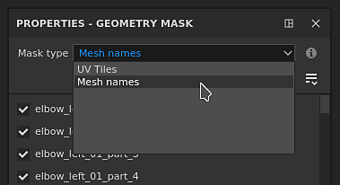
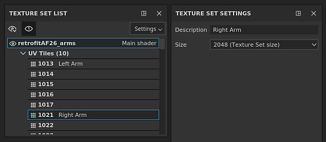
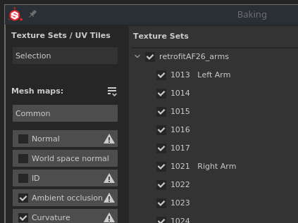

# Version 2021.1 (7.1.0)

**Substance Painter 2021.1 (7.1.0)** enthält mehrere neue Funktionen und Verbesserungen, wie z. B. die Geometriemaske und das Kopieren und Einfügen von Effekten im Ebenenstapel.

Freigabedaten: *28. Januar 2021*

>[!NOTE]
>
> Diese Version erhöht die von Ubuntu unterstützte Mindestversion auf 18.04 und von MacOS auf 10.14. Weitere Informationen finden Sie in den [technischen Anforderungen](../../getting-started/system-requirements.md).

## Wichtigste Funktionen

### Neue Geometriemaske

Die Geometriemaske ist ein neues Maskierungswerkzeug im Ebenenstapel, mit dem Sie Geometrien auf der Grundlage von Gitternamen oder UV-Kacheln ausblenden können. Es handelt sich um eine Weiterentwicklung der zuvor benannten UV-Kachelmaske, die auf UDIM-Nummern basierende Geometrie maskiert.

Dieses neue Werkzeug ist eine bessere Methode zum Maskieren von Geometrie als beim normalen Malen (oder bei Verwendung der [Polygonfüllung](../../painting/tool-list/polygon-fill.md)), da es von mehreren Moduloptimierungen profitiert. Es ist auch nicht-destruktiv, da es keine Geometrieinformationen (wie Gesichter oder Scheitelpunkte) speichert, sondern nur den Netznamen oder die UV-Kachelnummer, sodass der erneute Import eines Gitters die Maske nicht beschädigt. Ein weiterer Vorteil ist, dass durch das Ausblenden von Geometrie das Malen auf Oberflächen möglich ist, auf die zuvor in einem Textursatz nicht zugegriffen werden konnte. Dadurch entfällt die Notwendigkeit, ein Objekt beispielsweise in mehrere Textursätze aufzuteilen.

* **Neue Geometriemaske auf Ebenen**\
  Die Geometriemaske ist automatisch für jede Ebene im [Ebenenstapel](../../interface/layer-stack/layer-stack.md) verfügbar. Standardmäßig hat sie keine Auswirkungen, d. h., die Ebene ist vollständig sichtbar.\
  Die Geometriemaske verfügt über ein eigenes Kontextmenü, mit dem Sie schnell alle Elemente auswählen oder die Auswahl aufheben, aber auch die Werte in eine andere Ebene kopieren können.

  

  

* **Bearbeiten der Geometriemaskeneigenschaften** Die Geometriemaske folgt der gleichen Logik wie die Kontexte der anderen Ebene (z. B. Bearbeiten einer Maske oder instanzierter Eigenschaften). Um in den Editionsmodus für Geometriemasken zu wechseln, klicken Sie einfach auf das gepunktete Quadrat rechts neben einer Ebene. Um die Geometriemaske zu verlassen, klicken Sie auf den Inhalt oder die Malmaske derselben Ebene.

  

* **Maskieren nach Netznamen oder durch UV-Kacheln**\
  Oben in den Eigenschaften der Geometriemaske befindet sich eine Dropdown-Liste, die den Maskierungsmodus steuert. Sie können zwischen der Maskierung nach UV-Kachelnummer oder nach Maschenname wählen. Diese Dropdown-Liste ist deaktiviert und auf den Netznamen festgelegt, falls ein Projekt nicht den Workflow für die UV-Kachel verwendet.

  

* **Geometrie über die Eigenschaften maskieren**\
  Beim Bearbeiten der Geometriemaske wird im Eigenschaftenfenster eine Liste der Gitternamen (oder UV-Kacheln) angezeigt, die auf der Geometrie basieren, die mit dem aktuellen Textursatz verknüpft ist.

  * Die Zahl über der Liste gibt an, wie viele Meshes/UV-Kacheln über der insgesamt verfügbaren Maske unmaskiert sind.
  * Das Menü neben der Nummer bietet Schnellsteuerungen, mit denen Sie alle oder keine der Elemente auswählen und sogar die aktuelle Auswahl umkehren können.
  * Die folgende Liste definiert, welche Elemente maskiert sind oder nicht. Wie bei anderen Listen in der Anwendung können Sie auf mehrere Elemente gleichzeitig klicken und ziehen, um sie zu aktivieren/deaktivieren, oder Sie können ein Element mit **ALT+Klick** isolieren.

   

* **Geometrie über den Viewport maskieren**\
  Die Auswahl der Geometriemaske kann auch in den 2D- und 3D-Ansichten geändert werden. Bewegen Sie einfach den Mauszeiger über den Teil, der sichtbar/verborgen sein soll und klicken Sie darauf, um den Zustand zu ändern. Beim Bearbeiten der Geometriemaske wird die maskierte Geometrie mit einem grauen und diagonalen Linieneffekt angezeigt. Es ist auch möglich, rechteckige Auswahlbereiche auszuwählen, indem Sie auf mehrere Elemente klicken und sie ziehen.\
   

* **Ausgeblendete/nicht erreichbare Geometrie wird gemalt.**\
  Nachdem Sie die Geometrie ausgewählt haben, die in der Geometriemaske maskiert werden soll, können Sie die Schaltfläche **Ausgeschlossene Geometrie ausblenden/ignorieren** oben im Viewport aktivieren (oder die Tastenkombination **ALT+H** drücken). Wenn diese Option aktiviert ist, wird ausgeschlossene Geometrie (sowie andere Textursätze) ausgeblendet, um nur Geometrie anzuzeigen, die in der aktuellen Ebene enthalten bzw. mit ihr gemalt werden kann. Mit dieser Option können Sie Bereiche malen, die zuvor blockiert oder außer Reichweite waren. Diese Option gilt auch für jede Art von Ebene.

  >[!NOTE]
  >
  > Das Malen mit maskierter Geometrie bleibt dynamisch: Wenn beim Erstellen des Pinselstrichs zunächst eine Geometrie verborgen war, die das Malen blockierte, und dann die Maske wieder aufgehoben wird, wird der zuvor erstellte Pinselstrich wieder blockiert.

  

### Neue Effekte zum Kopieren und Einfügen von Ebenenstapeln

Effekte können jetzt auf die gleiche Weise wie normale Ebenen über Ebenen und Ebenenstapel hinweg kopiert werden.

Auch die Mehrfachauswahl ist jetzt möglich, um die Möglichkeit zu bieten, mehrere Effekte gleichzeitig zu kopieren und einzufügen.

Wenn Sie einen Effekt aus einer Maske auf einer Ebene ohne Maske kopieren oder verschieben, wird automatisch ein Effekt hinzugefügt. Das liegt daran, dass Effekte aus Ebeneninhalt und Maske nicht miteinander kompatibel sind. Das bedeutet, dass beim Kopieren eines Effekts von einer Maske in den Inhalt einer Ebene automatisch zur Maske gewechselt wird (oder ein Effekt erstellt wird).

* **Kopieren und Einfügen über das Kontextmenü**\
  Mache einen Rechtsklick bzw. Ctrl-Klick auf einen Effekt im Ebenen-Stapel eines Texturensatzes, und wähle die Aktion &quot;Ausschneiden&quot; oder &quot;Kopieren&quot;. Mache wieder einen Rechtsklick bzw. Ctrl-Klick auf eine beliebige Ebene, und wähle &quot;Einfügen&quot;, um die gewünschten Effekte zu verschieben oder eine Kopie davon zu erstellen. Wir haben auch die Gelegenheit genutzt, das Kontextmenü zu überarbeiten und Zugriff auf weitere Funktionen zu gewähren:

  

* **Kopieren und Einfügen mit den Tastaturbefehlen**\
  Wie bei jeder Ebene kann der Tastaturbefehl **STRG+C** (Kopieren)/**STRG+X** (Ausschneiden) und **STRG+V** (Einfügen) verwendet werden, um Effekte basierend auf der aktuellen Auswahl zu kopieren. Wie bei Ebenen werden Effekte über der aktuellen Auswahl eingefügt.

  

* **Effekt mit Tastaturbefehlen schnell duplizieren**\
  Verwenden Sie **STRG+D**, um die aktuelle Auswahl zu duplizieren, oder drücken und halten Sie **ALT, während Sie** einen Effekt ziehen, um ihn an der gewünschten Position zu duplizieren:

  

* **Effekte zwischen Ebenen verschieben**\
  Neben dem Kopieren und Duplizieren ist es jetzt möglich, einen Effekt durch einfaches Ziehen und Ablegen von einer Ebene in eine andere zu verschieben:

  

### Neue allgemeine Funktionen und Verbesserungen

In dieser Version wurden mehrere Verbesserungen vorgenommen:

* **Beschreibung pro UV-Kachel hinzufügen**\
  Für jede UV-Kachel kann jetzt eine Beschreibung über die Textursatzliste hinzugefügt werden. Dies erleichtert die Navigation im Projekt, insbesondere beim Exportieren und Backen, da die Beschreibungen auch in diesen Kontexten zu sehen sind.\
  Um eine Beschreibung hinzuzufügen oder zu bearbeiten, klicken Sie einfach auf eine UV-Kachel im Fenster &quot;Texturensatzliste&quot; und gehen dann in das Fenster &quot;Texturensatzeinstellungen&quot;, um sie zu bearbeiten.

  

   

* **Miniaturansichten für neuen Ebenenstapel**\
  Die optimierten Ebenenstapel-Miniaturansichten wurden verbessert. Für Füllebenen wird jetzt eine Materialkugel angezeigt, sodass Sie einfacher navigieren und die Haupteigenschaften jeder Ebene anzeigen können, selbst wenn Sie mit dem Arbeitsablauf [UV-Kacheln](../../features/uv-tiles/uv-tiles.md) arbeiten. Die Miniaturansicht wird aus den Ebeneninformationen generiert, berücksichtigt aber keine Effekte, um eine zu häufige Neuberechnung zu vermeiden.

  

* **Verbessertes Verlassen der Geometriemaske im Ebenenstapel**\
  Das Beenden der Geometriemaske (ehemals UV-Kachelmaske) könnte sich bei Ordnern im Ebenenstapel als schwierig erweisen, wenn keine Maske vorhanden war. Das liegt daran, dass es keinen anderen Kontext zum Aktivieren gab, als die Auswahl einer anderen Ebene. Es ist jetzt möglich, auf die Miniaturansicht des Ordners zu klicken, um die Geometriemaske zu verlassen. Es ist auch möglich, Materialien oder intelligente Materialien vom Shelf in den Viewport zu ziehen und dort abzulegen, während Sie die Geometriemaske bearbeiten.

  

  

* **Neue Auswahl durch Klicken bei gedrückter Alt-Taste im Backing-Fenster**\
  Die Liste der Gitterzuordnungen im Backfenster kann jetzt mit dem **Alt + Mausklick** isoliert werden, um eine bestimmte zu backende Karte zu isolieren, anstatt sie manuell ausschließen zu müssen. Mit dem gleichen Tastaturbefehl können Sie alle Gitterzuordnungen wieder aktivieren.

  

* **Schaltfläche &quot;Aktuelle Texturmenge backen&quot;**\
  Unten im Fenster &quot;Backen&quot; wurde ein neuer Button hinzugefügt, mit dem Sie ein neues Texturset schnell und einfach backen können. Die Verwendung dieser Schaltfläche hat keine Auswirkungen auf die zuvor definierte benutzerdefinierte Auswahl und backt stattdessen den gesamten Textursatz (einschließlich aller verfügbaren UV-Kacheln).

  

### Neues Substance Engine-Update

Das Substance Engine wurde auf Version 8 aktualisiert, um das neueste Substance-Dateiformat und seine Funktionen zu unterstützen.

Weitere Informationen zu den neuen Substance Engine-Funktionen finden Sie auf [dieser Dokumentationsseite](https://helpx.adobe.com/substance-3d/unlisted/documentation/sddoc/version-2020-2-10-2-0-200574252.html).

### Neue NVIDIA RTX 3000-Unterstützung in Irak

Der [Iray-Renderer](../../features/iray-renderer/iray-renderer.md) wurde auf die neueste Version aktualisiert und unterstützt jetzt die neuen Nvidia Ampere-GPUs (RTX 3000-Serie und Quadro A-Serie).

>[!NOTE]
>
> Mit diesem Update werden Kepler GPUs (GeForce 600 und 700 Serien) nicht mehr unterstützt, das Rendering in Iran erfolgt stattdessen über die CPU.

### Neue Inhalte

In dieser Version wurden drei neue Heftwerkzeuge hinzugefügt, mit denen komplexe Muster und realistische Stiche erstellt werden können. Um sie zu finden, gehen Sie einfach in den Werkzeugbereich des Regals und suchen Sie nach:

* Stiche komplex
* Nähte Quernaht
* Nähte gerade

Es wird empfohlen, die Funktion [Lazy mouse](../../painting/lazy-mouse.md) in der kontextabhängigen Symbolleiste zu aktivieren, um die Qualität der gemalten Stiche zu erhöhen.

Im Folgenden finden Sie eine Übersicht über alle Vorgaben in den neuen Werkzeugen:

{width="800px"}

### Neue Python-Funktionen

Die Python-API hat mehrere neue Funktionen erhalten. Die Dokumentation wurde ebenfalls überarbeitet, insbesondere ihre Beispiele, um es leichter zu machen, die API zu verstehen und zu lernen.

* **Ressourcen- und Regalverwaltung**\
  Das Ressourcenmodul wurde verbessert und kann jetzt Folgendes:
  * Erstellen und Verwalten von Ablagen.
  * Suchen oder importieren Sie Ressourcen in Regalen und Projekten.
  * Erkennen, ob ein Regal durchforstet wird (und damit wissen, wann die Ressourcen einsatzbereit sind).
  * Weisen Sie Ressourcen in einer Ablage benutzerdefinierte Miniaturen zu.

* **Informationen zu UV-Kacheln**\
  Es ist jetzt möglich, die Liste der UV-Kacheln eines Textursatzes abzufragen. Dies ermöglicht beispielsweise die Erstellung benutzerdefinierter Exporte für einen bestimmten Bereich von UDIM-Kacheln.

* **Status der Projektedition**\
  Eine neue Funktion und Ereignisse wurden hinzugefügt, um zu erfahren, ob ein Projekt bearbeitet werden kann. Dies ist nützlich, um zu erfahren, ob eine Berechnung ausgeführt wird und das Ändern der Eigenschaften eines Projekts nicht möglich ist.

>[!NOTE]
>
> Auf die Python-API-Dokumentation können Sie über das Hilfemenü der Anwendung zugreifen.

## Tutorials

Im Folgenden finden Sie unsere Videotutorials zu den neuen Funktionen:

## Versionshinweise

### 2021.1

*(veröffentlicht am 28. Januar 2021)*\
Zusammenfassung: **Hauptversion, neue Geometriemaske, mit der Teile der Geometrie ausgewählt und gemalt werden können, Kopier-/Einfügeeffekte im Ebenenstapel, Verbesserung des Arbeitsablaufs für UV-Kacheln, Aktualisierung von Iray, Bakers, Substance Engine und neuen Inhalten**

**Hinzugefügt:**

* Neue Geometriemaske und malen ausgewählte Teile der Geometrie
* [Geometriemaske] Ausgewählte Teile der Geometrie über Gitternamen malen
* [Geometrie-Maske] Rechteckige Auswahl in beiden Ansichten
* [Geometriemaske] Ausgeschlossene Geometrie auf einer Ebene ausblenden/ignorieren
* [Geometriemaske][Eigenschaften] Schnellauswahl für Kontrollkästchen mit Klicken und Ziehen
* [Geometriemaske][Eigenschaften][UI] Alle Elemente mit einer Dropdown-Liste im Eigenschaftenfenster einschließen/ausschließen
* [Geometriemaske][Eigenschaften] Ermöglicht die schnelle Auswahl eines Elements in einer Liste mit ALT+LINKSKLICK.
* [Geometriemaske][Eigenschaften] Überlagerung in Viewports, wenn der Mauszeiger über Gitternamen/UV-Kacheln im Eigenschaftenfenster bewegt wird
* [Geometriemaske][Ebenenstapel] Optionen zum Kopieren/Einfügen zur Geometriemaske hinzufügen
* [Geometriemaske] Neues Symbol für Schaltfläche &quot;Ausgeschlossene Geometrie ausblenden/ignorieren&quot;
* [Geometriemaske] Neue QuickInfo für Ausgeschlossene Geometrie ausblenden/ignorieren
* [Geometriemaske] Tastaturbefehl ALT+H zum Aktivieren/Deaktivieren der Schaltfläche &quot;Ausgeschlossene Geometrie ignorieren&quot;
* [UV-Kacheln][Ebenenstapel] Neue Kugelvorschau der Füllebene für UV-Kacheln und vereinfachten Modus
* [UV-Kacheln][Ebenenstapel] Einfaches Beenden der UV-Kachelmaske
* [UV-Kacheln][Texturset-Liste] Geben Sie eine Beschreibung pro UV-Kachel an.
* [UV-Kacheln][Einstellungen für Textursatz][UI] Zwei neue Abschnittstitel im Dropdown-Menü zum Ändern der UV-Kachelauflösung
* [UV-Kacheln][Viewport] Beenden Sie die UV-Kachelmaske, wenn Sie ein Material in das Viewport ziehen.
* [Ebenenstapel] Optionen zum Kopieren/Einfügen für Effekte hinzufügen
* [Ebenenstapel] Kopieren/Einfügen von Effekten von einem Textursatz in einen anderen zulassen
* [Ebenenstapel] Mehrere Effekte auswählen
* [Ebenenstapel] Optionen zum Kopieren/Einfügen als Tastaturbefehle für Ebeneneffekte hinzufügen
* [Ebenenstapel] Automatisch zwischen Maske und Inhalt wechseln, wenn Effekte auf eine andere Ebene gezogen werden
* [Ebenenstapel] Beim Einfügen einer Maske aus einer anderen Ebene automatisch eine Maske erstellen
* [Ebenenstapel] Fügen Sie im Kontextmenü der Effekte die Aktionen zum Verschieben hinzu.
* [Ebenenstapel] Ziehen und Ablegen von Effekten von einer Ebene auf eine andere zulassen
* [Ebenenstapel] Wenn Elemente in einen Ordner gezogen werden, werden sie oben im Ordner platziert.
* Aktualisieren Sie Iray auf Version 2020.1.0
* [Baker] Update Baker auf Version 2.5.4
* [Bäcker] Anzeigen einzelner UV-Kacheln im Fenster Backfortschritt
* [Bäcker][UI] Ermöglicht das schnelle Backen des aktuellen Textursatzes mit einer neuen Schaltfläche
* [Bäcker] Benutzer können schnell einen der Bäcker mit ALT+LINKSKLICK auswählen
* Substance Engine auf Version 8.0.8 aktualisieren
* [Substance Engine] Unterstützung der Standardfarbe in neuen .sbsar-Dateien
* [Automatisches Ausgliedern] Leistungsverbesserung
* [Exportieren] Fügen Sie visuelles Feedback hinzu, um anzugeben, welche UV-Kachel-Auflösung von der Standardauflösung des Projekts abweicht
* [Exportieren] Hinzufügen des Szenengrößenfaktors zur exportierten Shader-JSON-Datei
* [Sprache] Japanische Übersetzung hinzufügen
* [UI] Aktualisierung des Fensters mit Versionierung interner Abhängigkeiten
* [Scripting][Python] Verwaltung von Shelf-Ressourcen zulassen
* [Scripting][Python] Ermitteln Sie, wann ein Projekt zum Backen und Exportieren bereit ist.
* [Scripting][Python] Ermitteln Sie, wann ein Shelf das Crawlen von Ressourcen auf der Festplatte abgeschlossen hat.
* [Scripting][Python] Liste der UV-Kacheln pro Textursatz abfragen
* [Scripting][Python] Zulassen, dass den Shelf-Ressourcen eine benutzerdefinierte Vorschau zugewiesen wird
* [Scripting][Python] Verwaltung benutzerdefinierter Ablagen zulassen
* [Scripting][Python] Hinzufügen eines Methodenindexes in jedem Untermodul in der Dokumentation
* [Scripting][Python] Neuer Stil für die Dokumentation
* [Scripting][Python] Verbesserung der Ressourcen und der Dokumentation im Shelf
* [Inhalt] Drei neue Werkzeugvorgaben zum Erstellen von Nähten
* [Shelf] Entfernen Sie vorübergehend &quot;Exportieren auf Substance share&quot;, während Sie zur neuen Substance share-Plattform wechseln.

**Fest:**

* Absturz bei Verwendung von Monitoren mit unterschiedlichen Auflösungen
* Absturz im Substance Engine mit einigen seltenen Projekten
* Die Viewport-Aktualisierung schlägt beim Wechseln von Ebenen mit &quot;Ausgeschlossene Geometrie ausblenden/ignorieren&quot; fehl.
* [2D-Ansicht] 2D-Viewport kann in einigen Projekten fehlen
* [Backen] &quot;Match by mesh name&quot; ignoriert Teile des Objekts
* [Ebenenstapel] Durch Klicken auf einen Ebeneneffekt wird der Ordner geöffnet.
* [Geometrie-Maske] UV-Kachel wird in der Maske immer noch gezählt, auch wenn das Gitter ohne sie erneut importiert wird
* [Geometriemaske] Das Kontextmenü im Darstellungsfenster enthält nicht die richtigen Werkzeuge
* [Motor] Starke Verzögerungen bei bestimmten Projekten
* [Scripting] Hohe Latenz bei Anforderungen an Remote-JSON-POST unter Windows
* [Linux] Vram-Menge wird bei bestimmten integrierten GPUs nicht richtig erkannt
* [Automatisches Ausgliedern] Abstürze oder langes Ausgliedern bei einigen Projekten
