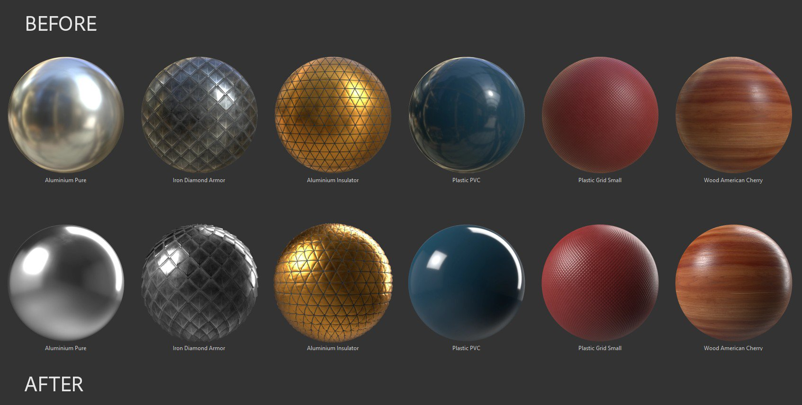
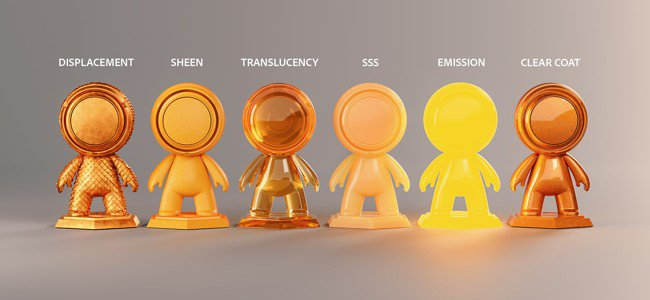
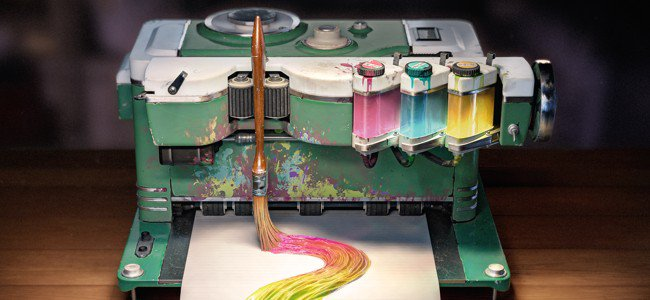

# Version 7.2

**Substance 3D Painter 7.2** bietet neue Rendering-Funktionen für den Adobe Standard Material-Workflow, neue Möglichkeiten zur Freigabe von Inhalten in [Substance 3D-Anwendungen](https://www.adobe.com/products/substance3d/3d-augmented-reality.html) und ein überarbeitetes Elementfenster.

Freigabedatum: *23. Juni 2021*

## Wichtigste Funktionen

### Fenster &quot;Neue Elemente&quot;

Das alte Regal wurde verbessert und in &quot;Elemente&quot; umbenannt. Das neue Design konzentriert sich darauf, den Zugriff auf Inhalte zu beschleunigen und Inhalte mit den neuen, dedizierten Symbolen einfacher zu filtern. Es kommt auch mit einem einfacheren Navigationssystem mit den Breadcrumbs. Dieses neue Design konzentriert sich auch darauf, die Erfahrung mit anderer Substance 3D-Software zu vergleichen, sodass die Verwaltung von Inhalten über Anwendungen hinweg einfacher wird.

>[!NOTE]
>
> Diese Version enthält Änderungen an der Verwaltung der Anwendungsvoreinstellungen und der Regal-/Assets-Inhalte. Um zu erfahren, wie Sie Ihre Daten migrieren, sehen Sie sich [die dedizierte Seite](../../pipeline-and-integration/resource-management/preferences-and-content-migration.md) an.

* **Neues Design und Layout**\
  Das neue Design konzentriert sich auf die Einfachheit, aber auch auf die einfachere Organisation des Fensters. Das Fenster kann nun vertikal angedockt werden, ohne Platz zu verschwenden. Mit einem neuen Listenanzeigemodus können Elemente viel einfacher nach Namen durchsucht werden.

  

* **Neue Breadcrumb-Navigation**\
  Navigationsressourcen können manchmal auf einer winzigen Benutzeroberfläche schwierig sein. Mit dem Breadcrumb ist es jetzt nicht einfacher, zwischen Ordnern zu springen, ohne die vollständige Ordnerhierarchie anzeigen zu müssen.

  

* **Neue Verwendungsfilter**\
  Das Fenster &quot;Elemente&quot; enthält viele verschiedene Inhalte. Die Verwendung ist eine gute Möglichkeit, Inhalte zu filtern und bestimmte Ressourcen zu isolieren. Um eine bestimmte Verwendung auszuwählen, klicken Sie einfach auf die dedizierte Schaltfläche. Um mehrere Benutzer hinzuzufügen oder zu entfernen, halten Sie die STRG-Taste gedrückt, während Sie auf eine Schaltfläche klicken.

  

* **Verbessertes Rendern von Miniaturansichten**\
  Wir haben uns die Zeit genommen, unser Miniaturansichtenerstellungssystem zu überarbeiten, um ihre Qualität zu verbessern und sie im gesamten Substance 3D-Ökosystem konsistenter aussehen zu lassen. Wir haben auch die Unterstützung von Versatz hinzugefügt.

  {width="500px"}

* **Miniaturansichten aus Substance-Archiven werden geladen (SBSAR)**\
  Benutzerdefinierte Miniaturansichten, die in Substance-Dateien eingebettet sind, werden nicht geladen und nicht im Fenster &quot;Elemente&quot; angezeigt. Das Freigeben benutzerdefinierter Ressourcen ist jetzt einfacher, da die Ressourcen-Metadaten für benutzerdefinierte Symbole nicht einbezogen werden müssen.

* **Verbesserte Leistung** Die Lade- und Generierungszeit von Miniaturansichten wurde in mehreren Aspekten verbessert und sollte jetzt viel schneller sein.

* **Das Vorschauspeicherbudget erhöhen, um mehr Miniaturansichten zu laden**\
  Standardmäßig wird der Anzeige von Miniaturansichten ein begrenzter Speicherplatz zugewiesen, um Performance-Einsparungen zu erzielen. Eine Bibliothek mit vielen Ressourcen kann jedoch dazu führen, dass Miniaturansichten ständig geladen und entladen werden, was die Navigation und die Suche nach Ressourcen erschwert. Es ist jetzt eine neue [Umgebungsvariable ](../../pipeline-and-integration/configuration/environment-variables.md) vorhanden, mit der der standardmäßige Budgetwert überschrieben werden kann.

### Neuer Adobe Standard Material-Arbeitsablauf

Ein neuer Shader mit dem Namen **Adobe Standard Material** (ASM) wurde hinzugefügt, der mehrere Funktionen gleichzeitig unterstützt, sodass komplexere und genauere Materialien innerhalb eines einzelnen Textursatzes erstellt werden können. Mit diesem neuen Shader haben wir auch die Möglichkeit genutzt, neue Kanäle hinzuzufügen, um die Erstellung von Materialien zu erleichtern.

* **Neuer Adobe Standard Material-Shader**\
  Der neue ASM Shader ist ein Shader, der mehrere Funktionalitäten sowie eine Weiterentwicklung unseres PBR-Renderings zusammenfasst. Gleichzeitig unterstützt sie Folgendes:
  * **Anisotropie**
  * **Mantel löschen**
  * **Glanz**
  * **Specular edge color**
  * **Zusätzliche Methoden zur Volumenstreuung**
  * Und natürlich die anderen bestehenden Features wie Parralax Verdeckung, Versatz, etc.

* **Neue Kanäle und Benutzerkanäle**\
  Zur Unterstützung des neuen ASM-Shader wurden neue Kanäle hinzugefügt. Außerdem haben wir die Anzahl der Benutzerkanäle verdoppelt, um die Möglichkeiten benutzerdefinierter Informationen und Shader zu erweitern.
  * Beschichtungsfarbe
  * Rauheit der Beschichtung
  * Beschichtung normal
  * Deckkraft der Beschichtung
  * Reflexionsebene der Beschichtung
  * Streufarbe
  * Schimmernde Farbe
  * Schimmerrauheit
  * Schimmer-Deckkraft
  * Spiegelartige Randfarbe
  * Benutzerkanäle von 8 bis 15

* **Verbesserte Einstellungen für den Textursatz**\
  Das Kanallistenmenü in den Kanaleinstellungen gruppiert nun die Textursätze nach ihrer Kompatibilität mit dem aktuellen Shader. So können Sie leichter erkennen, welche Kanäle Auswirkungen auf den Viewport haben.

  

* **Neue Shader-API-Funktionen mit sichtbaren if- und Rekompilierungsfunktionen**\
  Mit der Entwicklung des ASM Shaders wurden einige Änderungen in der API mit zwei bemerkenswerten Funktionen vorgenommen:
  * **Sichtbar wenn**: Shader-Parameter können je nach Bedingung ein- oder ausgeblendet werden, um die Shader-Benutzeroberfläche leichter lesbar zu machen.
  * **Neukompilierung**: Durch eine bestimmte Parameterdeklaration ist es nun möglich, einen Teil eines Shader zu deaktivieren und neu zu kompilieren, um ihn zu optimieren, wenn sich der Parameter ändert. Dadurch können ungenutzte Funktionen verworfen werden.

### Neuer Austausch für Substance 3D-Ökosysteme

Das Senden von Ressourcen und Assets zwischen Substance 3D-Applikationen ist jetzt mit diesem neuen Arbeitsablauf viel einfacher und mit nur einem Klick möglich. Es ist jetzt möglich, Substance-Dateien von Substance 3D Designer oder Substance 3D Sampler zu empfangen oder ein Projekt sehr einfach an Substance 3D Stager zu senden, um Inhalte schnell zu iterieren.

>[!WARNING]
>
> Diese Sende- und Empfangsfunktionen stehen nur in der Creative Cloud-Desktop-Version der Anwendung zur Verfügung, da sie auf bestimmten Technologien basiert, um dies zu ermöglichen. Dies bedeutet, dass die eigenständige Steam- oder Substance 3D-Version diese Funktionen nicht unterstützt.

* **Painter an Stager**\
  Exportieren Sie mit der aktualisierten Exportvorgabe von Painter nach Stager oder verwenden Sie die Aktion **An Substance 3D Stager senden**, um das aktuelle Projekt automatisch zu exportieren und in Stager zu importieren. Es ist keine manuelle Konfiguration erforderlich.

* **Stager zu Painter**\
  Erstelle Modelle aus 3D Stager in einer Textur mit einer ähnlichen Ein-Klick-Aktion direkt aus 3D Stager.

* **Designer oder Sampler zu Painter**\
  Erhalten Sie Substance-Materialien, Filter und vieles mehr von Designer oder Sampler mit nur einem Klick direkt im Bedienfeld &quot;Elemente&quot;.

* **Substance 3D Assets an Painter**\
  Empfangen Sie Inhalte wie Substance Material vom Creative Cloud Desktop direkt in das Asset-Fenster von Painter.

* **In Bridge anzeigen**\
  Ressourcen im Fenster &quot;Elemente&quot; in einer von Adobe Bridge verwalteten Bibliothek können in Bridge direkt geöffnet werden, indem Sie das Kontextmenü über einer bestimmten Ressource verwenden.

### Neuer Inhalt

In dieser Version wurden neue Inhalte hinzugefügt:

* **Neue Projektvorlagen für Adobe Stand Material (ASM)**\
  Um die Nutzung des neuen ASM-Shader zu erleichtern, wurden neue Projektvorlagen erstellt, um die Projekterstellung zu beschleunigen:
  * ASM - PBR-Metallische Rauheit
  * ASM - PBR Metallische Rauheit Anisotropy angle
  * ASM - PBR Metallische Rauheit beschichtet
  * ASM - PBR Metallische Rauheit SSS
  * ASM - PBR Metallische Rauheit Glanz

* **Neue Umgebungs-Map**\
  Einige neue Umgebungs-Map wurden hinzugefügt, um Ihre Projekte aufzuhellen, einschließlich der Studio 06-Version, mit der die neuen Elemente-Miniaturansichten gerendert wurden:
  * Innenausstattung:
    * Atelier
  * Studio:
    * Studio 06
    * Studio 80s Horror Flick A
    * Studio Black Soft
    * Studio White Soft
    * Studio White Umbrella

### Verbesserter automatischer Entpack von UV

Es wurde eine neue Aktualisierung der automatischen UV-entpack hinzugefügt, die die Unterstützung von UV-Kacheln und zusätzliche Kontrolle über die UV-Generierung bietet:

* **UV-Kachel**\
  Bei der Generierung von UVs kann nun die maximale Anzahl der zu erstellenden UV-Kacheln festgelegt werden. Dies ermöglicht es, die UV-Generierung auch mit dem UV-Kachel-Workflow zu verwenden.

* **Ausrichtung der UV-Insel**\
  Ein neuer Parameter wurde hinzugefügt, um die Ausrichtung der UV-Insel beim Verpacken zu beschränken. Dies ermöglicht UV-Inseln, die ein bisschen besser ausgerichtet sind, sodass einige Objekte einfacher Textur werden können (z. B.: eine Holztür zur Ausrichtung des Holzmusters).

* **Verbesserte Packing-Performance**\
  Auch die Packing-Funktion wurde verbessert, um mit der neuen UV-Kachel-Unterstützung eine gute Performance zu bieten.

### Allgemeine Verbesserungen

Diese neue Version bietet verschiedene Verbesserungen der Lebensqualität:

* **Verbesserte Schiebereglerleistung mit dem Stift des Grafiktabletts**\
  Das Ziehen von Reglern mit einem Stift sollte jetzt viel reaktionsfähiger sein. Schieberegler sollten sich nicht mehr klebrig fühlen.

* **Verbesserte Leistung mit bereits übermalten Ebenen**\
  Das Malen auf einer Ebene mit vielen vorhandenen Pinselstrichen sollte jetzt viel schneller gehen und nicht mehr zu einer Verlangsamung führen.

* **Schnelleres Malen nach dem Öffnen eines Projekts**\
  Das Malen auf einer Ebene oben im Ebenenstapel unmittelbar nach dem Öffnen eines Projekts erfolgt jetzt sofort. Die Berechnung des Engine-Caches wurde auf einen späteren Zeitpunkt verschoben, sodass die Neuauflage alter Projekte in diesem Kontext etwas schneller vonstatten geht.

* **Scharfe normale Methode**\
  In den Textursatz-Einstellungen gibt es einen neuen Methodenparameter &quot;Height zu Normal&quot;, mit dem Sie steuern können, wie der Height-Kanal in eine Normalen-Map konvertiert wird. Dieser neue Parameter ist nützlich, um die Qualität von Oberflächen mit vielen verschiedenen Materialien zu verbessern, wie z. B. bei Stoff.

  {width="450px"}

* **Neues Schnittstellenformat**\
  Die allgemeine Benutzeroberfläche wurde leicht angepasst, um sie besser an das allgemeine Substance 3D-Ökosystem anzupassen. Dies macht den Wechsel von einer Anwendung zur anderen weniger überraschend und einfacher zu navigieren.

* **Neue Übersetzungen**\
  Es wurden drei neue Sprachen hinzugefügt, um die Benutzeroberfläche des Programms Kamera bewegen:
  * Français
  * Deutsch
  * Vereinfachtes Chinesisch

## Versionshinweise

### 7.2.0

*(veröffentlicht am 23. Juni 2021)*\
Zusammenfassung: **Die Hauptversion bietet eine Aktualisierung des Bedienfelds &quot;Elemente&quot;, einen neuen Shader mit Zugriff auf neue Kanäle und Parameter, eine allgemeine Aktualisierung der Benutzeroberfläche, einige dringend angeforderte Leistungsverbesserungen, erweiterte Sprachunterstützung und vieles mehr!**

**Hinzugefügt:**

* [Bibliotheken] Neues Bedienfeld &quot;Elemente&quot;, um das Regal zu ersetzen
* [Bibliotheken][UI] Neues Bedienfeld &quot;Elemente&quot;
* [Bibliotheken][UI] Ändern der standardmäßigen Ausrichtung des Bedienfelds &quot;Elemente&quot; und der Benutzeroberfläche
* [Bibliotheken][Benutzeroberfläche] Einführung einer Listenansichtsoption in die Bibliothek
* [Bibliotheken][UI] Neue Breadcrumbs-Navigation im Bedienfeld &quot;Elemente&quot;
* [Bibliotheken][UI] Wählen Sie &quot;Alle Bibliotheken&quot; aus, wenn Sie eine gespeicherte Suche auswählen.
* [Bibliotheken][UI] Wählen Sie &quot;Alle Bibliotheken&quot;, wenn alle Ordner deaktiviert sind.
* [Bibliotheken][UI] Neues Tag für Partikelpinsel
* [Bibliotheken][UI] &quot;Ablage&quot; durch &quot;Alle Bibliotheken&quot; in der gesamten App ersetzt
* [Bibliotheken][UI] Leere Ordner ausblenden
* [Bibliotheken][UI] Die Standardbenutzerbibliothek sollte auch dann sichtbar sein, wenn sie leer ist
* [Bibliotheken][UI] Neue Filtermethode über die Symbole des Elementtyps
* [Bibliotheken] Tastenkombination &quot;STRG&quot; zum Auswählen mehrerer Elementtypen
* [Bibliotheken] Neue Umgebungsvariable zur Steuerung des Speicherbudgets für die Elementvorschau
* [Bibliotheken][Inhalt] Neue Umgebungszuordnungen
* [Bibliotheken][Inhalt][Benutzeroberfläche] Rendern von Versatz auf Standardmaterialien
* [Bibliotheken][Inhalt] Legen Sie den Adobe Standard Material (ASM)-Shader als Standard für die Vorschauerstellung fest.
* [Bibliotheken][Inhalt][ASM] Neue Projektvorlagen für neuen ASM-Shader
* [Bibliotheken][Miniaturansicht] Neue Studio 6-Umgebungszuordnung verwenden
* [Bibliotheken][Miniaturansicht] Miniaturansicht in Ressource lesen, anstatt sie zu generieren
* [Bibliotheken][Miniaturansicht] Versatz zur Miniaturgenerierung hinzufügen
* [Einstellungen für Struktureinstellungen]
* [Einstellungen für Struktureinstellungen][UI] Neues Height wird einer normalen Konvertierungsmethode zugewiesen.
* [Einstellungen für Textursatz][UI] Nachbearbeitung der UI-Organisation der Kanäle
* [Einstellungen für Textursatz] Benutzerkanallimit auf 16 Kanäle erhöht
* [Einstellungen für Textursatz][UI] Geben Sie an, welche Kanäle mit dem aktuell ausgewählten Shader kompatibel sind.
* [Shader][ASM] Neuer Adobe Standard Material Shader
* [Shader][ASM] Zusätzliche Unterstützung für Anisotropie, Clear Coat, Subsurface Scattering, Specular edge color und Sheen
* [Shader][ASM] Ändern der Farbwerte der Standardkanäle
* [Shader][ASM][Export] Aktualisierte Exportvorlage Adobe Dimension zu Adobe Substance 3D Stager
* [Shader][ASM] Beschriftungen und QuickInfos für Shader- und MDL-Parameter hinzugefügt
* [Shader][ASM] Die Farbfarbe der Streuung in der 2D-Ansicht sichtbar machen, auch wenn SSS nicht unterstützt wird
* [Shader][ASM][Iray] Unterstützung des ASM-Shaders in Iray mit neuer MDL
* [Shader][ASM][Iray] Aktualisierte Untergrundstreuung in veraltetem PBR-Spezifikationsglanz und beschichtet
* [Shader][ASM][Content] Der Standard-SSS-Typ für Samples wurde geändert
* [Shader][ASM] Hinzugefügte Dokumentation für ASM API
* [Shader][ASM] Optimieren Sie Shader, um nicht verwendete Kanäle zu ignorieren
* [Shader] Neue Texturset-Kanäle anzeigen
* [Shader] Verbesserte Untergrundstreuung
* [Shader] Neue Shader-Parameter für einige Shader wurden ausgeblendet.
* [Shader] Sichtbar, wenn für Shader-Parameter
* [Leistung]
* [Bibliotheken] Verbesserungen der Ladezeit der Ressourcenvorschau und der Berechnungsleistung
* [Engine] Verbesserungen der Malleistung
* [Automatisches Ausgliedern] Leistungsverbesserungen bei Packing
* [Automatisches Ausgliedern]
* [Automatisches Ausgliedern] Automatisches Ausgliedern, kompatibel mit dem UV-Kachel-Workflow
* [Automatisch entpacken] Neue Option zur Positionierung von UVs entsprechend der Gitterausrichtung
* [Sonstige]
* [Einstellungen] Standardzoomrichtung geändert
* [UI] Gesamte Aktualisierung der Benutzeroberfläche
* [UI] Überarbeitung des Hilfemenüs
* [UI] Symbol &quot;Umkehren ersetzen&quot;
* [UI][Plug-In] Symbol &quot;Ersetzen&quot; für den DCC-Link des Plug-Ins
* [UI][AMD] Mindest erforderliche Version aktualisieren und Popup-Nachricht
* [Ebenenstapel] Neue Ebene innerhalb des ausgewählten leeren Ordners erstellen
* Python-Dokumentation aktualisieren
* [Branding]
* [Branding][UI] Der Anwendungsname wurde in Adobe Substance 3D Painter aktualisiert.
* [Branding][UI] Eigenständige Version auf &quot;Substance Edition&quot; aktualisiert
* [Branding][UI] Aktualisierter Name der ausführbaren Datei der Anwendung, Installationspfad, Paket und Symbole
* [Branding][UI] Standardbibliothek und -pfad wurden umbenannt
* [Branding][UI] Aktualisiert über das Fenster
* [Branding][UI] Aktualisierter Begrüßungsbildschirm
* [Branding][UI] Die jährliche Versionsnummer wurde entfernt.
* [Lokalisierung] Neue Übersetzungen in Deutsch, Französisch und vereinfachtem Chinesisch
* [Interoperabilität] Nicht verfügbar für Steam- und Substance-Editionen
* [Interoperabilität] Interoperabilität mit dem Adobe-Ökosystem: Designer, Sampler, Stager und Bridge
* [Interoperabilität][Benutzeroberfläche] Empfangen und Aktualisieren von Elementen aus Designer
* [Interoperabilität][Benutzeroberfläche] Empfangen von Elementen aus Sampler
* [Interoperabilität][UI] Element an Stager senden
* [Interoperabilität][Benutzeroberfläche] In Adobe Bridge anzeigen
* [Interoperabilität][UI] Schneller Zugriff auf Adobe 3D-Elemente
* [Interoperabilität] Neue Verwendungs-Tags von sbsar
* [Interoperabilität] Umgang mit empfangenen Elementtypen
* [Interoperabilität] Von Adobe Substance 3D Designer oder Adobe Substance 3D Sampler empfangene Elemente werden in der vom Benutzer standardmäßig ausgewählten Bibliothek gespeichert.
* [Interoperabilität][Benutzeroberfläche] Neues Symbol in der linken Symbolleiste zum Senden an Stager oder Photoshop

**Fest:**

* [Tablet] Geringe Leistung beim Malen mit Druck
* [Tablet] Problem auf Tablets mit Schiebereglern
* [Absturz] Namenskonflikt zwischen der Textursatzliste und dem Exporteur
* [Absturz][Bibliotheken] Doppelklicken Sie auf eine Unterbibliothek
* [Bibliotheken] Problem beim Durchsuchen von Bibliotheksverzeichnissen
* [Bibliotheken] Befehlszeile zum Erzwingen der Vorschaugenerierung funktioniert nicht wie erwartet
* [Bibliotheken][Inhalt] Der Filter &quot;Hintergrundbeleuchtung&quot; ist standardmäßig schwarz.
* [Linux][MacOS][Export Mesh] GlTF, das unter Linux/MacOS erstellt wurde, kann nicht importiert werden.
* [Linux] Das Ziehen und Ablegen einer Datei in das Bedienfeld &quot;Asset&quot; kann zu einem Absturz führen
* [Automatisches Ausgliedern] Automatisches Ausgliedern ist auch verfügbar, wenn kein Gitter zum erneuten Laden ausgewählt wurde
* [Partikel] Falsches Partikelverhalten mit Schwerkraft
* [Ebenenstapel] Ebenen-Histogramm kann nur Luminanz mit einigen Kanälen verwenden
* [Geometriemaske] Rechtsklick-Menü auf einen Ordner beim Bearbeiten der Geometriemaske funktioniert nicht
* [Projektion] Naht mit sphärische Projektion &amp; bilinearer Filterung
* [UV-Kacheln] Exportmaske in Datei exportiert nur Kachel 0, 0
* [Gitter exportieren] FBX-Gitterexport ist leer
* [Iray] Normale Karte wird bei neuen Projekten beim Rendern nicht berücksichtigt
* [Speichern] Speichern von Problemen auf freigegebenen Laufwerken
* [Backen] Beim Rebaking eines Gitters mit geänderten Parametern wird eine Warnung angezeigt.
* [Backen][Regression] Falsches Ergebnis, wenn der globale Begrenzungsrahmen hoher Poly-Meshes den Szenenursprung nicht enthält
* [Python] Benutzerdefinierte Benutzerbibliotheken werden nicht berücksichtigt

**Bekannte Probleme:**

* [Bibliotheken] Gespeicherte Suchen werden nicht gespeichert, wenn kein Projekt geöffnet wird
* [NVIDIA] Meldung für veralteten Treiber, selbst wenn der Treiber auf dem neuesten Stand ist
