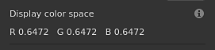
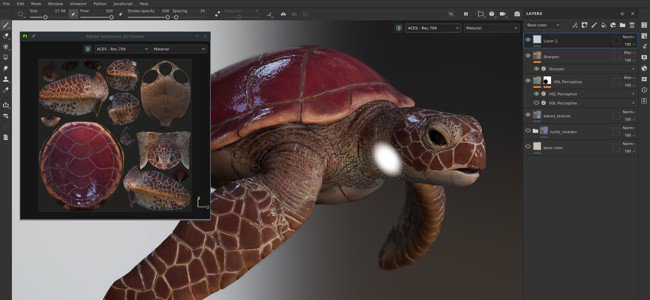
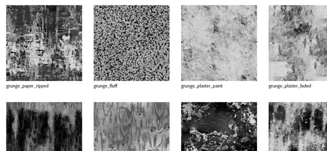

# Version 7.4

**Substance 3D Painter 7.4** bietet mit der Einführung des neuen Farbmanagement-Workflows Unterstützung für OpenColorIO.

Freigabedatum: *24. November 2021*

## Wichtigste Funktionen

### Neues Farbmanagement

In dieser Version wird das Farbmanagement mit Unterstützung von [OpenColorIO](https://opencolorio.org/) (OCIO) Version 2 eingeführt.

Mit diesem neuen Arbeitsablauf können Sie Farben vom Import bis zum Export sowie innerhalb des Viewports verwalten und kalibrieren, sodass Inhalte unterschiedlicher Anwendungen einfacher abgeglichen werden können.

* **Projekteinstellungen**\
  Beim Erstellen eines neuen Projekts ist es jetzt möglich, das Farb-Management zu aktivieren. Vorhandenes Projekt kann auch das Farbmanagement über die Projekteinstellungen aktivieren.\
  Um das Farbmanagement zu aktivieren, wechseln Sie von **Legacy** (Standard) zu **OpenColorIO** und verwenden Sie eine der Standardkonfigurationen oder eine benutzerdefinierte Konfiguration.

  {width="400px"}

* **Anzeigeeinstellungen für Viewport**\
  Am oberen Rand der 2D- und 3D-Ansichten befinden sich zwei Steuerelemente für das Farbmanagement:\
  **Farbschaltfläche**: die Farbtransformation des Viewports aktivieren oder deaktivieren.\
  **Dropdown der Anzeige transformieren**: Wählen Sie aus, welche Anzeige zum Konvertieren der Farben transformieren werden soll.

  {width="500px"}

* **Farbwählereinstellungen**\
  Wenn Farbmanagement aktiviert ist, bietet der Farbwähler neue Steuerelemente. Die Farbe wird im Arbeitsfarbraum bearbeitet, der in der Konfiguration festgelegt ist.\
  Unterhalb der HSV-/RGB-Schieberegler wird der endgültige Farbwert angezeigt, der vom Arbeitsfarbraum zum Anzeigefarbraum transformieren wird.

  

  

* **Importieren von Bitmaps und Substance von Materialien mit benutzerdefiniertem Farbraum**\
  Es sind spezielle Einstellungen verfügbar, die festlegen, wie Ressourcen behandelt werden sollen, einschließlich der Interpretation der Ausgabe von Substance-Materialien.\
  Es ist auch möglich, durch Analysieren des Dateinamens zu wissen, welchen Farbraum eine Ressource verwendet.

  

* **Exporteinstellungen**\
  Beim Exportieren von Texturen zeigen farbverwaltete Kanäle in ihren Dateinamen den Namen des verwendeten Farbraums mithilfe des neuen Schlüsselworts **$colorSpace** an.

  {width="250px"}

  

>[!NOTE]
>
> Weitere Informationen zur Funktionsweise des Farbmanagements in der Anwendung finden Sie auf der [dedizierten Seite](../../features/color-management/color-management.md).

### Neues Abdocken von 2D- und 3D-Viewport

Die 2D- und 3D-Ansicht kann jetzt abgedockt und an eine andere Stelle verschoben werden. Zum Beispiel, wenn die 3D-Ansicht auf einem Hauptbildschirm liegt, während die 2D-Ansicht auf einem anderen Bildschirm sitzt.

Das Arbeiten mit einer nicht angedockten Ansicht ist einfacher, das Layout der Anwendung zu organisieren und die Dinge im Auge zu behalten, ohne zu viel Malbereich zu verlieren.

* **Andocken einer Ansicht aufheben**\
  Um eine Ansicht abzudocken, öffnen Sie einfach das Ansichtsmenü und wählen Sie eine der beiden Optionen aus. Jede Option öffnet ein neues Fenster, in dem sich die Ansicht befindet, während die andere Ansicht innerhalb der Hauptoberfläche angedockt bleibt.

  

* **Austauschen auch mit einer abgedockten Ansicht**\
  Während eine Ansicht abgedockt ist, kann der Austausch über das Menü &quot;Ansicht&quot; zum Austausch verwendet werden.

  {width="500px"}

* **Kompatibel mit Farbmanagement**\
  Die abgedockte Ansicht verfügt über ein eigenes Farbmanagement-Display transformieren, was die Verwaltung auf verschiedenen Monitoren vereinfacht.

  {width="500px"}

### Neue Unterstützung für SpaceMouse® by 3Dconnection

Die **SpaceMouse®** ist ein Gerät mit 3D-Verbindung, mit dem die 3D-Viewport-Kamera intuitiver und benutzerfreundlicher bearbeitet werden kann. Es wird jetzt nativ und direkt mit Painter Plug-and-Play unterstützt.

Weitere Informationen finden Sie auf der dedizierten [Dokumentationsseite &#x200B;](../../features/spacemouse-by-3dconnexion.md).

>[!NOTE]
>
> * Verfügbar ab Version 7.4.2.
> * Stellen Sie sicher, dass Sie die neuesten SpaceMouse® Treiber installieren, damit Sie das Painter-Kontrollschema nutzen können.

### Neuer Inhalt

Dem Standardinhalt, der in der Anwendung verfügbar ist, wurde ein neuer Satz von Elementen hinzugefügt:

* Neue Aufkleber, Werkzeugvorgaben und Filter (von **Käy Vriend**):
  * **Aufkleber**
    * Narbenebene gerade
    * Pocket Patch Regular
  * **Vorgaben**
    * Zipper Advanced Tape
    * Zipper Advanced Stopp
    * Zipper Advanced Slider
    * Schnürsenkel
    * Schnuröse
    * Glitter Stars Golden
    * Glitter Party
    * Glitter Punkte Pastel
  * **Generator**
    * Aufblasen Schrumpfen/Umhüllen

* Neue Schmutz-Bitmaps (von **Emil Sleegers**):
  * Schmutz Plaster Malen
  * Schmutz Gips verblasst
  * Schmutz Malen Peeled
  * Schmutz Feuchtigkeit
  * Schmutz Fluff
  * Schmutz Cobweb
  * Schmutz Bush
  * Schmutz Wood Soft
  * Schmutz Papierkorb gerissen
  * Schmutz ist tief gerissen
  * Schmutz Brushed Dust

### Verbesserter automatischer entpack von UV

Die automatische UV-Entpackung wurde mit einer neuen Option aktualisiert, die die Unterstützung von 3D-Modellen mit erweiterten Oberflächen verbessert.

Diese neue Einstellung mit dem Namen **Vermeiden Sie verlängerte UV-Inseln**, die den UV-Bereich besser ausnutzen, indem Sie UV-Inseln aufteilen, die zu lang sein könnten.

Im Folgenden finden Sie ein Beispiel für diese neuen Einstellungen, ohne sie im Vergleich zu verwenden:

{width="500px"}

### Verbessertes Python-Skript

Die Python-API verfügt über eine neue Methode, mit der die JavaScript-API aufgerufen werden kann.

Diese neue Methode erleichtert die Migration alter Plug-ins zur neuen Python-API. Es werden auch einige Funktionen freigeschaltet, z. B. **Baking** und **Shader** Verwaltung, die noch nicht in Python gelegt wurden.

Um einen JavaScript-Befehl aus Python auszuführen, verwenden Sie die Funktion **evaluation()** des neuen **js**-Untermoduls. Weitere Informationen finden Sie in der API-Dokumentation (verfügbar über das Hilfemenü der Anwendung).

## Versionshinweise

### 7.4.2

*(veröffentlicht am 08. März 2022)*

**Hinzugefügt:**

* [SpaceMouse]&#x200B;[Windows] Unterstützung der 3D-Verbindung von SpaceMouse im 3D-Viewport für die Navigation
* [SpaceMouse]&#x200B;[Windows] Grundlegende Tastaturbefehle/Tasten für Pro- und Enterprise-SpaceMouse-Modelle im 3D-Viewport
* [SpaceMouse]&#x200B;[Windows] Dediziertes Drehmittelsymbol im 3D-Viewport
* [Farbmanagement] Verwenden Sie Rollen aus der OCIO-Konfiguration, um Standardeinstellungen zu ändern
* [Farbmanagement] Farbmanagement des Eigenschaftenfensters für Farb-Widgets
* [Farbmanagement] Farbmanagement des Eigenschaftsfensters für die Materialvorschau
* [Farbmanagement] Farbfelder im Farbwähler verwalten
* [Farbmanagement] Fügen Sie eine Einstellung hinzu, um den standardmäßigen sRGB-Farbraum zu definieren
* [Farbmanagement] Hinzufügen des standardmäßigen sRGB-Farbraums aus der OCIO-Konfiguration in der Farbwähler-Auswahlliste &quot;Anzeige&quot;
* [Farbmanagement] Verbesserungen für das Menü zum Überschreiben des Farbraums
* [Farbmanagement] Überschreiben des Umgebungs-Map-Farbraums in den Anzeigeeinstellungen zulassen
* [Farbmanagement] Zeichnen von Farbwählerverläufen basierend auf der aktuellen Anzeige
* [Farbmanagement] Klemmen von HDR-Werten standardmäßig im Farbeditor
* [Farbmanagement] Passthrough (kein Farbraum) für Filter im Legacy-Modus verwenden
* [Farbmanagement] Anzeige von Farbverläufen im Farbeditor auf Übereinstimmung mit dem Bereich [0-1] beschränken
* [Farbmanagement] Ausblenden der Anzeigeselektor im Farbwähler im Modus &quot;Legacy&quot;
* [Farbmanagement] Hex-Code für Farbwähler immer im sRGB-Farbraum
* [Farbmanagement] Deaktivieren der Farbwähler-Dropdown-Liste &quot;Anzeige&quot; für Datenkanäle
* [Optimierung] Verkrümmungsraster berechnet nur überdeckte UV-Kacheln neu
* [Exportieren] Exportieren von UV-Kachelprojekten für Sketchfab, USD und glTF zulassen
* [Scripting]&#x200B;[Python] Ändern der Tonzuordnungsfunktion zulassen

**Fest:**

* [Sketchfab] Durch die Aktualisierung des vorhandenen Modells wird am Ende ein neues Modell erstellt.
* [Sketchfab] Absturz bei der Suche nach einem zuvor aktualisierten Modell
* Absturz beim Exportieren in USD
* Absturz beim Erstellen einer neuen Shader-Instanz in der Geometriemaske oder wenn die Geometrie ausgeblendet ist
* [Fenster &quot;Element importieren&quot;] Absturz beim Ändern des Typs von importierten Ressourcen
* Normale Mesh-Maps werden bei Verwendung im Ebenenstapel invertiert
* [Substance] Der Benutzerdaten-Mischmodus wird nicht berücksichtigt.
* [Farbmanagement] Bitmaps mit Farbraum im Dateinamen werden als UV-Mustersequenzen importiert
* [Farbmanagement] Farbverwaltete Ausgaben des Substance-Diagramms befinden sich im falschen Farbraum
* [Farbmanagement] Polygon-Füllwerkzeug zeigt die falsche Farbe an
* [Color Management] ACES-Tonabnehmer wird im Solomodus auf Kanäle angewendet
* [Farbmanagement] Die Kugelbeleuchtung der Werkzeugvorschau ist nicht farbverwaltet
* [Farbmanagement]&#x200B;[Exportieren] Konvertierte Karten werden falsch konvertiert.
* [Scripting]&#x200B;[Python]&#x200B;[Farbmanagement] Projekte, die mit Vorlage und OCIO-Umgebungsvariablen erstellt wurden, befinden sich im Modus &quot;Veraltet&quot;.
* [Scripting]&#x200B;[Python] Die JavaScript-Evaluierungsfunktion kann beim Start nicht verwendet werden.
* [3D-Adobe-Angebot] Painter kann nicht gestartet werden, wenn regionale Einstellungen mit Sprachen verwendet werden, die nicht standardmäßig unterstützt werden

**Bekannte Probleme:**

* 3D-Verbindung SpaceMouse wird auf MacOS nicht unterstützt
* [UI] Horizontale Bildlaufleiste mit Farbmanagement, die in einigen Fällen in neuen Projektfenstern angezeigt wird
* [Bäcker] Die Einstellung &quot;Durchschnittliche Normale&quot; hat keine Auswirkungen in UV-Kachelprojekten
* [Mac M1] Smart-Materialien werden nicht korrekt angezeigt
* [Farbmanagement] Im Projektionsmodus verwendete Ressourcen werden in der Überlagerung nicht farbverwaltet

### 7.4.1

*(veröffentlicht am 14. Dezember 2021)*

**Hinzugefügt:**

* [Farbmanagement] Verwenden der Datenrolle in exportierten Dateinamen
* [Farbmanagement] Erweitern Sie den Abschnitt Farbmanagement standardmäßig, wenn OCIO in den Fenstern für neue Projekt- und Projekteinstellungen ausgewählt ist.
* [Farbmanagement] Hinzufügen ACE Tonwertumsetzers im Legacy-Modus
* [Farbmanagement] Standardkonfigurationseinstellungen anpassen
* [Farbmanagement]&#x200B;[Exportieren] Fill $colorSpace in Dateinamen für Datenkanäle
* [Exportieren] Exportieren eines UV-Kachelprojekts in Stager
* [Interoperabilität] Nicht verfügbar für Steam- und Substance-Editionen
* [Interoperabilität] Senden eines UV-Kachel-Projekts an Stager zulassen

**Fest:**

* [MacOS]&#x200B;[Absturz] Painter startet nicht mit Catalina
* [Farbmanagement]&#x200B;[Absturz] Zufälliger Absturz beim Spielen mit Datentyp/Farbmanagement auf Benutzerkanal
* [Farbmanagement] Ressourcen, die als Graustufen in Masken verwendet werden, zeigen den Farbraum an Neues Menü
* [Farbmanagement] Benutzerkanal ist im Viewport im Legacy-Modus + Solo-Ansicht dunkler
* [Farbmanagement] Die Env-Map ist immer linear, wenn sie in iRay verwendet wird
* [Farbmanagement] Die Farbauswahl wählt im Legacy-Modus nicht den richtigen Wert für den Datenkanal aus
* [Farbmanagement] Farbwähler in einer Substance im Legacy-Modus funktioniert nicht
* [Farbmanagement] Der Wechsel zwischen Solokanal-Ansichten im Viewport wird bei Verwendung des Dropdown-Menüs nicht mit dem richtigen Farbraum angezeigt
* [Farbmanagement] Beim Export wird die falsche Konvertierung auf farbverwaltete Benutzerkanäle im Legacy-Modus angewendet.
* Striche, die in der Einzelansichtsmaske vorgenommen wurden, werden beim Zurückwechseln zur Materialansicht nicht angezeigt
* [Exportieren] Konvertierte Karten werden nicht als farbverwaltete Kanäle exportiert
* [Textursatz] QuickInfo mit dem ursprünglichen Namen fehlt auf umbenannten Benutzerkanälen
* [Steam] Dateien fehlen beim Überprüfen der Dateiintegrität mit Steam

**Bekannte Probleme:**

* [Mac M1] Smart-Materialien werden nicht korrekt angezeigt

### 7.4.0

*(veröffentlicht am 24. November 2021)*

**Hinzugefügt:**

* [Color Management] Unterstützung von OpenColorIO-Farbmanagement-Version 2
* [Farbmanagement] Hinzufügen von Farbmanagementeinstellungen zu Projekteinstellungen
* [Farbmanagement] Warnfenster zu Farbmanagement-Konfigurationsänderungen beim Öffnen eines Projekts
* [Farbmanagement] Zeigt eine Fehlermeldung an, wenn eine ungültige OCIO-Konfigurationsdatei ausgewählt ist
* [Farbmanagement] Überschreiben der Konfiguration mit der OCIO-Umgebungsvariable zulassen
* [Farbmanagement] Mehrere OCIO-Konfigurationen sind standardmäßig in die Anwendung integriert.
* [Farbmanagement] Extrahieren des Farbraumnamens aus dem importierten Bitmap-Dateinamen
* [Farbmanagement] Überschreiben des Farbraums mit einem Farbraum aus der Konfiguration im Eigenschaftenfenster zulassen
* [Farbmanagement] Hinzufügen von Farbmanagementoptionen in den Textursatzeinstellungen
* [Farbmanagement]&#x200B;[Viewport] Ermöglicht das separate Farbmanagement für 2D- und 3D-Ansichten.
* [Farbmanagement] Umgebungszuordnung laden und in den Arbeitsfarbraum konvertieren
* [Farbmanagement] Anpassen des Farbwählers und Editors mit dem aktuellen Farbraum
* [Farbmanagement] Erlauben Sie mit einem neuen Dropdown-Menü die Auswahl des Anzeigetransformationsfarbraums im Viewport.
* [Farbmanagement] Anwenden der Anzeigetransformation mit Iray-Renderingergebnissen
* [Farbmanagement] Exportieren von Texturen mit verschiedenen Farbräumen
* [Farbmanagement]&#x200B;[Python] Anwenden von Farbmanagementeinstellungen der Umgebungsvariablen (OCIO) auf neue Projekte
* [Viewport] Abdocken des 2D- oder 3D-Viewports zulassen
* [Automatisches Ausgliedern] Neue Option zur Vermeidung länglicher Inseln
* [Scripting Python] Aufrufen von JavaScript-Funktionen über die Python-API
* [Neues Projektfenster] Reduzieren des Abschnitts &quot;Importierte Karten&quot;
* [Projektion]&#x200B;[Verkrümmen] Normale als Option in den Verkrümmungseinstellungen können ausgeblendet werden.
* [Content] 11 neue Schmutz-Maps
* [Inhalt] 8 neue Werkzeugvorgaben (Reißverschluss, Spannschnur, Glitter)
* [Inhalt] 8 neue Materialien (Narbe, Tasche, ...)
* [Inhalt] 1 neuer Generator (inflate schrumpfwarp)

**Bekannte Probleme:**

* [Mac M1] Smart-Materialien werden nicht korrekt angezeigt
* [Farbmanagement]&#x200B;[Absturz] Zufälliger Absturz beim Spielen mit Datentyp/Farbmanagement auf Benutzerkanal
* [Farbmanagement] Die Farbauswahl wählt im Legacy-Modus nicht den richtigen Wert für den Datenkanal aus
* [Farbmanagement]&#x200B;[Iray] Das Speichern des Renderings in EXR oder TIFF, während das Farbmanagement im Viewport aktiviert ist, wird immer linear gespeichert
* [Farbmanagement] Ressourcen, die als Graustufen in Masken verwendet werden, zeigen das falsche Farbraummenü an
* [Farbmanagement]&#x200B;[Iray] Die Env-Map ist immer linear, wenn sie in Iray verwendet wird
* [Farbmanagement]&#x200B;[Exportieren] Konvertierte Karten werden nicht als farbverwaltete Kanäle exportiert
* [Farbmanagement]&#x200B;[Exportieren] Der Export ignoriert, wenn der Benutzerkanal farbverwaltet ist oder nicht im Legacy-Modus ausgeführt wird
