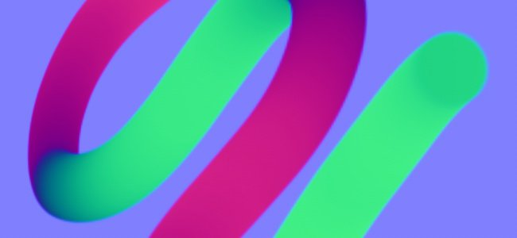
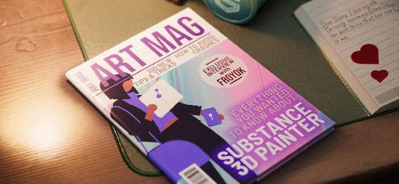

# Version 10.0

<b>Substance 3D Painter 10.0</b> bietet Unterstützung für Illustrator-Dateien (.ai), integriert Substance 3D Assets, importiert Schriften über die Textressourcen, fügt Ebenenstapel-Funktionen in der Python-API hinzu und verbessert die Lebensqualität in mehrfacher Hinsicht.

Freigabedatum: *16. Mai 2024*

## Wichtigste Funktionen

### Neue Textressource

Mit dieser neuen Version wird die <b>Textressource</b> eingeführt, mit der Schriftdateien zum Schreiben von Text in verschiedenen Kontexten (Pinsel, Füllfarbe, Substance-Projektion usw.) geladen werden können. um Ihre Texturen zu verschönern.

* <b>Schriften im Fenster &quot;Elemente&quot; durchsuchen</b>\
  Schriften werden jetzt im Fenster &quot;Elemente&quot; unter einem eigenen Filter aufgelistet. Sie werden von verschiedenen Speicherorten auf dem Betriebssystem (und auch in den Bibliotheken) gesammelt.

  
* <b>Schriften wie andere Ressourcen ziehen und ablegen</b>\
  Schriften können wie jede andere Ressource als Textressourcen verwendet werden. Ziehe sie per Drag-and-Drop, um die Projektion automatisch zu erstellen. Sie können auch in Pinseln oder als Eingabe in Substance-Filtern verwendet werden.

  
* <b>Textressourcenparameter</b>\
  Beim Erstellen einer Textressource können Sie einige Parameter optimieren, um das Aussehen Ihres Texts anzupassen: vertikale und horizontale Ausrichtung, automatische oder manuelle Größe, Zeilen- und Zeichen-Abstand, Farbe usw.

  
* <b>Breite Zeichenbreite und unterstützte Funktion</b>\
  Die Textressource unterstützt das Schreiben von rechts nach links sowie [Ligaturen](https://en.wikipedia.org/wiki/Ligature_(writing)). (Um nicht-lateinische Zeichen schreiben zu können, ist eine kompatible Schrift erforderlich.)

  
* <b>Benutzerdefinierte Schriften wie reguläre Ressource importieren</b>\
  Sie können Ihre eigenen Schriftartendateien wie alle anderen Ressourcen direkt in Ihre Bibliothek oder Ihr Projekt importieren. Einige Schriftarten werden jedoch nicht unterstützt. Weitere Informationen finden Sie auf dieser [Dokumentationsseite](../technical-support/workflow-issues/shelf-issues/font-import.md).

>[!NOTE]
>
> Weitere Informationen über die <b>Textressource</b> finden Sie auf der [Seite der dedizierten Dokumentation](../painting/text-resource.md).

### Neuer Import von Illustrator-Dateien (.Ai)

Nach der Unterstützung für <b>.svg</b>-Dateien bietet diese neue Version auch die Möglichkeit, Illustrator-Dateien (<b>.ai</b>) zu importieren.

* <b>Unterstützung für Illustrator-Dateien (.ai)</b>\
  In dieser neuen Version können AI-Dateien jetzt in Painter importiert und gerendert werden, um sie als Ressource in Pinseln, Füllprojektionen oder als Substance-Bildeingaben zu verwenden.
* <b>.svg- und .ai-Dateien verwenden gemeinsame Einstellungen</b>\
  SVG- und Illustrator-Dokumente haben ähnliche Einstellungen, insbesondere die Parameter für Auflösung, Freistellungsbereich und Bereichsauswahl. Dies bedeutet, dass vektorielle Ressourcen auf ähnliche Weise verwaltet werden können.

  
* <b>Auswahl der Zeichenfläche</b>\
  Illustrator-Dokumente unterstützen Zeichenflächen. Wenn Sie eine AI-Datei verwenden, können Sie auch zwischen verschiedenen Zeichenflächen wählen, die über die entsprechende Einstellung verfügbar sind.

  
* <b>Verbesserte Bereichsauswahl</b>\
  Das Fenster für die Bereichsauswahl wurde mithilfe von Miniaturansichten verbessert, sodass das Durchsuchen und Auswählen nur bestimmter Elemente einfacher ist.\
  Aus Leistungsgründen sind Miniaturansichten standardmäßig deaktiviert und können mit dem Kontrollkästchen <b>Miniaturansichten anzeigen</b> aktiviert werden.

  

>[!NOTE]
>
> Das Importieren von Illustrator-Dateien (<b>.ai</b>) wird derzeit nur unter Windows und MacOS unterstützt.

### Neue Substance 3D Assets-Integration

Es ist ein neues Fenster verfügbar, in dem die Substance 3D Assets-Website direkt in Painter eingebettet wird. Diese Integration erleichtert das Durchsuchen und Herunterladen von Ressourcen direkt in Ihrer eigenen Bibliothek.

* <b>Neues Substance 3D Assets-Fenster</b>\
  Auf der Benutzeroberfläche ist ein neues Dock zum Durchsuchen von Substance 3D Assets verfügbar. Wenn das Dock nicht sichtbar und geschlossen ist, finden Sie es wieder in der Dock-Symbolleiste auf der rechten Seite der Benutzeroberfläche.

  
* <b>Download-Manager</b>\
  Sie können die Assets, die derzeit über den dedizierten Manager heruntergeladen werden, über die Schaltfläche unten links im Fenster anzeigen. Assets, die möglicherweise nicht heruntergeladen werden können, können von dieser Liste aus erneut gestartet werden.

  
* <b>Die heruntergeladenen Assets schnell finden</b>\
  Mit der Schaltfläche unten rechts im Fenster wird ein Menü mit einigen Aktionen geöffnet, die die Navigation auf der Website erleichtern, aber auch Aufnahmen zeigen, wo Elemente heruntergeladen wurden.

  

>[!NOTE]
>
> Beim ersten Start ist eine Anmeldung in Ihrem Konto erforderlich, um Assets herunterzuladen. Diese Anmeldung wird dann für zukünftige Zwecke zwischengespeichert.

>[!NOTE]
>
> Das Substance 3D Assets-Dock ist in der Steam-Version nicht verfügbar.

### Neues Ebenenstapel-Modul in der Python-API

In dieser Version wurde das neue Ebenenstapel-Modul in unsere Python-API aufgenommen. Mit dieser API können Sie den Ebenenstapel eines Projekts steuern und so die Erstellung erweiterter Ebenenstapel-Plug-ins und benutzerdefinierter Tools ermöglichen.

* <b>Neue Ebenenstapel-API</b>\
  Das neue <b>Layerstack</b>-Modul ermöglicht es, den Ebenenstapel eines Projekts auf vielerlei Weise zu steuern. Sie haben folgende Möglichkeiten:

  * Fragen Sie die Auswahl von Ebenen und Effekten ab und legen Sie sie fest.
  * Erstellen neuer Ebenen, Ordner und Effekte (einschließlich Filter, Ankerpunkte usw.)
  * Ebenen instanziieren.
  * Parameter von Ebenen und Effekten abrufen und festlegen, Ressourcen laden.
  * Rufen Sie Substance-Parameter ab und legen Sie sie fest.
* <b>Änderungen des Gültigkeitsbereichs und Pause des Engine</b>\
  Das Bearbeiten des Ebenenstapels kann zu langen Berechnungen führen. Aus diesem Grund haben wir auch die Möglichkeit gelegt, das Engine von der API anzuhalten und nicht anzuhalten (wie in der Benutzeroberfläche). Wir haben es auch möglich gemacht, Änderungen aus beiden Performance-Gründen zu gruppieren, aber auch mehrere Operationen gleichzeitig rückgängig zu machen.
* <b>Grundlegendes Farbmanagement</b>\
  Mit der Präsentation des Ebenenstapels mussten wir das Konzept des Farbmanagements in unsere API einführen. Ein neues <b>Farbmanagement</b>-Modul wurde hinzugefügt, um Farben zu erstellen, zu optimieren und den Farbraum von Bitmaps auszuwählen. (Dieser Teil der API ist noch nicht vollständig und wird in zukünftigen Versionen erweitert.)
* <b>Informationen zu Exportvorgaben abfragen</b>\
  Exportvorgaben werden jetzt in unserer API gelegt, sodass Sie die Liste der (sowohl vordefinierten als auch benutzerdefinierten) Vorgaben abfragen können. Ihre Inhalte können auch in einem ähnlichen Format wie unsere bestehende Export-Texturen-API abgerufen werden.
* <b>Neue Möglichkeiten!\
  </b> Dieser neue Teil der API ermöglicht viele neue Dinge, wie das Speichern und Wiederherstellen einer Auswahl von Ebenen oder das Ändern der Zufallsgeschwindigkeit aller Ressourcen in einem Projekt. Beispiel:

  

>[!NOTE]
>
> Weitere Informationen zur API finden Sie in der Dokumentation der Anwendung (über <b>Hilfe > Scripting-Dokumentation > Python-API</b>), die viele Codefragmente enthält, die den Einstieg erleichtern.

>[!NOTE]
>
> Beispiele für Ebenenstapel-Plug-ins finden Sie auch in unserer [Onlinedokumentation](https://adobedocs.github.io/painter-python-api/).

### Verbessertes Normalen-Map-Malen

In dieser Version haben wir den Arbeitsablauf für das Normalen-Map-Malen überarbeitet. Wir haben vor allem die Art und Weise verändert, wie wir normale Pinselstempel sammeln und mischen. Diese Änderungen wurden vorgenommen, um Probleme beim Malen von Flussdiagrammen zu beheben.

* <b>Akkumulierungsproblem behoben</b>\
  Wenn Sie über einen Bereich im normalen Kanal malen, wird dieser nicht mehr gesättigt oder verklemmt und es entstehen keine Löcher oder Artefakte mehr. Auch das Umschalten des Normalkanals auf RGB32F entfällt.

  
* <b>Umbrechen gemalter Striche rückgängig gemacht</b>\
  Durch das Rückgängigmachen eines Pinselstrichs werden andere bereits gemalte Striche nicht mehr unterbrochen.

  
* <b>Transparenz bei Null Alpha</b>\
  Pinselstempel, die mit einer Textur mit einem Alphawert von Null erstellt wurden, werden jetzt als transparent gezeichnet. Das folgende Beispiel zeigt einen Pinselstempel (links) und eine planare Projektion (rechts).

  

>[!NOTE]
>
> Weitere Informationen zum Malen der Flusszuordnung finden Sie auf der [Dokumentationsseite](../painting/advanced-channel-painting/flow-map-painting.md).

### Verbesserte transformieren-Manipulator

Mehrere Verbesserungen wurden vorgenommen, um die Nutzung der transformieren Manipulatoren zu verbessern.

* <b>Präzisionsmodus mit STRG</b>\
  Das Drücken der Steuerung beim Ziehen eines Manipulators geht nun in einen neuen Präzisionsmodus über, der präzisere Operationen ermöglicht. Diese Änderung gilt für die Manipulator &quot;Kamera beweg&quot;, &quot;rotate&quot; und &quot;scale&quot;.\
  Hier ein Beispiel vor und nach dem Drücken der STRG-Taste beim Ziehen:

  
* <b>Neues Skalierungsverhalten</b>\
  Die Skalenintensität basiert nun auf dem aktuellen Skalenwert selbst und nicht mehr auf der Szene. Dadurch sind relative Änderungen einfacher, insbesondere bei kleinen Werten. In Kombination mit dem präzisen Modus macht es das Skalieren viel angenehmer.\
  Eine weitere Änderung ist die Skalierung nach unten, bis 0 nicht mehr in negative Werte übergeht. Dadurch wird vermieden, dass eine Projektion verkleinert und versehentlich umgedreht werden muss.

  
* <b>Verbesserte Drehung des Manipulators der Oberfläche</b>\
  Der Manipulator für die Aufhellung der Oberfläche ist jetzt viel stabiler, wenn Sie um eine Oberfläche ziehen. Es erhöht seine Rotation nicht, wenn es nur Hin- und Herübersetzungen vornimmt.\
  Hier ist das <b>alte</b>-Verhalten im Vergleich zum <b>neuen</b>-Verhalten:

  

  
* <b>Projektion mit Ausrichtung der Kamera beim Ziehen und Ablegen</b>\
  Das Ziehen und Ablegen einer Ressource in den Viewport ermöglicht das Erstellen einer Verkrümmungs-Projektion direkt auf der Oberfläche des Meshs. Diese Projektion wurde zuvor falsch gedreht und ist nun an der Kamera ausgerichtet.

  

Einige weitere Verbesserungen wurden hinzugefügt, insbesondere:

* <b>Tile Generator aktualisiert</b>\
  Der Parameter für den Mischmodus &quot;<b>Tile Generator</b>&quot; kann jetzt geändert werden und ändert das Ergebnis wie erwartet. Die Ressource wurde auch auf die neueste Version aktualisiert, die in <b>Substance 3D Designer</b> verfügbar ist.
* <b>Banding-/Qualitätsprobleme bei einigen Filtern behoben</b>\
  Mehrere Filter wurden auf 8-Bit-Präzision statt auf 16-Bit-Präzision fixiert, was bei ihrer Verwendung zu Streifenbildung/Artefakten führte (wie der Histogramm-Scan oder die Richtungsunschärfe). Dieses Problem wurde nun behoben.
* <b>Farbraum in SBSAR-Ausgabe</b>\
  Wenn der Farbmanagement-Arbeitsablauf aus Vorgängerversionen oder OCIO aktiviert ist, verweist der SBSAR-Export jetzt auf die Farbraumnamen, die im Projekt in den jeweiligen Ausgaben verwendet werden.
* <b>Schnellere Ressourcenermittlung</b>\
  Mit der Einführung der <b>Textressource</b> haben wir einen neuen Cache hinzugefügt, um das Crawlen von Ressourcen auf dem Datenträger beim nächsten Start zu beschleunigen. Dies ist bemerkenswert, wenn Ressourcen auf einer Festplatte installiert sind oder wenn eine Bibliothek über Gigabyte an Ressourcen verfügt. Dieser neue Cache kann über eine Befehlszeile deaktiviert werden. Weitere Informationen finden Sie auf der dedizierten [Dokumentationsseite &#x200B;](../pipeline-and-integration/configuration/command-lines.md).

Vielen Dank an die Website [ist dies arabisch ?](https://isthisarabic.com/) was bei der Entwicklung dieser Version sehr hilfreich war.

Bezugnahme auf Kunstwerke, die in den oben genannten Medien verwendet werden:

* [Mann trägt schwarzes Hemd](https://unsplash.com/photos/man-wearing-black-shirt-aoEwuEH7YAs) von Lucas Gouvêa
* [Rosa und grün](https://unsplash.com/photos/pink-and-green-abstract-art-ruJm3dBXCqw) von Pawel Czerwinski
* [Illustrationen auszeichnen](https://undraw.co/illustrations)
* Claude Monet

## Tutorials

## Versionshinweise

### 10.0.0

Freigabedatum: <b>2024/05/16</b>\
Zusammenfassung: <b>Hauptversion, Edition des Ebenenstapels mit Python-API, Lesen nativer Illustrator-Dateien, Integration von 3D-Assets und neuer Textressource</b>

<b>Hinzugefügt</b>:

* [Illustrator] Verwenden von Illustrator-Dateien mit Zeichenflächen in Painter
* [Illustrator]&#x200B;[SVG] Hinzufügen von Vorschauen in der Bereichsauswahl
* [Substance 3D Assets] Durchsuchen, Auswählen und Herunterladen von 3D-Assets direkt in Painter
* [Substance 3D Assets]&#x200B;[UI] Neues Bedienfeld
* [Substance 3D Assets] Unterstützung für Umgebungs-Map und Materials
* [Substance 3D Assets] Ermöglicht das erneute Laden und Navigieren im Speicherortordner und das Öffnen im neuen Bedienfeld &quot;Substance 3D Assets&quot;.
* [Substance 3D Assets] Hinzufügen eines Download-Managers
* [Textressource] Einbettbare Schriftarten verwenden
* [Textressource] Erlaubt das Rendern einer Schriftart/eines Texts auf einem Mesh.
* [Textressource] Anzeigen von Schriftarten von Benutzer- und anderen freigegebenen Pfaden im Bedienfeld &quot;Elemente&quot; mit einer neuen Kategorie
* [Textressource]&#x200B;[Eigenschaften] Unterstützung für erweiterte Schriftarteigenschaften hinzufügen
* [Textressource] Ermöglicht das Suchen/Anzeigen von Schriftarten in Mini-Regalen
* [Textressource] Fehlermeldung/Dialogfeld hinzufügen, wenn eine inkompatible Schriftart importiert wird
* Sonstiges
* [Füllprojektion] Verbessern des Skalierungsmanipulatorverhaltens bei Verwendung kleiner Werte
* [Manipulatoren] Hinzufügen eines neuen präzisen Modus beim Drücken von STRG-Tastenkombinationen
* [Manipulatoren] Verbessern der Stabilität des Oberflächenmanipulators beim Übersetzen
* [Exportieren] Hinzufügen eines Farbraumnamens in SBSAR-Ausgaben
* [Performance] Verbessern der Erkennungszeit von Elementen auf der Festplatte in Bibliotheken
* [Substance] Update auf Substance-Engine Version 9.1.2
* [Drag &amp; Drop] Ausrichten der Aufkleberdrehung an der Kamera beim Ablegen im Viewport
* [Python] Edition des Ebenenstapels
* [Python] Auswahl von Ebene, Effekt, Maske und Geomaske in der Benutzeroberfläche zulassen
* [Python] Abrufen/Festlegen von Mischmodi für Ebenen
* [Python] Abrufen/Festlegen von Projektionseinstellungen für Füllebenen zulassen
* [Python] Abfragen der Substance-Materialfarbe aus einer Füllebene zulassen
* [Python] Abfragen und Festlegen einheitlicher Farben und Ressourcen in Ebenen und Effekten zulassen
* [Python] Erstellen und Bearbeiten von Textressourcen im Ebenenstapel zulassen
* [Python] Bearbeiten aktiver Kanäle für Ebenen und Effekte zulassen
* [Python] Batch-Aktionen können nur einmal rückgängig gemacht/wiederholt werden.
* [Python] Laden/Bearbeiten von vektoriellen Quellparametern zulassen
* [Python] Bearbeiten von Ebenen- und Effektfarbeneigenschaften mit Farbmanagement zulassen
* [Python] Abfragen und Erstellen instanzierter Ebenen zulassen
* [Python] Hinzufügen eines Farbauswahleffekts zulassen
* [Python] Steuern des Farbmanagements für Bitmapbilder
* [Python] Engine anhalten/fortsetzen
* [Python] Navigation zu gleichrangigen und übergeordneten Knoten zulassen
* [Python] Erstellen eines Filter-/Generatoreffekts zulassen
* [Python] Hinzufügen des Ebeneneffekts zulassen
* [Python] Hinzufügen von intelligente Maske zu einer Ebene zulassen
* [Python] Erstellen/Bearbeiten von Ankerpunkten zulassen
* [Python] Maske für Ebenen abrufen/festlegen
* [Python] Erstellen des Effekts &quot;Maske vergleichen&quot; zulassen
* [Python] Zulassen, dass Vorgaben aus Substance-Ressourcen abgefragt und verwendet werden
* [Python] Erlaubt das Auflisten von Vorgaben und ihren Werten über die interne \_properties-Funktion für Substance-Ressourcen.
* [Python] Liste vordefinierter Exportvorgaben zulassen
* [Python] Auflisten der in der Bibliothek verfügbaren Exportvorgaben
* [Python] Abrufen des Inhalts von Exportvorgaben zulassen

<b>Fest</b>:

* [Absturz] Rückgängigmachen von &quot;Shader-Instanz entfernen&quot; mit Strg+Z
* [Absturz] Erstellen einer Ebene auf leerem Stapel, wenn die letzte Auswahl ein Effekt war
* [SVG] Problem mit benutzerdefiniertem Wert für den zugeschnittenen Bereich
* [Automatisches Entpacken] Die Neuberechnung nur des Packings ohne Änderung der Ausrichtung der UV führt zu einem Absturz
* [Drag &amp; Drop] Verzögerung aufgrund externer Ressourcen wird mehrmals vorgeladen
* [UI] Miniaturansicht der Ressource per Drag &amp; Drop kann Warnmeldung im Ebenenstapel ausblenden
* [Performance] Maskierte UV-Kacheln werden noch berechnet
* [USD] Falsche Markierung für die Bereichsauswahl
* [Ressource] Bitmapbild wird beschädigt, nachdem im normalen Kanal gemalt und das Projekt gespeichert wurde
* [USD] Unterstützung für die Bestellung von Meshs für den linkshändigen Scheitelpunkt
* [Substance] Auf die Standardeinstellung zurücksetzen, um immer auf null für Winkel-Widget zurückzusetzen
* [Engine] Das Malen mit einem SVG in einer Schablone funktioniert nicht
* [Engine] Normalen-Map-Pinselstriche brechen nach einem Rückgängigmachen
* [Inhalt] Grafik zu Materialfilter hat falsche Alpha-Überblendung und falschen Farbraum
* [Inhalt] Füllmethoden auf dem Tile Generator funktionieren nicht
* [Inhalt] Histogramm-Scanfilter erzeugt in einigen Fällen Streifenbildung
* [Inhalt] Baking geführt stilisierte Beleuchtung berücksichtigt kein gemaltes Height
* [Python] Unerwarteter Fehler beim Abrufen instanzierter Ebeneninformationen nach Shader-Änderung

<b>Bekannte Probleme</b>:

* [Farbmanagement] HDR. Farbraumkonvertierungen mit ACE unter Linux erzeugen festgeklemmte Farben
* [Absturz]&#x200B;[Linux]&#x200B;[AMD] Ziehen und Ablegen von Ressourcen im Ebenenstapel unter Wayland OS
* [Regression]&#x200B;[UI] Kontextmenü auf HD-Bildschirmen ist zu klein
* [Absturz]&#x200B;[Python] USD durch TextureStateEvent ausgelöst
* [Speichern] Spp-Projektdatei geht verloren, wenn &quot;Speichern unter&quot; fehlschlägt
* [MacOS Intel] Absturz beim Importieren einiger Vorgaben
* [Illustrator] Ai-Dateien können nach dem Server-Absturz nicht importiert werden, ohne Painter neu zu starten
* [Importieren] Assets mit demselben Namen, aber unterschiedlichen Erweiterungen werden überschrieben
