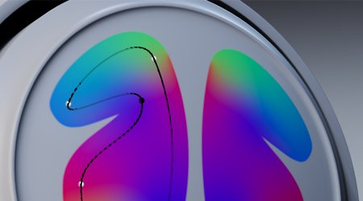

# Version 10.1

<b>Substance 3D Painter 10.1</b> bietet neue leistungsstarke Filter, verbesserte USD-Funktionen und eine aktualisierte VFX-Plattform- und Linux-Unterstützung.

Freigabedatum: *17. September 2024*

>[!NOTE]
>
> Diese Version von Painter verwendet jetzt Qt Version 6, was sich auf die Unterstützung von Python- und JavaScript-Plugins auswirkt. Weitere Informationen finden Sie unten.

## Wichtigste Funktionen

### Neue Standardfilter

In dieser Version wurden mehrere neue Filter hinzugefügt, um den Texturierungsprozess erheblich zu erweitern:

* <b>Neues Stickereiaufklebermaterial</b>\
  Im Bereich &quot;Materialien&quot; des Fensters &quot;Elemente&quot; finden Sie neue Stickereiaufklebematerialien. Ziehe die Maske über dein Gitter, setze eine beliebige Ressource ein (z. B. eine Textur oder sogar eine Schrift), und du kannst ganz einfach neue Fabric-Details erstellen.

  
* <b>Neuer Filter für Flächenfarbe/-maske </b>\
  Mit diesen beiden neuen Filtern können Sie alle geschlossenen Pfade und Konturen ausfüllen. Dies ist nützlich, um z. B. 3D-Pfade schnell zu füllen. Da es sich um Filter handelt, können sie auch für manuelle Pinselstriche oder in anderen Situationen verwendet werden.

  
* <b>Neuer FXAA-Filter</b>\
  Dieser neue Filter kann den Alias-Effekt schnell reduzieren, insbesondere bei harten Kanten, die nach einer Ebene angezeigt werden können, zum Beispiel oder bei Masken, die mit dem Farbauswahleffekt erstellt wurden.

  
* <b>Neuer Hochpassfilter</b>\
  Mit diesem generischen Filter können Sie eine Graustufenstruktur generieren, um sie für komplexere Effekte (z. B. Weichzeichnen, Weichzeichnen oder Scharfzeichnen von Details) zu verwenden.

  
* <b>Neuer Verpixelungsfilter</b>\
  Der Vergröberungsfilter kann eine Verringerung der Auflösung simulieren, was nützlich sein kann, um Farben und Muster zu stilisieren.

  
* <b>Neuer Posterisierungsfilter</b>\
  Dieser Filter kann nützlich sein, um die Anzahl der Farben in einem Bild zu reduzieren, wodurch Kontraste in Formen erstellt und stilisierte Effekte erstellt werden können.

  
* <b>Neuer Schwellenwertfilter</b>\
  Mit dem Schwellenwert-Filter lassen sich schnell scharfe Schwarz-Weiß-Binärmasken aus einem Graustufeneingang erstellen.

  
* <b>Neuer Smoothstep-Filter</b>\
  Der Smoothstep-Filter ist eine andere Möglichkeit, Graustufeninformationen auf eine Ebene oder einen Kontrast zu reduzieren. Dieser Filter wendet auch eine exponentielle Kurve auf das Ergebnis an, wodurch es möglich ist, lineare Verläufe in glatte Kurven umzuwandeln.

  
* <b>Verbesserte Transformieren- und Spiegelungsfilter</b>\
  Der Transformationsfilter wurde aktualisiert, um eine ungleichmäßige Skalierung, horizontales oder vertikales Spiegeln und einfachere Verwendung von Parametern zu unterstützen. Der Spiegelfilter wurde ebenfalls mit einfacheren Parametern aktualisiert.

  
* <b>Verbesserte Symbole</b>\
  Um Standardfilter sichtbarer und leichter zu finden, wurden ihre Symbole neu gestaltet. Gelb getönte Symbole sollen für den Inhalt einer Ebene verwendet werden, während Graustufen-Symbole generisch sind und sowohl für den Inhalt der Ebene als auch für die Maske verwendet werden können.

  
* <b>Geringfügige Korrekturen für Filter</b>\
  Einige andere Filter wurden angepasst, um einige Probleme zu beheben:

  * Der Filter &quot;Height anpassen&quot; hatte Auswirkungen auf das Alpha einer Ebene, was die Verwendung in einigen Fällen erschwert.
  * Der Weichzeichnungsfilter verwendete keinen linearen Farbraum im Legacy-Farbmanagementmodus, sodass beim Mischen/Mischen seiner Eingabe falsche Farben erstellt wurden.

### Update zur Unterstützung der USD- und VFX-Plattformen

In dieser Version von Painter wurden viele Drittanbieterkomponenten verbessert und aktualisiert:

* <b>Exportieren von Texturen mit Adobe-Standardmaterial in USD\
  </b>Wenn Sie Texturen aus Painter in eine USD-Datei exportieren, erhalten Sie jetzt die Adobe-Standardmaterialeigenschaften. Dadurch können diese USD-Dateien in Anwendungen verwendet werden, die diese Eigenschaften ebenfalls unterstützen.
* <b>Texturen aus USD-Dateien importieren</b>\
  Beim Importieren einer USD-Datei wird nun auch deren Textur in das erstellte Projekt importiert, wodurch das Hin und Her zwischen Anwendungen vereinfacht wird. Wenn die USD-Datei das Adobe-Standardmaterial verwendet, werden dadurch auch die Shader-Einstellungen konfiguriert, sodass das Ergebnis im Viewport mit der anderen Quellanwendung übereinstimmt.
* <b>GLTF-Änderungen\
  </b>Nach dem USD-Update war eine Verhaltensänderung für das GLTF-Format erforderlich, um die Parität sicherzustellen. Beim Importieren einer GLTF-Datei geht Painter jetzt davon aus, dass die normale Map im OpenGL-Format vorliegt.\
  Einige GLTF-Dateien können stattdessen das DirectX-Format verwenden. Daher wurde im neuen Projektfenster eine neue Einstellung hinzugefügt, um sie zu berücksichtigen (beachten Sie, dass das normale Format auch vom Ebenenstapel überschrieben werden kann).

  
* <b>Aktualisierte Abhängigkeiten</b>\
  Mehrere von Painter verwendete Bibliotheken wurden aktualisiert, insbesondere um die VFX-Plattformreferenz abzugleichen. Hier die neuen Versionen, die in Painter 10.1 verwendet werden:

  * Qt 6.5.6 (und PySide 6 6.5.6)
  * Substance Engine 9.1.3
  * OpenEXR 3.2
  * Python 3.11
  * OCIO 2.3.2
  * OpenSubdiv 3.6.0
* <b>Aktualisierte Linux-Unterstützung\
  </b>Diese neue Version von Painter unterstützt jetzt Red Hat Enterprise Linux (RHEL) mindestens Version 8.6, sollte aber auch mit Version 9.x kompatibel sein.

### Verbesserte Leistung

In einigen Bereichen der Anwendung wurden einige Leistungsverbesserungen erzielt:

* <b>Verbesserte Öffnungszeit von Projekten\
  </b>Projekte, die viele Pinselstriche verwendet haben, sollten jetzt schneller in Painter geöffnet werden können. Auch die Einsparzeit dieser Projekte sollte etwas verbessert werden.\
  In einigen unserer Testprojekte konnten wir beim Öffnen eines Projekts eine Verringerung der Ladezeit von 50 auf nur 6 Sekunden beobachten. Der Speicherverbrauch beim Öffnen alter Projekte und beim Konvertieren in die neueste Version wurde ebenfalls verbessert.
* <b>Verbesserte Tesselierungsleistung\
  </b>Wir verwenden jetzt eine automatische Optimierung, wenn die Tesselierung in den Shader-Einstellungen aktiviert ist. Dreiecke, die kleiner sind als ein Pixel auf dem Bildschirm, werden nicht mehr getesselt, was zu weniger zu zeichnenden Dreiecken und somit zu schnelleren Rendering-Zeiten führt.\
  Diese Änderung führt nicht zu visuellen Unterschieden und hat keine Auswirkungen auf den Gitterexportprozess.
* <b>Vereinfachte Miniaturansichten sind jetzt der Standard</b>\
  In Version 6.2 haben wir die vereinfachten Miniaturansichten für UV-Kacheln-Projekte eingeführt, um die Leistung zu verbessern, aber normale Projekte konnten immer noch die alte Art der Berechnung von Ebenen-Miniaturansichten verwenden. Dieses Verhalten wurde über eine Anwendungseinstellung gesteuert.\
  Diese Einstellung verwendet jetzt standardmäßig optimierte Miniaturansichten, um die Leistung bei allen Projekten zu verbessern. Dies kann in den Hauptvoreinstellungen zurückgesetzt werden, wenn gewünscht.

  

### Painter 10.1 - Migrationshinweise

>[!NOTE]
>
> * Python-Plug-ins müssen möglicherweise nach dem Update auf Qt6 aktualisiert werden. Weitere Informationen finden Sie auf [dieser Seite](https://adobedocs.github.io/painter-python-api/guides/qt6-migration/).
> * <b>JavaScript </b>-Plug-ins wurden jetzt in einen Unterordner innerhalb des Verzeichnisses Benutzerdokumente verschoben. Vorhandene Plug-ins werden nicht mehr in der Anwendung angezeigt, da sie manuell in diesen Ordner verschoben werden müssen.
> * Bei Steam/Ubuntu ist eine Systembibliothek erforderlich, damit Painter ordnungsgemäß funktioniert. Stellen Sie sicher, dass der libxcb-cursor installiert ist, bevor Sie die Anwendung starten.

## Versionshinweise

### 10.1.0

Freigabedatum: <b>2024/09/17</b>

Zusammenfassung: <b>Hauptversion, neuer Inhalt: Füllbereichsmaske/Farbfilter, Stickereiaufklebefilter und sechs generische Substance-Filter, Import von USD mit Material- und Shader-Eigenschaften, Leistungsverbesserung, VFX-Plattform 2024-kompatibel und Migration auf Linux RedHat</b>

<b>Hinzugefügt</b>:

* [Inhalt] Neue Füllbereichsmaske/Farbfilter hinzufügen
* [Inhalt] Neuen Stickerei Decal Filter hinzufügen
* [Inhalt] Fügen Sie 6 neue generische Substance-Filter hinzu (FXAA, Vergröberungsfilter, Hochpass, Posterisierung, Glättungsschritt, Schwellenwert).
* [USD] Exportieren der USD-Ebene mit einem definierten ASM-Material
* [USD] Importieren von USD mit Material- und Shader-Eigenschaften
* [Leistung] Aktivieren Sie standardmäßig optimierte Ebenenstapel-Miniaturansichten
* [Leistung] Reduzieren der Öffnungszeit von Projektdateien und des Speicherverbrauchs (Datendecodierung)
* VFX-Plattform 2024-kompatibel
* [VFX Platform 2024] Update auf Python 3.11
* [VFX Platform 2024] Update auf OpenEXR 3.2
* [VFX Platform 2024] [USD] Update OpenSubdiv 3.6.0
* [VFX Platform 2024]&#x200B;[Color Management] Update auf OCIO 2.3.2
* [Linux] Migration zu Linux RedHat
* [Linux] Aktualisieren Sie den Nvidia-Treiber auf Version 535.171.04
* [Importieren] Fügen Sie eine Option hinzu, um die normale Map beim Importieren eines GLTF-Gitters zu spiegeln.
* [UI] Standardwert des Betriebssystems für die Entfernung der Erkennung von Ziehereignissen verwenden
* [Substance Engine] Fügen Sie eine Aufrufstreifenfunktion hinzu, um die Symbole aus der ausführbaren Datei zu entfernen.
* [Begrüßungsbildschirm] Update auf neues Begrüßungsbildschirmformat
* Substance Engine auf Version 9.1.3 aktualisieren
* [Python] Link zu Beispielen im Dokumentationsmenü des Ebenenstapels anzeigen
* [JavaScript] Verschieben von JavaScript-Plugins in den Unterordner &quot;javascript/plugins&quot;

<b>Fest</b>:

* [Illustrator] Absturz beim Exportieren einer UV-Kachel mit .ai-Grafik in bestimmten Fällen
* [Dynamische Pinselstriche]&#x200B;[Pfad] Zufällig pro Strich funktioniert nicht auf einem Pfad
* [UI]&#x200B;[Eigenschaften] Sperre ist aktiviert, wenn die Unterteilung nicht einheitlich ist
* &#x200B; TXT-Datei wird erstellt, wenn Sie auf ein Painter-Projekt doppelklicken
* [USD]&#x200B;[Export] Möglicherweise fehlen einige Texturen.
* [ASM] Beim Streufarbkanal werden metallische
* [Inhalt] Weichzeichnungsfilter funktioniert nicht im &quot;funktionierenden&quot; Farbraum
* [Inhalt] Height Der Filter &quot;Anpassen&quot; ändert auch das Alpha der Ebene.

<b>Bekannte Probleme</b>:

* [Farbmanagement] HDR-Farbraumkonvertierungen mit ACE unter Linux erzeugen festgeklemmte Farben
* [Win]&#x200B;[Absturz] [ACE] sRGB ICE-Farbraum wird für die Bildschirmtransformation nicht verwendet.
* [Regression]&#x200B;[UI] Kontextmenü auf HD-Bildschirmen ist zu klein
* [Crash]&#x200B;[Python] USD-Export, ausgelöst durch TextureStateEvent
* [MacOS Intel] Absturz beim Importieren einiger Vorgaben
* [Absturz] Ressource verschieben und Projekt speichern
* [Engine] Malen mit dem Kopierwerkzeug in normalen Kanalverschiebungsfarben falsch
* [Python] Das Ghost-Widget wird durch das noch funktionierende Skript gelöscht.
* [RedHat] Probleme mit dem Farbwähler
